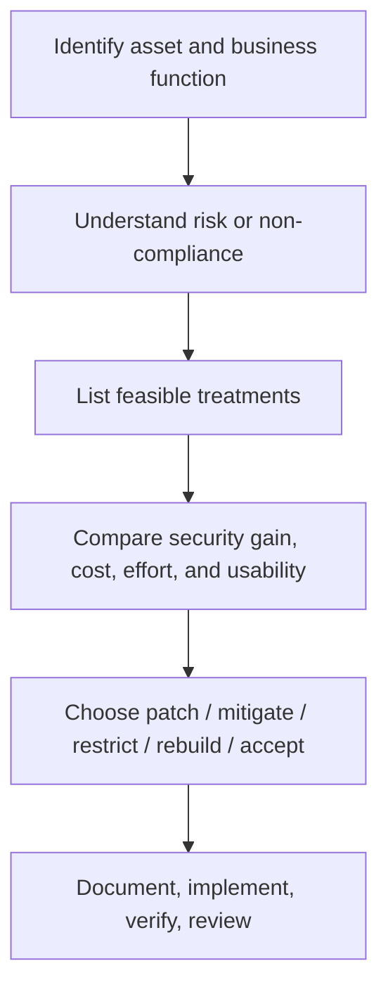

# Security Engineer Intro

## Summary

Security engineering exists because organizations cannot rely on modern digital systems without also managing cyber risk. The role is broad, but the core pattern is stable: understand the business, understand the assets, identify where risk comes from, and implement controls that reduce risk without crippling operations.

This room is not really about memorizing job-description keywords. It is about learning how a security engineer thinks. A strong security engineer does not optimize for maximum restriction in isolation. They optimize for durable risk reduction under real-world constraints such as cost, implementation effort, uptime requirements, compliance obligations, and legacy technology.

## 1. What a Security Engineer Is

A security engineer is typically expected to help design, implement, maintain, and improve an organization’s security posture. In practice, that means translating security principles into operational controls, technical architecture, review processes, and risk decisions.

A useful working definition is:

> A security engineer is someone who breaks security problems into manageable parts, then designs or coordinates practical solutions that reduce organizational risk.

That naturally makes the role interdisciplinary. It touches infrastructure, networking, identity, policy, logging, vulnerability handling, auditing, and business decision-making.

### Baseline expectations

Common entry-level or early-career expectations usually include:

* some prior exposure to IT administration, helpdesk, networking, or security operations
* working knowledge of operating systems and networks
* enough scripting or programming familiarity to reason about systems and automate simple tasks
* basic understanding of governance, risk, and compliance concepts

### Key room takeaway

The role responsible for minimizing organizational cyber risk, in the language of this room, is the **security engineer**.

## 2. Core Responsibilities

### 2.1 Asset inventory

You cannot secure what you cannot identify.

A security engineer needs visibility into the organization’s digital estate. A useful asset inventory should include at least:

* asset name
* asset type
* hostname / IP / environment
* public-facing vs internal-only exposure
* owner
* criticality / business function
* software or services running on the asset
* access requirements and dependencies

This is foundational because patching, segmentation, monitoring, audit scoping, and incident response all depend on inventory quality.

**Room answer anchor:** these details are stored in an **asset inventory**.

### 2.2 Security policies and exceptions

Security policies define what the organization expects from systems and users. A security engineer often helps interpret, operationalize, and enforce those policies.

However, real organizations constantly run into edge cases where strict policy compliance clashes with business needs. In those cases, the security engineer usually works through an **exception process**:

* document the business requirement
* document the risk introduced
* define compensating controls
* determine whether the exception is time-bound or ongoing
* review it periodically

This is one of the most realistic parts of the role. Good security engineering is not dogmatic. It is controlled compromise with explicit risk ownership.

**Room answer anchor:** when policy cannot be followed because of business needs, the main avenue is a **security exception / policy exception**.

### 2.3 Secure by design

The room is right to emphasize ROI here. Security is cheapest and most effective when introduced early.

Secure by design usually means:

* minimizing exposed services by default
* hardening systems before production
* enforcing least privilege early
* using safer defaults in architecture and identity
* integrating security review into system and software design

This produces better long-term outcomes than repeatedly bolting on controls after weaknesses are already embedded.

**Room answer anchor:** the philosophy with the strongest return on investment is **secure by design**.

### 2.4 Security assessment and assurance

Even well-designed systems drift over time. New services are added, assumptions break, and attackers adapt.

That means security engineering also involves supporting recurring assurance activities such as:

* vulnerability assessments
* penetration tests
* architecture reviews
* red- or purple-team exercises
* remediation planning and prioritization

The security engineer may not personally run every assessment, but they often help scope, schedule, interpret, and track the resulting work.

## 3. Continuous Improvement

### 3.1 Awareness

Humans are frequently the easiest path into an organization. Awareness is therefore not “fluff”; it is a control layer.

Security engineers may support or coordinate awareness efforts around:

* phishing and social engineering
* password and MFA hygiene
* secure development behaviors
* privileged admin practices
* handling sensitive data correctly

**Room answer anchor:** the weakest link in many organizations is still **humans**.

### 3.2 Risk management

Management usually evaluates security through the lens of risk, not through technical elegance.

A security engineer often helps answer questions like:

* What is the risk?
* How likely is it?
* What is the operational impact if it materializes?
* Can we reduce it now?
* If we cannot fully remove it, what compensating controls are realistic?

Typical risk treatment options are:

* remediate
* mitigate
* transfer
* accept
* avoid

The hard part is knowing when immediate full remediation is impossible without unacceptable business disruption. That is where compensating controls become central.

### 3.3 Change management

Every significant system or business change can alter the security posture.

Examples include:

* new SaaS integration
* internet exposure of an internal service
* migration to cloud
* changes in authentication flows
* new code modules or third-party components

A security engineer uses change management to ensure that these changes are reviewed before they silently create new weaknesses.

**Room answer anchor:** the discipline that helps keep the organization secure as it evolves is **change management**.

### 3.4 Vulnerability management

Security engineering also overlaps with the full lifecycle of vulnerability handling:

* identify vulnerable assets
* validate applicability
* prioritize based on exposure and impact
* patch or mitigate
* verify closure
* track exceptions and residual risk

This is not just patching. It is a business-aware prioritization function.

### 3.5 Compliance and audits

In many organizations, security engineering works closely with internal and external auditors against frameworks or customer requirements.

Examples commonly encountered in practice include:

* ISO 27001
* SOC 2
* PCI DSS
* HIPAA
* NIST-based control sets

The mature mindset is:

* compliance is not the same thing as security
* but compliance pressure often forces useful control discipline, documentation, and evidence collection

## 4. Additional Roles and Responsibilities

### 4.1 Security tooling

Depending on the organization, a security engineer may also tune or help own platforms such as:

* SIEM
* EDR
* firewalls
* WAFs
* vulnerability scanners
* logging pipelines
* alerting or detection content

In some organizations this is only a part of the role. In others it dominates the role.

### 4.2 Tabletop exercises

A tabletop exercise is a discussion-based scenario used to test whether people understand their roles before a real incident happens.

Common goals include validating:

* escalation paths
* role clarity
* communication plans
* decision points
* dependencies between teams

**Room answer anchor:** this theoretical readiness activity is a **tabletop exercise**.

### 4.3 Disaster recovery and crisis support

When a serious incident or operational crisis occurs, leadership’s first priority is usually continuity of service and organizational survival.

That means security engineers may contribute to:

* disaster recovery planning
* business continuity planning
* crisis decision support
* recovery architecture and control validation

**Room answer anchor:** the management priority during disaster or crisis is **business continuity**.

## 5. Walking in Their Shoes: How a Security Engineer Makes Decisions

The room’s scenario section is useful because it forces the right mindset: do not ask only “What is the most secure answer?” Ask “What meaningfully improves posture while remaining feasible?”

A practical evaluation model is:

1. How much risk reduction does this option provide?
2. How disruptive is it to business operations?
3. How quickly can it be implemented?
4. What does it cost?
5. Does it create a better long-term security state, or only a short-term workaround?



### Scenario reasoning patterns from the room

#### Public-facing service with a vendor patch available

Default reasoning:

* if the service is intended to remain exposed and a supported fix exists, patching is usually the strongest first move
* restricting access may reduce risk, but it may also break the system’s intended purpose
* rebuilding is heavier and often unnecessary if the architecture is otherwise valid

#### Legacy systems that break with updates

Default reasoning:

* do not leave them unmanaged without compensating controls
* if patching is operationally dangerous right now, reduce exposure aggressively
* isolate, restrict access, harden, monitor, and create a roadmap for replacement or rebuild

#### Cloud logging not integrated with on-prem monitoring

Default reasoning:

* do not accept blind spots just because environments differ
* central visibility still matters
* a controlled forwarding path or restricted tunnel usually gives a better security/usability balance than either doing nothing or forcing an unsafe direct exposure model

These are not just quiz patterns. They are the real trade-off logic of the job.

## 6. Pattern Cards

### Asset-first card

Before solving any security problem, ask:

* what asset is involved?
* who owns it?
* what business function does it support?
* how exposed is it?
* what depends on it?

### Exception review card

When policy and business reality conflict:

* document the exception
* define the risk
* define compensating controls
* define review cadence and expiration

### Vulnerability treatment card

When you receive a finding:

* patch if feasible
* if not, reduce exposure and add compensating controls
* if neither is possible in time, escalate residual risk explicitly
* never let “legacy” become a synonym for “ignored”

### Security engineer mindset card

A strong security engineer asks:

* what is the most meaningful improvement we can make now?
* what can this organization realistically implement?
* what preserves continuity while reducing risk?
* what gets us to a better future state rather than only suppressing symptoms?

## 7. Practical Workflow

```text
Know the asset -> Understand exposure -> Identify risk -> Select treatment -> Implement -> Verify -> Monitor -> Reassess after change
```

## 8. Takeaways

Security engineering is not just tool operation, and it is not just policy. It is the translation layer between business reality and security principles.

The role becomes much easier to understand once you stop viewing it as “someone who secures everything” and start viewing it as “someone who continuously improves how an organization manages cyber risk.”

If you remember only five things from this room, remember these:

* know the assets
* design securely early
* review change continuously
* treat vulnerabilities in business context
* optimize for both security posture and business continuity

## 9. References

* NIST Cybersecurity Framework 2.0
* NIST guidance on tabletop exercises and contingency planning
* CISA Secure by Design guidance
* CISA tabletop exercise resources

## CN-EN Glossary (mini)

* Security engineer: 安全工程师
* Asset inventory: 资产清单
* Secure by design: 安全内建 / 默认安全设计
* Policy exception: 策略例外
* Compensating control: 补偿性控制
* Risk treatment: 风险处置
* Change management: 变更管理
* Vulnerability management: 漏洞管理
* Tabletop exercise: 桌面推演
* Business continuity: 业务连续性
* Disaster recovery: 灾难恢复
* Compliance: 合规
* Audit: 审计
