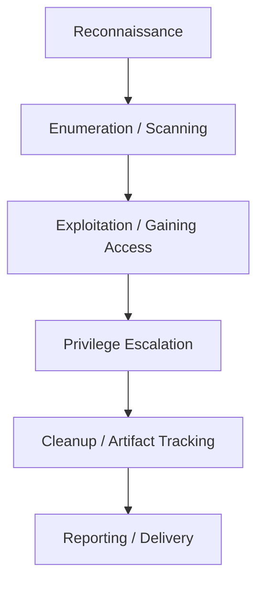
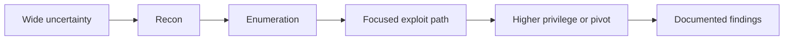
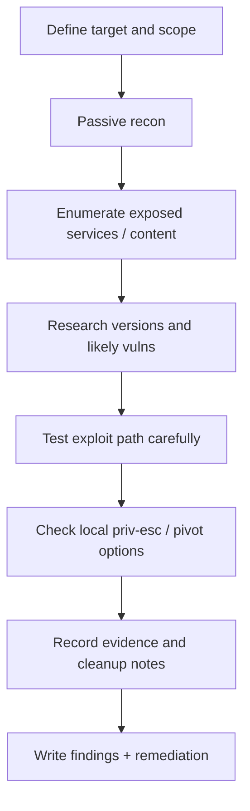

# The Hacker Methodology

## Summary

* This room introduces a simplified **ethical hacking / penetration testing workflow**: reconnaissance, enumeration/scanning, gaining access, privilege escalation, cleanup considerations, and reporting.
* The key idea is procedural discipline: useful offensive work is usually **method-driven**, not random button pressing.
* Reconnaissance narrows the target space. Enumeration turns surface-level knowledge into technical detail. Exploitation should follow evidence, not impulse.
* Privilege escalation is often where local compromise turns into meaningful control.
* In legitimate pentests, **reporting is not paperwork after the real work**; it is part of the real work.
* A useful correction to beginner mythology: "covering tracks" is not a default goal in normal authorized assessments. Documentation, cleanup, and remediation guidance matter more.

---

## 1. Context

This room is best understood as an **introductory operational model** for how attackers and authorized pentesters approach targets in phases.

It is not a complete industry standard by itself. It is a simplified mental scaffold for beginners.

A more formal way to think about this room is:

* it teaches a **workflow mindset**,
* it links common tools to specific stages,
* it helps you stop thinking of hacking as isolated tricks.

The room's simplified sequence overlaps strongly with established industry methodology families, even if the exact phase names differ.

---

## 2. Methodology Overview

### 2.1 Room-level phase sequence

The room's walkthrough presents a practical flow like this:

1. Reconnaissance
2. Enumeration / Scanning
3. Gaining Access / Exploitation
4. Privilege Escalation
5. Covering Tracks / Cleanup Considerations
6. Reporting / Delivery

### 2.2 Why phased work matters

A methodology gives you:

* consistency,
* repeatability,
* better evidence collection,
* reduced guesswork,
* clearer communication to clients or stakeholders.

Without a workflow, testing becomes noisy and shallow. You may still find issues, but you will struggle to explain:

* what you tested,
* why you tested it,
* how you reached the finding,
* how the target should fix it.

---

## 3. Phase 1 - Reconnaissance

### 3.1 Definition

Reconnaissance is the information-gathering phase. The goal is to learn about the target before deep interaction.

This often includes:

* domains and subdomains,
* public-facing assets,
* employee or organizational information,
* technology clues,
* leaked metadata,
* third-party exposure.

### 3.2 Passive vs active thinking

In beginner methodology discussions, recon is often treated as the lower-interaction or passive phase, while deeper host/service interaction gets moved into enumeration.

That distinction is useful because it trains you to separate:

* **what the world already says about the target**, from
* **what the target reveals when touched directly**.

### 3.3 Common recon sources

Basic public sources are often more valuable than new learners expect:

* search engines,
* public websites,
* company pages,
* social platforms,
* job postings,
* technical fingerprints,
* WHOIS / DNS data,
* archived or cached content.

### 3.4 Why recon is so important

Recon is the stage that prevents blind exploitation.

A useful mental model:

```text
No recon -> vague target model
Weak recon -> wasted enumeration
Good recon -> focused technical testing
```

### 3.5 Example tools mentioned in the room

* Google / Google dorking
* Wikipedia
* WHOIS
* Hunter.io
* Sublist3r
* BuiltWith
* Wappalyzer

These tools do not magically "hack" anything. They reduce uncertainty.

---

## 4. Phase 2 - Enumeration and Scanning

### 4.1 Definition

Enumeration/scanning is where the tester begins structured interaction with the target to understand its **attack surface**.

This phase asks:

* what is exposed?
* what services are running?
* what versions are present?
* what inputs or endpoints exist?
* what looks weak, outdated, or unusual?

### 4.2 What "attack surface" means here

The attack surface is the set of reachable components, services, interfaces, and behaviors that could potentially be abused.

Examples:

* open ports,
* login forms,
* API endpoints,
* file shares,
* admin panels,
* outdated services,
* exposed metadata,
* weak configurations.

### 4.3 Typical tools

The room names several important families of tools:

* **Nmap** for host/service discovery and fingerprinting
* **Dirb / DirBuster** for content discovery
* **Burp Suite** for web traffic inspection and manipulation
* **Metasploit** for auxiliary scanning and later exploitation workflows
* **Exploit-DB** for vulnerability research

### 4.4 Why enumeration is decisive

Enumeration often decides whether exploitation succeeds at all.

If recon gives you the target map, enumeration gives you the **technical terrain**.

A recurring beginner mistake is to scan, see output, and stop there. That is not enumeration. Enumeration means interpretation.

---

## 5. Phase 3 - Exploitation / Gaining Access

### 5.1 Definition

Exploitation is the phase where a tester attempts to use discovered weaknesses to gain an initial foothold or demonstrate impact.

### 5.2 Important discipline

A professional tester should not jump into exploitation just because a tool exists.

Better operating logic:

```text
evidence -> hypothesis -> targeted exploit attempt
```

This matters because poorly chosen exploit attempts can:

* fail noisily,
* waste time,
* crash services,
* produce weak findings,
* damage assessment quality.

### 5.3 Common exploitation tooling mentioned in the room

* Metasploit
* Burp Suite
* sqlmap
* msfvenom
* BeEF

These are not interchangeable. Each belongs to different operational niches.

### 5.4 The real lesson

Exploitation is only as good as the stages before it. The walkthrough is correct on that point.

Beginners often imagine exploitation as the center of the whole craft. In practice, it is often a downstream consequence of:

* good recon,
* careful enumeration,
* correct vulnerability matching,
* precise timing and scope discipline.

---

## 6. Phase 4 - Privilege Escalation

### 6.1 Definition

Privilege escalation is the process of moving from a lower-privileged foothold to a more powerful security context.

### 6.2 Typical end states

#### Windows targets

Common target privilege levels:

* `Administrator`
* `NT AUTHORITY\\SYSTEM`

#### Linux targets

Common target privilege level:

* `root`

### 6.3 Why this phase matters

Initial access is not always decisive. A low-privileged shell may be interesting, but higher privilege usually determines:

* data access,
* credential access,
* persistence options,
* lateral movement potential,
* overall impact.

### 6.4 Common privilege escalation paths

The room lists several broad categories that are worth remembering:

* weak or cracked credentials,
* password reuse / credential spraying within scope,
* default credentials,
* vulnerable services,
* local misconfigurations,
* secret keys or SSH keys,
* sudo / SUID issues,
* local enumeration scripts and commands.

### 6.5 Lateral movement note

The room also hints at an important idea: sometimes the next useful move is not vertical escalation on the same host, but **pivoting** to another system where escalation becomes easier or more meaningful.

---

## 7. Phase 5 - Covering Tracks, Cleanup, and Reality

### 7.1 What beginners often get wrong

Many pop-culture depictions of hacking overemphasize "covering tracks" as if it were always the next standard step.

In real authorized pentesting, that is usually not the default objective.

### 7.2 What matters more in legitimate engagements

For authorized assessments, the practical priorities are usually:

* stay inside scope,
* document what you changed,
* preserve client value,
* avoid unnecessary damage,
* support cleanup,
* provide actionable findings.

### 7.3 Better way to think about this phase

A more professional framing is:

```text
post-exploitation hygiene and cleanup
```

That includes:

* removing test artifacts where appropriate,
* recording what was uploaded or executed,
* tracking persistence-like changes for later rollback,
* noting anything the client must remove or rotate.

### 7.4 Useful operational rule

If you touched a system, note down:

* what you changed,
* where you changed it,
* how to undo it.

That makes the later report materially better.

---

## 8. Phase 6 - Reporting and Delivery

### 8.1 Why reporting is part of the methodology

If you did not document it, the client cannot reliably act on it.

Reporting turns technical work into:

* evidence,
* business communication,
* remediation planning,
* risk prioritization.

### 8.2 Core reporting components

The room correctly emphasizes several core parts:

* finding name / summary,
* severity or criticality,
* description,
* how it was discovered or reproduced,
* remediation recommendation.

A mature report also often includes:

* affected assets,
* impact statement,
* proof-of-concept evidence,
* scope context,
* detection or monitoring notes,
* assumptions and limitations.

### 8.3 Report types mentioned in the room

The walkthrough distinguishes between:

* raw vulnerability scan output,
* finding summaries,
* full formal reports.

That is useful because different audiences want different levels of abstraction.

### 8.4 Audience split

A common practical split looks like this:

* **Executive summary**: business-level overview, risk, prioritization
* **Technical report**: reproducibility, evidence, remediation detail

### 8.5 Reporting principle

```text
A pentest that cannot be consumed is operationally incomplete.
```

---

## 9. Mapping the Room to Broader Methodology

This room uses a simplified, beginner-friendly model.

That is good pedagogy, but it is helpful to know that real-world standards often break the workflow into more explicit stages such as:

* pre-engagement / planning,
* intelligence gathering,
* threat modeling or vulnerability analysis,
* exploitation,
* post-exploitation,
* reporting.

So the room is directionally correct, but intentionally compressed.

---

## 10. Workflow Diagram



Another useful view:



---

## 11. Pattern Cards

### Pattern Card 1 - Recon reduces randomness

**Problem**
: beginners want to touch the target too early.

**Fix**
: build a target model first using public information.

**Reason**
: you cannot effectively probe what you do not conceptually understand.

### Pattern Card 2 - Enumeration is interpretation, not just scanning

**Problem**
: a scan result is mistaken for a finished analysis.

**Fix**
: connect findings to versions, exposed services, likely weaknesses, and next steps.

**Reason**
: tooling produces data; methodology produces meaning.

### Pattern Card 3 - Exploit only with evidence

**Problem**
: random exploit attempts create noise and instability.

**Fix**
: verify service identity, version, and fit before attempting exploitation.

**Reason**
: offensive precision is more valuable than offensive enthusiasm.

### Pattern Card 4 - Initial access is often not the end state

**Problem**
: low-privilege access gets mistaken for full compromise.

**Fix**
: assess local escalation paths, credential material, and lateral movement opportunities.

**Reason**
: impact usually depends on what the foothold can become.

### Pattern Card 5 - Reporting is part of the weapon system

**Problem**
: reporting is treated as admin overhead.

**Fix**
: think of reporting as the conversion layer between technical proof and remediation.

**Reason**
: unreported value is operational waste.

---

## 12. Mini Workflow for a Beginner Lab



This is a better operational memory aid than memorizing tool names in isolation.

---

## 13. Tool-to-Phase Mapping

| Phase | Typical goal | Example tools |
| --- | --- | --- |
| Reconnaissance | learn about target exposure | Google, WHOIS, Hunter.io, BuiltWith, Wappalyzer, Sublist3r |
| Enumeration / Scanning | identify reachable surface and versions | Nmap, Dirb/DirBuster, Burp Suite, Metasploit auxiliary modules |
| Exploitation | gain foothold or prove impact | Metasploit, Burp Suite, sqlmap, msfvenom, BeEF |
| Privilege Escalation | increase control or move laterally | local enum tools, credential abuse, config analysis |
| Reporting | convert findings into action | evidence notes, screenshots, formal report structure |

---

## 14. Common Pitfalls

### 14.1 Treating methodology as a rigid script

The sequence is useful, but real engagements vary based on:

* scope,
* target type,
* rules of engagement,
* time constraints,
* whether the work is internal, external, red-team, or validation-oriented.

### 14.2 Confusing recon with enumeration

Recon is broader and often lower-interaction.
Enumeration is more technical and target-touching.

### 14.3 Letting tools replace reasoning

Knowing ten tool names is not the same as understanding when a result matters.

### 14.4 Over-romanticizing "covering tracks"

In legitimate pentesting, that mindset is usually less valuable than disciplined cleanup and documentation.

### 14.5 Writing weak remediation advice

"Patch this" is rarely enough. Good remediation should help the target owner know what to do next.

---

## 15. Takeaways

* Offensive work becomes more effective when you think in **phases**, not tricks.
* Reconnaissance is where target uncertainty starts to collapse.
* Enumeration is where the attack surface becomes technically legible.
* Exploitation should be evidence-led, not ego-led.
* Privilege escalation often determines real impact.
* Cleanup and artifact tracking matter more than cinematic "track covering" in normal pentests.
* Reporting is the phase that turns a compromise path into something the client can actually fix.

---

## 16. CN-EN Glossary

* Reconnaissance - 侦察 / 信息收集
* Enumeration - 枚举 / 细化探测
* Scanning - 扫描
* Attack Surface - 攻击面
* Exploitation - 利用 / 漏洞利用
* Initial Access - 初始访问
* Privilege Escalation - 提权
* Lateral Movement - 横向移动
* Pivoting - 枢纽跳转 / 枢轴移动
* Default Credentials - 默认凭据
* Password Reuse - 密码复用
* Reporting - 报告撰写
* Remediation Recommendation - 修复建议
* Executive Summary - 管理摘要 / 高层摘要
* Technical Report - 技术报告
* Rules of Engagement - 交战规则 / 测试约束
* Scope - 范围
* Passive Recon - 被动侦察
* Active Enumeration - 主动枚举

---

## 17. References

* TryHackMe room content: *The Hacker Methodology*
* PTES: Penetration Testing Execution Standard
* NIST SP 800-115: Technical Guide to Information Security Testing and Assessment
* Rapid7: Metasploit
* PortSwigger: Burp Suite
