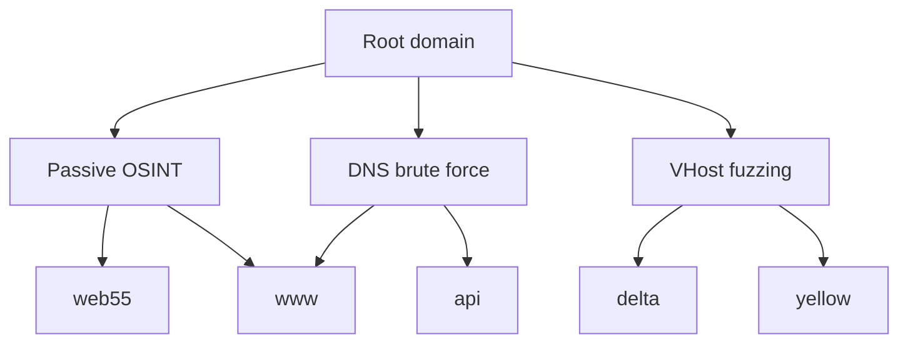

# Subdomain Enumeration

## Summary

* Subdomain enumeration expands attack surface. The point is not collecting names for its own sake; the point is finding additional services, roles, environments, and trust boundaries.
* The room uses three discovery families: passive OSINT, active DNS brute force, and virtual host fuzzing.
* Passive methods are quieter and often faster for a first pass. Active methods are better for surfacing non-indexed or internally used naming patterns.
* A subdomain is not always a DNS record visible to the public. Some names only exist as virtual hosts resolved by the web server after inspecting the `Host` header.
* The strongest workflow is layered: CT logs -> search engines -> passive aggregators -> brute force -> vhost fuzzing -> HTTP follow-up.

```text
known domain
   -> passive discovery
   -> active DNS guessing
   -> web vhost probing
   -> verify live services
   -> prioritize by exposure and function
```

## 1. Why Subdomain Enumeration Matters

Subdomain enumeration is one of the simplest ways to widen a target's observable surface.

Typical value comes from finding:

* alternate web apps
* APIs
* admin portals
* staging or development systems
* forgotten microsites
* environment-specific hosts
* internal naming conventions leaked into public exposure

A root domain rarely represents the whole estate.

### First-principles view

A subdomain often encodes role.

Examples:

* `api` -> programmatic interface
* `admin` -> management plane
* `dev`, `staging`, `test` -> weaker controls are common
* `cdn`, `static`, `assets` -> delivery infrastructure
* product/team names -> business context and app segmentation

So the real question is not "How many subdomains exist?"

The real question is:

**Which names reveal additional systems worth validating?**

## 2. Method Families

## 2.1 Passive discovery

Passive discovery uses public data sources instead of querying the target infrastructure aggressively.

Typical sources:

* certificate transparency logs
* search engines
* passive DNS / internet scan datasets
* third-party aggregation tools

Advantages:

* low noise
* fast initial coverage
* historical artifacts may still be visible

Limits:

* misses private or unindexed assets
* quality depends on public exposure

## 2.2 Active DNS brute force

This method tests candidate names from a wordlist against DNS.

Advantages:

* finds common naming patterns directly
* useful when passive results are sparse

Limits:

* noisier than passive discovery
* depends on wordlist quality
* may miss unconventional naming

## 2.3 Virtual host fuzzing

Some sites are hosted on one IP and one web server, but different content is served depending on the `Host` header.

That means a valid site may exist even when no public DNS record points to it.

This is one of the most important conceptual points in the room.

## 3. Certificate Transparency (CT) Logs

When certificates are issued, certificate transparency logs can expose domain names and subdomains included in those certificates.

That makes CT a strong passive starting point.

### Practical idea

Search the target root domain in CT data, then extract:

* exact subdomain names
* wildcard entries
* historical records
* SAN-related naming patterns

### Why CT is valuable

It often reveals:

* older infrastructure
* certificate naming drift
* alternate service names
* forgotten but once-legitimate hosts

### Pattern card

**Pattern:** CT-first enumeration  
**Use when:** the target likely uses TLS broadly  
**Strength:** low noise, historically rich  
**Weakness:** only helps if certificates exist and were logged

## 4. Search Engine Discovery

Search engines can leak subdomains through indexed pages, cached references, or public documentation.

The room uses the logic of restricting results to the target domain while excluding the main `www` host.

### Core idea

Use search results to extract hosts that are:

* indexed
* linked by public pages
* referenced in docs / assets / redirects

### Strength

Search engines sometimes expose subdomains that are not obvious from CT logs alone.

### Weakness

Coverage is inconsistent and time-dependent.

## 5. DNS Brute Force

DNS brute force tries candidate labels such as:

* `api`
* `dev`
* `mail`
* `admin`
* `staging`
* `portal`

against the target domain.

This is straightforward but still useful because real infrastructure naming is often predictable.

## 5.1 Tool pattern: dnsrecon

The room demonstrates `dnsrecon` for brute-force DNS discovery.

### General workflow

1. Select target domain.
2. Use a standard or curated wordlist.
3. Resolve candidate subdomains.
4. Record positive A/AAAA hits.
5. Validate live HTTP/HTTPS exposure afterwards.

**Lab observation from the provided screenshots**

The simulated `dnsrecon` run found two A records:

* `api.acmeitsupport.thm`
* `www.acmeitsupport.thm`

The first discovered subdomain in that run was:

* `api.acmeitsupport.thm`

**Command shape**

```bash
dnsrecon -t brt -d TARGET_DOMAIN
```

### Interpretation

If brute force returns `api`, that is immediately more interesting than a duplicate `www` because it suggests a separate application surface and often different authentication logic.

## 6. Passive Automation with Sublist3r

Sublist3r automates passive collection across multiple public data sources.

This is effectively a recon aggregator for subdomain discovery.

### Mental model

Instead of manually checking:

* search engines
* passive DNS-like sources
* internet datasets
* certificate and reputation services

Sublist3r queries them in one pass and merges results.

**Lab observation from the provided screenshots**

The Sublist3r simulation for `acmeitsupport.thm` returned:

* `web55.acmeitsupport.thm`
* `www.acmeitsupport.thm`

The first discovered subdomain shown in that run was:

* `web55.acmeitsupport.thm`

### Why that matters

Names like `web55` imply infrastructure indexing or server-role numbering. That kind of hostname often hints at:

* load-balanced web tiers
* older naming conventions
* separate application nodes
* operational segmentation

**Command shape**

```bash
sublist3r -d TARGET_DOMAIN
```

## 7. Virtual Hosts and Why They Matter

A major misconception in beginner recon is:

```text
If DNS does not resolve it, the host does not exist.
```

That is false in web enumeration.

A web server can host multiple applications on the same IP and choose which one to serve based on the `Host` header.

So if you can control the `Host` header, you can probe for additional names that are configured server-side but not published in public DNS.

## 7.1 VHost fuzzing logic

You send repeated requests to one IP while varying:

```http
Host: candidate.target.tld
```

Then compare response differences such as:

* status code
* body size
* word count
* line count
* titles / redirects / headers

## 7.2 Why filtering matters

In the room, the first `ffuf` run returns many default-looking hits. That is common because the server often responds generically even for invalid hostnames.

The fix is to filter on a common baseline response size using `-fs`.

**Command shape**

```bash
ffuf -w WORDLIST \
  -H "Host: FUZZ.TARGET_DOMAIN" \
  -u http://TARGET_IP \
  -fs 1234
```

**Lab observation from the provided screenshots**

Using `ffuf` with a filtered baseline size, the vhost fuzzing step surfaced two additional names:

* `delta`
* `yellow`

In fully qualified form:

* `delta.acmeitsupport.thm`
* `yellow.acmeitsupport.thm`

These are especially useful because they were not obtained through the earlier public-DNS-oriented methods.

## 8. Comparison of the Three Approaches

| Method | Noise level | Data source | Best for | Common blind spot |
| --- | --- | --- | --- | --- |
| CT / search / passive OSINT | Low | Public internet records | Fast first-pass discovery | Private or unindexed assets |
| DNS brute force | Medium | Authoritative resolution behavior | Common naming patterns | Non-dictionary names |
| VHost fuzzing | Medium to high | Web server host routing | Hidden web apps on shared IPs | Non-HTTP assets |

### Recommended sequencing

```text
1. passive first
2. active DNS brute force second
3. vhost fuzzing third
4. HTTP fingerprinting and content discovery next
```

That order gives good coverage while keeping logic clean.

## 9. Practical Lab Findings from the Provided Material

This section records only what was explicitly shown in the screenshots and room text.

## 9.1 DNS brute force result

```text
api.acmeitsupport.thm
www.acmeitsupport.thm
```

## 9.2 Sublist3r passive result

```text
web55.acmeitsupport.thm
www.acmeitsupport.thm
```

## 9.3 Virtual host fuzzing result

```text
delta.acmeitsupport.thm
yellow.acmeitsupport.thm
```

### Interpretation of the combined set

The lab demonstrates an important recon lesson:

* different enumeration channels reveal different subsets
* no single method is sufficient
* overlap (`www`) is normal
* non-overlap is where the real value is



## 10. Command Cookbook

## 10.1 dnsrecon brute force

```bash
dnsrecon -t brt -d TARGET_DOMAIN
```

## 10.2 Sublist3r passive enumeration

```bash
sublist3r -d TARGET_DOMAIN
```

## 10.3 ffuf virtual host fuzzing

```bash
ffuf -w /path/to/wordlist.txt \
  -H "Host: FUZZ.TARGET_DOMAIN" \
  -u http://TARGET_IP
```

## 10.4 ffuf with baseline-size filtering

```bash
ffuf -w /path/to/wordlist.txt \
  -H "Host: FUZZ.TARGET_DOMAIN" \
  -u http://TARGET_IP \
  -fs 1234
```

## 10.5 Search engine query shape

```text
site:*.target.tld -site:www.target.tld
```

## 11. Analyst Notes

## 11.1 What to prioritize after discovery

Do not treat every discovered name equally.

Prioritize:

1. API-like names
2. admin or auth-like names
3. dev/test/staging names
4. numbered infrastructure names that may map to separate apps
5. newly exposed vhosts with distinct response sizes or titles

## 11.2 Common mistakes

### Mistake 1

Stopping after passive OSINT.

### Mistake 2

Stopping after DNS brute force.

### Mistake 3

Assuming same-IP means same app.

### Mistake 4

Not filtering baseline noise during vhost fuzzing.

### Mistake 5

Collecting names without following up with HTTP validation.

## 12. Follow-on Workflow

Subdomain enumeration is only step one.

A good next-stage pipeline is:

```text
subdomain discovery
  -> resolve / de-duplicate
  -> HTTP/HTTPS probing
  -> title / tech fingerprinting
  -> content discovery
  -> auth surface review
  -> parameter discovery
```

This room fits best as the recon-to-web-enumeration bridge.

## 13. Pattern Cards

## Pattern Card - `api`

**Signal:** API-labeled subdomain discovered  
**Likely implications:** separate auth logic, machine-consumed endpoints, documentation leaks, CORS and token issues  
**Priority:** high

## Pattern Card - numbered web host (`web55`-style)

**Signal:** infrastructure-style hostname  
**Likely implications:** cluster member, legacy service, alternate deployment lane  
**Priority:** medium to high

## Pattern Card - vhost-only discovery (`delta`, `yellow`-style)

**Signal:** hostname appears only when `Host` header is fuzzed  
**Likely implications:** hidden app on shared server, dev/staging naming, DNS-private exposure  
**Priority:** high

## 14. CN-EN Glossary

* Subdomain Enumeration -- 子域名枚举
* Certificate Transparency -- 证书透明度日志
* Passive Reconnaissance -- 被动侦察
* Active Enumeration -- 主动枚举
* DNS Bruteforce -- DNS 爆破 / 字典枚举
* Virtual Host -- 虚拟主机
* Host Header -- Host 请求头
* Baseline Response -- 基线响应
* Response Size Filtering -- 响应大小过滤
* Attack Surface -- 攻击面
* Wordlist -- 字典表
* Resolution -- 解析
* SAN (Subject Alternative Name) -- 证书备用名称

## 15. References

* crt.sh and CT-based discovery concepts
* dnsrecon project documentation
* Sublist3r project documentation
* ffuf documentation for `FUZZ` keyword placement and filtering strategy

## 16. Final Takeaway

The room teaches one durable recon principle:

```text
Subdomain enumeration is not one technique.
It is a layered discovery process across public records, DNS behavior, and web-server routing logic.
```

That distinction matters, because the most interesting host is often the one that only appears in exactly one layer.
