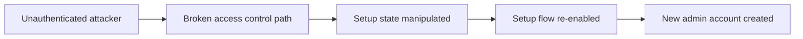

# Confluence CVE-2023-22515

## Summary

* **CVE-2023-22515** is a **Broken Access Control** vulnerability affecting **Confluence Server** and **Confluence Data Center**. It was assigned **CVSS 10.0** and was reported as being exploited in the wild.
* The practical consequence is severe: an unauthenticated remote attacker can abuse the vulnerable setup flow to create an **unauthorized Confluence administrator account**.
* Atlassian states that **versions prior to 8.0.0 are not affected**. The vulnerable ranges include selected 8.0.x, 8.1.x, 8.2.x, 8.3.x, 8.4.x, and 8.5.x releases before the fixed versions.
* The vendor-fixed versions are **8.3.3+**, **8.4.3+**, and **8.5.2+**. Temporary mitigation exists, but Atlassian explicitly says mitigation is **not a replacement for upgrading**.
* Detection should focus on **unexpected admin accounts**, suspicious members of the `confluence-administrators` group, and requests to **`/setup/*.action`** or similar recovery/setup paths.
* For a public writeup, the most useful framing is **impact, affected versions, root cause class, detection, and remediation**, not a click-for-click reproduction guide.

---

## 1. What the Vulnerability Is

CVE-2023-22515 is an **unauthenticated broken access control flaw** in on-premises Confluence editions.

High-level properties:

| Property | Value |
| --- | --- |
| CVE | CVE-2023-22515 |
| Product family | Confluence Server / Confluence Data Center |
| Vulnerability class | Broken Access Control |
| Severity | Critical / CVSS 10.0 |
| Attack precondition | Publicly reachable vulnerable instance |
| Impact | Unauthorized administrator account creation |
| Atlassian Cloud affected? | No |

---

## 2. Why It Was So Dangerous

This issue was operationally dangerous for three reasons:

1. **No prior credentials were required**.
2. **The end state was administrative access**.
3. **Exploitation was simple enough that widespread scanning and public exploit code followed quickly**.

This is the sort of flaw that moves very quickly from advisory to real-world compromise, especially on internet-facing enterprise software.

---

## 3. Root Cause, Simplified

Confluence's request handling relied on action/property binding behaviour in the underlying web framework stack. In the vulnerable setup, an attacker could reach a path that allowed application setup state to be changed when it should no longer have been externally mutable.

Security meaning:

* setup completion should have been a protected state transition
* instead, the application allowed a path that could re-enable setup logic
* once setup was re-opened, the attacker could walk through administrator creation again

The important abstraction is:

> This is fundamentally a **state-reset / authorization failure** that re-exposed privileged initialization behaviour to unauthenticated users.

---

## 4. Affected and Fixed Versions

### 4.1 Affected scope

According to Atlassian:

* **versions prior to 8.0.0 are not affected**
* affected branches include multiple releases from **8.0.0 through 8.5.1**, excluding the later fixed maintenance releases

### 4.2 Fixed versions

Atlassian's listed fixed versions are:

* **8.3.3 or later**
* **8.4.3 or later**
* **8.5.2 (LTS) or later**

This immediately answers one common check:

* **Confluence Server 8.2.0 is vulnerable**

---

## 5. Public-Safe Lab Summary

This room demonstrates the vulnerability in a controlled environment by showing that a vulnerable Confluence instance can be pushed back into a setup-administration path and then abused to gain administrative access.

For a public note, the useful takeaway is not the exact request sequence but the exploitation logic:

* vulnerable Confluence instance is reachable
* setup state is improperly made mutable again
* admin-creation path becomes reachable
* attacker creates a new admin and logs in

### Public task answers

| Question | Answer |
| --- | --- |
| Is Confluence Server 8.2.0 vulnerable? | **yea** |
| Does mitigation replace upgrading? | **nay** |
| Chocapikk script username | **pleasepatch** |

### Note on the lab flag

The room includes a lab-specific flag posted by the in-room administrator account after successful access. Because that value is environment-specific and not needed for the public security lesson, it is intentionally omitted from this public note.

---

## 6. Detection Guidance

Atlassian's own advisory recommends checking for signs such as:

* unexpected new user accounts
* unexpected members of the `confluence-administrators` group
* requests to `/setup/*.action`
* evidence tied to setup administrator flows in logs
* unknown or suspicious plugins installed after compromise

From a blue-team perspective, the best lens is:

* **identity anomalies**
* **setup-flow access after normal installation**
* **post-compromise persistence / plugin activity**

---

## 7. Remediation

### 7.1 Preferred fix

Upgrade to a fixed Confluence version as soon as possible.

This is the authoritative remediation path.

### 7.2 Interim mitigation

If immediate upgrade is not possible, Atlassian documents an interim mitigation by restricting access to **`/setup/*`** endpoints via configuration.

Important operational point:

* this can reduce exposure to known attack paths
* it is **not** the same as patching
* the instance should still be upgraded as soon as possible

### 7.3 Additional response step

If compromise is suspected, treat the instance as fully administrative-access compromised and investigate accordingly. The advisory explicitly warns that attackers with admin access may exfiltrate content and credentials or install malicious plugins.

---

## 8. Security Lessons

### 8.1 Initialization logic is sensitive security state

Any code path related to first-run setup, bootstrap, or administrative initialization should be treated as highly privileged application state.

### 8.2 Public exposure multiplies broken access control impact

A flaw like this is much worse on internet-facing collaboration software than on a tightly isolated internal service.

### 8.3 Admin creation is equivalent to compromise

In enterprise SaaS-style or collaboration platforms, unauthorized admin creation is not a minor misconfiguration. It is usually full application compromise.

---

## 9. Pattern Cards

### Pattern Card 1 - Setup Flow Re-Exposure

**Failure mode**
A post-installation setup path becomes reachable again.

**Lesson**
Initialization endpoints should be permanently locked down after completion.

### Pattern Card 2 - State Change Without Authorization

**Failure mode**
An attacker can mutate a security-relevant application state without proper authorization.

**Lesson**
Not all dangerous bugs look like code execution; state-reset bugs can be equally catastrophic.

### Pattern Card 3 - Mitigation Drift

**Failure mode**
Teams apply an interim block and delay the real upgrade.

**Lesson**
Temporary mitigations buy time; version upgrade closes the vulnerability.

---

## 10. Defensive Takeaways

* Prioritise rapid patching for **internet-facing enterprise software** with critical vendor advisories.
* Treat **setup and bootstrap flows** as security-critical surfaces.
* Look for **identity and privilege anomalies**, not only web exploit traces.
* Assume **full administrative compromise** if unauthorized admin creation is confirmed.
* Public-facing security notes are more valuable when they explain **impact, scope, IoCs, and remediation** instead of publishing turnkey exploitation steps.

---

## 11. CN-EN Glossary

| English | 中文 |
| --- | --- |
| Broken Access Control | 访问控制失效 / 访问控制缺陷 |
| Confluence Server | 本地部署版 Confluence Server |
| Confluence Data Center | 数据中心版 Confluence |
| Bootstrap / Setup Flow | 初始化 / 安装配置流程 |
| Unauthorized Administrator Account | 未授权管理员账户 |
| Indicator of Compromise (IoC) | 入侵指标 |
| Interim Mitigation | 临时缓解措施 |
| Fixed Version | 已修复版本 |
| Publicly Accessible Instance | 公网可访问实例 |
| Threat Detection | 威胁检测 |

---

## 12. Further Reading

* Atlassian security advisory for CVE-2023-22515
* Atlassian Jira ticket CONFSERVER-92475
* NVD entry for CVE-2023-22515
* Rapid7 AttackerKB analysis
