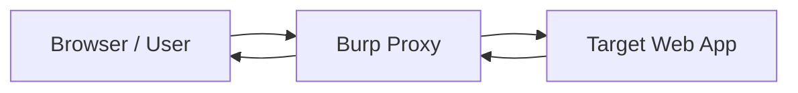
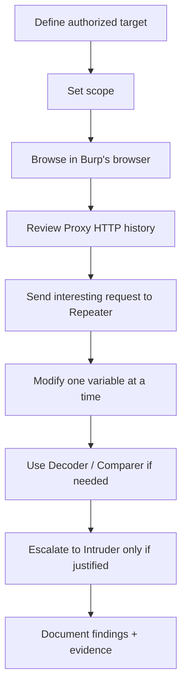

# Burp Suite The Basics

## Summary

* Burp Suite is best understood as an **intercepting web proxy** for web security testing.
* Its core workflow is simple: **capture traffic -> inspect it -> modify it -> resend it -> compare responses**.
* For beginners, the most important Burp tools are **Proxy, HTTP history, Repeater, Intruder, Decoder, Comparer, Sequencer, Target/Scope, and Burp's browser**.
* The operational mistake most beginners make is collecting too much noise. Good Burp usage starts with **scope discipline**.
* In current official documentation, **Burp's browser** is the default recommendation for most users; external browser proxy setup is optional in most cases.
* This room is about **manual web testing foundations**, not automation-first scanning.

---

## 1. Context

Burp Suite is the standard manual toolkit for web application security testing. The Community Edition is positioned by PortSwigger as the essential manual toolkit for learning AppSec, while the Professional edition adds faster workflows, more automation, and broader testing convenience. Enterprise-oriented scanning is handled separately for organizational continuous scanning use cases.

This note focuses on the beginner baseline: how Burp fits into a practical testing loop, what each core tool is for, and how to avoid common beginner confusion caused by version/UI drift between older tutorials and the current desktop interface.

---

## 2. Rules of Engagement

Use Burp only in one of these contexts:

* your own applications,
* explicit lab targets,
* CTF / training platforms,
* environments where you have written authorization.

Do **not** use Burp against production systems outside approved scope.

Safe placeholders used in this note:

* `TARGET_HOST`
* `TARGET_IP`
* `example.com`
* `SESSION_TOKEN`
* `PARAM_NAME`

---

## 3. Core Mental Model

### 3.1 Burp as a man-in-the-middle proxy

Burp sits between your browser and the target application.



That gives you four major powers:

1. **Intercept** requests before they reach the server.
2. **Inspect** raw HTTP(S) traffic.
3. **Modify** requests and responses.
4. **Route** interesting messages into other Burp tools.

### 3.2 Why this matters

Web apps often hide their real behavior behind JavaScript, client-side validation, redirects, and browser rendering. Burp lets you see the application at the **HTTP message layer**, where a lot of security logic actually lives.

That is the transition from "using a website" to "testing an application."

---

## 4. Editions at a Glance

| Edition | Practical role | Typical user |
| --- | --- | --- |
| Community Edition | Manual toolkit for learning and hands-on testing | beginners, students, manual testers |
| Professional | Manual + faster workflows + more automation | pentesters, bug bounty hunters, AppSec engineers |
| Enterprise-style deployment | Continuous organizational scanning | security teams / companies |

### Important operational distinction

For this room, **Community Edition is enough**. The point is not maximum automation. The point is learning:

* how to see traffic,
* how to resend requests,
* how to keep your scope clean,
* how to reason about web behavior from raw messages.

---

## 5. Main Tools You Actually Need

### 5.1 Proxy

**Purpose**
: intercept, inspect, and modify traffic between browser and target.

**What to learn first**

* `Intercept on/off`
* `Forward`
* `Drop`
* request/response inspection
* sending requests to other tools

**Sub-areas that matter**

* **Intercept**: live stop-and-edit traffic
* **HTTP history**: full record of proxied HTTP messages
* **WebSockets history**: useful when apps use WS heavily
* **Match and replace**: automatic traffic rewriting rules

#### Proxy pattern

```text
Proxy = live control plane
History = passive evidence store
```

That distinction matters. Beginners often leave intercept on too long and then wonder why the browser "breaks." It usually means Burp is holding the request.

### 5.2 Repeater

**Purpose**
: manually resend a single interesting request with controlled edits.

**Best use cases**

* parameter tampering
* endpoint exploration
* header/cookie changes
* auth flow testing
* comparing normal vs altered behavior

**Mental model**

```text
Proxy catches something interesting.
Repeater becomes the microscope.
```

### Example workflow

1. capture a request in Proxy / HTTP history,
2. send it to Repeater,
3. change one thing at a time,
4. resend,
5. study differences in response code, body, headers, and timing.

This "one variable at a time" habit is foundational.

### 5.3 Intruder

**Purpose**
: automate repeated request sending with payload positions.

**Beginner-safe interpretation**

Think of Intruder as an **automation layer over Repeater**.

You define:

* the base request,
* the insertion point(s),
* the payload list,
* the attack style.

Then Burp iterates.

### Typical beginner use cases in labs

* content discovery on permitted targets,
* parameter value fuzzing,
* simple wordlist-based testing in authorized environments.

### Why it matters

Repeater is good for hypothesis testing.
Intruder is good for **systematic variation**.

### 5.4 Decoder

**Purpose**
: encode/decode data during manual testing.

Common formats you will encounter:

* URL encoding
* Base64
* hex
* HTML entities
* hashes / transforms depending on context

### Real workflow

```text
copy encoded value -> decode -> understand/edit -> re-encode -> paste back -> resend
```

Decoder is not glamorous, but it is one of the most practical tools in the suite.

### 5.5 Comparer

**Purpose**
: diff two items of data.

Useful for comparing:

* request A vs request B,
* response A vs response B,
* pre-auth vs post-auth behavior,
* valid vs invalid parameter effects.

Comparer is excellent when your eyes start lying to you. That happens faster than beginners expect.

### 5.6 Sequencer

**Purpose**
: analyze the quality of randomness in tokens that should be unpredictable.

Relevant examples:

* session tokens,
* anti-CSRF tokens,
* password reset tokens.

### Why this exists

If a token is predictable, it may be guessable or statistically weak. That can become a serious security issue.

Sequencer is conceptually more advanced than Proxy/Repeater, but the room's main lesson is simple:

> Some application values must be random enough to resist prediction.

### 5.7 Extensions / BApps

**Purpose**
: extend Burp beyond the default toolset.

Extensions can add:

* convenience helpers,
* analysis workflows,
* niche testing functions,
* integration with outside tooling.

For a beginner, the right attitude is:

```text
Learn the default workflow first.
Customize second.
```

Otherwise you will build a cockpit before learning how to fly.

---

## 6. Target Tab, Sitemap, and Scope

This is one of the most practically important sections in the room.

### 6.1 Sitemap

The sitemap gives you a structured view of discovered content for in-scope targets.

Useful for:

* visualizing endpoints,
* spotting odd directories or filenames,
* reviewing what you have actually touched,
* reducing guesswork during exploration.

### 6.2 Scope

Scope defines what Burp should treat as your target.

Why scope matters:

* reduces noise,
* keeps HTTP history cleaner,
* keeps your testing aligned with authorization,
* prevents you from getting lost in irrelevant third-party traffic.

#### Good habit

Set scope **before** doing broad browsing.

That one habit can save a large amount of time.

#### Scope principle

```text
No scope -> too much noise
Bad scope -> operational confusion
Good scope -> clearer testing signal
```

---

## 7. Burp's Browser vs External Browser

Current PortSwigger guidance is clear: for the vast majority of users, configuring an external browser is unnecessary because **Burp's browser is already configured**.

### Practical recommendation

Use **Burp's browser** if:

* you are learning,
* you want the least setup friction,
* you want traffic to be automatically proxied through Burp,
* you want to avoid certificate/proxy misconfiguration early on.

Use an **external browser** if:

* you have a specific workflow reason,
* you need your normal browser profile,
* you are working in a setup where external integration is required.

### Why old tutorials feel different

A lot of older walkthroughs lean heavily on browser extensions such as FoxyProxy. That still works, but it is no longer the simplest default path for most standalone learners.

---

## 8. Installation and Settings

### 8.1 Installation

Burp installation is operationally simple. The harder part is not installation itself; it is understanding:

* proxying,
* certificates,
* scope,
* browser routing.

### 8.2 Settings model

Burp exposes tool-specific and broader settings. Conceptually, think in two layers:

* **global/user-level preferences**,
* **project/tool-level behavior**.

#### Important settings families beginners should know exist

* Proxy
* Intruder
* Repeater
* Comparer
* Sequencer
* Burp's browser
* UI / hotkeys

Do not over-tune everything on day one. Most beginners need only:

* proxy behavior,
* scope behavior,
* browser setup,
* UI familiarity.

---

## 9. Navigation and UI Drift

A practical issue with Burp learning material is **UI version drift**.

Older screenshots may not match the current Burp desktop layout. That does **not** change the conceptual workflow.

### Stable ideas across versions

* main tools are still the same,
* requests can still be routed between tools,
* settings still exist by tool area,
* Proxy / Repeater / Intruder remain core,
* scope and history still matter,
* built-in help and documentation remain useful.

So when UI changes, keep your abstraction level high:

```text
Tool name > exact button placement
Workflow > screenshot matching
```

That is how you stay sane.

---

## 10. Pattern Cards

### Pattern Card 1 - Capture, then isolate

**Problem**
: Browsing creates a lot of traffic.

**Technique**
: Use Proxy/History to catch traffic, then move one interesting request into Repeater.

**Why it works**
: You reduce complexity and test hypotheses cleanly.

### Pattern Card 2 - Scope before exploration

**Problem**
: Third-party requests pollute your history.

**Technique**
: Set scope first, then browse.

**Why it works**
: It keeps the signal-to-noise ratio manageable.

### Pattern Card 3 - Decode before guessing

**Problem**
: Encoded values look meaningless.

**Technique**
: Use Decoder to reveal the structure before editing.

**Why it works**
: Editing opaque blobs blindly is how time gets wasted.

### Pattern Card 4 - Compare instead of eyeballing

**Problem**
: Small response differences are easy to miss.

**Technique**
: Use Comparer for diffs.

**Why it works**
: Human visual comparison is unreliable under repetition.

### Pattern Card 5 - Automate only after understanding

**Problem**
: Beginners jump into automation too early.

**Technique**
: Confirm manual logic in Repeater, then scale with Intruder.

**Why it works**
: Automation amplifies understanding; it does not replace it.

---

## 11. Mini Workflow for a Beginner Lab



This is the room in one picture.

---

## 12. Command / Action Cookbook

> This section is intentionally light and lab-safe. It focuses on workflow actions, not offensive playbooks.

### Open Burp's browser

```text
Proxy -> Intercept -> Open browser
```

### Send a request to Repeater

```text
Right-click request -> Send to Repeater
```

### Send a request to Intruder

```text
Right-click request -> Send to Intruder
```

### Send selected text to Decoder

```text
Highlight value -> Right-click -> Send to Decoder
```

### Add a host or URL to scope

```text
Target -> Scope -> Add
```

### High-value routine

```text
Browse -> History -> Repeater -> Compare -> Document
```

---

## 13. Common Pitfalls

### 13.1 Leaving intercept on by accident

Symptom:

* browser appears frozen,
* pages stop loading,
* you think the target is broken.

Reality:

* Burp is waiting for you to `Forward` or turn interception off.

### 13.2 Testing without scope

Symptom:

* history full of unrelated noise,
* difficulty finding relevant endpoints,
* confusion about what belongs to the target.

Reality:

* you skipped one of the most important setup steps.

### 13.3 Over-trusting the rendered view

Burp's rendering is useful, but it is not a full browser replacement. For precise behavior analysis, always trust raw HTTP details first.

### 13.4 Copy-paste edits without encoding awareness

A changed parameter may fail simply because the encoding format is wrong.

### 13.5 Jumping straight to Intruder

If you do not understand the request manually, automating it will mostly generate prettier confusion.

---

## 14. Evidence / Notes

### Current stable takeaways from official docs

* Burp Proxy is still the essential user-driven workflow tool.
* Repeater is still the manual resend-and-modify workhorse.
* Intruder is still the customizable automated attack/fuzzing tool.
* Sequencer is still the randomness-analysis tool for unpredictable tokens.
* Scope remains central for keeping testing focused.
* Burp's browser is the current default recommendation for most users.

### Practical reading of the THM room

This room is best treated as:

* a foundational tool familiarization room,
* a bridge from "browser user" to "HTTP tester",
* an onboarding module before deeper PortSwigger Academy labs.

It is **not** the endpoint of web security learning. It is the entry corridor.

---

## 15. Takeaways

* Burp Suite is not "just another security tool"; it is the main manual observation and manipulation layer for web AppSec work.
* The core beginner stack is: **Proxy + History + Repeater + Scope**.
* Repeater teaches thinking. Intruder scales thinking.
* Decoder and Comparer look minor until the day they save you 40 minutes.
* Burp's browser is now the least-friction entry point for most learners.
* Old tutorials may have outdated UI, but the workflow model is still valid.
* After this room, the right next step is not random bug bounty behavior. The right next step is **structured practice** on Web Security Academy labs.

---

## 16. Further Reading

* Burp Suite official documentation
* Web Security Academy beginner topics
* HTTP basics, cookies, headers, sessions
* Intro labs on authentication, access control, XSS, and request handling

---

## 17. CN-EN Glossary

* Burp Suite - Burp 套件
* Proxy - 代理 / 拦截代理
* Intercept - 拦截
* HTTP history - HTTP 历史记录
* WebSockets history - WebSocket 历史记录
* Repeater - 重发器 / 手动重放工具
* Intruder - 自动化注入/模糊测试工具
* Decoder - 编解码工具
* Comparer - 比较器 / 差异对比工具
* Sequencer - 随机性分析工具
* Scope - 作用域 / 测试范围
* Sitemap - 站点地图
* Payload - 载荷 / 输入项
* Session token - 会话令牌
* Anti-CSRF token - 防 CSRF 令牌
* Match and replace - 匹配与替换
* Burp's browser - Burp 内置浏览器
* BApp / Extension - 扩展插件
* AppSec - 应用安全

---

## 18. References

* PortSwigger, Burp Suite documentation
* PortSwigger, Burp Proxy / Repeater / Intruder / Sequencer docs
* PortSwigger, Burp's browser and external browser configuration docs
* PortSwigger, Web Security Academy
