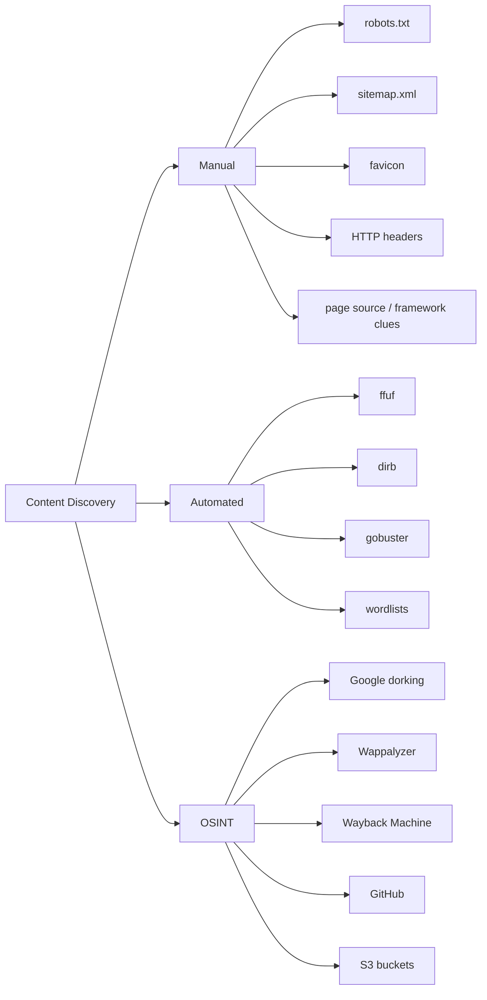
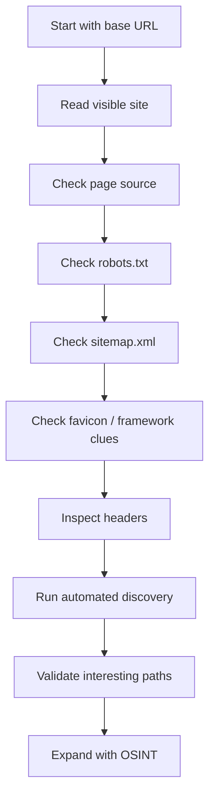

# Content Discovery

## Summary

* Content discovery means finding files, directories, endpoints, and hidden functionality that are not obvious from normal site navigation.
* The room groups the workflow into manual discovery, automated discovery, and OSINT.
* The practical takeaway is simple: do not trust the visible UI to represent the real attack surface.
* Manual checks like `robots.txt`, `sitemap.xml`, page source, headers, and favicon analysis often reveal low-effort, high-value leads.
* Automated tools such as `ffuf`, `dirb`, and `gobuster` accelerate brute-force enumeration using curated wordlists like SecLists.
* The room's lab confirms several hidden resources, including `/monthly`, `/development.log`, and an admin path that yields the flag `THM{CHANGE_DEFAULT_CREDENTIALS}`.

---

## 1. Why Content Discovery Matters

A website almost never exposes its full surface through menus and buttons alone.

In practice, real systems often contain:

* staff-only portals
* old application routes
* backup files
* log files
* admin panels
* customer-only content
* framework leftovers
* debugging paths

This is why content discovery is foundational recon. Before you attempt exploitation, you need a realistic map of what exists.

```text
visible website != full website
```

That single equation explains the entire room.

---

## 2. Core Model

The room breaks content discovery into three methods:



---

## 3. Manual Discovery

Manual discovery is slow, but it is also high signal. You are not just scanning blindly. You are reading the target like a human analyst.

## 3.1 `robots.txt`

`robots.txt` tells crawlers what they should or should not crawl. That makes it useful for recon, but not for access control.

Important security insight:

```text
If a path is sensitive, robots.txt is the wrong protection layer.
```

This room's example shows exactly why: defenders sometimes place internal-looking paths there, effectively publishing a shortlist of interesting locations.

**Lab finding**

* Hidden directory found in `robots.txt`: `/staff-portal`

### Interpretation

This is a recurring recon pattern:

* developers want search engines away from a path
* testers see the file
* the "hidden" path becomes public knowledge

---

## 3.2 Favicon analysis

A favicon can leak framework identity if the default icon was never replaced.

That matters because once you identify the stack, you can search for:

* default admin routes
* version-specific docs
* common files
* default credentials
* known misconfigurations

### Practical logic

1. download favicon
2. hash it
3. compare against known favicon databases
4. infer framework / stack

### Lab answer

* Framework from favicon match: `cgiirc`

This is a tiny clue, but tiny clues compound.

---

## 3.3 `sitemap.xml`

A sitemap is meant to help search engines understand a site's important pages and files.

For content discovery, this means it can expose:

* pages not linked in navigation
* deprecated content still live
* hidden sections the team forgot to remove

**Lab finding**

* Secret path from `sitemap.xml`: `/s3cr3t-area`

---

## 3.4 HTTP headers

Headers can expose implementation details such as:

* web server type
* framework hints
* reverse proxy behavior
* custom debug or flag headers

### Example mindset

When you see a server response, do not only read the body. Read the metadata around it.

**Lab finding**

* Custom header flag: `THM{HEADER_FLAG}`

---

## 3.5 Framework stack clues from page source

Page source often leaks framework identity through:

* comments
* static asset paths
* generator tags
* footer credits
* documentation links
* copied default HTML fragments

Once the framework is known, documentation often reveals default admin endpoints.

### Lab finding

* Admin portal flag: `THM{CHANGE_DEFAULT_CREDENTIALS}`

This is a good example of a structural weakness:

```text
framework fingerprint -> documentation lookup -> default route discovery -> admin access clue
```

That is not "magic hacking". It is ordinary analytical chaining.

---

## 4. OSINT Discovery

OSINT expands discovery beyond the target host itself. Instead of asking "what is on this web server?", you ask "what has the organization or internet already revealed about this web server?"

## 4.1 Google dorking

Useful operators include:

* `site:` limit results to one domain
* `inurl:` search for specific words in URLs
* `filetype:` search specific file extensions
* `intitle:` search page title keywords

### Example

```text
site:example.com admin
```

**Lab answer**

* Operator that limits results to a site: `site:`

---

## 4.2 Wappalyzer

Wappalyzer is used to identify technologies behind a site:

* CMS
* frameworks
* analytics
* payment processors
* JavaScript libraries
* sometimes versions

**Lab answer**

* Tool name: `wappalyzer`

---

## 4.3 Wayback Machine

The Wayback Machine helps recover historical site states.

This is valuable because archived versions may reveal:

* old routes still accessible
* prior naming schemes
* deprecated apps
* old JavaScript paths
* forgotten portals

**Lab answer**

* Site address: `https://archive.org/web/`

---

## 4.4 GitHub

GitHub can expose:

* source code
* configuration files
* secrets accidentally committed
* old repository names
* infrastructure clues
* internal route naming

**Lab answer**

* Git is a `version control system`

---

## 4.5 S3 bucket discovery

Cloud storage is often overlooked in web recon.

Common discovery paths:

* hardcoded URLs in source
* references in JavaScript
* repo leaks
* naming conventions such as `company-assets`, `company-public`, `company-www`

**Lab answer**

* Typical S3 bucket suffix: `.s3.amazonaws.com`

---

## 5. Automated Discovery

Manual checks give direction. Automated discovery gives coverage.

The principle is simple:

1. choose a wordlist
2. append entries to a base URL
3. observe status codes, lengths, redirects, and anomalies
4. recurse into promising directories

### Why wordlists matter

A brute-force tool is only as good as its candidate list.

The room uses:

```text
/usr/share/wordlists/SecLists/Discovery/Web-Content/common.txt
```

This is a practical default because it balances coverage and speed.

---

## 6. Tooling in the Room

## 6.1 `ffuf`

Fast and flexible fuzzing/enumeration tool.

**Example**

```bash
ffuf -w /usr/share/wordlists/SecLists/Discovery/Web-Content/common.txt -u http://TARGET_IP/FUZZ
```

### Strengths

* fast
* flexible filters and matchers
* useful for directories, files, params, vhosts

---

## 6.2 `dirb`

Older classic directory brute-forcing tool.

**Example**

```bash
dirb http://TARGET_IP/ /usr/share/wordlists/SecLists/Discovery/Web-Content/common.txt
```

**Strengths**

* simple syntax
* recursive behavior
* good for quick classic web content discovery

---

## 6.3 `gobuster`

High-performance Go-based brute-forcing tool.

**Example**

```bash
gobuster dir --url http://TARGET_IP/ -w /usr/share/wordlists/SecLists/Discovery/Web-Content/common.txt
```

**Strengths**

* fast
* stable
* supports directory/file/DNS/vhost modes

---

## 7. Practical Findings from the Screenshots

The screenshots show multiple discovered paths.

### Confirmed results

* `/assets/`
* `/contact`
* `/customers`
* `/development.log`
* `/monthly`
* `/news`
* `/private/`
* `/robots.txt`
* `/sitemap.xml`
* `/private/index.php`
* `/assets/avatars/`

### Room answer recap

| Question                          | Answer                            |
| --------------------------------- | --------------------------------- |
| Directory beginning with `/mo...` | `/monthly`                        |
| Log file discovered               | `/development.log`                |
| Framework admin portal flag       | `THM{CHANGE_DEFAULT_CREDENTIALS}` |

---

## 8. Command Cookbook

## 8.1 Check `robots.txt`

```bash
curl http://TARGET_IP/robots.txt
```

## 8.2 Check `sitemap.xml`

```bash
curl http://TARGET_IP/sitemap.xml
```

## 8.3 Inspect response headers

```bash
curl -v http://TARGET_IP/
```

## 8.4 Download and hash favicon

```bash
curl http://TARGET_IP/images/favicon.ico | md5sum
```

## 8.5 Run `ffuf`

```bash
ffuf -w /usr/share/wordlists/SecLists/Discovery/Web-Content/common.txt -u http://TARGET_IP/FUZZ
```

## 8.6 Run `dirb`

```bash
dirb http://TARGET_IP/ /usr/share/wordlists/SecLists/Discovery/Web-Content/common.txt
```

## 8.7 Run `gobuster`

```bash
gobuster dir --url http://TARGET_IP/ -w /usr/share/wordlists/SecLists/Discovery/Web-Content/common.txt
```

## 8.8 Simple Google dork

```text
site:example.com admin
```

---

## 9. Recon Decision Tree



---

## 10. First-Principles Takeaways

## 10.1 `robots.txt` is discovery noise, not a security control

If a resource must be protected, use:

* authentication
* authorization
* network restrictions
* noindex where appropriate
* removal from public hosting

Do not rely on "please do not crawl this".

---

## 10.2 Enumeration is a force multiplier

The attack surface becomes visible only after you enumerate it.

No enumeration means:

* missed endpoints
* missed admin panels
* missed backups
* missed logs
* missed exploit paths

---

## 10.3 Small clues chain into larger access

A single favicon, comment, or XML entry can reveal:

```text
framework -> docs -> default route -> admin area -> weak configuration
```

That is why recon quality often determines exploitation quality.

---

## 11. Common Pitfalls

* Treating `200 OK` as the only interesting response
* Ignoring redirects like `301` and `302`
* Using one wordlist and assuming coverage is complete
* Skipping recursive enumeration into discovered directories
* Forgetting to check static files such as `.log`, `.bak`, `.old`, `.zip`, `.sql`
* Confusing crawler-disallow with real access control
* Failing to correlate manual clues with automated results

---

## 12. Defensive Perspective

Content discovery exists because applications often leak structure.

### Reduce exposure by

* removing unused routes and old files
* disabling default admin panels
* replacing default framework assets
* restricting sensitive paths with proper authN/authZ
* not exposing logs or backups via the web root
* reviewing cloud storage and public object access
* minimizing debug comments and metadata leakage

---

## 13. Pattern Card

## Pattern: Framework Fingerprint -> Documentation Pivot

### Context

A target site reveals default framework artifacts.

### Clues

* default favicon
* source comments
* static asset naming
* generator strings

### Action

* identify framework
* search official docs / deployment docs
* look for default admin routes and default files

### Risk

* exposed admin portal
* insecure defaults
* default credentials

### Defensive fix

* rebrand or replace defaults
* disable unused components
* harden deployment before publishing

---

## 14. Short Answer Bank

| Prompt                            | Answer                            |
| --------------------------------- | --------------------------------- |
| Method beginning with M           | `Manually`                        |
| Method beginning with A           | `Automated`                       |
| Method beginning with O           | `OSINT`                           |
| Directory blocked in `robots.txt` | `/staff-portal`                   |
| Framework from favicon            | `cgiirc`                          |
| Secret area from sitemap          | `/s3cr3t-area`                    |
| Flag from `X-FLAG` header         | `THM{HEADER_FLAG}`                |
| Admin portal flag                 | `THM{CHANGE_DEFAULT_CREDENTIALS}` |
| Google dork site limiter          | `site:`                           |
| Technology fingerprinting tool    | `wappalyzer`                      |
| Wayback Machine URL               | `https://archive.org/web/`        |
| Git is what?                      | `version control system`          |
| S3 URL ending                     | `.s3.amazonaws.com`               |
| Directory beginning `/mo...`      | `/monthly`                        |
| Log file discovered               | `/development.log`                |

---

## 15. CN-EN Glossary

* Content discovery -- 内容发现 / 隐藏资源发现
* Enumeration -- 枚举
* Wordlist -- 字典 / 词表
* Web root -- 网站根目录
* Favicon -- 网站图标
* Framework fingerprinting -- 框架指纹识别
* Sitemap -- 站点地图
* HTTP headers -- HTTP 响应头
* Redirect -- 重定向
* OSINT -- 开源情报
* Google dorking -- Google 高级检索 / 搜索语法侦察
* Cloud bucket -- 云存储桶
* Attack surface -- 攻击面
* Directory brute-force -- 目录爆破 / 路径枚举
* Default credentials -- 默认凭证

---

## 16. Further Reading

* Google Search Central: robots.txt documentation
* Google Search Central: sitemap overview
* Gobuster GitHub repository
* SecLists GitHub repository
* OWASP favicon database

---

## 17. Final Takeaway

This room is basic, but the principle is professional-grade:

```text
Recon is not a warm-up phase. Recon is the phase that decides what is even possible later.
```

If you miss content discovery, you are testing the brochure version of the site, not the real one.
