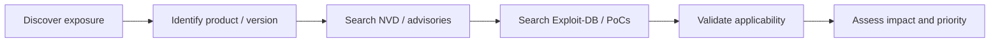

# Vulnerabilities 101

## Summary

* A **vulnerability** is a weakness or flaw in a system, application,
  configuration, or process that can be exploited to violate security
  expectations.
* The room's real lesson is not just "what is a vulnerability", but **how to
  move from discovery to prioritisation to research to exploitation path
  building**.
* The five practical categories introduced here are: **operating system**,
  **(mis)configuration**, **weak/default credentials**, **application logic**,
  and **human-factor** vulnerabilities.
* Public vulnerability work depends heavily on two resource types:
  **advisory/metadata databases** such as NVD, and **exploit/PoC repositories**
  such as Exploit-DB.
* **CVSS** is best understood as a severity language. **VPR** is better
  understood as a risk-prioritisation language.
* In real assessments, minor findings such as **version disclosure** often
  become valuable because they unlock targeted research into known weaknesses
  and public PoCs.

---

## 1. What a Vulnerability Is

NIST defines a vulnerability as a weakness in an information system, system
security procedures, internal controls, or implementation that could be
exploited or triggered by a threat source. That framing is broad on purpose:
vulnerabilities are not only bugs in code, but also weaknesses in
configuration, access design, and human workflows.

### 1.1 Practical categories from the room

| Category                   | Meaning                                                 | Typical outcome                         |
| -------------------------- | ------------------------------------------------------- | --------------------------------------- |
| Operating System           | Weakness in the OS or privileged system components      | Privilege escalation or host compromise |
| (Mis)Configuration         | Service or application deployed insecurely              | Exposure of data or admin functions     |
| Weak / Default Credentials | Predictable or unchanged authentication secrets         | Easy account compromise                 |
| Application Logic          | Flaws in workflow, trust assumptions, or state handling | Auth bypass, impersonation, privilege abuse |
| Human-Factor               | Weaknesses that exploit human behaviour                 | Phishing, social engineering, unsafe execution |

### 1.2 Simple classification examples

* Upgrading a system account from **user** to **administrator** is best
  classified as an **operating system / privilege-escalation style
  vulnerability outcome**.
* Bypassing a login panel through manipulated cookies is an **application
  logic** problem.

---

## 2. Why Vulnerability Research Matters

Most real assessments are not won by guessing. They are won by:

* identifying exposed software or behaviour
* determining the exact or approximate version
* checking whether the exposure has known weaknesses
* testing whether those weaknesses are applicable in the target environment

That workflow is why small clues, like version strings, matter.

---

## 3. Vulnerability Databases and What They Are Good For

### 3.1 NVD

The National Vulnerability Database is NIST's public repository of standardized
vulnerability information built around CVE records. It is good for:

* official vulnerability metadata
* severity information
* affected products / CPEs
* reference links
* structured search and filtering

It is less good as a direct "how do I exploit this right now?" resource.

### 3.2 Exploit-DB

Exploit-DB is maintained by OffSec and focuses on public exploits and
proofs-of-concept. It is useful when you already know the product, version, or
vulnerability class and want to find a practical PoC or exploit reference.

The key distinction is:

* **NVD tells you what is known**
* **Exploit-DB helps show what is actionable**

---

## 4. Scoring Vulnerabilities: CVSS vs VPR

### 4.1 CVSS

The Common Vulnerability Scoring System (CVSS) is an open framework for
describing vulnerability severity using a numerical score and qualitative
bands. FIRST describes CVSS as a way to capture the principal characteristics
of a vulnerability and produce a numerical severity score.

The common qualitative bands used in practice are:

| Rating   | Score range |
| -------- | ----------- |
| None     | 0           |
| Low      | 0.1 - 3.9   |
| Medium   | 4.0 - 6.9   |
| High     | 7.0 - 8.9   |
| Critical | 9.0 - 10.0  |

#### CVSS strengths

* widely used and widely understood
* open and free to adopt
* useful for communicating severity consistently

#### CVSS limits

* severity is not the same as remediation priority
* scores can look static even when real-world exploitability changes
* business relevance is not the same thing as technical severity

### 4.2 VPR

Vulnerability Priority Rating (VPR) is Tenable's risk-focused prioritisation
model. Unlike CVSS, it is designed around the risk a vulnerability poses in
context, not just the intrinsic technical severity characteristics.

#### VPR strengths

* more explicitly prioritisation-oriented
* dynamic and risk-driven
* more aligned to patch-ordering decisions

#### VPR limits

* not open in the same way as CVSS
* tied to a commercial ecosystem
* not the universal public lingua franca that CVSS is

### 4.3 Practical comparison

| Question                                                      | Better fit |
| ------------------------------------------------------------- | ---------- |
| "How severe is this flaw in general?"                         | CVSS       |
| "Which vulnerability should I patch first in my environment?" | VPR        |
| "Which framework is free and open?"                           | CVSS       |
| "Which framework is more risk-prioritisation oriented?"       | VPR        |

---

## 5. Version Disclosure as a Bridge Finding

One of the room's strongest practical lessons is that **version disclosure** is
often a bridge vulnerability.

By itself, version disclosure may look minor. But once you know the application
name and exact version, you can:

* search NVD for known CVEs
* search Exploit-DB for PoCs
* compare the target against known advisories
* test likely attack paths more efficiently

This is why version information matters so much during application testing.

---

## 6. ACKme Showcase, Public-Safe Summary

The ACKme scenario is best understood as a guided example of how vulnerability
research supports exploitation planning.

### 6.1 High-level workflow

1. Scope is established around a specific public IP.
2. Enumeration identifies exposed services.
3. Application testing reveals a login page and version information.
4. Vulnerability research links the product/version to a known RCE path.
5. A matching exploit is used to gain shell access.

### 6.2 What this demonstrates

The important lesson is not the synthetic product name. The important lesson is
the method:

* **enumerate first**
* **identify software and version**
* **research known weaknesses**
* **map a working exploit to the discovered version**

That is a core offensive research workflow and also a defensive lesson for
asset management and exposure reduction.

### 6.3 Public-safe note on the flag

The room includes a lab-specific flag after the guided exploitation path.
Because that value is tied to the lab environment and does not materially
improve the public learning value of this note, it is intentionally omitted
here.

---

## 7. Stable Room Answers

| Question                                                                               | Answer                                                             |
| -------------------------------------------------------------------------------------- | ------------------------------------------------------------------ |
| Privilege escalation from user to administrator is what type?                          | **Operating system vulnerability / privilege-escalation category** |
| Bypassing login using cookies is what type?                                            | **Application logic vulnerability**                                |
| What type of vulnerability was used to find the application name and version?          | **Version disclosure**                                             |
| If you want a risk-focused framework for organizational prioritisation, which acronym? | **VPR**                                                            |
| If you want a free and open framework, which acronym?                                  | **CVSS**                                                           |

### Note on two database-dependent questions

Two room questions are intentionally not frozen into this public note:

* the count of CVEs published in a specific past month on NVD
* the lab-specific end flag from the ACKme showcase

The first depends on live database querying practice and the second is
environment-specific. They are less useful than the reusable workflow itself.

---

## 8. Pattern Cards

### Pattern Card 1 - Small Leak, Big Payoff

**Failure mode**
The application leaks its exact product and version.

**Lesson**
Minor information exposure can unlock targeted exploit research.

### Pattern Card 2 - Severity vs Priority

**Failure mode**
A team confuses "technically severe" with "patch first."

**Lesson**
CVSS and real-world prioritisation are related but not identical.

### Pattern Card 3 - Database Without Workflow

**Failure mode**
An analyst knows databases exist but does not have a repeatable search process.

**Lesson**
Research skill matters more than simply knowing site names.

### Pattern Card 4 - Enumeration Before Exploitation

**Failure mode**
The tester jumps straight into exploit hunting without confirming services,
versions, or exposure.

**Lesson**
Good exploitation starts with disciplined discovery.

---

## 9. Practical Takeaways

* Vulnerability research is a chain:
  **discover -> identify -> score -> research -> validate**.
* NVD is better for **structured vulnerability knowledge**. Exploit-DB is
  better for **public exploit and PoC lookup**.
* CVSS is a public common language for severity, not a complete prioritisation
  solution.
* Version disclosure is often more dangerous than it looks because it shortens
  attacker research time.
* Public notes are most useful when they preserve **workflow and reasoning**,
  not only answer strings.

---

## 10. CN-EN Glossary

| English                                    | 中文                  |
| ------------------------------------------ | --------------------- |
| Vulnerability                              | 漏洞 / 安全弱点       |
| Exploit                                    | 利用代码 / 利用方式   |
| Proof of Concept (PoC)                     | 概念验证 / PoC        |
| Version Disclosure                         | 版本泄露              |
| Vulnerability Database                     | 漏洞数据库            |
| National Vulnerability Database (NVD)      | 国家漏洞数据库        |
| Exploit-DB                                 | Exploit-DB 漏洞利用库 |
| Common Vulnerability Scoring System (CVSS) | 通用漏洞评分系统      |
| Vulnerability Priority Rating (VPR)        | 漏洞优先级评分        |
| Critical                                   | 严重                  |
| Remote Code Execution (RCE)                | 远程代码执行          |
| Enumeration                                | 枚举 / 侦察式信息收集 |

---

## 11. Further Reading

* NVD vulnerability search and CVE records
* FIRST CVSS documentation
* Exploit-DB / OffSec database guidance
* vendor advisories for exposed products discovered during assessments
