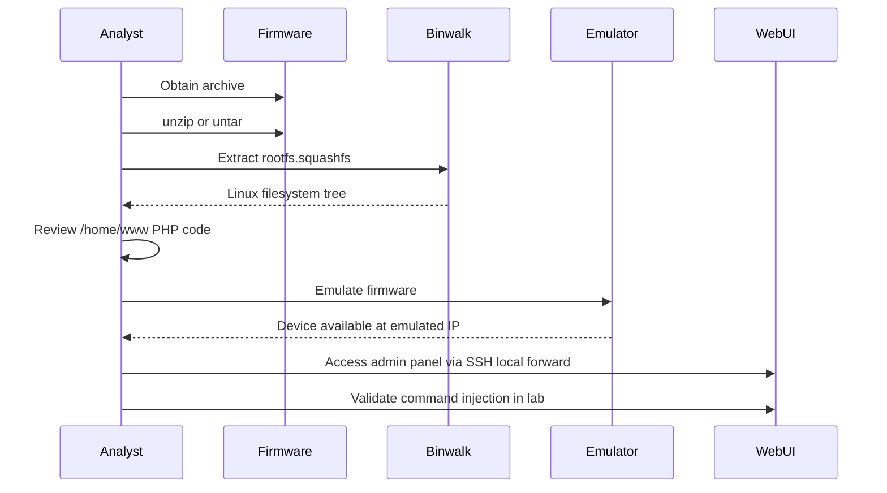

# Intro to IoT Pentesting

## Summary

* IoT pentesting is often a combination of **firmware analysis**, **lightweight Linux system inspection**, and **web application testing**.
* A common workflow is: **obtain firmware -> unpack filesystem -> inspect web UI code -> emulate firmware -> validate impact in a lab**.
* In this room, the firmware archive contains a **SquashFS root filesystem**, which is extracted with `binwalk` and then emulated with **FAT (Firmware Analysis Toolkit)**.
* The vulnerable component is a PHP page, `boardDataWW.php`, where user input reaches `exec()` and enables **blind command execution**.
* The most important lesson is structural: many IoT bugs are not "mystical hardware hacking"; they are ordinary software flaws inside constrained embedded environments.

---

## 1. Why This Room Matters

IoT security looks exotic from a distance, but the core logic is familiar:

```text
embedded device = firmware + web panel + config logic + network services
```

So the attack surface usually falls into a few buckets:

* web administration panel
* outdated binaries or packages
* insecure update mechanism
* weak credentials or hidden endpoints
* exposed network protocols
* device-specific hardware interfaces

This room focuses on the first three layers of a realistic beginner workflow:

1. **collect firmware**
2. **unpack it**
3. **inspect the filesystem and web code**
4. **emulate it**
5. **confirm impact in a controlled lab**

---

## 2. Key Concepts

### 2.1 Firmware

Firmware is the low-level software bundle that tells an embedded device how to boot and operate. In practice, it may contain:

* kernel image
* root filesystem
* web assets
* device configuration logic
* management binaries
* scripts and init files

In this room, the target firmware came from a Netgear access point product line and is linked to **CVE-2016-1555**.

### 2.2 SquashFS

`rootfs.squashfs` is the important artifact here.

SquashFS is a **compressed read-only filesystem**, which is common in embedded Linux firmware because it is compact and suitable for shipping root filesystems to storage-constrained devices.

### 2.3 Firmware emulation

Instead of attacking the physical device directly, we emulate the unpacked firmware with tools built around QEMU-based workflows. This gives us a safer and more repeatable analysis environment.

---

## 3. Lab Workflow at a Glance

```mermaid
flowchart LR
    A["Firmware archive"] --> B["Unzip or untar"]
    B --> C["Locate rootfs.squashfs"]
    C --> D["binwalk -e extraction"]
    D --> E["Review extracted Linux filesystem"]
    E --> F["Inspect /home/www PHP files"]
    F --> G["Identify command injection in boardDataWW.php"]
    G --> H["Emulate firmware with FAT"]
    H --> I["SSH local port forward"]
    I --> J["Access web UI in browser"]
    J --> K["Validate impact in lab"]
```



---

## 4. Obtaining the Firmware

The room starts with the firmware archive and unpacks it in two stages:

```bash
unzip "/path/to/firmware.zip"
tar -xf /path/to/firmware.tar
```

Interesting output files include:

* `rootfs.squashfs`
* `vmlinux.gz.uImage`
* checksum files
* release notes

The high-value target is:

```text
rootfs.squashfs
```

because it contains the embedded Linux root filesystem.

---

## 5. Unpacking the Root Filesystem

The room uses:

```bash
binwalk -e rootfs.squashfs
```

This creates an extracted directory such as:

```text
_rootfs.squashfs.extracted/
```

Inside it, the unpacked tree looks like a normal Linux filesystem:

```text
bin/  dev/  etc/  home/  lib/  proc/  root/  sbin/  tmp/  usr/  var/
```

That is the first major pivot point in IoT analysis:

```text
If the unpacked firmware looks like Linux, treat it like Linux.
```

Meaning:

* inspect init scripts
* inspect configs
* inspect binaries
* inspect web roots
* inspect credentials and hardcoded values

---

## 6. Locating the Web Application

From the screenshots and room text, the web code is in:

```text
/home/www
```

Interesting files include:

* `index.php`
* `login.php`
* `config.php`
* `packetCapture.php`
* `siteSurvey.php`
* `boardDataWW.php`
* `boardDataNA.php`

This is a common embedded pattern:

```text
small admin web UI + CGI/PHP handlers + shell-backed device logic
```

That pattern is dangerous because input validation is often weak, and backend actions may call native commands directly.

---

## 7. Vulnerability Focus: `boardDataWW.php`

The room highlights `boardDataWW.php` as the vulnerable file.

The critical issue is that untrusted request data flows into `exec()`.

That means the page is not merely processing form input. It is handing attacker-controlled values to the shell layer.

### 7.1 Vulnerable pattern

```php
exec("wr_mfg_data -m ".$_REQUEST['macAddress']." -c ".$_REQUEST['reginfo'], $dummy, $res);
```

### 7.2 Why this matters

`exec()` is an OS-command execution primitive. If input is concatenated into the command string without robust validation and escaping, shell metacharacters can change program behavior.

### 7.3 Security diagnosis

This is a classic **command injection** or **OS command injection** flaw.

### 7.4 Risk model

* initial vector: authenticated web UI request
* trust boundary violated: HTTP form input -> shell command
* likely impact: arbitrary command execution as web-server or service context
* escalation path: read sensitive files, modify configs, pivot further inside the emulated device

---

## 8. Emulation with FAT

The room uses **FAT (Firmware Analysis Toolkit)**, which automates parts of the firmware emulation workflow on top of Firmadyne-style logic.

Preparation shown in the screenshots:

```bash
sudo -s
cp rootfs.squashfs firmware-analysis-toolkit/
cd firmware-analysis-toolkit/
chown root:root rootfs.squashfs
```

Then run FAT:

```bash
./fat.py rootfs.squashfs
```

Observed output includes:

* extracted firmware
* identified architecture: `mipseb`
* built QEMU disk image
* network interface setup
* emulation launch

This is a very important concept for beginners:

```text
You do not always need the physical device to begin meaningful IoT analysis.
```

If emulation works, you can reach the web UI and validate bugs under controlled conditions.

---

## 9. Port Forwarding and Accessing the Device UI

The room uses SSH local port forwarding so the attacker workstation can reach the emulated management UI:

```bash
ssh -N USER_A@TARGET_HOST -L 8081:TARGET_IP:80
```

Then browse:

```text
http://localhost:8081
```

Default credentials shown in the room:

```text
username: admin
password: PASSWORD_REDACTED
```

After login, the workflow moves directly to the vulnerable endpoint:

```text
/boardDataWW.php
```

---

## 10. Validating the Injection

The room demonstrates a standard testing pattern:

1. submit a normal value first
2. intercept the request in Burp Suite
3. replay to Repeater
4. inject a payload that changes shell behavior
5. confirm impact via timing or file-read side effects

### 10.1 Benign validation strategy

For blind command execution, a common first step is a **timing-based payload** rather than a destructive command. A delay in the response suggests shell execution succeeded.

### 10.2 File-read confirmation

The room then pivots to reading `/etc/passwd` through a copied file and fetching it over HTTP in the emulated lab.

That confirms real command execution impact.

---

## 11. Pattern Card

### Pattern: Embedded Web UI -> Shell-backed Admin Action

#### Context

Small router, AP, and NVR web panels often expose administration forms that eventually call local device-management binaries.

#### Red flags

* PHP or CGI scripts calling `exec`, `system`, `popen`, or backticks
* request parameters concatenated into shell commands
* MAC, IP, channel, or SSID fields passed to backend tools
* weak regex validation combined with dangerous string concatenation

#### Typical impact

* command injection
* configuration tampering
* credential exposure
* file disclosure
* lateral pivoting inside lab environments

#### Defensive fix

* avoid shell invocation if possible
* use safe APIs rather than shelling out
* strictly type and whitelist inputs
* separate validation from execution
* run web service with minimal privilege

---

## 12. Detection and Defensive Notes

### 12.1 Detection opportunities

Possible signals in an embedded or simulated environment:

* unusual POST requests to rarely used admin handlers
* shell metacharacters in form fields
* delayed responses from config endpoints
* spawned child processes from web server context
* unexpected reads of `/etc/passwd`, configs, or credentials
* outbound connections or DNS requests from management processes

### 12.2 Remediation priorities

1. remove unsafe shell concatenation
2. replace `exec()` with parameter-safe APIs or backend wrappers
3. add strict server-side validation and allowlists
4. disable default credentials
5. segment management interface access
6. expose admin UI only on trusted networks
7. patch or retire affected firmware

---

## 13. Methodological Takeaways

This room is useful because it demystifies IoT exploitation.

### 13.1 What it teaches correctly

* firmware analysis begins with file formats, not magic
* unpacking often yields familiar Linux structures
* IoT admin panels are frequently normal web apps with bad backend glue
* emulation can be enough for meaningful vulnerability confirmation

### 13.2 First-principles conclusion

```text
Many IoT exploits are software engineering failures in embedded packaging.
```

The hardware may be special. The bug often is not.

---

## 14. Minimal Command Cookbook

### 14.1 Unpack archive

```bash
unzip "/path/to/firmware.zip"
tar -xf /path/to/firmware.tar
```

### 14.2 Extract filesystem

```bash
binwalk -e rootfs.squashfs
```

### 14.3 Navigate extracted files

```bash
cd _rootfs.squashfs.extracted/squashfs-root/
ls
cd home/www
ls
```

### 14.4 Prepare FAT

```bash
sudo -s
cp rootfs.squashfs firmware-analysis-toolkit/
cd firmware-analysis-toolkit/
chown root:root rootfs.squashfs
./fat.py rootfs.squashfs
```

### 14.5 Port forward

```bash
ssh -N USER_A@TARGET_HOST -L 8081:TARGET_IP:80
```

### 14.6 Access panel

```text
http://localhost:8081
```

---

## 15. Safe Public-Writeup Versioning Notes

If this note is later published publicly, it should be sanitized further.

Recommended public-safe changes:

* keep the vulnerable pattern, remove exact exploit strings
* describe impact using placeholders instead of fully copyable payloads
* frame the work as lab-only emulation on approved training content
* emphasize methodology, detection, and remediation over weaponization

---

## 16. Mermaid: End-to-End Workflow



---

## 17. Takeaways

* IoT testing often starts with **firmware, not live hardware**.
* `binwalk` plus filesystem review gives fast visibility into embedded stacks.
* Web admin code in embedded devices frequently contains familiar web flaws.
* Emulation is a force multiplier for repeatable, lower-risk analysis.
* Strong IoT pentesting is less about "hacking gadgets" and more about disciplined software and systems analysis.

---

## 18. CN-EN Glossary

* Firmware - 固件
* Root filesystem - 根文件系统
* SquashFS - 压缩只读文件系统
* Emulation - 仿真 / 模拟运行
* Access Point (AP) - 无线接入点
* Command Injection - 命令注入
* Blind Command Execution - 盲命令执行
* Web administration panel - Web 管理面板
* Port forwarding - 端口转发
* Attack surface - 攻击面
* Input validation - 输入校验
* Shell metacharacters - Shell 元字符
* Proof of Concept (PoC) - 概念验证
* Remediation - 修复措施
* Whitelisting - 白名单限制

---

## 19. Further Reading

* Binwalk documentation
* Firmadyne project
* Firmware Analysis Toolkit (FAT)
* SquashFS documentation
* CVE-2016-1555 advisory material
