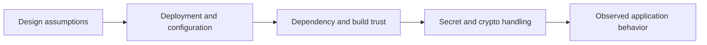

# OWASP Top 10 2025 - Application Design Flaws

## Summary

This note covers four OWASP Top 10:2025 categories that are best understood as **design and architecture failures**, not isolated coding mistakes:

* **A02:2025 - Security Misconfiguration**
* **A03:2025 - Software Supply Chain Failures**
* **A04:2025 - Cryptographic Failures**
* **A06:2025 - Insecure Design**

The common pattern is simple:

```text
Weak assumptions + weak defaults + weak trust boundaries = predictable compromise
```

These categories matter because they usually survive patching at the function level. If the design is wrong, the bug is only a symptom.

---

## 1. Official 2025 Ranking Context

OWASP's official 2025 Top 10 places these categories at:

* **A02** Security Misconfiguration
* **A03** Software Supply Chain Failures
* **A04** Cryptographic Failures
* **A06** Insecure Design

A03 is especially important because OWASP explicitly expanded it beyond the old "vulnerable and outdated components" framing into a broader **supply chain risk** category. A06 also moved down in rank, which does **not** mean it is unimportant; it reflects relative movement, not disappearance of the design problem.

---

## 2. Unifying Mental Model

These four categories are easier to remember if you group them by **where the weakness lives**.

| Category | Where the weakness lives | Typical failure mode |
| --- | --- | --- |
| A02 Security Misconfiguration | deployment / runtime environment | too much exposed, too much trust, too much detail |
| A03 Software Supply Chain Failures | dependencies / build / update path | trusted component becomes attack path |
| A04 Cryptographic Failures | protection of secrets and data | encryption exists but is badly chosen or badly handled |
| A06 Insecure Design | architecture / workflow / trust model | system was built on the wrong assumptions |

A useful way to think about them:



If the first layers are weak, the later layers leak almost automatically.

---

## 3. A02 - Security Misconfiguration

### 3.1 What it is

Security misconfiguration happens when the application stack is deployed with:

* unsafe defaults
* exposed debug behavior
* verbose errors
* unnecessary services or endpoints
* weak permissions
* weak operational hardening

This is usually **not** a classic code logic bug. It is a failure in how the system is configured and exposed.

### 3.2 Why it matters

Attackers love misconfiguration because it reduces uncertainty.

A good exploit chain often starts with one of these:

* stack traces
* debug endpoints
* default credentials
* admin panels exposed to the internet
* permissive cloud storage or API configuration

Misconfiguration is basically **free recon** handed to the attacker.

### 3.3 Practical room example

#### A03 scenario

The **User Management API** exposed a normal endpoint like:

```text
GET /api/user/123
```

A valid request such as `/api/user/123` returned normal JSON user data.

The key issue was discovered by forcing an invalid ID format. Instead of returning a generic error, the application exposed:

* raw debug information
* internal exception detail
* traceback data
* embedded flag content

#### A03 technical meaning

The vulnerability was **not** "IDOR as the intended category" here, even though enumeration is tempting. The real lesson is:

```text
The application exposed excessive internal error detail in production.
```

That is classic **verbose error leakage**.

### 3.4 Root cause

Likely design / deployment failures:

* development-style error handling left enabled in production
* no generic exception wrapper for client-facing API replies
* sensitive values mixed into debug objects
* internal tracebacks returned to untrusted clients

### 3.5 Challenge result

Flag recovered from the verbose error path:

```text
FLAG_REDACTED
```

### 3.6 Secure design guidance for A02

#### A03 minimum controls

* never expose stack traces to end users
* return generic error messages externally
* log detailed exceptions only to secured server-side logs
* disable debug modes in production
* remove or restrict internal-only routes and diagnostics
* perform environment hardening reviews before release

#### Engineering rule

A client should learn only:

```text
what failed, not how your internals work
```

---

## 4. A03 - Software Supply Chain Failures

### 4.1 What it is

Software supply chain failures happen when the application trusts:

* unverified libraries
* outdated internal packages
* tampered build paths
* unsafe update mechanisms
* poorly governed CI/CD dependencies

This category is broader than "old package version bad." It includes the full trust path from source to runtime.

### 4.2 Why it matters

Modern software is mostly assembled, not written from scratch.

That means attackers often target:

* package ecosystems
* build scripts
* internal helper libraries
* CI runners
* update distribution chains

The core lesson is brutal but accurate:

```text
If you trust code you did not verify, you imported someone else's risk model into your product.
```

### 4.3 Practical room example

#### A04 scenario

The **Data Processing Service** exposed:

* `POST /api/process`
* `GET /api/health`

The code imported an old local component:

```python
from vulnerable_utils import process_data, format_output, debug_info
```

The challenge logic hid a debug pathway behind an outdated helper design. Sending JSON with:

```json
{"data":"debug"}
```

caused the application to return sensitive internal values through `debug_info()`.

Observed leaked values included:

* `admin_token`
* `internal_secret`
* version details
* the flag

#### What this means technically

This is a strong illustration of supply chain failure at the **local/internal dependency** level.

The vulnerable behavior was not primarily in the route handler itself. The route trusted a component with unsafe behavior inherited from an old library.

That is exactly why supply chain governance is not only about public packages like `npm`, `pip`, or `Maven`. It also includes:

* internal shared modules
* copied utility files
* legacy code reused without review

### 4.4 Root cause

* unsafe internal dependency retained in the codebase
* debug functionality reachable from production input
* no contract review for imported helper behavior
* no secure deprecation / replacement process for legacy library code

### 4.5 Challenge result

Flag recovered from the vulnerable debug response:

```text
FLAG_REDACTED
```

### 4.6 Secure design guidance for A03

#### A04 minimum controls

* verify third-party and internal dependencies before use
* maintain dependency inventory and provenance records
* remove or quarantine legacy helper modules
* sign and verify packages and release artifacts where possible
* review CI/CD trust boundaries and artifact promotion rules
* monitor dependencies continuously after deployment

#### Stronger operational model

Treat every dependency as a mini-vendor:

* who wrote it?
* who maintains it?
* what version is in production?
* what behavior is security-sensitive?
* how is it updated or rolled back?

---

## 5. A04 - Cryptographic Failures

### 5.1 What it is

Cryptographic failures happen when encryption exists but is badly selected, badly implemented, badly stored, or badly managed.

Common examples:

* weak algorithms or modes
* hardcoded keys
* ECB mode
* secrets in source code
* poor key lifecycle management
* no separation between encrypted data and accessible decryption logic

### 5.2 Why it matters

Bad cryptography often creates a false sense of security.

The application says:

```text
This document is encrypted for security.
```

But if the key is in the frontend code, or the mode leaks structure, the "encryption" becomes decoration rather than protection.

### 5.3 Practical room example

#### A06 scenario

The **Secure Document Viewer** displayed an encrypted document string and referenced client-side decryption logic.

Inspection of the JavaScript revealed:

* `SECRET_KEY = "SECRET_REDACTED"`
* `ENCRYPTION_MODE = "ECB"`
* AES-128 style handling

This is a textbook crypto design failure:

1. the key was hardcoded
2. the mode was ECB
3. the client received enough information to reconstruct decryption

Decryption of the provided ciphertext revealed a plaintext message containing a hardcoded admin credential.

Recovered plaintext detail:

```text
The admin password is 'PASSWORD_REDACTED'
```

### 5.4 Why ECB is bad

ECB (**Electronic Codebook**) encrypts identical plaintext blocks into identical ciphertext blocks.

That means it preserves structural patterns and is generally unsuitable for protecting real confidential application data.

ECB is not merely "old-fashioned." It is structurally weak for most modern confidentiality use cases.

### 5.5 Root cause

* hardcoded secret embedded in application code
* insecure cipher mode choice
* client-side trust model assumed secrecy of delivered code
* no separation between viewer logic and secret management

### 5.6 Secure design guidance for A04

#### A06 minimum controls

* never hardcode production secrets in source code
* use modern authenticated encryption modes such as AES-GCM or ChaCha20-Poly1305
* manage keys through a proper KMS / secret vault
* rotate keys and document crypto ownership
* keep decryption keys out of untrusted client contexts whenever possible

#### A06 design rule

If the browser can read both the ciphertext and the long-term key, the browser is not just a viewer - it is now part of your secret boundary.

That is usually the wrong design.

---

## 6. A06 - Insecure Design

### 6.1 What it is

Insecure design means the system was built on the wrong security assumptions from the start.

This is deeper than misconfiguration and broader than a specific code bug.

Typical examples:

* assuming only one client type will ever access the backend
* assuming "nobody will guess this endpoint"
* assuming mobile app distribution is equivalent to API protection
* building workflows without abuse-case analysis
* missing authorization on backend resources because UI was expected to hide them

### 6.2 Why it matters

You can patch an endpoint bug.
You cannot easily patch a trust model that was wrong from day one.

Insecure design often looks like this:

```text
The frontend enforces the rule.
The backend assumes the frontend is honest.
Attackers talk directly to the backend.
```

That is the failure.

### 6.3 Practical room example

#### Scenario

The **SecureChat** page claimed the service was for mobile only and encouraged users to download the mobile app.

However, the backend APIs were still reachable directly from a browser.

Observed API patterns included:

* `/api/users`
* `/api/users/admin`
* `/api/messages/admin`
* `/api/messages/user1`

This allowed direct retrieval of user and message data outside the intended client experience.

The design assumption was effectively:

```text
Only the mobile app will interact with this API.
```

That assumption collapsed immediately because the API itself did not enforce the trust boundary.

### 6.4 What this means technically

This is a pure backend trust failure.

The application relied on **client exclusivity as a security control**.
That is not a security control.

If an API is reachable, it must authenticate, authorize, and constrain requests independently of the frontend client type.

### 6.5 Challenge result

Flag recovered from exposed message data:

```text
FLAG_REDACTED
```

### 6.6 Root cause

* backend assumed mobile-only interaction would remain true
* API endpoints exposed sensitive resources directly
* no robust authorization boundary at the API layer
* hidden or unlinked endpoints were treated as "good enough" protection

### 6.7 Secure design guidance for A06

#### Minimum controls

* design every API as directly reachable by an adversary
* enforce authN/authZ at backend resource level
* perform threat modeling on trust boundaries, not only UI flows
* review abuse cases such as direct API access, replay, enumeration, and client bypass
* do not treat obscurity, UI limitations, or distribution model as protection

#### Design rule

```text
If security depends on users only using your intended client, the design is already weak.
```

---

## 7. Cross-Category Comparison

### 7.1 A02 vs A06

These two are easy to confuse.

#### A02 Security Misconfiguration

The design may be acceptable, but deployment or runtime exposure is unsafe.

Example:

* verbose traceback exposed in production
* debug path still enabled

#### A06 Insecure Design

The architecture itself trusts the wrong thing.

Example:

* backend assumes mobile app is the only caller
* hidden API is treated as protection

A simple distinction:

```text
A02 = the system was configured unsafely.
A06 = the system was conceptually built unsafely.
```

### 7.2 A03 vs A04

#### A03 Software Supply Chain Failures

The weakness enters through a trusted component or build/update dependency.

#### A04 Cryptographic Failures

The weakness lives in how secrecy, integrity, or key management is implemented.

A practical distinction:

```text
A03 = you trusted the wrong component.
A04 = you trusted the wrong protection method.
```

---

## 8. Attack Surface Patterns from the Room

### Pattern 1 - Error or debug leakage

```text
Invalid input -> verbose error -> internal details exposed
```

### Pattern 2 - Legacy helper trust

```text
Safe-looking endpoint -> imported legacy utility -> unsafe hidden behavior
```

### Pattern 3 - Client-side secrecy illusion

```text
Encrypted data in UI + hardcoded key in JS -> decryption becomes recoverable
```

### Pattern 4 - Frontend-only trust boundary

```text
Mobile-only message in UI -> API still directly queryable -> private data exposed
```

---

## 9. Practical Results from the Challenge

### 9.1 A02 - Security Misconfiguration

* issue type: verbose production error leakage
* symptom: internal traceback and sensitive debug data exposed
* flag:

```text
FLAG_REDACTED
```

### 9.2 A03 - Software Supply Chain Failures

* issue type: outdated / unsafe imported helper library
* symptom: debug path exposed via legacy dependency behavior
* flag:

```text
FLAG_REDACTED
```

### 9.3 A04 - Cryptographic Failures

* issue type: hardcoded secret + ECB mode
* key observed:

```text
SECRET_REDACTED
```

* decrypted sensitive value observed:

```text
PASSWORD_REDACTED
```

### 9.4 A06 - Insecure Design

* issue type: backend API trusted mobile-only assumption
* symptom: direct API access to user/message resources
* flag:

```text
FLAG_REDACTED
```

---

## 10. Secure Design Checklist

### 10.1 For platform / DevOps teams

* disable debug and verbose errors in production
* review exposed routes and administrative surfaces
* harden cloud storage and permissions
* remove unused services and default paths

### 10.2 For engineering teams

* review imported libraries and internal helper modules
* document dependency provenance and ownership
* do not ship reachable debug behaviors in production code paths
* threat-model API access without assuming a specific client

### 10.3 For crypto / security engineering

* eliminate hardcoded keys from code and frontend assets
* replace ECB with authenticated encryption modes
* centralize key storage and rotation
* keep decryption authority server-side where feasible

### 10.4 For reviewers / pentesters

Ask these four questions early:

1. **What errors leak too much?**
2. **What imported code is trusted without review?**
3. **What secrets are recoverable from shipped code or client logic?**
4. **What trust assumptions disappear if I bypass the intended frontend?**

---

## 11. Key Takeaways

* **A02** teaches that production systems must fail quietly externally and loudly only in internal logs.
* **A03** teaches that old or unverified helper code is part of your attack surface.
* **A04** teaches that encryption without sound key management is mostly theater.
* **A06** teaches that client assumptions are not security boundaries.

The one-sentence summary of the whole room is:

```text
Most serious application security failures start before the request hits the vulnerable line of code.
```

They begin in:

* configuration decisions
* trust in dependencies
* weak crypto design
* flawed architectural assumptions

---

## Further Reading

* OWASP Top 10 2025 overview
* OWASP A02 Security Misconfiguration
* OWASP A03 Software Supply Chain Failures
* OWASP A04 Cryptographic Failures
* OWASP A06 Insecure Design

---

## CN-EN Glossary

* Security Misconfiguration - 安全配置错误 / 安全配置失误
* Software Supply Chain Failures - 软件供应链失效
* Cryptographic Failures - 加密机制失效 / 密码学失效
* Insecure Design - 不安全设计
* Verbose Error - 详细报错泄露
* Traceback - 回溯栈 / 异常堆栈
* Debug Endpoint - 调试接口
* Legacy Dependency - 遗留依赖
* Provenance - 来源可追溯性
* Key Management - 密钥管理
* ECB Mode - ECB 分组模式
* Authenticated Encryption - 认证加密
* Trust Boundary - 信任边界
* Threat Modeling - 威胁建模
* Abuse Case - 滥用场景
* Mobile-only Assumption - 仅移动端访问假设
* Backend API Exposure - 后端 API 暴露
* Secret Handling - 秘密 / 凭据处理
* Runtime Hardening - 运行时加固
* Dependency Governance - 依赖治理
