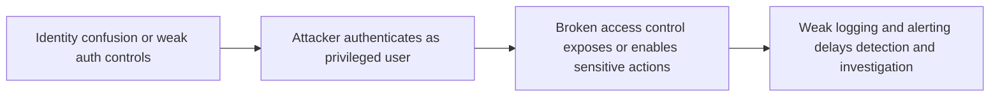

# OWASP Top 10 2025 - IAAA Failures

## Summary

This note covers a practical way to understand three closely related web security risk areas through the **IAAA** model:

* **Identity**
* **Authentication**
* **Authorisation**
* **Accountability**

The room maps three OWASP-style failure domains to weaknesses in how applications implement these controls:

* **A01 Broken Access Control** -> mainly an **Authorisation** failure
* **A07 Authentication Failures** -> mainly an **Identity + Authentication** failure
* **A09 Logging & Alerting Failures** -> mainly an **Accountability** failure

The main value of this model is structural: instead of memorising isolated bugs, you ask one sequence of questions for every feature:

1. **Who is this user?**
2. **Have they really proven that identity?**
3. **Are they allowed to do this exact action on this exact object?**
4. **Can we later prove what happened?**

If one of these layers fails, later layers become weak or meaningless.

---

## 1. What IAAA Is

### 1.1 Core idea

IAAA is a compact reasoning model for access decisions in applications.

```text
Identity -> Authentication -> Authorisation -> Accountability
```

This ordering matters.

* Without a stable **identity**, authentication is attached to the wrong subject.
* Without **authentication**, authorization decisions are meaningless.
* Without **authorisation**, users may access resources they should never touch.
* Without **accountability**, defenders cannot reconstruct the attack chain or prove abuse.

### 1.2 Definitions

#### Identity checks

The unique entity the system believes it is dealing with.

Examples:

* user ID
* email address
* service account
* tenant ID

#### Authentication checks

The mechanism used to prove that the claimed identity is genuine.

Examples:

* password
* OTP / MFA
* passkey
* client certificate
* session token bound to a previously verified login

#### Authorisation checks

The decision logic that answers:

```text
Is this authenticated identity allowed to perform this action on this resource?
```

#### Accountability checks

The evidence layer.

It answers:

```text
Can we reconstruct who did what, when, from where, and with what outcome?
```

---

## 2. Why This Model Is Useful

A lot of web application weaknesses are symptoms of one of these failures:

* app trusts a user-controlled identifier too early
* app authenticates the wrong canonical identity
* app checks role but not object ownership
* app logs success badly or does not log abuse at all

This is why the model is more useful than simply memorising bug names.

---

## 3. A01 - Broken Access Control

### 3.1 Concept

Broken Access Control happens when the server does not enforce access checks correctly on every request.

The most classic pattern is **IDOR** (**Insecure Direct Object Reference**):

```text
?id=5  ->  ?id=7
```

If changing the object identifier lets one user read or modify another user's data, the application has delegated trust to the client.

That is the core design error.

### 3.2 First-principles explanation

A secure system must not ask only:

```text
Does this object exist?
```

It must ask:

```text
Does this authenticated user have permission to access this exact object?
```

That means the authorization decision must be:

* **server-side**
* **resource-specific**
* **performed on every request**

### 3.3 Types of privilege escalation in this context

#### Horizontal privilege escalation

Same privilege level, different user's data.

Example:

* normal user A changes `id=5` to `id=7`
* still a normal user
* now viewing another user's account data

#### Vertical privilege escalation

User reaches a higher privilege tier.

Example:

* normal user reaches admin-only endpoint
* feature intended only for staff or administrators

### 3.4 Practical room example

The account page exposed records directly through a predictable `id` parameter.

Example pattern:

```text
https://TARGET_URL/accounts?id=5
```

Changing IDs allowed access to other users' account information.

This is a textbook authorization failure because the server accepted:

* a user-supplied object reference
* without validating ownership or entitlement

### 3.5 Key finding from the challenge

* Account with more than $1 million: user at `id=7`
* Extracted note/flag:

```text
THM{Found.the.Millionare!}
```

### 3.6 Why encoded or hashed IDs do not solve this

Developers often try to "hide" IDs by:

* Base64 encoding them
* hashing them
* using UUID-like strings

This may reduce casual guessing, but it does **not** fix authorization.

The real control is not "make the ID hard to guess."
The real control is:

```text
Even if the user knows the identifier, the server must still deny access unless the user is entitled to that object.
```

### 3.7 Secure design guidance for A01

#### Minimum required controls

* enforce authorization on **every request**
* validate **object ownership** and **tenant scope** server-side
* never trust hidden fields, query parameters, or client-side role checks
* use centralized authorization middleware or policy evaluation
* test direct object references explicitly during QA and pentests

#### Better design pattern

Instead of:

```text
SELECT * FROM accounts WHERE id = user_supplied_id
```

Prefer logic equivalent to:

```text
SELECT * FROM accounts
WHERE id = requested_id
AND owner_id = authenticated_user_id
```

Or role/policy-based evaluation where admin exceptions are explicit.

---

## 4. A07 - Authentication Failures

### 4.1 Concept

Authentication Failures happen when the application cannot reliably bind a login flow or session to the correct identity.

Typical causes include:

* weak passwords
* missing rate limits or lockouts
* username enumeration
* session fixation or poor session rotation
* canonicalization errors in identity handling
* flawed registration/login logic

### 4.2 The subtle part: identity canonicalization

Many systems compare usernames inconsistently.

Example problem:

* registration accepts `aDmiN`
* login or lookup normalizes case inconsistently
* internal identity store treats `admin` and `aDmiN` as equivalent in one place, but not another

This can create **account confusion**.

That is not simply a bad password issue. It is an **identity-binding failure**.

### 4.3 Practical room example

The challenge logic allowed abuse of username case handling.

By registering a username variant of `admin`, the attacker could ultimately access the admin dashboard.

This is important because it shows a deeper lesson:

```text
Authentication is not only about secrets.
It is also about stable, canonical identity mapping.
```

If the application cannot determine that one identity representation is unique and reserved, login correctness breaks.

### 4.4 Key finding from the challenge

Admin dashboard flag:

```text
THM{Account.confusion.FTW!}
```

### 4.5 Root cause analysis

The likely design weakness is one or more of the following:

* no canonical uniqueness enforcement on usernames
* inconsistent case normalization between registration and login
* improper reserved-name protection
* session bound to the wrong account object after normalization

### 4.6 Secure design guidance for A07

#### Identity handling

* canonicalize usernames before storage and comparison
* enforce uniqueness on the canonical representation
* reserve privileged names and sensitive aliases
* avoid mixed logic across registration, login, password reset, and profile update flows

#### Password and brute-force controls

* enforce strong password policy
* rate-limit login attempts
* introduce progressive delay or temporary lockout
* monitor repeated authentication failures
* alert on credential stuffing patterns

#### Session security

* rotate session identifiers after login and privilege changes
* bind sessions correctly to the authenticated principal
* invalidate old sessions after password reset or admin action

---

## 5. A09 - Logging and Alerting Failures

### 5.1 Concept

Without good logging and alerting, the system loses accountability.

That means defenders cannot answer:

* who attempted access?
* which account succeeded?
* from which IP?
* what was done after compromise?
* when did the attack chain transition from failed attempts to successful abuse?

Poor logging turns a security incident into guesswork.

### 5.2 Practical attack pattern in the challenge

The log view showed repeated failed login attempts against the `admin` account from the same IP, followed by:

* a successful login
* access to a suspicious privileged endpoint

This is exactly the kind of attack that becomes invisible if the application does not capture:

* login failures
* login success
* source IP
* endpoint access after authentication
* timestamps with sufficient precision

### 5.3 Key findings from the challenge

#### Brute-force source IP

```text
203.0.113.45
```

#### Username successfully accessed

```text
admin
```

#### Suspicious action or endpoint reached after successful authentication

```text
/supersecretadminstuff
```

### 5.4 Why this matters structurally

A07 and A09 often appear together.

Authentication controls may be imperfect, but if logging is strong, defenders can still:

* detect brute-force bursts
* identify successful compromise quickly
* correlate source IP and account
* scope follow-on abuse

If logging is weak, one control failure cascades into an investigation failure.

### 5.5 What good accountability logging should include

For security-relevant application events, logs should capture:

* timestamp
* user or claimed identity
* normalized identity if applicable
* source IP / proxy chain where appropriate
* user agent or device context where appropriate
* action / endpoint
* result (`success`, `failure`, `denied`)
* reason code where useful
* privilege or role changes
* object identifier touched

#### Especially important events

* login failure
* login success
* password change
* password reset
* MFA enrollment / disablement
* role change
* admin action
* access denial to protected resource
* session creation / invalidation

---

## 6. Mapping the Three Categories Back to IAAA

| Category | Primary IAAA layer | Core failure |
| --- | --- | --- |
| A01 Broken Access Control | Authorisation | User can access an object or action the server failed to restrict |
| A07 Authentication Failures | Identity + Authentication | System cannot reliably prove or bind the correct user identity |
| A09 Logging & Alerting Failures | Accountability | Security-relevant actions are not recorded or surfaced effectively |

---

## 7. Unified Attack Logic Across the Room

A useful way to think about the room is as one connected failure chain.



This is why these categories belong together under IAAA.

---

## 8. Analyst Checklist

### 8.1 For developers

#### Identity

* Are usernames canonicalized consistently?
* Is canonical uniqueness enforced at the database level?
* Are reserved privileged identities protected?

#### Authentication

* Are brute-force protections implemented?
* Are sessions rotated after authentication and privilege changes?
* Are password reset flows resistant to account confusion?

#### Authorisation

* Is authorization checked on every request?
* Is object ownership validated server-side?
* Are role checks separate from object checks?

#### Accountability

* Are auth lifecycle events logged?
* Are privileged actions logged with actor, time, IP, and target?
* Are alerts generated for brute-force or anomalous admin access?

---

## 9. Secure Design Patterns

### 9.1 Pattern 1 - Canonical identity enforcement

Store a canonical representation of the username.

Example concept:

```text
input username -> normalize -> store normalized form -> unique index on normalized value
```

This prevents `Admin`, `ADMIN`, and `aDmiN` from becoming logically confusing identities.

### 9.2 Pattern 2 - Object-level authorization

Every object access should answer:

```text
Can this principal access this specific object?
```

This is more precise than checking only:

```text
Is this user logged in?
```

### 9.3 Pattern 3 - Full authentication lifecycle logging

Treat auth and admin actions as high-value telemetry.

Good security operations depend on this.

---

## 10. Practical Results from the Room

### 10.1 A01

* issue type: IDOR / broken access control
* escalation type: horizontal privilege escalation
* extracted flag:

```text
THM{Found.the.Millionare!}
```

### 10.2 A07

* issue type: authentication / identity-binding failure
* abuse pattern: case-variant registration leading to admin account confusion
* extracted flag:

```text
THM{Account.confusion.FTW!}
```

### 10.3 A09

* brute-force source IP:

```text
203.0.113.45
```

* compromised username:

```text
admin
```

* suspicious endpoint accessed:

```text
/supersecretadminstuff
```

---

## 11. Common Mistakes in Real Applications

### 11.1 Access control mistakes

* relying on hidden fields or client-side IDs
* checking role only once at login
* assuming unguessable IDs are authorization
* reusing object lookups without ownership checks

### 11.2 Authentication mistakes

* case-sensitive registration but case-insensitive login
* weak password policy
* no brute-force protection
* no session invalidation after password change
* login flow and registration flow use different identity normalization rules

### 11.3 Logging mistakes

* only logging failures, not successes
* logging vague messages without actor or source IP
* missing privileged endpoint access logs
* keeping logs only locally where attackers can tamper with them
* no alerts on brute-force bursts or new admin session anomalies

---

## 12. Short Takeaways

* **Identity must be canonical and unique.**
* **Authentication must bind the correct identity to a trusted session.**
* **Authorisation must be enforced server-side on every object and action.**
* **Accountability must preserve enough evidence to investigate abuse.**

The most important mental model is this:

```text
If the app knows who you are but not what you can access, you get A01.
If the app does not even know who you really are, you get A07.
If defenders cannot reconstruct either of those failures afterward, you get A09.
```

---

## Further Reading

* OWASP Top 10 2025 overview
* OWASP A01 Broken Access Control
* OWASP object-level authorization guidance
* auth/session management guidance
* application logging and monitoring guidance

---

## CN-EN Glossary

* Identity - 身份标识
* Authentication - 身份认证
* Authorisation / Authorization - 授权
* Accountability - 可追责性 / 问责留痕
* Broken Access Control - 访问控制失效
* IDOR (Insecure Direct Object Reference) - 不安全的直接对象引用
* Horizontal Privilege Escalation - 水平越权
* Vertical Privilege Escalation - 垂直越权
* Authentication Failures - 身份认证失效
* Logging & Alerting Failures - 日志与告警失效
* Canonicalization - 规范化 / 归一化
* Session Rotation - 会话轮换
* Object Ownership Check - 对象归属校验
* Audit Trail - 审计轨迹
* Brute-force Attack - 暴力破解攻击
* Privileged Endpoint - 高权限接口
* Telemetry - 安全遥测 / 事件遥测
* Object-level Authorization - 对象级授权
* Identity Binding - 身份绑定
