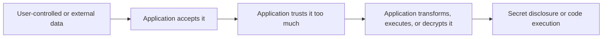

# OWASP Top 10 2025 - Insecure Data Handling

## Summary

This note focuses on three OWASP Top 10:2025 categories that are tightly connected to **how applications process, trust, transform, and protect data**:

* **A04:2025 - Cryptographic Failures**
* **A05:2025 - Injection**
* **A08:2025 - Software or Data Integrity Failures**

These categories look different on the surface, but they share one root pattern:

```text
The application accepts data, assumes too much about it, and then gives that data more power than it deserves.
```

That failure can appear as:

* weak encryption with recoverable secrets
* template rendering that executes attacker-controlled expressions
* deserialization of untrusted data into executable object behavior

---

## 1. Official 2025 Ranking Context

OWASP's 2025 Top 10 lists these categories at:

* **A04** Cryptographic Failures
* **A05** Injection
* **A08** Software or Data Integrity Failures

A05 remains one of the most heavily tested categories. A08 continues as a distinct integrity-focused category, separated from the broader supply chain problem in A03. A04 remains high because weak crypto still routinely leads to exposure of sensitive data and secrets.

---

## 2. Unifying Mental Model

### 2.1 Data handling failure chain



### 2.2 Category-level view

| Category | What the app gets wrong | Typical result |
| --- | --- | --- |
| A04 Cryptographic Failures | protects data weakly or exposes secrets needed to decrypt it | confidentiality collapses |
| A05 Injection | treats input as instructions instead of data | execution inside the target interpreter |
| A08 Software or Data Integrity Failures | trusts code or serialized artifacts without verification | arbitrary behavior through tampered objects or components |

A compact memory rule:

```text
A04 = weak protection.
A05 = unsafe interpretation.
A08 = unsafe trust.
```

---

## 3. A04 - Cryptographic Failures

### 3.1 What it is

Cryptographic failures happen when sensitive data is not adequately protected because encryption or hashing is missing, weak, misused, or easy to reverse in practice.

Common causes include:

* weak or outdated algorithms
* short keys
* shared keys reused across multiple objects
* homegrown encryption
* exposed secrets or predictable key material
* weak password storage or poor key management

### 3.2 Why it matters

Applications often claim data is "encrypted," but the real question is:

```text
Can an attacker still recover the plaintext with realistic effort?
```

If the answer is yes, the system has failed even if it technically used encryption.

That is why "encrypted" is not a security verdict. It is only an implementation detail.

### 3.3 Practical room example - weak XOR cipher

A note-sharing service protected three notes with the same weak XOR-based scheme.

Key properties of the lab:

* all notes were encrypted with the **same 4-character key**
* most of the key pattern was already known
* only the last character had to be determined
* one successful key would decrypt all notes

### 3.4 Why this is weak

XOR itself is reversible. If the key is:

* short
* reused
* predictable
* shared across multiple ciphertexts

then brute force or simple pattern-based recovery becomes practical.

This is exactly why OWASP warns against "rolling your own crypto."

### 3.5 Attack logic

Only the final character of the four-character key needed to be guessed. Once the correct value was found, all notes decrypted successfully.

Recovered key material:

```text
SECRET_REDACTED
```

Recovered flag from the decrypted notes:

```text
FLAG_REDACTED
```

### 3.6 Security lesson

This lab is intentionally simple, but the lesson scales well:

* short reusable keys are dangerous
* ad hoc ciphers are fragile
* encryption without proper key management is not robust protection

### 3.7 Defensive guidance for A04

#### 3.7.1 A04 minimum controls

* use well-vetted modern cryptography only
* use strong, random keys with sufficient entropy
* never reuse the same weak key across many protected objects
* use standard libraries, not custom schemes
* separate secret storage from application logic
* hash passwords with slow password hashing functions such as Argon2, scrypt, or bcrypt

#### 3.7.2 A04 engineering rule

```text
If a human can guess the missing part of the key from context, the system was never cryptographically strong.
```

---

## 4. A05 - Injection

### 4.1 What it is

Injection happens when user-controlled input is passed into an interpreter or execution context in a way that changes system behavior.

Classic cases include:

* SQL Injection
* Command Injection
* LDAP Injection
* Server-Side Template Injection (SSTI)
* prompt-level abuse in AI-assisted systems

### 4.2 Why it matters

Injection is the moment where the application stops treating input as **data** and starts treating it as **instructions**.

That boundary failure is why the impact can be extreme:

* file read
* remote command execution
* authentication bypass
* data theft
* full compromise depending on context

### 4.3 Practical room example - SSTI in Jinja2

The lab intentionally rendered raw user input inside a Jinja2 template using `render_template_string`.

Initial proof payload:

```jinja2
{{ 7 * 7 }}
```

This confirmed that template expressions were executed server-side.

Further context enumeration payload:

```jinja2
{{ config.items() }}
```

This exposed accessible Flask/Jinja objects and proved the environment was not properly sandboxed.

### 4.4 Final file-read payload

The successful payload used Flask internals and builtins to read `flag.txt` directly:

```jinja2
{{ request.application.__globals__.__builtins__.open('flag.txt').read() }}
```

Recovered flag:

```text
FLAG_REDACTED
```

### 4.5 Why it worked

The rendering engine evaluated attacker-controlled template syntax and exposed enough object graph access to reach Python builtins.

This created a path like:

```text
user input -> template evaluation -> Flask globals -> Python builtins -> file read
```

That is a classic SSTI exploitation chain.

### 4.6 Root cause

* untrusted input passed directly to server-side template rendering
* unsafe use of `render_template_string`
* insufficient sandboxing or object exposure
* no boundary between user content and executable template logic

### 4.7 Defensive guidance for A05

#### 4.7.1 A05 minimum controls

* never render raw user input as a template
* keep user input as data, not template source
* use safe templating patterns with fixed templates and escaped variables
* remove unnecessary object exposure in template contexts
* validate inputs strictly before processing
* avoid passing input into shells, query builders, or interpreters directly

#### 4.7.2 A05 engineering rule

```text
If the attacker controls the syntax layer, they do not just control input anymore - they control execution.
```

---

## 5. A08 - Software or Data Integrity Failures

### 5.1 What it is

Software or Data Integrity Failures occur when applications trust code, serialized objects, updates, or critical data without verifying integrity, origin, or allowed behavior.

This category is about **trust boundaries**.

Typical examples:

* unsigned or unchecked updates
* unsafe deserialization
* build artifacts trusted without verification
* execution paths derived from untrusted serialized objects
* application logic that assumes imported or submitted data is authentic

### 5.2 Why it matters

Some data is not "just data."

Serialized objects, config blobs, templates, plugins, and update packages can all carry **behavioral meaning**. If the application reconstructs them blindly, attackers can turn data ingestion into code execution.

### 5.3 Practical room example - insecure Python deserialization

The lab accepted base64-encoded Python pickle data and deserialized it **without any integrity verification**.

The challenge description explicitly highlighted the core problem:

* no integrity verification
* unsafe deserialization
* trust boundary violation
* no input whitelisting

The application effectively treated attacker-supplied serialized objects as trusted internal objects.

### 5.4 Attack logic

A malicious pickle payload was crafted with a custom `__reduce__()` method so that deserialization would trigger execution of a callable that reads `flag.txt`.

Representative exploit idea:

```python
class Malicious:
    def __reduce__(self):
        return (eval, ("open('flag.txt').read()",))
```

The object was then:

1. pickled
2. base64-encoded
3. submitted to the application

During deserialization, the server executed the attacker-controlled behavior and returned the file content.

Recovered flag:

```text
FLAG_REDACTED
```

### 5.5 Why `pickle` is dangerous here

Python's `pickle` format is not a safe data interchange format for untrusted input. It is fundamentally capable of reconstituting objects in ways that invoke executable behavior.

That makes this pattern dangerous by design:

```text
untrusted pickle input + automatic loads() = attacker-controlled behavior
```

### 5.6 Root cause

* untrusted serialized input accepted from the client
* no signature or checksum validation
* no restricted unpickler
* no safe schema-based format used instead
* no hard trust boundary between user input and executable reconstruction

### 5.7 Defensive guidance for A08

#### 5.7.1 A08 minimum controls

* never deserialize untrusted pickle data
* use safe serialization formats such as JSON when executable object reconstruction is not needed
* verify signatures or integrity of critical artifacts before loading
* whitelist allowed object types where deserialization is unavoidable
* treat CI/CD artifacts, packages, and serialized blobs as integrity-sensitive assets

#### 5.7.2 A08 engineering rule

```text
If submitted data can recreate behavior, then integrity verification is not optional.
```

---

## 6. Category Comparison

### 6.1 A04 vs A08

These two can look similar because both involve "protected" or "encoded" data.

#### 6.1.1 A04 Cryptographic Failures

The application tries to protect data, but the protection is weak or recoverable.

Example:

* weak XOR cipher
* predictable key
* decrypted secret exposed after trivial recovery

#### 6.1.2 A08 Software or Data Integrity Failures

The application trusts structured data that can alter behavior or execution without verifying authenticity.

Example:

* malicious pickle object
* deserialization triggers code execution

Simple distinction:

```text
A04 = secrecy fails.
A08 = trust verification fails.
```

### 6.2 A05 vs A08

These can also overlap conceptually because both may end in code execution.

#### 6.2.1 A05 Injection

The attacker sends input that the interpreter directly executes.

Example:

* Jinja2 template payload
* SQL query fragment
* shell command fragment

#### 6.2.2 A08 Software or Data Integrity Failures

The attacker sends a structured artifact that the application reconstructs and trusts.

Example:

* pickle payload
* unsigned update artifact
* tampered serialized configuration

Simple distinction:

```text
A05 = input becomes instructions.
A08 = trusted artifact becomes instructions.
```

---

## 7. Practical Lab Results

### 7.1 A04 - Weak XOR cipher

* weakness: short shared XOR key
* recovered key:

```text
SECRET_REDACTED
```

* recovered flag:

```text
FLAG_REDACTED
```

### 7.2 A05 - SSTI in Jinja2

* proof payload:

```jinja2
{{ 7 * 7 }}
```

* enumeration payload:

```jinja2
{{ config.items() }}
```

* successful payload:

```jinja2
{{ request.application.__globals__.__builtins__.open('flag.txt').read() }}
```

* recovered flag:

```text
FLAG_REDACTED
```

### 7.3 A08 - Insecure deserialization

* weakness: base64-encoded untrusted pickle deserialized without integrity checks
* exploit primitive: malicious `__reduce__()`
* recovered flag:

```text
FLAG_REDACTED
```

---

## 8. Secure Data Handling Checklist

### 8.1 Crypto hygiene

* use standard modern crypto only
* separate key management from application logic
* avoid deterministic or guessable key structures
* never design custom encryption for production data protection

### 8.2 Template safety

* never evaluate user input as template code
* keep templates static and pass variables safely
* escape and validate input before rendering
* reduce accessible object graph in server-side rendering contexts

### 8.3 Integrity verification

* verify integrity and origin of critical data before loading
* never trust deserialized objects from untrusted sources
* prefer schema-based, non-executable data formats
* define trust boundaries explicitly in application design and CI/CD

---

## 9. Key Takeaways

* **A04** teaches that weak crypto is often just recoverable obfuscation.
* **A05** teaches that rendering or interpreting untrusted input is execution by another name.
* **A08** teaches that serialized artifacts can be code delivery mechanisms when integrity is ignored.

A short synthesis:

```text
Do not just protect data.
Do not just parse data.
Do not just accept data.
First decide whether that data should be trusted, executable, decryptable, or loadable at all.
```

That is the real defensive mindset behind this room.

---

## Further Reading

* OWASP Top 10 2025 overview
* OWASP A04 Cryptographic Failures
* OWASP A05 Injection
* OWASP A08 Software or Data Integrity Failures

---

## CN-EN Glossary

* Cryptographic Failures - 密码学失效 / 加密失效
* Injection - 注入漏洞
* Server-Side Template Injection (SSTI) - 服务端模板注入
* Software or Data Integrity Failures - 软件或数据完整性失效
* XOR Cipher - 异或加密
* Shared Key - 共享密钥
* Brute Force - 暴力穷举
* Template Rendering - 模板渲染
* Builtins - 内建函数 / 内置对象
* Deserialization - 反序列化
* Pickle - Python 序列化格式（高风险）
* Integrity Verification - 完整性校验
* Trust Boundary - 信任边界
* Executable Context - 可执行上下文
* Untrusted Input - 不可信输入
* Key Management - 密钥管理
* Safe Serialization Format - 安全序列化格式
* Object Reconstruction - 对象重建
* File Read Primitive - 文件读取原语
* Defensive Control - 防御控制
