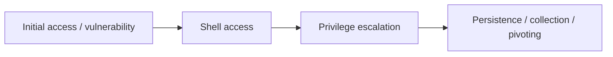

# Shells Overview

## Summary

* A **shell** is the command-line interface that allows interaction with an operating system.
* In offensive security, "getting a shell" means obtaining command execution on a target system.
* The three core shell patterns in this room are **reverse shells**, **bind shells**, and **web shells**.
* A reverse shell makes the **target initiate the connection back** to the operator.
* A bind shell makes the **target listen on a port** and wait for the operator to connect.
* A web shell is a **server-side script** exposed through a web application or web server.
* Practical shell work has two halves: **listener** and **payload**.

## 1. What a Shell Means in Security

A shell is software that lets a user interact with an operating system, usually through a command-line interface.

In security work, the phrase usually means a **remote command session** obtained on a compromised host.

Once shell access exists, it can be used for:

* remote system control
* privilege escalation
* data exfiltration
* persistence
* post-exploitation actions
* pivoting to other systems

### Core Idea

```text
Normal administration: user -> shell -> OS
Compromise scenario: operator -> remote shell -> target OS
```

## 2. Shells as Part of the Attack Chain

Shell access is rarely the end goal. It is usually an **execution foothold**.

Typical sequence:



That is why defenders care about shells too. A detected shell often means the intrusion already moved beyond simple probing.

## 3. Reverse Shell

### 3.1 Concept

In a reverse shell, the **target connects back** to the operator's listener.

```text
TARGET  -------->  ATTACKER LISTENER
        outbound connection
```

This pattern is popular because outbound traffic often blends into normal network behavior more easily than inbound unsolicited connections.

### 3.2 Why It Is Common

* works well when inbound access to the target is restricted
* often blends with allowed outbound traffic
* easy to pair with lightweight listeners such as `nc`, `ncat`, or `socat`

### 3.3 Practical Model

A reverse shell needs:

1. a **listener** on the operator side
2. a **payload** on the target side
3. a network path from target to listener

## 4. Bind Shell

### 4.1 Concept

In a bind shell, the **target opens a listening port** and waits for the operator to connect.

```text
ATTACKER  -------->  TARGET LISTENER
          inbound connection to target
```

### 4.2 Why It Is Less Common

* requires the target to expose a listening service
* can be noisier from a network visibility standpoint
* often easier to block with firewall policy

### 4.3 When It Still Matters

* when outbound connections from the target are blocked
* in controlled lab environments
* when testing port exposure and service-binding behavior

## 5. Reverse vs Bind Shell

| Type | Who initiates connection? | Typical strength | Typical weakness |
| --- | --- | --- | --- |
| Reverse shell | Target | Often easier to pass outbound controls | Requires reachable listener |
| Bind shell | Operator | Simple conceptually | Exposes target listener and may be blocked |

## 6. Shell Listeners

A listener is the receiving side of the shell interaction.

### 6.1 Netcat / Ncat Family

Common listener features:

* listen on a port
* accept TCP connections
* pass stdin/stdout over the network

### 6.2 `rlwrap`

`rlwrap` improves shell usability by adding line editing and command history to programs that normally lack them.

Practical effect:

* arrow keys behave better
* command recall is easier
* rough shells become less painful to use

### 6.3 `ncat`

`ncat` is the Nmap project's enhanced Netcat implementation.

Useful characteristics:

* modern replacement behavior
* SSL/TLS support
* strong general-purpose networking utility value

### 6.4 `socat`

`socat` is more flexible than classic Netcat-style usage and is excellent when you need explicit socket-to-socket or stream-to-stream plumbing.

Mental model:

```text
source A <----> socat <----> source B
```

## 7. Shell Payloads

A shell payload is the command or script that exposes a shell session through a network connection.

This room surveys payload styles in:

* Bash
* PHP
* Python
* Telnet
* AWK
* BusyBox

### 7.1 Common Structure

Even when syntax differs, the pattern is usually:

```text
create connection -> redirect stdin/stdout/stderr -> spawn shell
```

### 7.2 Bash Patterns

Bash payloads often rely on:

* file descriptor redirection
* `/dev/tcp/HOST/PORT` style socket access
* interactive shell spawn with `bash -i` or `sh`

### 7.3 PHP Patterns

PHP payloads commonly use command-execution functions such as:

* `exec`
* `shell_exec`
* `system`
* `passthru`
* `popen`

These matter both offensively and defensively because they are high-signal indicators during code review and web shell hunting.

### 7.4 Python Patterns

Python payloads often combine:

* `socket`
* `os.dup2`
* `pty.spawn`
* sometimes `subprocess`

This makes Python especially common in Linux-heavy lab environments.

## 8. Web Shells

A web shell is a script deployed on a server and executed through the web stack.

Typical languages:

* PHP
* ASP / ASPX
* JSP
* CGI-compatible scripting

### 8.1 What Makes Web Shells Different

A normal shell payload is usually executed directly on the target host. A web shell is usually executed **through an HTTP request** to a server-side script.

### 8.2 Typical Abuse Paths

Web shells often appear after vulnerabilities such as:

* unrestricted file upload
* file inclusion
* command injection
* weak administrative access control

### 8.3 Minimal Web Shell Model

Conceptually:

```text
HTTP request -> server-side script -> command execution -> output returned in response
```

### 8.4 Defensive Importance

Web shells are important to detect because they can look like ordinary application files while quietly enabling remote command execution.

## 9. Operational Interpretation for Defenders

If you detect shell-like behavior, the key questions are:

* Was there an unexpected outbound connection to an uncommon destination?
* Did a web process spawn a shell or command interpreter?
* Did a script interpreter create a socket and then a child shell?
* Did a service begin listening on an unusual port?
* Did a web upload path suddenly contain executable server-side content?

These questions convert shell theory into hunt hypotheses.

## 10. Pattern Cards

### Pattern Card 1 - Reverse Shell

**Signal**

* target initiates unexpected outbound session
* shell or interpreter chained to network activity

**Why it matters**

* often indicates post-exploitation command execution

**Common pivots**

* process tree review
* outbound connection logs
* EDR command-line history

### Pattern Card 2 - Bind Shell

**Signal**

* new listening service on non-standard port
* unexpected shell process tied to listening socket

**Why it matters**

* indicates the target is exposing remote access directly

**Common pivots**

* `ss -lntp` / `netstat`
* service startup history
* firewall logs

### Pattern Card 3 - Web Shell

**Signal**

* suspicious server-side file in upload or writable directory
* web worker spawning shell / interpreter children
* repeated HTTP requests with command-like parameters

**Why it matters**

* often provides persistent remote execution over HTTP

**Common pivots**

* web server access logs
* file creation timestamps
* code review of uploaded server-side files

## 11. Command Cookbook

Only use these in authorized lab environments.

### Listener Examples

```bash
nc -lvnp LISTEN_PORT
```

```bash
rlwrap nc -lvnp LISTEN_PORT
```

```bash
ncat -lvnp LISTEN_PORT
```

```bash
ncat --ssl -lvnp LISTEN_PORT
```

```bash
socat -d -d TCP-LISTEN:LISTEN_PORT STDOUT
```

### Placeholder Conventions

* `ATTACKER_IP` = listener host
* `TARGET_IP` = target host
* `LISTEN_PORT` = chosen port
* never hardcode real infrastructure into public notes

## 12. Pitfalls

### 12.1 Confusing Listener With Payload

A listener waits. A payload initiates or exposes the shell.

### 12.2 Thinking Every Shell Is Interactive And Stable

Many shells are fragile, non-PTY, and missing job control.

### 12.3 Ignoring Process Ancestry

A shell launched by a web process, scripting runtime, or unusual parent process is a major clue.

### 12.4 Treating All Command Execution As "Just Scripting"

On servers, functions like `exec`, `system`, or `shell_exec` deserve scrutiny.

### 12.5 Forgetting The Defender View

Shell knowledge is not only for exploitation. It is also for:

* detection engineering
* DFIR triage
* process and network correlation
* web shell hunting

## 13. Quick Comparison Table

| Topic | Core question |
| --- | --- |
| Shell | Do we have command execution? |
| Reverse shell | Did the target call back outward? |
| Bind shell | Did the target expose a listener? |
| Web shell | Is command execution being triggered over HTTP? |
| Listener | What receives the connection? |
| Payload | What creates or exposes the shell? |

## 14. Takeaways

* Shell access is a post-exploitation execution channel, not just a buzzword.
* Reverse shells are common because they fit outbound traffic patterns better.
* Bind shells are simpler conceptually but often noisier operationally.
* Web shells are especially relevant in web application security because they bridge HTTP and OS command execution.
* `nc`, `ncat`, `rlwrap`, and `socat` are not interchangeable in every detail; each has a different operational niche.
* Blue-team value is high: if you understand how shells are created, you understand what to hunt.

## 15. Related Tools

* Netcat / `nc`
* `ncat`
* `rlwrap`
* `socat`
* Bash
* PHP
* Python

## 16. Further Reading

* Ncat Users' Guide
* socat documentation
* PHP manual: command execution functions
* Python docs: `socket`, `pty`, `subprocess`

## 17. CN-EN Glossary

* Shell - Shell / 命令行壳层
* Reverse Shell - 反连 shell / 回连 shell
* Bind Shell - 绑定 shell / 监听 shell
* Web Shell - Web shell / 网站后门脚本
* Listener - 监听端
* Payload - 载荷
* Pivoting - 横向支点利用 / 枢轴移动
* Privilege Escalation - 提权
* Data Exfiltration - 数据外传 / 数据渗出
* Persistence - 持久化
* File Descriptor - 文件描述符
* Standard Input - 标准输入
* Standard Output - 标准输出
* Standard Error - 标准错误
* Command Injection - 命令注入
* Unrestricted File Upload - 不受限文件上传
