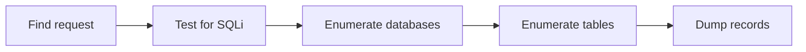

# SQLMap: The Basics

## Summary

* A database stores application data in structured form and is usually queried through SQL.
* **SQL injection (SQLi)** happens when user-controlled input is inserted into a query without proper validation or parameterization.
* `sqlmap` is an automated penetration-testing tool for detecting and exploiting SQL injection in authorized environments.
* SQLi testing often starts from a **GET parameter**, but `sqlmap` can also work from captured requests, cookies, and authenticated contexts.
* The core `sqlmap` workflow in this room is **identify injectable request -> enumerate databases -> enumerate tables -> dump records**.
* In the provided lab screenshots, the target exposed **6 databases**, and the `ai` database contained a `user` table.

## 1. SQLi in One Sentence

SQL injection is a case where the application lets user input change the logic of a backend SQL query.

### Mental Model

```text
User input -> application query builder -> database
```

Safe case:

```text
input is treated as data
```

Unsafe case:

```text
input becomes part of SQL logic
```

## 2. Why This Matters

A successful SQL injection can let an attacker:

* bypass authentication
* read sensitive records
* modify stored data
* enumerate schema objects
* sometimes escalate impact beyond the database layer

For defenders, SQLi is one of the cleanest examples of why **input handling** and **query construction** matter.

## 3. Databases, DBMS, and Queries

Applications usually do not "talk to files". They talk to a **DBMS** such as:

* MySQL
* PostgreSQL
* SQLite
* Microsoft SQL Server

The application sends SQL queries to the DBMS, and the DBMS returns results.

### Example Login Logic

Conceptually:

```sql
SELECT * FROM users WHERE username = 'USER_A' AND password = 'CANDIDATE_PASSWORD';
```

This is not the problem by itself.

The problem begins when user input is concatenated into the query unsafely.

## 4. Basic SQLi Logic

### 4.1 The Classic Idea

If input is not safely handled, an attacker may inject logic such as:

```text
' OR 1=1 --
```

Why it works conceptually:

* `OR` changes the boolean logic
* `1=1` is always true
* comment syntax can ignore the rest of the original query

### 4.2 Boolean Intuition

```text
FALSE OR TRUE = TRUE
```

That is why `OR` matters so much in many introductory SQLi examples.

## 5. Where to Look First

### 5.1 GET Parameters

A URL like this deserves attention:

```text
http://TARGET_URL/search?cat=1
```

The query string contains parameters that may directly influence database lookups.

### 5.2 Hidden GET Requests in Modern Pages

Even when parameters do not appear obviously in the visible browser URL, developer tools may reveal them in the actual request.

### 5.3 POST Requests

Forms often send data in the body instead of the URL. In those cases, testing may require a captured request file.

### 5.4 Cookies and Authenticated Context

If the target needs authentication, session cookies can matter. A scan without the right session context may miss the reachable injection point.

## 6. What `sqlmap` Is

`sqlmap` is an automated SQLi testing and exploitation tool used in authorized security assessments.

### What It Helps Automate

* injection detection
* DBMS fingerprinting
* schema enumeration
* data extraction
* request handling options

### Important Note

This room uses it in a lab context. In real work, use it only with explicit authorization.

## 7. Core `sqlmap` Workflow



## 8. Key Commands to Remember

Use placeholders in notes and public repos.

### 8.1 Test a URL

```bash
sqlmap -u 'http://TARGET_URL/path?param=value'
```

### 8.2 Enumerate Databases

```bash
sqlmap -u 'http://TARGET_URL/path?param=value' --dbs
```

### 8.3 Enumerate Tables in One Database

```bash
sqlmap -u 'http://TARGET_URL/path?param=value' -D ai --tables
```

### 8.4 Dump One Table

```bash
sqlmap -u 'http://TARGET_URL/path?param=value' -D ai -T user --dump
```

### 8.5 Use a Captured Request File

```bash
sqlmap -r request.txt
```

## 9. Flags That Matter in This Room

| Flag | Meaning |
| --- | --- |
| `-u` | target URL |
| `--dbs` | enumerate database names |
| `-D` | choose database |
| `--tables` | enumerate tables |
| `-T` | choose table |
| `--dump` | dump table contents |
| `-r` | use raw captured HTTP request |
| `--level=5` | deeper testing intensity |
| `--cookie` | send session cookies |
| `--wizard` | interactive guided mode |

## 10. Reading the Tool Output

When `sqlmap` succeeds, you should learn to extract these fields quickly:

* injectable parameter name
* injection technique type
* backend DBMS
* web stack hints
* discovered databases
* discovered tables
* dumped records

### Example Output Interpretation

If you see something like:

```text
GET parameter 'email' is vulnerable
back-end DBMS: MySQL
```

that means:

1. the parameter under test is the likely injection point
2. payload syntax and next steps should now be reasoned in a MySQL context

## 11. Common SQLi Technique Labels in `sqlmap`

You do not need to master each one on day one, but you should recognize the labels.

### 11.1 Boolean-Based Blind

The tool infers truth or falsehood from how the application responds.

### 11.2 Error-Based

The tool extracts information from database error behavior.

### 11.3 Time-Based Blind

The tool infers behavior through response delays.

### 11.4 UNION Query

The tool tries to join attacker-controlled output into the application response.

## 12. Lab Notes From the Provided Screenshots

These are the concrete observations visible in your screenshots.

### 12.1 Request Shape

The vulnerable request was a GET request to a login-related endpoint, with parameters similar to:

```text
http://TARGET_IP/ai/includes/user_login?email=test&password=test
```

### 12.2 Enumerated Databases

The screenshots show **6 available databases**:

* `ai`
* `information_schema`
* `mysql`
* `performance_schema`
* `phpmyadmin`
* `test`

### 12.3 Enumerated Table

Inside the `ai` database, the screenshots show **1 table**:

* `user`

### 12.4 Practical Reading

That means the room's practical flow worked exactly as intended:

```text
request -> DB enumeration -> ai DB selection -> user table discovery
```

## 13. Practical Workflow for This Room

### Step 1 - Capture or obtain the exact request

For this room, the login page sends a GET request even though the parameters are not obvious from the visible URL.

### Step 2 - Start with detection

Use the exact request URL in single quotes.

### Step 3 - Increase testing depth if needed

The room explicitly suggests `--level=5` for deeper coverage.

### Step 4 - Enumerate databases

Once injection is confirmed, move from detection to controlled enumeration.

### Step 5 - Enumerate tables in the chosen DB

Here the relevant database is `ai`.

### Step 6 - Dump records from the chosen table

This is the final evidence-extraction stage in the room.

## 14. Why Single Quotes Around the URL Matter

The room warns about wrapping the URL in single quotes.

Reason:

* shell special characters such as `?`, `&`, and others can be interpreted by the terminal
* quoting keeps the URL intact as one argument

## 15. Pattern Cards

### Pattern Card 1 - GET parameter injection surface

**Signal**

* dynamic query string parameters
* application behavior changes with small parameter changes

**Why it matters**

* parameters may be inserted directly into SQL logic

**Next checks**

* error behavior
* timing changes
* parameter quoting behavior

### Pattern Card 2 - Hidden request, visible in DevTools

**Signal**

* browser page looks normal
* actual request parameters appear only in Network tools

**Why it matters**

* the attack surface exists in the HTTP request, not necessarily the pretty UI

**Next checks**

* inspect XHR/fetch requests
* copy exact request path and parameters

### Pattern Card 3 - Enumeration chain

**Signal**

* injection confirmed

**Why it matters**

* risk escalates from "is vulnerable" to "how much can be extracted"

**Next checks**

* databases
* tables
* records
* privilege scope

## 16. Pitfalls

### 16.1 Testing the Wrong Request

If you miss the actual endpoint, you are testing the UI, not the vulnerable request path.

### 16.2 Forgetting Quotes Around the URL

Shell parsing can break the command before `sqlmap` even starts correctly.

### 16.3 Stopping After "Vulnerable"

The real learning value comes from reading the enumeration workflow.

### 16.4 Not Understanding What Was Enumerated

Do not just copy answers. Track:

* which parameter was injectable
* which DBMS was identified
* which database mattered
* which table mattered

### 16.5 Using Real Infrastructure in Public Notes

Public GitHub notes should use placeholders such as `TARGET_URL` and `TARGET_IP`.

## 17. Defensive Lessons

The offensive lab is simple, but the defensive lesson is the real point.

### Root Causes

* unsafe string concatenation
* poor input handling
* missing parameterized queries
* weak boundary between user input and SQL logic

### Strong Defenses

* prepared statements / parameterized queries
* strict allowlist validation where appropriate
* least privilege on DB accounts
* safe error handling
* logging and detection around suspicious query patterns

## 18. Quick Comparison Table

| Concept | What to ask |
| --- | --- |
| SQLi | Can user input change SQL logic? |
| Detection | Which parameter is injectable? |
| Fingerprinting | Which DBMS is behind the app? |
| Enumeration | What schema objects are reachable? |
| Extraction | What data can actually be read? |
| Defense | Why was input able to reach SQL unsafely? |

## 19. Takeaways

* SQL injection is fundamentally an **input-to-query-boundary failure**.
* `sqlmap` speeds up both detection and exploitation, but the operator still has to understand the request and the output.
* Request analysis is part of the skill. Many labs hide the real parameters inside network traffic rather than obvious URLs.
* Database enumeration should be read as a chain of logic, not as random flags.
* For real reporting, the most important statement is not "the tool worked"; it is **what data exposure or control became possible because of the injection**.

## 20. Related Tools

* `sqlmap`
* browser DevTools / Network panel
* Burp Suite or another HTTP proxy
* `curl` for request reproduction

## 21. Further Reading

* OWASP SQL Injection overview
* OWASP SQL Injection Prevention Cheat Sheet
* `sqlmap` official wiki and usage guide

## 22. CN-EN Glossary

* Database - 数据库
* DBMS - 数据库管理系统
* SQL Injection (SQLi) - SQL 注入
* Query String - 查询字符串
* GET Parameter - GET 参数
* POST Body - POST 请求体
* Enumeration - 枚举
* Dump Records - 导出记录 / 倾倒数据
* Boolean-based blind - 布尔盲注
* Error-based - 报错注入
* Time-based blind - 时间盲注
* UNION query - UNION 联合注入
* Prepared Statement - 预编译语句
* Parameterized Query - 参数化查询
* Session Cookie - 会话 Cookie
