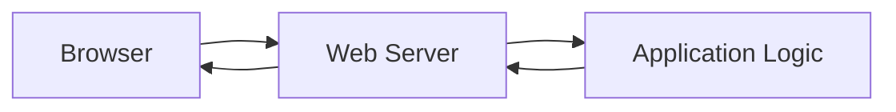
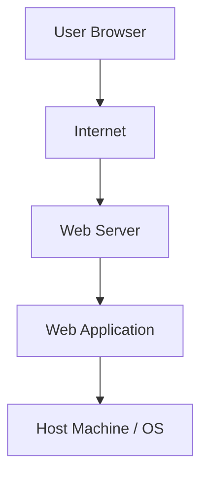
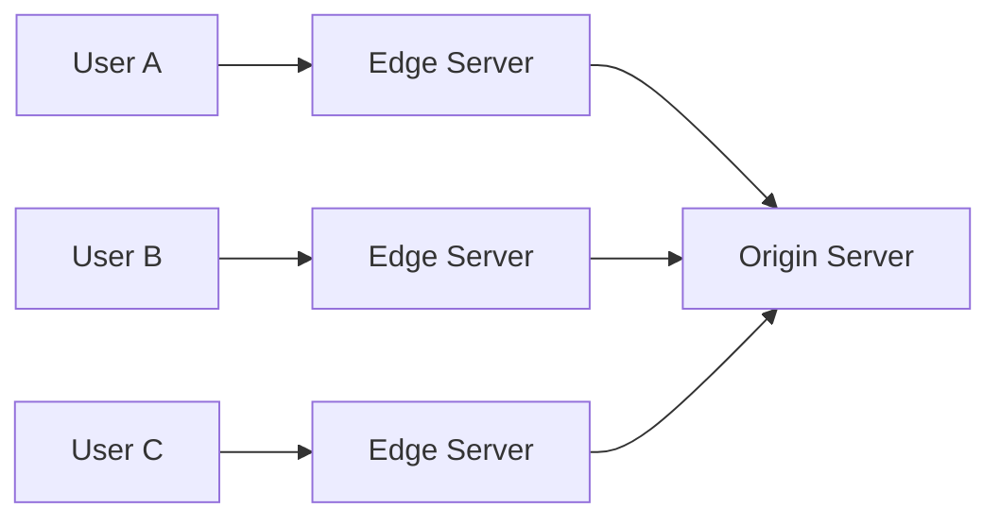
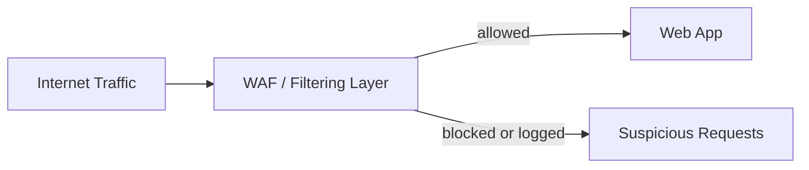
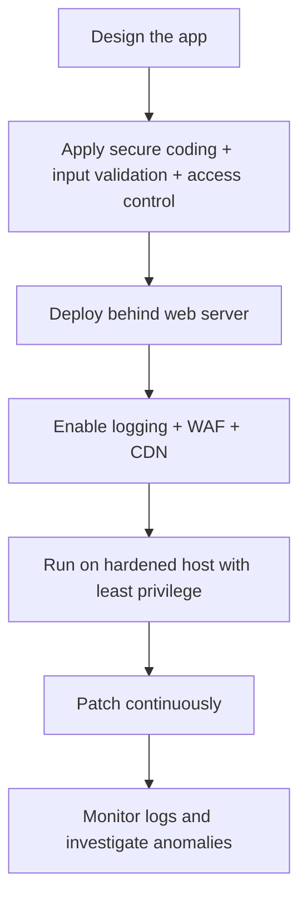

# Web Security Essentials

## Summary

* Modern software has shifted heavily from desktop delivery to **web applications**, which increases accessibility and deployment speed, but also increases exposure.
* A web service can be understood as three stacked layers: **application**, **web server**, and **host machine**.
* Attackers target web apps because they are **publicly reachable**, often connected to valuable back-end systems, and frequently process sensitive user data.
* Defensive work is also layered: protect the **application** with secure coding, validation, and access control; protect the **web server** with logging, WAFs, and CDNs; protect the **host** with least privilege, hardening, and endpoint security.
* Access logs are one of the most important visibility sources because they help analysts reconstruct what happened, when it happened, and from where.
* The practice scenario in this room reinforces a simple principle: **good web security is defense in depth, not one magic control**.

---

## 1. Key Concepts

### 1.1 Why the web became dominant

The long-term shift from desktop software to web-based software happened because the browser became a universal runtime.

Advantages:

* easier access from anywhere,
* faster updates,
* better cross-platform compatibility,
* less client-side installation burden,
* cloud and SaaS delivery at scale.

Security cost:

* the application is reachable from the internet,
* exposure is continuous rather than occasional,
* vulnerabilities can become remote entry points,
* one flaw may affect a very large user base.

### 1.2 Why web apps are attractive targets

A web application is often the first accessible layer an attacker sees. It may lead to:

* user data,
* internal APIs,
* databases,
* admin panels,
* cloud resources,
* broader enterprise infrastructure.

This is why web applications are frequently the **initial access surface** in larger attack chains.

### 1.3 Owner risk vs user risk

#### From the owner's perspective

* the app is online 24/7,
* global reach means global attack surface,
* patching and threat tracking are constant obligations,
* the organization becomes responsible for protecting user data.

#### From the user's perspective

* sensitive data is stored remotely,
* account compromise may cascade across services,
* privacy loss can be persistent,
* financial and identity harm can follow a breach.

---

## 2. Web Infrastructure Model

### 2.1 The request-response cycle

At a high level, the browser sends a request, the server processes it, and the server returns a response.



That simple cycle is the foundation of the web. It is also the core place where attackers try to:

* overwhelm the service,
* bypass access controls,
* inject malicious input,
* abuse application logic.

### 2.2 Three essential components of a web service

#### Application

The code and assets that define how the site behaves and looks.

Examples:

* HTML, CSS, JavaScript,
* server-side code,
* templates,
* APIs,
* business logic.

#### Web Server

The component that listens for requests and returns responses.

Common examples:

* **Apache**
* **Nginx**
* **IIS**

#### Host Machine

The underlying operating system and environment that run the web server and application.

Examples:

* Linux server
* Windows Server
* cloud VM / container host

### 2.3 Layered diagram



A security control at one layer helps, but a weakness at another layer can still be exploitable.

---

## 3. Defensive Stack by Layer

### 3.1 Protecting the Application

#### Secure Coding

Goal:

* reduce vulnerabilities in the code and design itself.

Examples:

* avoid unsafe functions,
* handle errors safely,
* do not leak sensitive debug details,
* remove secrets and internal details from outputs.

#### Input Validation & Sanitization

Goal:

* treat all user input as untrusted until checked.

Examples:

* enforce type, format, length, and range,
* reject malformed input,
* sanitize data before downstream use,
* reduce injection risk.

#### Access Control

Goal:

* users should only access what their role allows.

Examples:

* employee should not see admin dashboard,
* normal user should not access another user's data,
* internal endpoints should require proper authorization.

#### Application security principle

```text
If the app trusts the wrong input or the wrong user, everything downstream inherits the mistake.
```

### 3.2 Protecting the Web Server

#### Access Logging

Goal:

* maintain a detailed record of web requests for detection, triage, and investigation.

Typical log fields:

* client IP
* timestamp
* HTTP method
* requested resource
* response status code
* response size
* referrer
* user-agent

Example sequence from the room:

1. `GET /index.html`
2. `GET /login.html`
3. `POST /login.html`
4. `GET /myaccount.html`

This is benign, but the same log structure helps reconstruct malicious behavior.

#### Web Application Firewall (WAF)

Goal:

* inspect HTTP traffic and block or log suspicious requests.

Common detection ideas:

* signature-based detection,
* heuristic analysis,
* anomaly / behavioral analysis,
* location and IP reputation filtering.

A WAF is valuable, but it is not a substitute for secure application design.

#### Content Delivery Network (CDN)

Goal:

* improve performance and reduce direct origin exposure.

Security-relevant benefits:

* origin IP masking,
* DDoS absorption,
* traffic buffering,
* HTTPS enforcement,
* often integrated WAF capability.

#### Web-server security principle

```text
The web server layer is where visibility and edge filtering become operationally critical.
```

### 3.3 Protecting the Host Machine

#### Least Privilege

Goal:

* run services with only the permissions they actually need.

Why it matters:

* if the web service is compromised, the attacker inherits less power.

#### System Hardening

Goal:

* reduce unnecessary exposure on the operating system and service layer.

Examples:

* disable unused services,
* close unused ports,
* remove outdated software,
* tighten configuration.

#### Antivirus / Endpoint Protection

Goal:

* detect known malicious files or host-level malicious behavior.

Useful against:

* malware drops,
* web shells,
* post-exploitation tooling,
* known suspicious binaries.

#### Host security principle

```text
Even if the app fails, the host should still be a difficult place to live on.
```

---

## 4. Controls That Apply Across All Layers

### Strong Authentication

Protect:

* application accounts,
* admin interfaces,
* source code access,
* server management interfaces.

### Patch Management

Keep updated:

* application dependencies,
* frameworks,
* web server software,
* operating system,
* security tooling.

These are boring controls, which is precisely why they matter. Breaches often happen through old, well-known weaknesses rather than cinematic zero-days.

---

## 5. Logging as a Security Signal

### 5.1 Why access logs matter

Access logs give analysts a request-by-request narrative of what a client did.

They support:

* anomaly detection,
* incident response,
* timeline reconstruction,
* correlation with other telemetry.

### 5.2 Simplified access-log anatomy

```text
CLIENT_IP [TIMESTAMP] "METHOD /path HTTP/1.1" STATUS SIZE "REFERRER" "USER-AGENT"
```

### 5.3 What a normal sequence can tell you

A normal browsing path already reveals:

* where the user started,
* whether they opened a login page,
* when they submitted credentials,
* what page they reached afterward.

That same structure becomes highly useful when the path is abnormal.

---

## 6. CDN and WAF: Edge Security Model

### 6.1 CDN mental model

A CDN stores cached content on geographically distributed edge servers.



Benefits:

* lower latency,
* less direct origin exposure,
* improved resilience under traffic surges.

### 6.2 WAF mental model

A WAF is a gatekeeper in front of the application.



Good analogy from the room:

* it behaves like a bouncer at the door.

But a good bouncer does not fix a broken building. It only filters who gets in and what gets through.

---

## 7. Practice Scenario Answers

The room's practical site reinforces which control fits which problem.

### 7.1 Web Application Security

#### 1/3 Employee can see admin dashboard

**Correct control:** Access Control

Reason:

* authorization boundaries are wrong.

#### 2/3 App leaks detailed crash errors

**Correct control:** Secure Coding

Reason:

* the problem begins in development and error handling.

#### 3/3 Attackers inject code into login form

**Correct control:** Input Validation & Sanitization

Reason:

* untrusted input must be checked and cleaned before use.

### 7.2 Web Server Security

#### 1/3 Stop malicious requests before they reach the server

**Correct control:** Web Application Firewall

Reason:

* the filtering job belongs at the edge / request inspection layer.

#### 2/3 Reduce exposure while improving delivery speed

**Correct control:** Content Delivery Network

Reason:

* CDN edge servers cache content and reduce direct origin exposure.

#### 3/3 Investigate unusual traffic later

**Correct control:** Access Logging

Reason:

* logging provides the evidence trail.

### 7.3 Host Machine Security

#### 1/3 Open unused ports and outdated services

**Correct control:** System Hardening

Reason:

* reduce unnecessary attack surface.

#### 2/3 Web server runs with admin rights

**Correct control:** Least Privilege

Reason:

* services should run with minimal permissions.

#### 3/3 Protect endpoint from harmful or unauthorized software

**Correct control:** Antivirus

Reason:

* endpoint-level protection helps catch known malicious files and behavior.

---

## 8. Pattern Cards

### Pattern Card 1 - Public-by-default exposure

**Problem**
: web apps are reachable from the internet at all times.

**Implication**
: your attack surface is continuous, not occasional.

**Response**
: layered defenses, visibility, and disciplined patching.

### Pattern Card 2 - Input becomes execution pressure

**Problem**
: user-controlled input reaches application logic.

**Implication**
: malformed or malicious input may trigger injection or logic abuse.

**Response**
: validate early, sanitize where needed, and minimize trust.

### Pattern Card 3 - Edge filtering reduces pressure, not responsibility

**Problem**
: WAFs and CDNs can block or absorb traffic.

**Implication**
: operators may overestimate what these controls solve.

**Response**
: use them as mitigation layers, not excuses for weak application security.

### Pattern Card 4 - Logs are delayed truth

**Problem**
: after an incident, memory and assumptions become unreliable.

**Implication**
: without logs, reconstruction becomes guesswork.

**Response**
: preserve high-quality access logs and review them routinely.

### Pattern Card 5 - Compromise containment matters

**Problem**
: sometimes prevention fails.

**Implication**
: attacker impact depends on what permissions and services are available afterward.

**Response**
: least privilege + hardening reduce blast radius.

---

## 9. Mini Defensive Workflow



This is the room condensed into one operational path.

---

## 10. Common Pitfalls

### 10.1 Treating WAF as a substitute for secure coding

A WAF can block many malicious requests. It cannot make bad application logic safe.

### 10.2 Logging too little or reviewing never

Logs that are never retained, normalized, or reviewed become decorative security.

### 10.3 Ignoring authorization because authentication exists

A user being logged in does not mean they should see everything.

### 10.4 Running services with excessive privilege

This is one of the fastest ways to turn a small compromise into a large one.

### 10.5 Leaving unnecessary services exposed

Unused ports and outdated services are basically abandoned doors with old locks.

---

## 11. Takeaways

* Web security is easiest to understand when broken into **application**, **web server**, and **host machine** layers.
* The application layer needs **secure coding, validation, and authorization**.
* The web server layer needs **visibility and edge filtering**, mainly through **logging, WAF, and CDN**.
* The host layer needs **reduced privilege and reduced exposure**.
* CDNs and WAFs are powerful, but they do not remove the need for secure design.
* Access logs are one of the highest-value artifacts for web investigations.
* The practical lesson of this room is architectural: **security should be layered before launch, not improvised after compromise**.

---

## 12. CN-EN Glossary

* Web Application - Web 应用程序
* Web Server - Web 服务器
* Host Machine - 主机 / 宿主机
* Access Control - 访问控制 / 授权控制
* Secure Coding - 安全编码
* Input Validation - 输入验证
* Sanitization - 清洗 / 净化
* Access Log - 访问日志
* Web Application Firewall (WAF) - Web 应用防火墙
* Content Delivery Network (CDN) - 内容分发网络
* Origin Server - 源站
* Edge Server - 边缘服务器
* Least Privilege - 最小权限原则
* System Hardening - 系统加固
* Antivirus / AV - 杀毒软件 / 终端防护
* Patch Management - 补丁管理
* DDoS Protection - 分布式拒绝服务防护
* IP Masking - 源站 IP 隐藏
* Request-Response Cycle - 请求-响应周期
* User Agent - 用户代理标识
* Referrer - 来源页 / 引荐页

---

## 13. References

* TryHackMe room content: *Web Security Essentials*
* MDN Web Docs: HTTP overview and HTTP methods
* Cloudflare Learning Center: CDN and WAF explainers
* OWASP: Input Validation and Access Control guidance
