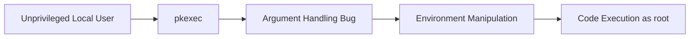

# Pwnkit (CVE-2021-4034)

## Summary

* **CVE-2021-4034**, commonly called **Pwnkit**, is a **local privilege escalation (LPE)** flaw in `pkexec`, the SUID helper shipped with **polkit**.
* The bug existed for years in `pkexec` argument handling and allowed an unprivileged local user to escalate to **root** on many Linux systems where polkit was installed by default.
* The practical risk was severe because the vulnerable binary was broadly present across mainstream Linux distributions, while exploitation was comparatively simple for a local attacker.
* This was **not a remote exploit**. The attacker needed local code execution or shell access first.
* The correct defensive response is **vendor patching first**. If patched packages are temporarily unavailable, a common hotfix is removing the **SUID bit** from `pkexec` until the package can be updated.
* For public notes, the useful focus is **root cause, impact, validation, and remediation**, not copy-paste exploitation steps.



---

## 1. What Pwnkit Is

`pkexec` is part of **polkit** (formerly PolicyKit), a Linux authorization framework used to let unprivileged processes request privileged actions under policy control.

The Pwnkit vulnerability lives in **`pkexec`**, not in Linux privilege logic in general.

High-level properties:

| Property | Value |
| --- | --- |
| CVE | CVE-2021-4034 |
| Common name | Pwnkit |
| Component | `pkexec` in polkit |
| Attack type | Local privilege escalation |
| Impact | Unprivileged local user may obtain root |
| Remote exploitation | No |

---

## 2. Why It Was So Serious

Three factors made Pwnkit unusually dangerous:

1. **Breadth** - polkit was widely installed by default.
2. **Privilege level** - successful exploitation yielded **root**.
3. **Exploitability** - the issue was straightforward enough that public PoCs appeared quickly after disclosure.

This is the classic high-severity Linux LPE profile: not internet-facing by itself, but extremely valuable once an attacker already has a foothold.

---

## 3. Root Cause, Simplified

The vulnerable `pkexec` versions handled command-line arguments incorrectly.

At a high level:

* `pkexec` expected command arguments to be present
* under a crafted edge case, its internal argument indexing became unsafe
* that unsafe state enabled an **out-of-bounds write**
* the write affected process environment handling
* the attacker could abuse this to regain dangerous environment influence in a SUID-root context
* the result was **code execution as root**

The most important conceptual point is this:

> Pwnkit is fundamentally an **argument-handling / environment-manipulation flaw inside a SUID-root helper**.

You do not need the full exploit chain memorised to understand the security lesson.

---

## 4. Security Lessons

### 4.1 SUID helpers are high-risk code

Any bug inside a SUID-root binary is immediately high-impact because it executes with elevated privilege.

### 4.2 Local only does not mean low risk

In real intrusions, local privilege escalation is often the step that converts a weak foothold into full host compromise.

### 4.3 Environment handling remains dangerous

Security-sensitive binaries must treat argument parsing and process environment interaction as critical attack surfaces.

---

## 5. Public-Safe Lab Summary

This room demonstrates the vulnerability in a controlled environment and shows how quickly a local user can move from a low-privilege shell to **root** on a vulnerable target.

For a public writeup, the right abstraction is:

* vulnerable system contains affected `pkexec`
* local user runs a proof-of-concept in a lab
* privilege escalates to `root`
* the lab flag is then readable from `/root/flag.txt`

### Task answers

| Question | Answer |
| --- | --- |
| Is Pwnkit exploitable remotely? | **Nay** |
| In which Polkit utility does the vulnerability reside? | **pkexec** |
| Flag | **THM{CONGRATULATIONS-YOU-EXPLOITED-PWNKIT}** |

---

## 6. Remediation

### 6.1 Preferred fix

Use your distribution's patched **polkit** package from the vendor repository.

This is the real fix.

### 6.2 Temporary hotfix

If patched packages are not immediately available, a common emergency mitigation is to remove the **SUID bit** from `pkexec`.

Example:

```bash
sudo chmod 0755 "$(which pkexec)"
```

This is operationally useful as a temporary containment step, but it is not a substitute for patching.

### 6.3 Validation idea

After remediation, test only through safe validation methods appropriate for your environment. The goal is to confirm that the vulnerable path is no longer reachable, not to leave ad hoc exploit material lying around production systems.

---

## 7. Detection and Operational Considerations

Pwnkit-style exploitation may or may not leave obvious traces depending on the variant used.

Operationally useful checks include:

* inventorying systems with polkit / `pkexec`
* validating installed package versions against vendor advisories
* confirming SUID permissions on `pkexec`
* reviewing local privilege-escalation telemetry and suspicious root-shell activity
* restricting unnecessary local access paths that make LPE chaining easier

---

## 8. Pattern Cards

### Pattern Card 1 - Wide Default Footprint

**Failure mode**
A privileged helper is installed nearly everywhere by default.

**Lesson**
Default presence multiplies incident scope even before exploitation details are public.

### Pattern Card 2 - Local Foothold Becomes Root

**Failure mode**
A seemingly limited local shell becomes full administrative control.

**Lesson**
LPE vulnerabilities should be treated as breach-amplifiers, not secondary bugs.

### Pattern Card 3 - Temporary Mitigation vs Real Fix

**Failure mode**
Teams apply a hotfix and forget the package upgrade.

**Lesson**
Operational workarounds buy time; vendor patching closes the issue.

---

## 9. Defensive Takeaways

* Prioritise **vendor patching** for SUID-root vulnerabilities.
* Treat local privilege escalation as a serious production risk, especially on shared or multi-user systems.
* Maintain inventory of privileged binaries and review default package attack surface.
* Have a repeatable process for temporary containment when patches lag behind disclosure.
* Public security notes are more valuable when they explain **why the bug matters** and **how to remediate it**, instead of reproducing every exploit step.

---

## 10. CN-EN Glossary

| English | 中文 |
| --- | --- |
| Local Privilege Escalation (LPE) | 本地提权 |
| SUID | 设置用户 ID 位 / SUID 位 |
| pkexec | polkit 的提权执行工具 |
| polkit / PolicyKit | Linux 授权框架 |
| Out-of-bounds Write | 越界写 |
| Environment Variable | 环境变量 |
| Root | 超级用户 / root 权限 |
| Hotfix | 临时修复 |
| Remediation | 修复措施 |
| Validation | 修复验证 |

---

## 11. Further Reading

* Qualys security advisory for CVE-2021-4034
* NVD entry for CVE-2021-4034
* distribution-specific security advisories from Ubuntu, Red Hat, Debian, and others
