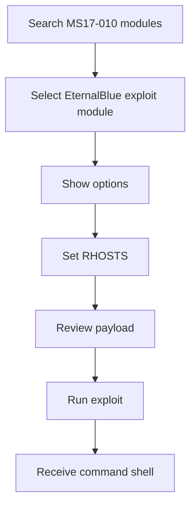
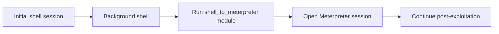
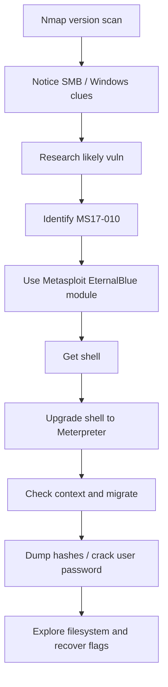

# Blue

## Summary

* This room is a classic beginner Windows exploitation lab built around **MS17-010 / EternalBlue** and is mainly about understanding a simple workflow: **scan -> identify SMB exposure -> select the right Metasploit module -> upgrade the shell -> collect evidence**.
* The room is less about deep exploitation theory and more about operational discipline. The real lesson is that small pieces of enumeration data can strongly narrow the attack path.
* The initial Nmap scan is enough to point you toward **Windows 7 + SMB-related exposure**, which is the critical clue that leads to MS17-010.
* Metasploit is used in two phases here: first to gain a shell with the EternalBlue exploit, then to **upgrade that shell to Meterpreter** for richer post-exploitation actions.
* The post-exploitation phase demonstrates three very common ideas: **privilege/context checking, process migration, and hash extraction**.
* This room is a good example of why "find the exploit" is only one part of the workflow. Reliable execution, session recovery, and evidence extraction matter just as much.

---

## 1. Context

`Blue` is one of the most widely reused Windows training rooms because it centers on **EternalBlue**, the exploit associated with **MS17-010**, which became famous in real-world incidents and is still heavily used in labs for teaching SMB exploitation workflow.

A useful way to understand the room is:

* **Task 1** teaches you to recognize a promising target from scan output.
* **Task 2** teaches basic exploit-module usage in Metasploit.
* **Task 3** teaches shell upgrading and Meterpreter transition.
* **Task 4** teaches credential/hash extraction.
* **Task 5** teaches simple host exploration and flag retrieval.

So the room is really a **Windows post-exploitation lab wrapped around a famous SMB vulnerability**.

---

## 2. Reconnaissance

### 2.1 Initial Scan Logic

The first meaningful action in the room is a version scan with Nmap.

Typical pattern:

```text
nmap -sV TARGET_IP
```

Why `-sV` matters:

* it adds service/version detection,
* it helps distinguish generic open ports from high-value vulnerable services,
* it gives enough context to begin vulnerability research.

### 2.2 What The Scan Is Trying To Tell You

The important analyst behavior is not "memorize the answer." It is:

1. identify the unusual or high-value exposed service,
2. match it to the platform context,
3. research likely issues.

The room's scan output effectively points you toward:

* Windows target behavior,
* SMB exposure,
* a well-known historical vulnerability family.

### 2.3 Why Port 445 Matters

Port **445/TCP** is strongly associated with SMB traffic on modern Windows systems. In training environments, exposed SMB on older or intentionally vulnerable Windows systems is often your highest-value lead.

#### Practical Lesson

```text
Not every open port matters equally.
Look for the service that best explains the machine's likely attack path.
```

---

## 3. Vulnerability Identification

### 3.1 From Scan Result To Vulnerability Guess

The room teaches a beginner-friendly research workflow:

* take the service/version clue,
* search trusted exploit/vulnerability references,
* narrow based on platform and service,
* identify the likely matching issue.

In this room, that leads to:

* **MS17-010**
* commonly associated training name: **EternalBlue**

### 3.2 Why This Matters

This is a useful habit because real exploitation work is usually not:

* "see port, immediately exploit."

It is:

* "see service, form a hypothesis, verify, then choose the correct module."

That is much more stable and much less noisy.

---

## 4. Exploitation Workflow With Metasploit

### 4.1 Core Exploit Path

The room uses Metasploit to search for the relevant MS17-010 exploit module and set the required target value.

High-level sequence:



### 4.2 Important Operational Note

The room deliberately has you switch payloads in one step to a simpler shell instead of leaving the default Meterpreter payload in place.

That is useful because it later creates a reason to learn:

* shell handling,
* backgrounding,
* shell-to-Meterpreter upgrade.

So the room is using the exploit chain to teach **session evolution**, not just code execution.

---

## 5. Shell To Meterpreter Upgrade

After the initial shell is obtained, the room uses the **`post/multi/manage/shell_to_meterpreter`** module to upgrade the command shell into a Meterpreter session.

That matters because Meterpreter gives you:

* better session control,
* post-exploitation convenience,
* migration support,
* hash-related actions,
* better filesystem/process interaction.

### 5.1 Why The Upgrade Matters

A plain shell is often enough to prove access.

A Meterpreter session is much better for:

* stable post-exploitation workflow,
* richer commands,
* easier operator ergonomics.

#### Upgrade Model



### 5.2 Good Workflow Lesson

The room implicitly teaches a very important idea:

```text
Access is not the end state.
Access is the beginning of better access.
```

---

## 6. Meterpreter Post-Exploitation

Once the Meterpreter session is opened, the room pivots into post-exploitation basics.

### 6.1 Identity Check

Typical first step:

* confirm your security context.

Why it matters:

* you should know whether you are a low-privilege user, Administrator, or SYSTEM-equivalent context before deciding what to do next.

### 6.2 Process Listing And Migration

The room has you enumerate processes and migrate into another process.

Why migration matters:

* better stability,
* different privilege context,
* improved post-exploitation behavior in some cases,
* operational control over where the session lives.

#### Migration Principle

```text
A Meterpreter session always lives in a process context.
Choosing a better process can improve the session.
```

### 6.3 Session Fragility Lesson

This room also demonstrates a real truth of exploitation labs: sessions can die, exploits can behave inconsistently, and module execution is not always smooth.

That is not a bug in your learning. That is part of learning exploitation tooling.

A strong operator skill is knowing how to:

* background a session,
* relaunch a module,
* restart a target when necessary,
* recover gracefully instead of panicking.

---

## 7. Hash Extraction And Password Recovery

### 7.1 Why This Phase Matters

This is where the room shifts from exploitation to credential access.

The core action is:

* extract hash material,
* identify the non-default user,
* recover the plaintext password via cracking.

### 7.2 Conceptual Lesson

This matters because a compromise often becomes much more serious when you can pivot from:

* code execution

to:

* credential capture,
* account compromise,
* lateral movement potential.

### 7.3 Practical Caution

Hash formats and extraction workflows are OS-specific.

In this room, the key takeaway is not memorizing one exact output format. It is learning that:

* Windows post-exploitation frequently involves hash extraction,
* those hashes can then be tested or cracked offline.

---

## 8. Flag Hunting As Filesystem Practice

The last phase of the room uses flags to force simple Windows host exploration.

That includes:

* moving around the filesystem,
* understanding likely sensitive locations,
* recognizing where Windows stores important security-related data,
* using file search and file-reading logic cleanly.

### 8.1 Why This Is Useful

CTF-style flags are artificial, but the underlying skills are not.

In real post-exploitation, you still need to know how to:

* navigate Windows paths,
* distinguish files from directories,
* locate evidence or secrets,
* recover session state after instability.

---

## 9. Workflow Diagram



This is the room condensed into one attack chain.

---

## 10. Pattern Cards

### Pattern Card 1 - Enumeration Narrows The Exploit Space

**Problem**
: beginners want to exploit before they understand the service landscape.

**Better view**
: let the version scan shrink the problem first.

**Reason**
: a good scan often eliminates most of the wrong directions.

### Pattern Card 2 - Port 445 On Legacy Windows Is A High-Value Lead

**Problem**
: all open ports are treated equally.

**Better view**
: some services are historically far more operationally important.

**Reason**
: SMB exposure on older Windows targets is often worth immediate attention.

### Pattern Card 3 - A Shell Is Not The Final Form

**Problem**
: initial command execution is treated as the finish line.

**Better view**
: upgrade to a richer session when possible.

**Reason**
: Meterpreter gives much better post-exploitation control.

### Pattern Card 4 - Sessions Are Fragile, And That Is Normal

**Problem**
: users think a dropped session means they did everything wrong.

**Better view**
: unstable sessions are common in exploit labs.

**Reason**
: learning recovery and rerun workflow is part of exploitation practice.

### Pattern Card 5 - Credential Material Changes The Impact Level

**Problem**
: exploitation is seen as the whole objective.

**Better view**
: extracted hashes and recovered passwords change what the compromise means.

**Reason**
: credentials unlock persistence, impersonation, and lateral movement paths.

---

## 11. Command Cookbook

> Lab-safe examples only. Replace values with your own room-specific placeholders.

### Initial Version Scan

```text
nmap -sV TARGET_IP
```

### Search Metasploit For MS17-010-Related Modules

```text
search ms17
```

### Use The Relevant EternalBlue Exploit Module

```text
use MODULE_NAME
show options
set RHOSTS TARGET_IP
run
```

### Background A Shell / Session

```text
Ctrl+Z
sessions
```

### Upgrade A Shell To Meterpreter

```text
search shell_to_meterpreter
use post/multi/manage/shell_to_meterpreter
set SESSION SESSION_ID
run
```

### Interact With A Meterpreter Session

```text
sessions -i SESSION_ID
getuid
ps
migrate TARGET_PID
```

### Extract Hashes

```text
hashdump
```

### Search For A File By Name

```text
search -f flag*.txt
```

### Filesystem Navigation Reminders

```text
cd PATH
pwd
ls
cat FILE.txt
```

---

## 12. Common Pitfalls

### 12.1 Treating The First Exploit Run As Guaranteed

EternalBlue-style training modules can be temperamental. Re-running or resetting the target is sometimes necessary.

### 12.2 Confusing Files And Directories On Windows

You cannot `cd` into a file. This sounds trivial, but it causes real confusion in beginner labs.

### 12.3 Forgetting To Background A Working Shell Before Upgrading It

If you lose the shell without upgrading or recording the session properly, you create unnecessary extra work.

### 12.4 Migrating Into A Poor Process Choice

Migration is useful, but not every process is a good target.

### 12.5 Copying The Wrong Half Of Credential Output

Hash material often contains multiple parts. Know which part is actually relevant for the intended follow-on step.

---

## 13. Defensive Takeaways

This room is old in technique but still useful in defensive thinking.

The blue-team lessons are:

* unpatched legacy SMB exposure is dangerous,
* Windows service/version exposure can rapidly collapse into known-exploit paths,
* SYSTEM-level post-exploitation gives the attacker enormous freedom,
* credential extraction turns host compromise into identity compromise,
* segmentation, patching, SMB hardening, and aggressive legacy protocol reduction matter.

This is why EternalBlue became historically important: not because the exploit name was dramatic, but because the operational consequences were severe.

---

## 14. Takeaways

* `Blue` is a classic teaching room because it connects a famous Windows SMB vulnerability to a full beginner exploitation workflow.
* The most important lesson is not "run EternalBlue." It is "use reconnaissance to justify the exploit path."
* Meterpreter upgrade is a core learning milestone because it teaches that initial shells are often only temporary stepping stones.
* Post-exploitation basics in Windows include process context, migration, hash extraction, and filesystem exploration.
* Exploit instability is part of the learning experience, not a sign that the whole methodology is wrong.

---

## 15. CN-EN Glossary

* EternalBlue - EternalBlue SMB 利用漏洞名
* MS17-010 - 微软 SMB 安全更新编号 / 漏洞家族标识
* SMB - Server Message Block，Windows 文件共享协议
* Port 445 - SMB 常见端口
* Version Detection - 版本探测
* Meterpreter - Metasploit 高级后渗透会话
* Session - 会话
* Shell Upgrade - shell 升级
* Process Migration - 进程迁移
* Hash Dump - 哈希导出
* Credential Material - 凭据材料
* SYSTEM - Windows 高权限上下文
* File Search - 文件搜索
* Post-Exploitation - 后渗透

---

## 16. References

* TryHackMe room content: *Blue*
* Microsoft documentation for MS17-010 / SMBv1 remote code execution bulletin
* Nmap documentation for `-sV` service/version detection
* Rapid7 documentation for Metasploit EternalBlue module and `shell_to_meterpreter`
