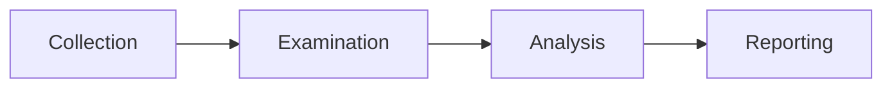
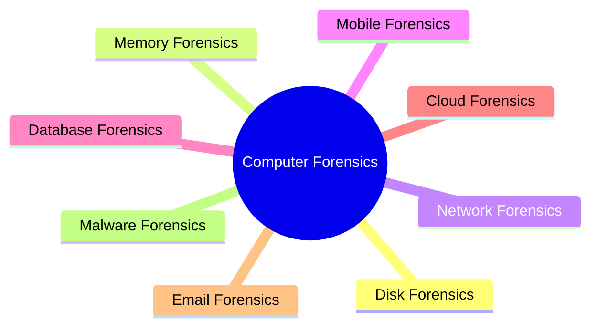

# Digital Forensics Fundamentals

## Summary

* Digital forensics is the branch of forensics focused on collecting, preserving, examining, and analyzing evidence from digital devices.
* A standard high-level workflow is **Collection -> Examination -> Analysis -> Reporting**.
* Evidence handling quality matters as much as technical analysis. Without authorization, chain of custody, and write protection, evidence may become unreliable or inadmissible.
* In Windows investigations, two major acquisition targets are **disk images** and **memory images**. Disk is non-volatile; memory is volatile and must be captured first when live-state evidence matters.
* Common Windows forensics tools include **FTK Imager**, **Autopsy**, **DumpIt**, and **Volatility**.
* Metadata analysis is often high-yield. In the room example, PDF metadata revealed the author, while EXIF metadata revealed camera model and location clues.

## 1. What Digital Forensics Actually Does

Digital forensics applies structured investigative methods to digital systems after a cybercrime, fraud case, insider incident, or other security event. The goal is not only to "find files", but to build a **defensible timeline** and extract evidence that can support technical, operational, or legal conclusions.

Typical evidence sources include:

* laptops and desktops
* mobile phones
* USB drives and external disks
* cloud storage
* email systems
* databases
* network traffic captures

A useful mental model is this:

```text
Digital forensics = preserve reality first, interpret reality second.
```

If preservation fails, later analysis loses trust value.

## 2. Core Methodology

The room uses the standard four-phase model:



### 2.1 Collection

This phase identifies and acquires potential evidence sources.

Key questions:

* What devices exist?
* Which data is volatile?
* What must be preserved immediately?
* What legal or procedural authorization is required?

Examples:

* seize a laptop, phone, USB, and hard drive from a suspect location
* capture RAM before shutting down a live system
* photograph the device state before touching it

### 2.2 Examination

This phase reduces the data set to the subset worth deeper investigation.

Examples:

* filter files by date range
* isolate one user profile from a multi-user system
* extract browser history, documents, or media files
* recover deleted files for review

This is basically **evidence triage**.

### 2.3 Analysis

This is where findings are correlated into meaning.

Examples:

* connect file timestamps with chat messages
* align browser activity with USB insertion events
* map GPS metadata to physical movement
* reconstruct a likely sequence of actions

Examination answers: *what data is relevant?*
Analysis answers: *what likely happened?*

### 2.4 Reporting

The report documents:

* methodology
* evidence sources
* findings
* interpretations
* limitations
* recommendations

A good forensics report must be reproducible, structured, and audience-aware.

## 3. Major Types of Digital Forensics



### 3.1 Computer Forensics

Focuses on endpoints such as desktops and laptops.

### 3.2 Mobile Forensics

Focuses on phones and tablets. Typical artefacts include:

* SMS / call logs
* app data
* GPS history
* media metadata

### 3.3 Network Forensics

Focuses on packet captures, flow data, IDS/IPS alerts, and traffic timelines.

### 3.4 Database Forensics

Focuses on unauthorized access, modification, or exfiltration within database systems.

### 3.5 Cloud Forensics

Focuses on cloud-hosted systems, logs, storage artefacts, and control-plane events.

### 3.6 Email Forensics

Focuses on message headers, delivery paths, phishing indicators, and mailbox activity.

## 4. Evidence Acquisition Principles

### 4.1 Proper Authorization

Evidence collection must be legally and procedurally authorized. Otherwise, evidence may be challenged or rejected.

### 4.2 Chain of Custody

Chain of custody is the audit trail of the evidence lifecycle.

A good chain-of-custody record should include:

* evidence description
* who collected it
* when it was collected
* where it is stored
* who accessed it and when

This matters because forensic value is partly a **trust problem**, not only a technical one.

### 4.3 Write Blockers

A write blocker prevents accidental modification of source evidence during acquisition.

Why this matters:

* timestamps can change
* system background processes may write to mounted media
* the defense can question whether evidence was altered

Rule of thumb:

```text
Never analyze original evidence directly if a protected acquisition path exists.
```

## 5. Windows Forensics Essentials

### 5.1 Disk Image vs Memory Image

| Image Type | Contains | Volatility | Typical Value |
| --- | --- | ---: | --- |
| Disk image | Files, documents, browser history, deleted content, installed software | Non-volatile | Long-term artefacts |
| Memory image | Running processes, active network connections, loaded modules, live credentials/artifacts | Volatile | Live-state evidence |

### 5.2 Priority Logic

If the system is live and volatile evidence matters, **capture memory first**.
A reboot or shutdown can permanently destroy RAM-resident artefacts.

### 5.3 Common Tools

#### FTK Imager

Used for disk acquisition and basic image review.

#### Autopsy

Open-source forensic platform for disk image analysis.

Typical use cases:

* keyword search
* deleted file recovery
* metadata review
* extension mismatch detection
* timeline-oriented review

#### DumpIt

Used to acquire Windows memory images from the command line.

#### Volatility

Open-source memory forensics framework used to analyze RAM captures.

Typical goals:

* list processes
* inspect DLLs/modules
* extract network connections
* identify injected code or suspicious artefacts

## 6. Practical Metadata Example From The Room

The room's mini-case is useful because it shows how **small metadata fields can become investigative leads**.

### 6.1 PDF Metadata With `pdfinfo`

Example goal:

* inspect document metadata
* identify author / creator / production tool / timestamps

Observed key result from the room artefact:

* **Author:** `Ann Gree Shepherd`

This is a reminder that exporting a document to PDF does not necessarily remove authoring metadata.

### 6.2 Image Metadata With `exiftool`

Example goal:

* inspect EXIF metadata from the attached JPG
* identify device model, dates, and possible geolocation

Observed key results from the room artefact:

* **Camera model:** `Canon EOS R6`
* **Street/location clue:** `Milk St`
* **Embedded user comment / flag example:** present in EXIF output

### 6.3 Why Metadata Matters

Metadata often gives:

* author names
* software used
* camera model
* capture time
* GPS coordinates
* editing timeline clues

That is low-cost, high-yield analysis.

## 7. Practical Workflow For A Beginner

A sane beginner workflow looks like this:

```text
1. Confirm authorization and scope.
2. Identify all evidence sources.
3. Preserve originals and document custody.
4. Acquire volatile data first when needed.
5. Create protected disk/memory images.
6. Triage with examination tools.
7. Correlate artefacts into a timeline.
8. Write a defensible report.
```

## 8. Common Mistakes

### 8.1 Treating Analysis Like Random File Browsing

Forensics is not "open folders and hope". It is hypothesis-driven evidence work.

### 8.2 Forgetting Volatility

Live RAM evidence disappears quickly.

### 8.3 Touching Original Evidence Carelessly

That can contaminate timestamps and weaken trust.

### 8.4 Ignoring Documentation

If you cannot explain where the data came from and who handled it, the result is weaker.

### 8.5 Over-Interpreting Weak Artefacts

One artefact rarely proves the whole story. Correlation matters.

## 9. Exam / Interview-Useful Distinctions

### Collection vs Examination vs Analysis

* **Collection:** acquire evidence
* **Examination:** filter and extract relevant material
* **Analysis:** interpret and correlate evidence

### Disk vs Memory

* **Disk:** persistent storage
* **Memory:** volatile live-state evidence

### Write Blocker vs Chain of Custody

* **Write blocker:** protects source media from modification
* **Chain of custody:** documents evidence handling and ownership trail

## 10. Takeaways

* Digital forensics is as much about **procedure integrity** as technical skill.
* The NIST-style four-phase model is the baseline mental framework.
* Disk and memory images answer different questions; neither fully replaces the other.
* Metadata analysis is often a fast first win.
* Reports are the final product. If your reporting is weak, your investigation is weakened.

## 11. Related Tools

* FTK Imager
* Autopsy
* DumpIt
* Volatility
* `pdfinfo`
* `exiftool`

## 12. Further Reading

* NIST SP 800-86
* Autopsy official documentation
* Volatility documentation
* ExifTool documentation

## 13. CN-EN Glossary

* Digital Forensics - 数字取证
* Collection - 收集 / 取证采集
* Examination - 检验 / 初步筛查
* Analysis - 分析研判
* Reporting - 报告撰写
* Chain of Custody - 证据保全链 / 证据交接链
* Write Blocker - 写保护器
* Disk Image - 磁盘镜像
* Memory Image - 内存镜像
* Volatile Data - 易失性数据
* Metadata - 元数据
* EXIF - 图像交换文件格式元数据
* Timeline Reconstruction - 时间线重建
* Artefact - 取证 artefact / 痕迹物
