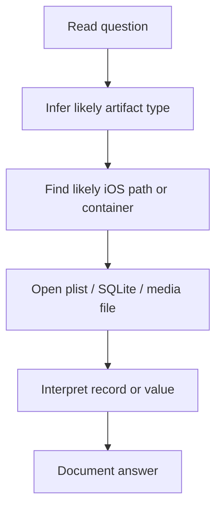
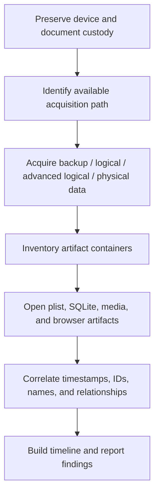

# iOS Forensics

## Summary

* iOS forensics is the practice of acquiring, examining, and interpreting digital evidence from Apple mobile devices in a manner that preserves evidentiary value.
* The room's main teaching arc is: **what digital forensics is -> why mobile forensics is difficult -> how iOS data is stored -> how acquisition choices shape what evidence you can actually recover**.
* A core lesson is that **method matters as much as artifacts**. The same phone can yield very different evidence depending on whether you have direct access, a paired computer, a logical backup, or specialized acquisition tooling.
* In iOS examinations, two artifact families repeatedly matter: **property lists (`.plist`)** and **SQLite databases**.
* The room also reinforces a standard forensic mindset: evidence is not just "what exists," but also "what was altered, removed, encrypted, or intentionally hidden."
* The practical scenario is not about advanced exploitation. It is about **structured artifact hunting** inside a realistic iPhone backup / file-system style dataset.

---

## 1. Context

This room sits at the intersection of:

* digital forensics,
* mobile device security,
* evidentiary handling,
* artifact analysis.

Unlike many beginner security rooms, the focus here is not on attacking a target, but on reconstructing user behavior and relationships from stored device data.

That means your core questions change from:

* "How do I get in?"

to:

* "What was stored?"
* "What can be proven?"
* "How was the data acquired?"
* "Would this evidence survive scrutiny?"

---

## 2. What Digital Forensics Is

Digital forensics is the preservation, acquisition, examination, analysis, and reporting of data from digital systems for investigative purposes.

A useful simplification:

```text
Traditional forensics studies physical traces.
Digital forensics studies computational traces.
```

Examples of digital traces:

* files,
* logs,
* databases,
* metadata,
* pairing records,
* timestamps,
* cached content,
* browser artifacts,
* app data,
* deleted/partial remnants.

### Important mindset

"Nothing there" can itself be evidence.

For example:

* an unexpectedly blank drive,
* wiped records,
* reset counters,
* missing expected artifacts,
* encryption without the expected operational context.

Absence is not always innocence. Sometimes absence is a clue.

---

## 3. Why Mobile Forensics Matters

Phones are unusually dense evidence containers because they compress many parts of a person's life into one device:

* calls,
* SMS,
* contacts,
* photos,
* app usage,
* calendars,
* browser history,
* location-adjacent artifacts,
* network connections,
* credentials,
* cloud relationships.

That makes mobile devices extremely valuable in:

* criminal investigations,
* incident response,
* insider threat cases,
* fraud investigations,
* workplace misconduct inquiries,
* civil disputes.

### Core reality

A phone is not just a communications device. It is a behavioral timeline generator.

---

## 4. Problems Facing Digital Forensic Analysts

### 4.1 Scale

Forensics is often slow because the analyst is trying to find a very small number of meaningful facts inside a very large amount of data.

Common problem:

* **too much storage, too many artifacts, too many timestamps**.

### 4.2 Storage and imaging cost

A forensic image is a storage problem before it becomes an analysis problem.

If you acquire 10 TB of data, you need room to store:

* the working image,
* backups,
* analysis output,
* case documentation.

### 4.3 Encryption

Modern device encryption is one of the most important practical barriers in mobile forensics.

If the device is strongly encrypted and you lack the right access state, keys, or acquisition path, available evidence may shrink dramatically.

### 4.4 Cost of tooling

Advanced mobile acquisition frequently depends on specialized hardware/software ecosystems that are expensive and often targeted at enterprise or law-enforcement buyers.

### 4.5 Interpretation burden

Data alone is not the answer.

The analyst must build:

* context,
* sequencing,
* attribution logic,
* reportable findings.

This is why forensics is as much analytical writing as it is technical extraction.

---

## 5. iOS File Systems

Apple historically used **HFS+**, then moved modern platforms to **APFS**.

### 5.1 HFS+

Legacy Apple file system.

Useful historical note:

* older Apple devices and platforms used HFS+ / Mac OS Extended.

### 5.2 APFS

Modern Apple file system.

High-level properties relevant to this room:

* designed for modern storage,
* supports strong encryption,
* uses copy-on-write behavior,
* supports cloning and more efficient space usage.

### Why analysts care

APFS changes what storage "looks like" and how copied or referenced data may appear conceptually.

A simple learning point from the room:

```text
A copied file does not always imply a full duplicate block-for-block rewrite in the naive sense.
```

That matters when reasoning about storage artifacts and volume efficiency.

---

## 6. Modern iOS Security and Forensic Friction

Apple's device security model creates meaningful obstacles for acquisition.

Relevant controls include:

* passcodes,
* biometric gates,
* encryption,
* trust relationships between device and computer,
* restricted accessory / data access behavior.

### Important consequence

Forensics is often less about "opening a file" and more about:

* getting the device into the right state,
* leveraging an existing trust relationship,
* using a backup path,
* or using specialized acquisition tooling.

### Practical tension

Security that protects normal users also reduces what forensic analysts can recover without cooperation, pairing state, or specialized tools.

---

## 7. Data Acquisition Models

This is one of the most important sections in the room.

### 7.1 Direct acquisition

Use the device directly when you can legitimately access it.

Typical helpful conditions:

* no passcode,
* known passcode,
* valid trust / pairing relationship.

#### Risk

If your workflow writes to the device or alters state in uncontrolled ways, evidentiary value can be challenged.

### 7.2 Logical / backup acquisition

Use a trusted/compliant path to collect backed-up device data.

Benefits:

* cheaper,
* often more accessible,
* useful when paired systems or backups already exist.

Limitations:

* you may not get everything,
* what you get depends on backup type and device state.

### 7.3 Advanced logical acquisition

Use elevated trust / pairing state or tool-assisted methods to access more of the file-system-level content than a simple user-facing backup would expose.

### 7.4 Physical acquisition

Take a much deeper image-like extraction of the device contents where tooling and platform state permit it.

#### Important reality

"Physical" does not mean "easy." On modern encrypted mobile platforms, physical-style acquisition can still be gated by security state, boot conditions, key access, and specialized tooling.

---

## 8. Chain of Custody and Admissibility

A recurring professional lesson in forensics:

```text
Good evidence badly handled becomes weak evidence.
```

Chain of custody exists to document:

* who handled the device,
* when it was acquired,
* how it was stored,
* what was done to it,
* what tool or method was used,
* whether integrity can be defended later.

This matters because evidence may be challenged on grounds such as:

* contamination,
* undocumented handling,
* device modification,
* uncertain acquisition method,
* broken custody trail.

So the analyst's job is not just technical recovery. It is defensible recovery.

---

## 9. Trust Relationships, Backups, and Lockdown Logic

One of the room's most useful operational ideas is the importance of **trusted computers**.

When an iPhone trusts a computer, that relationship can enable backup/access behavior that would otherwise not be available.

### Why this matters in forensics

A suspect's paired computer may become an important evidence source because it can contain:

* backup data,
* pairing records,
* cached relationship artifacts,
* indirect access paths into the phone's data.

### Forensic implication

Sometimes the shortest path to iPhone evidence is not "beat the iPhone."

Sometimes it is:

```text
analyze the already-trusted computer
```

That is a much better investigative mindset than fixating on the phone alone.

---

## 10. Two Major iOS Artifact Families

### 10.1 Property Lists (`.plist`)

Property lists are Apple serialization files used to store structured data.

They may appear as:

* XML-readable content,
* binary plist data,
* configuration-style records,
* counters,
* app preferences,
* timestamps,
* state information.

### Practical lesson

Not every plist is directly readable in a text editor. Some require:

* hex inspection,
* plist-aware conversion,
* or better tooling.

### Example room idea

A seemingly small plist can reveal things like:

* reset counters,
* time zone configuration,
* preference changes,
* app behavior state.

### 10.2 SQLite Databases

Many iOS artifacts are stored in SQLite databases.

Typical data classes include:

* SMS / messages,
* contacts,
* mail metadata,
* calendars,
* bookmarks,
* app state.

### Why SQLite matters

SQLite is investigator-friendly once identified, because you can inspect:

* tables,
* schemas,
* rows,
* timestamps,
* IDs,
* relationships across tables.

In mobile forensics, SQLite databases are often where the narrative starts becoming explicit.

---

## 11. Artifact Hunting Workflow in the Room

The practical scenario teaches a repeatable pattern:



This is the actual skill transfer.

The room is quietly training you to ask:

* Is this likely a database artifact?
* Is this likely stored in a plist?
* Is this a media artifact?
* Is this mail, contacts, Safari, or SMS?

That style of thinking scales to real cases.

---

## 12. Lab Notes - Operation Just In Case

The scenario positions you as an analyst reviewing a logical-style iPhone data set using a recently valid trust relationship / backup path.

The investigation revolves around locating evidence across different artifact families.

### 12.1 SMS / messaging artifact

Use a messages-related SQLite database to answer communication questions such as:

* who received the message,
* what the message said,
* when it was sent.

### 12.2 Address book artifact

Use the contacts / address-book database to identify:

* names,
* linked organizations,
* phone/contact relationships.

### 12.3 Safari / browsing artifact

Browser-related artifacts may include:

* bookmarks,
* history,
* cookies,
* web storage.

The key lesson is not memorizing one filename. The key lesson is understanding that Safari evidence may be split across multiple containers.

### 12.4 Mail artifact

Mail metadata is often preserved in mail-related databases or index structures.

### 12.5 Photos / media artifact

Images may reveal:

* entities,
* logos,
* environments,
* EXIF-adjacent clues,
* timeline relationships.

### 12.6 Cookies / browser residue

Cookies can preserve:

* session clues,
* service identifiers,
* user behavior artifacts.

---

## 13. Pattern Cards

### Pattern Card 1 - The paired computer may matter as much as the phone

**Problem**
: analysts fixate on defeating the device directly.

**Better view**
: the trusted backup source may be easier and evidentially richer.

**Reason**
: pairing and backup relationships can unlock higher-value acquisition paths.

### Pattern Card 2 - Small files can answer big questions

**Problem**
: a `.plist` looks unimportant.

**Better view**
: state/configuration artifacts often explain user behavior or device condition.

**Reason**
: metadata is often more revealing than content.

### Pattern Card 3 - SQLite is narrative storage

**Problem**
: a database file looks opaque at first glance.

**Better view**
: once tables are mapped, the user's activity becomes much more legible.

**Reason**
: messages, contacts, and mail are usually structured records, not random blobs.

### Pattern Card 4 - Acquisition method defines evidence ceiling

**Problem**
: beginners assume all extractions are equivalent.

**Better view**
: direct, logical, advanced logical, and physical acquisition yield different evidence sets.

**Reason**
: access state and security controls constrain what can be collected.

### Pattern Card 5 - Forensics is as much about integrity as discovery

**Problem**
: finding the data is treated as the only objective.

**Better view**
: preserving admissibility and documenting process is part of the job.

**Reason**
: evidence that cannot be defended may not be operationally useful.

---

## 14. Common Pitfalls

### 14.1 Confusing "backup exists" with "everything exists in the backup"

Different backup/acquisition paths expose different artifact sets.

### 14.2 Assuming every plist is readable as plain text

Some are XML-readable; some are binary or require conversion/inspection.

### 14.3 Looking for all browser evidence in one file

Browser artifacts are often fragmented across bookmarks, cookies, history, and other stores.

### 14.4 Ignoring the paired computer

A trusted workstation can be the investigative shortcut.

### 14.5 Forgetting evidentiary hygiene

A convenient access method is not always a defensible one if it writes to the device or is poorly documented.

---

## 15. Mini Practical Workflow



That is the room's operational core.

---

## 16. Takeaways

* iOS forensics is driven by **acquisition constraints** as much as by artifact analysis.
* The most important practical distinction is often not "what tool do I use?" but "what access state do I have?"
* `.plist` files and SQLite databases are foundational artifact types in iOS analysis.
* Trust relationships and prior backups can radically change what is recoverable.
* A paired computer is often part of the evidence system, not just the phone.
* Chain of custody and method documentation matter because forensic work must be defensible, not merely technically interesting.

---

## 17. CN-EN Glossary

* Digital Forensics - 数字取证
* DFIR - 数字取证与事件响应
* Forensic Image - 取证镜像
* Bit-for-bit copy - 位对位复制
* Chain of Custody - 证据保管链 / 保全链
* Admissibility - 可采性 / 证据可采性
* Logical Acquisition - 逻辑提取
* Physical Acquisition - 物理提取
* Direct Acquisition - 直接提取
* Advanced Logical Acquisition - 高级逻辑提取
* Pairing / Trusted Computer - 配对 / 受信任电脑
* Lockdown Record / Pairing Record - 锁定记录 / 配对记录
* Property List (`.plist`) - 属性列表文件
* Binary Plist - 二进制 plist
* SQLite Database - SQLite 数据库
* APFS - Apple 文件系统
* HFS+ - 分层文件系统增强版
* Artifact - 取证痕迹 / 工件
* Browser Artifact - 浏览器痕迹
* Mail Metadata - 邮件元数据
* Reset Counter - 重置计数器

---

## 18. Further Reading

* Mobile device forensic process and evidence handling guidance
* Apple filesystem and plist format references
* SQLite basics for artifact parsing
* iOS backup / pairing behavior and trusted computer workflows

---

## 19. References

* TryHackMe room content: *iOS Forensics*
* NIST mobile device forensics guidance
* Apple developer documentation for APFS and property lists
* SQLite official documentation
* Cellebrite product overview materials
