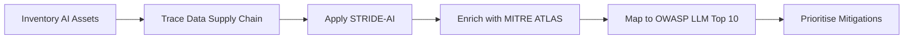
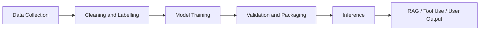

# AI Threat Modelling

## Summary

* AI systems introduce **new assets** that do not fit cleanly into classic application threat models: training data, model weights, embeddings, system prompts, feature stores, and model registries.
* The **AI data supply chain** is a first-class security problem. Risk begins before deployment, at data collection and labelling, and persists through training, validation, packaging, and inference.
* **STRIDE still works**, but only after adaptation. In AI contexts, the same category may manifest differently, for example Tampering becomes data poisoning, and Elevation of Privilege becomes jailbreaking plus excessive agency.
* **MITRE ATLAS** adds the attacker's technique layer. It translates broad threat categories into named AI attack methods such as `AML.T0020 Data Poisoning`, `AML.T0024 Model Extraction`, and `AML.T0051 LLM Prompt Injection`.
* **OWASP LLM Top 10 (2025)** is the best architecture-facing lens in this room. It tells defenders where a risk lives: inference endpoint, RAG pipeline, vector store, training pipeline, model registry, or tool layer.
* In a MegaCorp-like environment, the highest-value defensive work is usually concentrated around the **LLM inference endpoint**, **RAG/vector pipeline**, **training pipeline**, and **tool integrations**.

---

## 1. Key Concepts

### 1.1 AI-Specific Assets

| Asset | Security Meaning | Why Defenders Should Care |
| --- | --- | --- |
| Training Data | The data that teaches model behaviour | Poisoning at this layer alters the model upstream and may only surface after retraining |
| Model Weights / Parameters | The learned numerical state of the model | Theft equals loss of the model itself, not just metadata |
| Embedding Vectors | Numeric representations used for similarity and retrieval | Manipulation changes what context the model sees at query time |
| System Prompts | Behavioural instructions, constraints, and hidden logic | Leakage gives attackers a map of guardrails and internal rules |
| Feature Stores | Preprocessed inputs used during inference | Tampering here changes model perception without changing the model |
| Model Registry / Artifacts | Stored deployable model versions | Registry compromise enables silent model swap or backdoored deployment |

### 1.2 Why AI Systems Are Operationally Different

* **Non-deterministic behaviour**: identical prompts may produce different outputs. Reproduction, regression testing, and incident review become harder.
* **Black-box behaviour**: many ML systems are hard to interpret internally. Defenders often audit via observable input-output behaviour rather than logic traces.
* **Long-latency failure**: poisoning can be introduced today and only become visible after retraining next month.
* **Behavioural attack surface**: attackers are not only targeting code and infrastructure; they are shaping model behaviour itself.

### 1.3 The AI Data Supply Chain

| Stage | What Happens | Main Security Concern |
| --- | --- | --- |
| Data Collection | Raw data is gathered from internal, public, or third-party sources | Poisoning, source spoofing, untrusted upstream data |
| Cleaning & Labelling | Data is filtered, normalised, and labelled | Mislabelled or maliciously curated training signals |
| Model Training | Patterns are learned and baked into weights | Poison survives and becomes embedded model behaviour |
| Validation & Packaging | Models are tested, versioned, and stored | Backdoored model swap, weak provenance, registry compromise |
| Inference | Model serves predictions or answers in production | Prompt injection, denial of wallet, output abuse, RAG poisoning |

### 1.4 Why Plain STRIDE Has Gaps in AI

Classic STRIDE assumes code, credentials, services, and databases. AI systems add softer, delayed, and behaviour-centric compromise paths.

Main gaps:

* **Training data poisoning** is not ordinary tampering. Its effects are delayed, diffuse, and hard to detect.
* **Adversarial inputs** often span categories at once: Tampering, Spoofing, and Elevation of Privilege.
* **Privilege** expands in agentic systems. A compromised model with tools may query databases, send emails, or execute actions.
* **Model theft** is technically information disclosure, but economically it is closer to intellectual property exfiltration at model scale.

---

## 2. STRIDE Reinterpreted for AI

| STRIDE | AI Manifestation | Typical Example | Main Control Direction |
| --- | --- | --- | --- |
| Spoofing | Data source impersonation | Malicious content injected into RAG knowledge base | Source trust, content signing, ingestion validation |
| Tampering | Data poisoning / feature manipulation / prompt injection | Crafted transactions shift fraud model boundaries | Provenance, anomaly detection, retraining controls |
| Repudiation | Lack of decision audit trail | Cannot explain why a transaction was approved | Input-output logging, model versioning, retrieval logs |
| Information Disclosure | Model extraction / prompt leakage / memorised data leakage | Competitor builds a shadow model via API queries | Query controls, rate limits, output minimisation |
| Denial of Service | Inference cost exploitation / denial of wallet | Expensive prompt floods spike cloud bill | Quotas, rate limits, token caps, cost guards |
| Elevation of Privilege | Jailbreaking / excessive agency / tool abuse | LLM bypasses restrictions and uses internal tools | Tool scoping, policy enforcement, isolation layers |

### Core Interpretation

* **Spoofing** in AI frequently targets what the model trusts, not just who logs in.
* **Tampering** often aims to reshape learning or inference context rather than edit a file directly.
* **Repudiation** becomes a logging and explainability problem.
* **Information Disclosure** includes prompts, embeddings, and learned behaviour.
* **DoS** may leave service technically online while still causing major business harm through spend.
* **Elevation of Privilege** becomes especially dangerous once models gain tools and autonomy.

---

## 3. MITRE ATLAS as the Enrichment Layer

### 3.1 What ATLAS Adds

ATLAS gives defenders a structured AI adversary vocabulary similar to ATT&CK, but focused on ML/AI systems.

| Layer | Question Answered |
| --- | --- |
| Tactic | Why the adversary is acting |
| Technique | How the adversary performs the action |
| Sub-technique | Which specific variant is used |
| Mitigation | What reduces likelihood or impact |

### 3.2 High-Value Techniques from This Room

| Technique | ID | Why It Matters |
| --- | --- | --- |
| Data Poisoning | AML.T0020 | Corrupts model behaviour through training data manipulation |
| Backdoor ML Model | AML.T0018 | Hidden triggers cause malicious behaviour on selected inputs |
| Model Extraction | AML.T0024 | Reconstructs a model via API interaction |
| Infer Training Data Membership | AML.T0025 | Tests whether specific records were present in training |
| Evade ML Model | AML.T0015 | Adversarial input avoids detection or causes misclassification |
| LLM Prompt Injection | AML.T0051 | Alters model behaviour via direct or indirect instructions |

### 3.3 Practical Use

Recommended sequence:

1. Use **STRIDE-AI** to identify threat category.
2. Use **ATLAS** to assign named techniques and IDs.
3. Use **OWASP** to decide where in the architecture the risk is concentrated.
4. Write mitigations as engineering tasks, not abstract concerns.

---

## 4. OWASP LLM Top 10 as the Component Map

### 4.1 Key Insight

OWASP LLM Top 10 is most useful when read from **component to risk**, not just from **risk to definition**.

| Component | Highest-Value OWASP Risks |
| --- | --- |
| LLM Inference Endpoint | LLM01, LLM02, LLM05, LLM06, LLM07, LLM09, LLM10 |
| Vector Database / RAG Pipeline | LLM01, LLM08, LLM09 |
| Training Pipeline | LLM02, LLM03, LLM04 |
| Model Registry | LLM03, LLM04 |
| Tool / Plugin Layer | LLM03, LLM06 |
| Frontend / Output Consumer | LLM05, LLM09 |

### 4.2 Defender Reading Pattern

* Ask **"What risks does this component inherit?"**
* Then ask **"Which one matters most operationally?"**
* Then ask **"What control should be placed at this exact boundary?"**

That sequence is more useful than memorising a static list.

---

## 5. MegaCorp Threat Assessment

### 5.1 System A - Customer-Facing Chatbot with RAG

| Area | Main Risks | Priority |
| --- | --- | --- |
| Inference Endpoint | Prompt injection, system prompt leakage, misinformation, denial of wallet | High |
| RAG Pipeline / Vector Store | Indirect prompt injection, embedding weaknesses, stale knowledge | High |
| Tool Use | Excessive agency if the chatbot can query internal systems | Critical if tools are broad |

**What matters most**

* RAG trust boundary
* hidden prompt and policy secrecy
* tool scoping
* output filtering before user display or downstream execution

**Immediate controls**

* content validation at ingestion
* retrieval source allow-listing and metadata trust levels
* prompt boundary separation
* strict per-tool least privilege
* token, request, and cost caps

### 5.2 System B - Internal Recommendation Engine

| Area | Main Risks | Priority |
| --- | --- | --- |
| API Surface | Model extraction, training data inference, sensitive scoring leakage | High |
| Training Data | Data poisoning, bias reinforcement, integrity drift | High |
| Feature Pipeline | Feature tampering and silent degradation | Medium-High |

**What matters most**

* Avoid exposing too much confidence detail.
* Watch for abnormal query patterns indicating shadow-model building.
* Treat user and product features as security-sensitive, not just data-science artifacts.

**Immediate controls**

* Query rate limits and behavioural analytics
* reduced response fidelity where appropriate
* data provenance tracking
* drift monitoring and feature validation

### 5.3 System C - Fraud Detection Model

| Area | Main Risks | Priority |
| --- | --- | --- |
| Training Pipeline | Poisoning via crafted transactions over time | Critical |
| Decision Logging | Weak auditability for approvals/denials | High |
| Model Versioning | Ambiguity around which model made a decision | High |

**What matters most**

* Long-term poisoning resistance
* decision reproducibility
* monitoring for silent degradation rather than only uptime failures

**Immediate controls**

* provenance checks on labelled data
* statistical anomaly detection on retraining inputs
* version-pinned decision logs
* threshold and feature trace capture for contested decisions

---

## 6. Pattern Cards

### Pattern Card 1 - Indirect Prompt Injection via RAG

**Context**
A model retrieves external or indexed content and treats it as context.

**Attack path**
Attacker poisons documents, embeddings, or indexed text with hidden instructions.

**Likely outcome**
Model follows attacker-controlled instructions, leaks data, or bypasses policy.

**Mappings**

* STRIDE: Spoofing / Tampering / Elevation of Privilege
* ATLAS: `AML.T0051 LLM Prompt Injection`
* OWASP: `LLM01 Prompt Injection`, sometimes `LLM06 Excessive Agency`

**Defender controls**

* validate and classify trusted/untrusted sources
* separate retrieved content from instruction space
* scan ingested documents for prompt-like directives
* restrict tool use even after prompt compromise

### Pattern Card 2 - Training Data Poisoning

**Context**
The model is retrained on periodic operational data.

**Attack path**
Attacker injects crafted samples or labels over time.

**Likely outcome**
Decision boundaries drift in attacker-favouring ways.

**Mappings**

* STRIDE: Tampering
* ATLAS: `AML.T0020 Data Poisoning`, sometimes `AML.T0018 Backdoor ML Model`
* OWASP: `LLM04 Data and Model Poisoning`, `LLM03 Supply Chain`

**Defender controls**

* provenance and integrity checks on training sources
* label quality review and anomaly detection
* retraining drift comparison against trusted baselines
* canary evaluation sets for trigger-like behaviour

### Pattern Card 3 - Model Extraction / Shadow Model Building

**Context**
The model is reachable via API.

**Attack path**
Attacker systematically queries inputs and records outputs or confidence signals.

**Likely outcome**
Competitor or attacker reconstructs a functionally similar model.

**Mappings**

* STRIDE: Information Disclosure
* ATLAS: `AML.T0024 Model Extraction`, `AML.T0025 Infer Training Data Membership`
* OWASP: usually overlaps with `LLM02 Sensitive Information Disclosure`

**Defender controls**

* rate limits and usage throttling
* limit confidence output granularity
* abuse detection on query patterns
* legal and contractual controls for external access

### Pattern Card 4 - Denial of Wallet

**Context**
Inference is expensive and billed by token, prompt length, or compute time.

**Attack path**
Attacker sends long or deliberately costly requests at scale.

**Likely outcome**
Severe cost spike without full outage.

**Mappings**

* STRIDE: Denial of Service
* ATLAS: technique choice varies by delivery pattern
* OWASP: `LLM10 Unbounded Consumption`

**Defender controls**

* per-user quotas and rate limits
* output length caps
* budget alarms and cost anomaly detection
* tiered inference pathways for risky or untrusted users

### Pattern Card 5 - Excessive Agency / Tool Abuse

**Context**
The model can call tools such as databases, email, code execution, or APIs.

**Attack path**
Attacker jailbreaks the model or manipulates tool-calling behaviour.

**Likely outcome**
The model acts far outside intended scope.

**Mappings**

* STRIDE: Elevation of Privilege
* ATLAS: often chained with prompt injection and service misuse techniques
* OWASP: `LLM06 Excessive Agency`

**Defender controls**

* least privilege for every tool
* per-tool policy gates and argument validation
* human approval for high-impact actions
* separate execution identity from conversational identity

---

## 7. Structured Assessment Workflow for Real Environments

### 7.1 Minimal Repeatable Method

1. **Identify AI assets**
   Inventory data, weights, prompts, embeddings, models, and tool permissions.
2. **Map the data supply chain**
   Mark every ingestion, transformation, training, packaging, and inference boundary.
3. **Run STRIDE-AI per component**
   Ask what could go wrong at each stage and component.
4. **Enrich with ATLAS**
   Attach technique IDs and named adversary methods.
5. **Overlay OWASP**
   Decide which component carries each risk and where hardening belongs.
6. **Prioritise**
   Rank by business impact, attacker effort, exploitability, and detectability gap.
7. **Write engineering actions**
   Translate findings into logging, access control, validation, monitoring, and architecture changes.

### 7.2 What Good Output Looks Like

A useful AI threat model should answer:

* What are the AI-specific assets?
* Where can data, models, or prompts be influenced?
* Which components are risk-dense?
* Which ATT&CK-like techniques are relevant?
* Which controls should be deployed first?
* Which gaps are governance problems rather than pure engineering problems?

---

## 8. Task Answers

| Question | Answer |
| --- | --- |
| In a RAG-based system, which asset retrieves relevant context at query time? | **Embedding vectors** |
| If the production model is swapped in the registry, which asset is compromised? | **Model registry / model artifacts** |
| Crafted malicious data injected over months enters at which supply-chain stage? | **Data collection** |
| Which STRIDE category is insufficient for the delayed, diffuse effects of poisoning? | **Tampering** |
| What is the primary AI-specific manifestation of Information Disclosure? | **Model extraction / model stealing** |
| Safety-guideline bypass through crafted prompts maps to which STRIDE category? | **Elevation of Privilege** |
| Which OWASP LLM Top 10 entry covers too many permissions or autonomy? | **LLM06: Excessive Agency** |
| What is the name for a cost-spike attack without full outage? | **Denial of wallet** |
| What does ATLAS stand for? | **Adversarial Threat Landscape for Artificial-Intelligence Systems** |
| Which case study showed a self-replicating prompt injection worm in RAG email systems? | **Morris II Worm** |
| What is the ATLAS technique ID for Model Extraction? | **AML.T0024** |
| How many OWASP entries affect the LLM inference endpoint? | **7** |
| Unsanitised LLM output rendered in the browser falls under which OWASP risk? | **LLM05: Improper Output Handling** |
| Which component should be hardened first against LLM03 supply-chain risk? | **Training pipeline** |

---

## 9. Takeaways

* AI threat modelling is **system security + data lineage + behaviour control**.
* Inventory is the first hard problem. Many teams still do not treat prompts, embeddings, and model artifacts as sensitive assets.
* The strongest practical workflow in this room is:
  **STRIDE-AI for category -> ATLAS for technique -> OWASP for component prioritisation**.
* In production AI environments, the most dangerous failures are often **silent**: poisoning, drift, leakage, and tool misuse.
* A model that is accurate but unauditable is still a security and governance problem.

---

## 10. CN-EN Glossary

| English | 中文 |
| --- | --- |
| Threat Modelling | 威胁建模 |
| Training Data | 训练数据 |
| Model Weights | 模型权重 |
| Embedding Vectors | 嵌入向量 |
| System Prompt | 系统提示词 / 系统指令 |
| Feature Store | 特征存储 |
| Model Registry | 模型注册表 |
| Data Poisoning | 数据投毒 |
| Model Extraction | 模型窃取 / 模型提取 |
| Prompt Injection | 提示注入 |
| Jailbreaking | 越狱 / 护栏绕过 |
| Excessive Agency | 过度代理能力 / 权限过大 |
| Denial of Wallet | 钱包型拒绝服务 / 成本耗尽 |
| RAG | 检索增强生成 |
| Inference Endpoint | 推理端点 |
| Audit Trail | 审计轨迹 |
| Drift Monitoring | 漂移监控 |
| Data Provenance | 数据来源追踪 |

---

## 11. Further Reading

* MITRE ATLAS
* OWASP GenAI Security Project / OWASP LLM Top 10
* STRIDE threat modelling methodology
* AI red-teaming and model governance guidance
* Supply-chain security practices for ML systems
