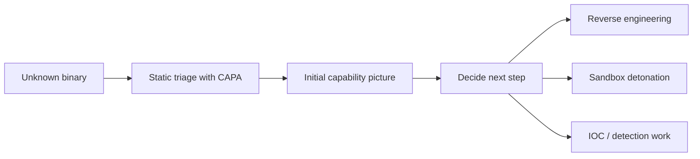

# CAPA: The Basics

## Summary

* **CAPA** is a static-analysis-focused malware triage tool that identifies what a binary is capable of doing by matching rules against program features.
* It is especially useful when you want a **quick capability-oriented view** of a suspicious file without doing full manual reverse engineering first.
* CAPA supports common artifact types such as:
  * PE
  * ELF
  * .NET modules
  * shellcode
  * sandbox reports
* The room uses `cryptbot.bin` as the sample and shows how to interpret CAPA results through five major views:
  * general file information
  * MITRE ATT&CK mapping
  * MAEC values
  * MBC behaviors
  * Capability + Namespace breakdown
* The room also introduces **CAPA Web Explorer**, which is much easier than reading large verbose terminal output directly.
* Core practical value:
  * triage suspected malware faster
  * map behavior to ATT&CK / MBC
  * understand persistence, anti-VM checks, encoding, process creation, and other likely behaviors

---

## 1. What CAPA Actually Is

CAPA is a rule-driven capability analysis tool.

Its main question is not:

> "What exact malware family is this?"

Its first useful question is:

> "What can this program do?"

That is a much better triage question.

For example, even before full reverse engineering, CAPA may tell you that a binary can:

* create processes
* read or write files
* communicate over HTTP
* allocate RWX memory
* establish persistence with scheduled tasks
* look for virtual machine artifacts

That is operationally valuable because incident response usually begins with capability triage, not beautiful reverse engineering.

### Why CAPA Matters

```text
Manual reversing is deep but slow.
CAPA is shallow-to-mid depth but fast.
```

That makes it a very strong first-pass static analysis tool.

---

## 2. Static Analysis vs Dynamic Analysis

The room starts with the correct framing:

* **Dynamic analysis** = run the sample and observe behavior.
* **Static analysis** = inspect the sample without executing it.

### Why This Room Focuses On Static Analysis

Because running suspicious software is risky unless you already have:

* a sandbox
* strong isolation
* safe revert capability
* proper monitoring

Static analysis reduces execution risk and is often the right first step.

### Practical Interpretation



---

## 3. Core Workflow In The Room

The room workflow is simple:

1. run CAPA against `cryptbot.bin`
2. inspect the default output
3. use `-v` and `-vv` for more detail
4. use `-j` to export JSON
5. load the verbose JSON into **CAPA Web Explorer**
6. inspect specific rules, namespaces, and matched conditions

This is the right workflow for real use too.

### Good Analyst Habit

Do **not** stop at the default output.

Default output tells you *what* was found.

Verbose and web-explorer views help you understand *why* CAPA found it.

---

## 4. Basic Command-Line Usage

### 4.1 Run CAPA Normally

```powershell
capa.exe .\cryptbot.bin
```

This gives the standard high-level report.

### 4.2 Show Help

```powershell
capa -h
```

Answer: the shortest help option is `-h`.

### 4.3 Verbose Output

```powershell
capa.exe .\cryptbot.bin -v
```

Answer: the shortest option for detailed information is `-v`.

### 4.4 Very Verbose Output

```powershell
capa.exe .\cryptbot.bin -vv
```

Answer: the shortest option for very verbose information is `-vv`.

### 4.5 Read Saved Output In PowerShell

```powershell
Get-Content .\cryptbot.txt
```

Answer: the PowerShell command used to read file content is `Get-Content`.

### 4.6 Export JSON For Web Exploration

```powershell
capa.exe -j -vv .\cryptbot.bin > cryptbot_vv.json
```

Answer: the option that outputs JSON is `-j`.

---

## 5. General Information Block

The first output block contains the basic file metadata.

For `cryptbot.bin`, the room gives:

* MD5
* SHA1
* SHA256
* analysis type
* OS
* format
* architecture
* path

### Important Interpretation Fields

#### `analysis`

Shows whether CAPA performed:

* static analysis
* or dynamic report analysis

In this room:

* `analysis = static`

#### `os`

Operating system context.

In this room:

* `windows`

#### `format`

Executable format.

In this room:

* `pe`

#### `arch`

Architecture.

In this room:

* `i386`

Answer: the SHA256 of `cryptbot.bin` is `ae7bc6b6f6ecb206a7b957e4bb86e0d11845c5b2d9f7a00a482bef63b567ce4c`.

---

## 6. MITRE ATT&CK In CAPA Output

CAPA maps some capabilities to ATT&CK tactics and techniques.

That is useful because it translates low-level static features into a standard detection / threat-model language.

### ATT&CK Structure Reminder

```text
Tactic = why the adversary is doing something
Technique = how they are doing it
Sub-technique = more specific variant
```

### Example From The Room

* `DEFENSE EVASION`
* `Obfuscated Files or Information [T1027]`
* `Obfuscated Files or Information::Indicator Removal from Tools [T1027.005]`
* `Virtualization/Sandbox Evasion::System Checks [T1497.001]`

Answers:

* Technique identifier of **Obfuscated Files or Information**: `T1027`
* Sub-technique identifier of **Indicator Removal from Tools**: `005`

### Why This Matters

This mapping helps with:

* defensive communication
* ATT&CK coverage mapping
* threat hunting alignment
* reporting consistency

---

## 7. MAEC In CAPA Output

MAEC here is used as a concise malware characterization label.

The room highlights two especially important values:

* **launcher**
* **downloader**

### 7.1 Launcher

Indicates behavior such as:

* dropping payloads
* enabling persistence
* executing additional actions
* initiating other malware-like stages

Answer: if the file demonstrates behavior such as **activating persistence mechanisms**, the MAEC value is `launcher`.

### 7.2 Downloader

Indicates behavior such as:

* fetching additional payloads
* retrieving resources or configuration
* downloading later stages

Answer: if the file demonstrates behavior such as **fetching additional payloads or resources from the internet**, the MAEC value is `downloader`.

### Practical Note

These labels are not a full malware family attribution.

They are high-level behavior characterization.

---

## 8. MBC - Malware Behavior Catalog

This is where the room becomes much more useful conceptually.

MBC is not just another random label block. It is a standardized language for malware behavior.

### The Room's Key Conceptual Model

```text
Objective -> Behavior -> Method -> Identifier
```

Example:

```text
ANTI-STATIC ANALYSIS::Executable Code Obfuscation::Argument Obfuscation [B0032.020]
```

### Interpretation

* Objective = broad malware goal context
* Behavior = what it does
* Method = how specifically it does it
* Identifier = reference tag

### 8.1 Objectives

Examples from the room include:

* ANTI-BEHAVIORAL ANALYSIS
* ANTI-STATIC ANALYSIS
* COMMUNICATION
* DATA
* DISCOVERY
* EXECUTION
* IMPACT
* PERSISTENCE

Answers:

* What serves as a catalogue of malware objectives and behaviours: `Malware Behavior Catalogue`
* Which field is based on ATT&CK tactics in the context of malware behaviour: `Objective`

### 8.2 Important MBC Values From The Room

#### `Virtual Machine Detection [B0009]`

This tells you the binary looks for signs of virtualized environments.

Answer: the behavior with identifier `B0009` is `Virtual Machine Detection`.

#### `Create Process [C0017]`

Process creation is not always malicious, but inside malware triage it is highly relevant.

Answer: the identifier of **Create Process** micro-behavior is `C0017`.

#### `Encode Data`

The room maps Base64 and XOR here.

Answer: the related micro-behavior for obfuscating data with Base64 and XOR is `Encode Data`.

#### `HTTP Communication`

Answer: the micro-behavior referring to "Malware is capable of initiating HTTP communications" is `HTTP Communication`.

---

## 9. Namespace Model In CAPA

This is one of the best parts of CAPA.

Namespaces group capabilities by purpose.

### Format

```text
Capability :: Top-Level Namespace / Namespace
```

Example:

```text
reference anti-VM strings :: anti-analysis/anti-vm/vm-detection
```

### Why Namespaces Matter

They let you organize findings by intent.

Instead of reading a flat list of random capabilities, you can think in behavioral clusters like:

* anti-analysis
* communication
* persistence
* impact
* load-code
* host-interaction

### 9.1 Important TLNs From The Room

* `anti-analysis`
* `collection`
* `communication`
* `compiler`
* `data-manipulation`
* `executable`
* `host-interaction`
* `impact`
* `internal`
* `lib`
* `linking`
* `load-code`
* `malware-family`
* `nursery`
* `persistence`
* `runtime`
* `targeting`

### 9.2 High-Value Room Answers

* TLN containing rules for obfuscation, packing, anti-debugging, and other analysis-evasion behavior: `anti-analysis`
* Namespace containing rules to detect virtual machine environments: `anti-vm/vm-detection`
* TLN focused on maintaining access or persistence: `persistence`
* Namespace addressing string encryption, code obfuscation, packing, and anti-debugging tricks: `obfuscation`
* TLN that is a staging ground for not-yet-polished rules: `nursery`

---

## 10. Capability Block

The Capability column is where CAPA becomes immediately readable.

These are human-readable statements of what the sample appears able to do.

Examples from the room's `cryptbot.bin` output:

* reference anti-VM strings
* reference anti-VM strings targeting VMWare
* reference anti-VM strings targeting VirtualBox
* contain obfuscated stackstrings
* reference HTTP User-Agent string
* check HTTP status code
* reference Base64 string
* encode data using XOR
* create directory
* delete file
* read file on Windows
* write file on Windows
* create process on Windows
* allocate or change RWX memory
* reference cryptocurrency strings
* run PowerShell expression
* schedule task via at
* schedule task via schtasks

### Critical Observation

Capability names usually match rule names in YAML form, with spaces becoming dashes.

Example:

```text
check HTTP status code
-> check-http-status-code.yml
```

Answers:

* Rule YAML file matched for **check HTTP status code**: `check-http-status-code.yml`
* Capability name if the rule YAML file is `reference-anti-vm-strings.yml`: `reference anti-VM strings`
* TLN that includes **run PowerShell expression**: `load-code`

---

## 11. Very Verbose Output And Why It Matters

The room's strongest operational lesson is this:

Default output is not enough when you need to trust and explain a result.

Using `-vv` shows **what exact evidence** matched.

That means:

* matched strings
* matched API references
* matched logical conditions
* addresses or functions where the evidence occurred

### This Is The Key Shift

```text
Normal output = summary
Very verbose output = justification
```

That is what makes CAPA defensible in real analysis.

---

## 12. CAPA Web Explorer

The room then moves to the best practical UI for large verbose results.

### 12.1 Workflow

1. run CAPA with `-j -vv`
2. generate `cryptbot_vv.json`
3. upload it into **CAPA Web Explorer**
4. inspect matched rules interactively

Answers:

* Tool that lets you interactively explore CAPA results in a browser: `CAPA Web Explorer`
* Feature that allows you to filter options or results: `Global Search Box`

### 12.2 Why This Matters

Because reading thousands of lines in raw text is inefficient.

The web explorer gives you:

* searchable rules
* namespace browsing
* clickable expansions
* function-level evidence
* better reasoning visibility

---

## 13. Screenshot-Based Observations From The Room

Your screenshots are useful because they show how CAPA evidence is actually displayed in the explorer.

### 13.1 Anti-VM Strings Targeting VMware

The expanded rule shows a regex condition like:

```text
regex: /VMWare/i
```

That means CAPA matched evidence of VMware-related anti-VM checking.

#### Anti-VM Interpretation

This does **not** automatically mean the file is malware.

But in malicious software, VM checks are a strong anti-analysis signal.

### 13.2 Scheduled Task Via `schtasks`

The screenshot shows logic resembling:

* match process creation
* regex `/schtasks/i`
* regex `/\/create /i`

#### `schtasks` Interpretation

This suggests the sample may attempt persistence through Windows scheduled tasks using `schtasks.exe` and `/create`.

That is a classic persistence indicator.

### 13.3 Scheduled Task Via `at`

The screenshot also shows a separate rule:

* `schedule task via at`

#### `at` Interpretation

This is another persistence path, older but still relevant in capability mapping.

---

## 14. The Rule-Reading Mindset

A big lesson from this room is that CAPA should not be treated as a magic answer generator.

It is better treated as:

```text
rule-based evidence compression
```

Meaning:

* it compresses years of RE knowledge
* but you still need analyst judgment

### Correct Habit

When CAPA says:

* anti-VM
* PowerShell
* scheduled tasks
* XOR
* RWX memory

ask:

1. what exact evidence matched?
2. is that evidence sufficient?
3. how do these capabilities combine into an attack story?

---

## 15. Pattern Cards

### Pattern Card 1 - CAPA Answers "What Can It Do?" First

**Problem**
: beginners expect malware-family attribution immediately.

**Better view**
: start from capability triage.

**Reason**
: capability is often more actionable than family naming in early analysis.

### Pattern Card 2 - ATT&CK And MBC Are Not Duplicates

**Problem**
: learners confuse ATT&CK, MBC, and MAEC as the same label set.

**Better view**
: ATT&CK maps adversary tradecraft, MBC maps malware behaviors, MAEC gives broader malware characterization.

**Reason**
: they answer related but different analytic questions.

### Pattern Card 3 - Namespace Gives Structure To Chaos

**Problem**
: the capability list feels flat.

**Better view**
: read by TLN and namespace clusters.

**Reason**
: grouping reveals intent faster than line-by-line reading.

### Pattern Card 4 - `-vv` Is Where Trust Begins

**Problem**
: analysts quote CAPA output without checking evidence.

**Better view**
: use `-vv` or the web explorer to validate matches.

**Reason**
: evidence-backed interpretation is more defensible.

### Pattern Card 5 - One Capability Is Weak, Combinations Are Strong

**Problem**
: a single indicator gets overinterpreted.

**Better view**
: combine persistence + anti-analysis + encoding + process creation + network capability.

**Reason**
: malware intent is usually inferred from clusters, not isolated facts.

---

## 16. Command Cookbook

> Lab-oriented only. Analyze malware samples only in authorized, isolated environments.

### Show Help

```powershell
capa -h
```

### Standard Run

```powershell
capa.exe .\cryptbot.bin
```

### Verbose Run

```powershell
capa.exe .\cryptbot.bin -v
```

### Very Verbose Run

```powershell
capa.exe .\cryptbot.bin -vv
```

### Read Saved Output

```powershell
Get-Content .\cryptbot.txt
```

### Generate JSON For Web Explorer

```powershell
capa.exe -j -vv .\cryptbot.bin > cryptbot_vv.json
```

### Read Verbose Text Output

```powershell
Get-Content .\cryptbot_vv.txt
```

### Read Generated JSON Carefully If Needed

```powershell
Get-Content .\cryptbot_vv.json
```

---

## 17. Important Room Answers - Fast Review

### Task 2

* help option: `-h`
* detailed info: `-v`
* very verbose info: `-vv`
* PowerShell file read: `Get-Content`

### Task 3

* sha256: `ae7bc6b6f6ecb206a7b957e4bb86e0d11845c5b2d9f7a00a482bef63b567ce4c`
* technique ID: `T1027`
* sub-technique ID: `005`
* MAEC persistence-style value: `launcher`
* MAEC internet-fetching value: `downloader`

### Task 4

* catalogue of malware objectives and behaviours: `Malware Behavior Catalogue`
* ATT&CK-based field in malware context: `Objective`
* Create Process identifier: `C0017`
* `B0009`: `Virtual Machine Detection`
* Base64/XOR related micro-behavior: `Encode Data`
* HTTP initiation micro-behavior: `HTTP Communication`

### Task 5

* TLN for anti-analysis behavior: `anti-analysis`
* VM environment namespace: `anti-vm/vm-detection`
* TLN for persistence: `persistence`
* namespace for obfuscation tricks: `obfuscation`
* staging TLN: `nursery`

### Task 6

* YAML for check HTTP status code: `check-http-status-code.yml`
* capability for `reference-anti-vm-strings.yml`: `reference anti-VM strings`
* TLN for run PowerShell expression: `load-code`
* API ending in `Ex` looked for in the sandbox-via-registry rule: `RegOpenKeyEx`

### Task 7

* JSON output option: `-j`
* browser exploration tool: `CAPA Web Explorer`
* filtering/search feature: `Global Search Box`

---

## 18. Common Pitfalls

### 18.1 Treating CAPA As Full Reverse Engineering

It is not.

It is accelerated capability inference.

### 18.2 Treating Every Matched Rule As Malicious Proof

Not every capability is inherently malicious.

* process creation
* HTTP communication
* file access

can all be benign depending on context.

### 18.3 Ignoring The Evidence View

The default output is a headline. The evidence is the actual argument.

### 18.4 Forgetting That CAPA Supports More Than PE Files

The room focuses on PE / Windows, but CAPA is broader than that.

### 18.5 Confusing Namespace With ATT&CK Tactic

Namespace is CAPA's internal grouping model. ATT&CK is an external adversary-behavior framework.

---

## 19. Takeaways

* CAPA is one of the best first-pass static triage tools for malware capability analysis.
* Its biggest strength is **rule-driven behavioral explanation without full manual reversing**.
* MITRE ATT&CK, MAEC, MBC, Namespace, and Capability are not redundant blocks; they each add different interpretive value.
* `-vv` plus **CAPA Web Explorer** is where CAPA becomes truly analyst-friendly.
* The strongest analytic habit is to move from:
  * capability list
  * to namespace grouping
  * to exact rule evidence
  * to a coherent behavioral story

---

## 20. CN-EN Glossary

* CAPA - 恶意样本能力识别工具
* Static Analysis - 静态分析
* Dynamic Analysis - 动态分析
* Capability - 能力 / 功能特征
* Namespace - 命名空间
* Top-Level Namespace (TLN) - 顶级命名空间
* Rule YAML File - YAML 规则文件
* ATT&CK Tactic - ATT&CK 战术
* ATT&CK Technique - ATT&CK 技术
* ATT&CK Sub-technique - ATT&CK 子技术
* MAEC - Malware Attribute Enumeration and Characterization, 恶意软件属性枚举与刻画
* MBC - Malware Behavior Catalogue, 恶意软件行为目录
* Objective - 目标维度
* Behavior - 行为
* Micro-Behavior - 微行为 / 低层行为
* Method - 方法 / 子技术化细节
* Obfuscation - 混淆
* Anti-VM - 反虚拟机检测
* Persistence - 持久化
* Scheduled Task - 计划任务
* Process Creation - 进程创建
* RWX Memory - 可读可写可执行内存
* Explorer Web - 浏览器交互式查看界面
