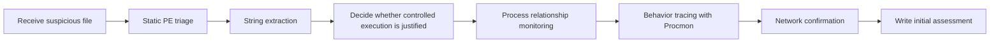

# FlareVM: Arsenal of Tools

## Summary

FlareVM is a Windows-based reverse-engineering and malware-analysis environment that bundles a large number of investigation tools into one workstation. Instead of building a Windows lab tool by tool, the analyst starts from a pre-equipped VM and focuses on evidence.

This note turns the room content into a practical analyst-oriented reference. The goal is not to memorize every tool in FlareVM, but to understand how to choose the right tool for the right question.

Core ideas in this note:

* what FlareVM is and why it matters
* how to group tools by investigative purpose
* how to build an initial triage workflow for suspicious Windows binaries
* how to combine PEStudio, FLOSS, Process Explorer, Procmon, CFF Explorer, HxD, and Wireshark in one case

---

## Why FlareVM Matters

A Windows malware case usually creates two kinds of friction:

* **tooling friction**: analysts waste time installing debuggers, PE viewers, Sysinternals tools, and supporting utilities
* **workflow friction**: analysts know isolated tools but not how to chain them into a coherent investigation

FlareVM primarily solves the first problem and partially solves the second.

### First-Principles View

```text
Good malware triage = environment + tooling + process discipline + interpretation
```

FlareVM gives you the environment and much of the tooling.

You still need:

* process discipline
* hypothesis-driven investigation
* evidence correlation
* clean reporting

---

## What FlareVM Is Good For

### Main Use Cases

* reverse engineering setup on Windows
* malware triage and static analysis
* process and execution monitoring
* PE structure inspection
* string extraction
* network-behavior observation
* basic forensic and IR support

### What It Is Not

FlareVM is not a single magic detector. It is a curated toolkit. It improves analyst speed, not analyst judgment.

---

## Tool Selection by Question

A better way to learn FlareVM is not by alphabetical tool lists, but by analyst questions.

| Analyst question | Best starting tool |
| --- | --- |
| What kind of executable is this? | PEStudio / CFF Explorer / DIE |
| Is it packed, suspicious, or unusual? | PEStudio / DIE |
| What strings can I recover? | FLOSS |
| What process spawned this binary? | Process Explorer |
| What files, registry keys, or sockets did it touch? | Procmon |
| What does the PE structure look like? | CFF Explorer / PEview |
| Is there obvious network traffic? | Wireshark / Procmon / Process Explorer |
| Does the file really begin like a PE? | HxD |

---

## Core Tool Categories

### 1. Reverse Engineering and Debugging

These tools are for deeper code-centric work.

#### Reverse Engineering Examples

* Ghidra
* x64dbg
* OllyDbg
* Radare2
* Binary Ninja
* PEiD

#### When to Use

* disassembly
* control-flow tracing
* breakpoints and runtime debugging
* unpacking or deeper malware logic reconstruction

#### Beginner Caution

Do not start every case here. Reverse engineering is expensive. Many triage questions can be answered before opening a debugger.

### 2. Disassemblers and Decompilers

These help translate binaries into forms humans can inspect.

#### Disassembler and Decompiler Examples

* CFF Explorer
* Hopper
* RetDec

#### Value

They support understanding file structure, imports, metadata, and partial code behavior. In beginner workflows, CFF Explorer is often more immediately useful than a full decompiler.

### 3. Static and Dynamic Analysis

This category sits at the center of day-one malware triage.

#### Static and Dynamic Analysis Examples

* Process Hacker
* PEview
* Dependency Walker
* DIE (Detect It Easy)

#### Why This Category Matters

Most first-pass malware work is a negotiation between:

* what the file **contains** statically
* what the file **does** dynamically

You rarely win with only one side.

### 4. Forensics and Incident Response

#### Forensics and IR Examples

* Volatility
* Rekall
* FTK Imager

#### Role in FlareVM Workflow

These matter when the investigation expands beyond one executable and into system state, memory, or disk evidence.

### 5. Network Analysis

#### Network Analysis Examples

* Wireshark
* Nmap
* Netcat

#### Network Analysis Role

Once a sample executes, network artifacts often provide the fastest evidence of:

* command-and-control behavior
* staging downloads
* protocol choice
* beaconing pattern

### 6. File Analysis

#### File Analysis Examples

* FileInsight
* Hex Fiend
* HxD

#### File Analysis Role

These tools let you inspect raw bytes, identify file headers, and detect mismatch between extension and actual type.

### 7. Scripting and Automation

#### Scripting and Automation Examples

* Python
* PowerShell Empire

#### Scripting and Automation Role

Automation is not optional in serious analysis. Even if the room is introductory, real work scales through scripting.

### 8. Sysinternals Suite

#### Examples

* Autoruns
* Process Explorer
* Process Monitor

#### Role

This is one of the most operationally useful clusters in FlareVM. For many incident-response style questions, Sysinternals gets you answers quickly.

---

## Investigation Workflow: From Suspicious File to Initial Verdict



---

## Recommended Beginner Workflow in FlareVM

### Phase 1 - Static triage

Use:

* PEStudio
* CFF Explorer
* HxD
* FLOSS

Questions:

* Is this really a PE file?
* What architecture is it?
* Is it signed?
* What imports are suspicious?
* Is there a manifest requesting elevation?
* Are there hardcoded strings, URLs, mutexes, or filenames?
* Does entropy suggest packing or obfuscation?

### Phase 2 - Controlled execution observation

Use:

* Process Explorer
* Procmon
* Wireshark

Questions:

* What is the parent process?
* What children does it create?
* Does it touch files or registry keys?
* Does it open network connections?
* Does it stage other payloads?

### Phase 3 - Correlation

Questions:

* Do static imports align with observed behavior?
* Are network indicators supported by process evidence?
* Are suspicious claims actually evidenced?

---

## Commonly Used Investigation Tools

### Process Monitor (`procmon`)

Procmon records file system, registry, process, and thread activity in real time.

#### Why Analysts Use Procmon

* trace filesystem changes
* monitor registry persistence
* watch spawned processes
* capture execution paths that static analysis only suggests

#### Procmon Investigative Value

Procmon answers the question:

```text
What exactly did the process do on the host?
```

#### Typical Malware-Relevant Artifacts

* file creation in temp or roaming paths
* autorun or Run key modification
* DLL loads from odd directories
* repeated access attempts to security-sensitive paths
* network-related events depending on configuration and filters

#### Practical Caution

Procmon is noisy by default. Filtering is mandatory.

#### Good Starting Filter Pattern

```text
Process Name contains [sample name] -> Include
```

That turns "everything on Windows" into "just the suspect process."

### Process Explorer (`procexp`)

Process Explorer shows process hierarchy, paths, parent-child relationships, loaded modules, and process properties.

#### Why Analysts Use Process Explorer

* verify parent process
* inspect process lineage
* review TCP/IP activity in process properties
* understand whether execution came from Explorer, Office, PowerShell, script host, and similar parents

#### Process Explorer Investigative Value

Process Explorer answers:

```text
Who launched this process, and what is it connected to right now?
```

#### High-Value Use Cases

* suspicious Word document spawns PowerShell
* LNK launches `cmd.exe` then child payload
* `explorer.exe` launches downloaded executable
* suspicious process shows active TCP session to public IP

#### Analyst Interpretation Rule

A process is rarely suspicious alone. The **parent-child context** often makes it suspicious.

### HxD

HxD is a hex editor for viewing and editing binary content.

#### Why Analysts Use HxD

* identify file headers
* verify file type mismatch
* inspect raw bytes directly
* compare claimed extension vs actual structure

#### Classic Example

If a file starts with:

```text
4D 5A
```

that is the `MZ` DOS header signature typical of PE executables.

#### HxD Investigative Value

HxD answers:

```text
What is this file at the byte level?
```

#### When to Use It

* suspicious `.txt` that is actually an EXE
* malformed or partially corrupted binaries
* validation of magic bytes
* simple manual artifact inspection

### CFF Explorer

CFF Explorer is a PE-focused inspection and editing tool.

#### Why Analysts Use CFF Explorer

* inspect PE headers
* review sections and directories
* compute hashes
* verify timestamps
* inspect imports and resources
* validate file characteristics

#### CFF Explorer Investigative Value

CFF Explorer answers:

```text
How is this executable built, and does its structure look trustworthy?
```

#### Particularly Useful Fields

* MD5 / SHA1 / SHA256
* imphash
* CPU architecture
* subsystem
* compiler timestamp
* sections
* DOS header and `e_magic`

#### Example Logic

If a file is named like a text file but CFF Explorer shows executable structure and PE headers, extension-based trust is gone immediately.

### Wireshark

Wireshark captures and inspects packets.

#### Why Analysts Use Wireshark

* observe network sessions
* confirm C2 traffic
* identify destination IP and port
* inspect protocols
* validate claims made by endpoint tools

#### Wireshark Investigative Value

Wireshark answers:

```text
What actually went over the wire?
```

#### Practical Use in Malware Triage

* find outbound IPs
* identify TLS vs plaintext communication
* inspect DNS requests
* confirm staging downloads
* isolate traffic for one suspicious endpoint

#### Example Analyst Filters

```text
ip.addr == PUBLIC_IP
```

or host/process-correlated filters depending on the case.

### PEStudio

PEStudio is a static malware triage tool for Windows executables.

#### Why Analysts Use PEStudio

* inspect file properties without execution
* surface suspicious imports quickly
* review indicators, strings, resources, and manifest data
* spot blacklisted APIs
* assess entropy and metadata anomalies

#### PEStudio Investigative Value

PEStudio answers:

```text
Why does this file deserve suspicion before we run it?
```

#### High-Value Tabs and Areas

* indicators
* functions / imports
* strings
* manifest
* version info
* sections
* hashes
* entropy

#### What Makes PEStudio Powerful for Triage

It turns PE metadata into judgment cues. It does not prove maliciousness by itself, but it reduces analyst search space fast.

### FLOSS

FLOSS extracts and attempts to deobfuscate strings from binaries.

#### Why Analysts Use FLOSS

* recover static strings
* recover hidden or reconstructed strings in some binaries
* identify potential file paths, URLs, DLLs, commands, or protocol markers

#### FLOSS Investigative Value

FLOSS answers:

```text
What human-readable clues can I recover from this sample without executing it?
```

#### Important Distinction

Not all samples yield decoded strings. Sometimes you only get static strings. That is still useful.

#### Typical Findings

* API names
* DLL names
* mutexes
* error messages
* command fragments
* URLs / IPs
* configuration indicators

---

## Practical Case 1 - `windows.exe`

### Initial Situation

A suspicious file named `windows.exe` was downloaded into a user-accessible sample directory.

#### Why the Filename Is Already Suspicious

* it mimics a benign or system-like naming convention
* it is not in a normal Windows system path
* it may exploit user trust by resembling a native component

### Static Triage with PEStudio

#### Key Points from the Case

* suspicious metadata and file context
* no rich header
* administrator-related manifest information
* imported functions suggesting shell execution and cryptographic operations

#### Immediate Analyst Reasoning

##### 1. Path-based suspicion

A supposedly system-related executable located in a user download or desktop area is abnormal.

##### 2. Missing rich header

This may indicate packing, modification, or build characteristics inconsistent with normal expectations. Not proof, but a legitimate suspicion amplifier.

##### 3. Manifest requesting elevated execution

If the manifest requests administrator-level execution, the file is explicitly asking for high privilege.

##### 4. Suspicious imports

Functions associated with shell execution, encryption, or decryption often justify deeper analysis.

### Interpreting Suspicious Imports

#### `set_UseShellExecute`

This suggests the process may rely on the Windows shell to execute other programs or actions.

Potential implications:

* child process spawning
* LOLBin abuse
* execution chaining

#### `RijndaelManaged`, `CryptoStream`, `CipherMode`, `CreateDecryptor`

These point toward cryptographic behavior.

Potential implications:

* encrypted configuration
* encrypted payload staging
* encrypted communications
* ransomware-related logic in some cases

#### Analyst Discipline Note

Crypto imports do not automatically mean ransomware. They mean **cryptographic capability exists**. Capability is not yet verdict.

### FLOSS Follow-up

Running FLOSS on `windows.exe` is useful for confirming whether string-based evidence aligns with PEStudio's observations.

#### Why This Step Matters

If FLOSS surfaces the same or related function names, that strengthens confidence that the imports are meaningful and not an artifact of superficial inspection.

#### Practical Lesson

Use FLOSS to support static triage, not replace it.

---

## Practical Case 2 - `cobaltstrike.exe`

### Goal

Determine whether the sample is making external network connections and identify destination details.

### Step 1: Parent process with Process Explorer

If manually launched, `explorer.exe` appears as the parent.

#### Why This Matters

This tells you execution origin.

```text
User clicked file -> Explorer launched sample
```

That is a very different story from:

```text
Word -> PowerShell -> sample
```

Parentage changes the hypothesis.

### Step 2: TCP/IP properties in Process Explorer

By checking process properties, you can often see live connection metadata.

#### What to Extract

* remote IP
* remote port
* connection state
* local port if needed

This gives a fast endpoint-centric network view.

### Step 3: Verify with Procmon

Do not trust one tool blindly.

That is one of the most important lessons in the case.

#### Why Re-verify?

Because investigations need corroboration.

Procmon gives supporting evidence that the process is indeed attempting or making connections tied to the observed destination.

#### Good Workflow

1. stop process
2. rerun sample
3. filter Procmon on process name
4. inspect resulting activity
5. compare to Process Explorer findings

### Step 4: Confirm in Wireshark

If a packet capture is available, network evidence becomes much stronger.

#### Why Wireshark Completes the Picture

* Process Explorer shows process perspective
* Procmon shows host activity perspective
* Wireshark shows actual packet perspective

Together, these form a much more defensible conclusion.

---

## Multi-Tool Correlation Pattern

This is the core analyst habit the room is trying to teach.

### Example Correlation Chain

```text
PEStudio -> suspicious imports and manifest
FLOSS -> recover meaningful strings
Process Explorer -> identify parent and live network connection
Procmon -> verify runtime activity on host
Wireshark -> confirm destination IP/port on network
```

That is already enough for a solid initial triage memo.

### Why Single-Tool Conclusions Are Weak

Bad workflow:

```text
One tool says suspicious -> conclude malware
```

Better workflow:

```text
Static suspicion + runtime evidence + network confirmation -> initial high-confidence assessment
```

---

## PE Triage Heuristics to Remember

### Strong Suspicion Indicators

* misleading filename
* unusual execution path
* requested admin privileges
* suspicious cryptographic APIs
* shell execution APIs
* high or unusual entropy
* no rich header where you would expect one
* external network connections to suspicious IPs
* mismatched extension vs content

### Weak Indicators Alone

* one suspicious API
* one foreign-language metadata field
* absence of signature
* odd description string

Weak indicators become meaningful through correlation.

---

## Analyst Mistakes to Avoid

### 1. Confusing Capability with Behavior

Static imports show what a file *can* do, not what it *did* in your test.

### 2. Treating One String as a Verdict

Recovered strings are clues, not convictions.

### 3. Ignoring Execution Context

A benign dual-use tool becomes suspicious in the wrong path, with the wrong parent, at the wrong time.

### 4. Failing to Verify Network Evidence

If you only use one endpoint view, you may miss the real connection context.

### 5. Forgetting Path Realism

System-like names in user-controlled directories are classic deception patterns.

---

## Suggested Investigation SOP for FlareVM Labs

### Stage 1 - Static PE review

```text
[ ] Open in PEStudio
[ ] Record hashes
[ ] Check entropy
[ ] Inspect manifest
[ ] Review imports/functions
[ ] Note strings/resources/sections
```

### Stage 2 - Structural validation

```text
[ ] Open in CFF Explorer
[ ] Confirm PE characteristics
[ ] Review architecture and timestamps
[ ] Inspect DOS header / e_magic
```

### Stage 3 - Raw file sanity checks

```text
[ ] Open in HxD if extension/type mismatch is suspected
[ ] Confirm magic bytes
```

### Stage 4 - String extraction

```text
[ ] Run FLOSS
[ ] Search for URLs, IPs, commands, DLLs, file paths
```

### Stage 5 - Controlled execution

```text
[ ] Launch in lab
[ ] Observe parent-child relations with Process Explorer
[ ] Review live TCP/IP properties
[ ] Capture runtime activity with Procmon
```

### Stage 6 - Packet verification

```text
[ ] Load PCAP if available
[ ] Filter by suspect IP/domain
[ ] Record destination port and session pattern
```

---

## Example Reporting Language

### Weak Version

```text
The file looked bad and probably tried to do malware things.
```

### Better Version

```text
Initial static analysis identified multiple suspicious characteristics, including a manifest requesting administrator execution, shell-related functionality, and cryptographic imports. Controlled execution in the lab showed that the sample initiated outbound network communication to an external IP address, which was corroborated across Process Explorer, Procmon, and packet-level evidence.
```

---

## Tool-to-Artifact Mapping

| Tool | Best evidence produced |
| --- | --- |
| PEStudio | triage indicators, imports, entropy, manifest, hashes |
| FLOSS | extracted strings and hidden clues |
| Process Explorer | parent-child lineage, live process properties, TCP/IP |
| Procmon | file/registry/process activity timeline |
| CFF Explorer | PE structure, hashes, header values |
| HxD | raw header validation, byte-level inspection |
| Wireshark | destination IP, protocol, port, packet evidence |

---

## Key Takeaways

* FlareVM is best understood as a Windows investigation platform, not as one tool.
* Tool choice should be driven by the analyst's question, not by habit.
* PEStudio is excellent for first-pass executable triage.
* FLOSS strengthens static analysis by recovering strings that imports and headers alone may not explain.
* Process Explorer provides high-value process lineage and live network visibility.
* Procmon is indispensable for host-side runtime evidence, but only when filtered properly.
* CFF Explorer and HxD help validate what the file actually is at the structural and byte levels.
* Wireshark gives the network-ground-truth layer needed to confirm process claims.
* Good malware triage is almost always multi-tool, correlation-driven work.

---

## Further Reading

* FLARE-VM official repository and installation docs
* FLOSS usage and output interpretation docs
* PE format references
* Sysinternals documentation for Process Explorer and Procmon
* Wireshark display-filter basics

---

## CN-EN Glossary

* reverse engineering - 逆向工程
* debugger - 调试器
* disassembler - 反汇编器
* decompiler - 反编译器
* static analysis - 静态分析
* dynamic analysis - 动态分析
* parent-child process relationship - 父子进程关系
* manifest - 清单文件 / 程序清单
* import address table (IAT) - 导入地址表
* entropy - 熵值
* packed binary - 被加壳的二进制
* obfuscation - 混淆
* deobfuscation - 去混淆
* strings extraction - 字符串提取
* process watcher - 进程监视工具
* hex editor - 十六进制编辑器
* PE file - Portable Executable / PE 可执行文件
* imphash - 导入哈希
* command and control (C2) - 命令与控制
* destination port - 目标端口
* process lineage - 进程谱系 / 执行链
* triage - 初步研判 / 分诊
* corroboration - 交叉验证
* indicator - 指标 / 特征信号
* packet capture (PCAP) - 数据包捕获文件
* dual-use tool - 双用途工具
