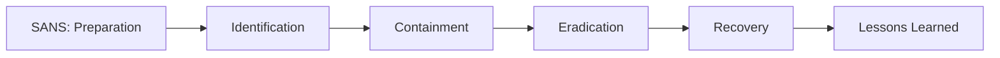
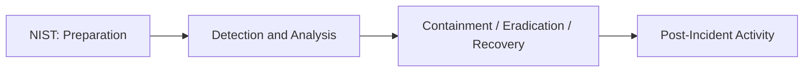
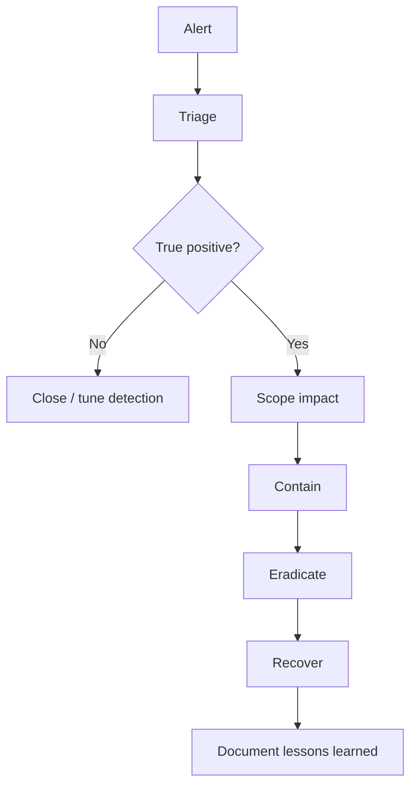

# Incident Response Fundamentals

## Summary

* **Incident Response (IR)** is the structured process used to prepare for, detect, contain, eradicate, recover from, and learn from cybersecurity incidents.
* In practice, IR starts after alerts are reviewed and confirmed as **true positives** rather than false positives.
* Incident severity drives priority. A critical ransomware event and a low-impact policy violation should not be handled with the same urgency.
* Common incident categories include **malware infections, security breaches, data leaks, insider attacks, and denial-of-service attacks**.
* Two common frameworks appear repeatedly in training and practice: **SANS PICERL** and **NIST's four-phase model**.
* Detection and response rely on tooling such as **SIEM, AV, and EDR**, but the process is operationalized through **playbooks** and formal **incident response plans**.
* In the provided lab screenshots, the incident began from a **phishing email attachment**, involved **3 devices downloading the file**, and **1 device executing it**.

## 1. What Counts as an Incident?

An environment produces huge numbers of routine events:

* logons
* file access
* process launches
* network connections
* application activity

Most of them are benign.

The sequence is usually:

```text
Event -> log -> alert -> analyst review -> incident decision
```

### Key Distinction

* **False positive**: looks suspicious, but investigation shows benign cause.
* **True positive**: investigation confirms harmful or genuinely suspicious activity.

In many operational contexts, the "incident" starts when a true positive is confirmed and requires coordinated response.

## 2. Severity Matters More Than Noise

IR is not just about finding bad things. It is about deciding what gets handled first.

Typical severity levels:

* Low
* Medium
* High
* Critical

### Why Severity Exists

If the team receives multiple cases at once, severity becomes the prioritization mechanism.

### Useful Mental Model

```text
Risk priority = likelihood + impact + urgency + spread potential
```

A malware alert on one isolated test VM is different from domain-wide credential abuse.

## 3. Common Incident Types

### 3.1 Malware Infection

A malicious file or payload executes on a host and causes harmful activity.

Typical indicators:

* suspicious attachment execution
* unexpected PowerShell usage
* outbound command-and-control traffic
* AV/EDR detection

### 3.2 Security Breach

Unauthorized access to protected systems or sensitive resources.

Typical indicators:

* suspicious authentication activity
* privilege misuse
* lateral movement
* access to restricted data

### 3.3 Data Leak / Data Exposure

Confidential data becomes accessible to unauthorized parties.

This may be malicious or accidental.

### 3.4 Insider Attack

A trusted internal user intentionally abuses access.

### 3.5 Denial of Service (DoS)

The attacker floods or exhausts resources, reducing or removing service availability.

## 4. SANS vs NIST: The Two Models You Keep Seeing

### 4.1 SANS PICERL

```text
Preparation -> Identification -> Containment -> Eradication -> Recovery -> Lessons Learned
```

### 4.2 NIST Model

```text
Preparation -> Detection and Analysis -> Containment, Eradication, and Recovery -> Post-Incident Activity
```

### 4.3 Comparison





### Practical Interpretation

SANS is more granular.

NIST compresses several operational phases into broader buckets.

Operationally, they are aligned more than they are different.

## 5. The SANS Phases in Plain Language

### 5.1 Preparation

Build capability before the incident.

Examples:

* security awareness training
* logging architecture
* EDR deployment
* responder contacts
* tested backups
* incident response plan
* containment procedures

### 5.2 Identification

Find and validate abnormal activity.

This is where alerts become triaged cases.

Questions to ask:

* What happened?
* Is this real?
* Which hosts, users, and assets are involved?
* Is the attack still active?

### 5.3 Containment

Limit spread and reduce damage.

Examples:

* isolate host
* disable account
* block domain/IP
* kill malicious process
* revoke session token

### 5.4 Eradication

Remove the attacker's foothold or malware.

Examples:

* delete malware
* remove persistence
* patch exploited weakness
* reset credentials
* clean malicious scheduled tasks or registry entries

### 5.5 Recovery

Return systems to trusted operation.

Examples:

* reimage host
* restore data from backup
* validate business service functionality
* monitor for recurrence

### 5.6 Lessons Learned

Convert the incident into better future readiness.

Examples:

* timeline review
* missed detection review
* control gap analysis
* playbook updates
* tuning detections

## 6. Core IR Tooling

### 6.1 SIEM

Best for:

* centralized log collection
* cross-source correlation
* alert generation
* search and timeline reconstruction

### 6.2 AV

Best for:

* known-malware detection
* baseline endpoint protection

### 6.3 EDR

Best for:

* host-level telemetry
* process trees
* isolation actions
* rapid containment
* deeper endpoint investigation

## 7. Playbooks vs Plans vs Runbooks

### Incident Response Plan

The formal organizational document.

It defines:

* roles and responsibilities
* escalation paths
* communications
* authority boundaries
* high-level methodology

### Playbook

A structured response guide for a specific scenario.

Example:

* phishing email
* ransomware
* suspicious PowerShell
* data exfiltration

### Runbook

The exact step-by-step execution detail.

Think:

```text
Click here -> collect this -> isolate host -> export timeline -> notify owner -> reset password
```

## 8. Minimal IR Thinking Loop



## 9. Lab Scenario Notes From the Screenshots

These are the concrete observations visible from the material you shared.

### 9.1 Threat Vector

* **Email attachment**

### 9.2 Malicious Sender

* **Jeff Johnson**

### 9.3 User Context Shown in Timeline

* **Smith**

### 9.4 Device-Level Spread

The file appeared on three hosts:

* `Host-ATYU` - **Not Executed**
* `Host-IOPE` - **Not Executed**
* `Host-HKNV` - **Executed**

This is a good example of why "downloaded" and "executed" are operationally different states.

### 9.5 Host Action Flow

From the screenshots, the analyst workflow is roughly:

```text
Malware alert -> Investigate -> Isolate host -> View process timeline -> Finish case
```

### 9.6 Process / Event Timeline

The visible sequence is:

```text
explorer.exe
  -> chrome.exe
    -> File Downloaded
      -> Payslip.pdf
        -> PowerShell.exe
        -> Malicious DNS Query
```

### 9.7 Interpretation

This strongly suggests a phishing-driven malware incident where:

1. the user opened email content
2. a file named `Payslip.pdf` was involved
3. execution led to PowerShell activity
4. follow-on network behavior included suspicious DNS activity

That is enough for a Level 1 or Level 2 analyst to justify containment.

## 10. What the Analyst Should Conclude in This Case

### Immediate Classification

* likely **malware infection** initiated via **phishing attachment**

### Immediate Containment Action

* isolate the executed host first

### Why Only One Host Is Highest Priority

Because only one host shows **Executed**, while the other two show only **Not Executed**.

This means the primary infection scope is probably narrow at the current point in time, but still requires verification.

### What Else Should Be Checked Next

* whether the attachment hash appears elsewhere
* whether the user clicked/opened similar content on other devices
* whether DNS requests map to known malicious infrastructure
* whether PowerShell spawned child processes or persistence
* whether credentials were exposed or reused

## 11. A Sensible Phishing Playbook for This Room

### Phase 1 - Validate

* confirm sender and email content
* identify attachment name and hash
* verify which users received it

### Phase 2 - Scope

* find all hosts with the file
* split into downloaded vs executed
* identify all related network activity

### Phase 3 - Contain

* isolate executed hosts
* block related indicators if available
* prevent attachment from further delivery

### Phase 4 - Eradicate

* remove malware and persistence
* clean PowerShell artifacts if relevant
* reset exposed accounts if needed

### Phase 5 - Recover

* restore trusted host state
* return network access only after validation

### Phase 6 - Learn

* improve email filtering
* improve detection for suspicious attachment + PowerShell chains
* update user awareness material

## 12. Why "Downloaded" Is Not the Same as "Executed"

This distinction matters a lot in triage.

| State | Operational meaning |
| --- | --- |
| Downloaded only | exposure occurred, but compromise is not yet proven |
| Executed | stronger evidence of compromise or malicious activity |

That changes:

* priority
* containment urgency
* forensic depth
* communication tone

## 13. False Positive vs True Positive: Practical Test

Use this operator test:

### False Positive

A detection fired, but the behavior is explainable as authorized, benign, or expected.

Example:

* large data transfer caused by approved backup job

### True Positive

The alert is supported by evidence of malicious or unauthorized behavior.

Example:

* phishing email followed by suspicious file execution and malicious DNS

## 14. Incident Response Report Skeleton

### Case Title

```text
Phishing Attachment Leading to Malware Execution on Host-HKNV
```

### Initial Facts

* Sender: Jeff Johnson
* Vector: Email attachment
* Attachment: `Payslip.pdf`
* Downloaded on: 3 hosts
* Executed on: 1 host
* Impacted user observed in timeline: Smith

### Preliminary Assessment

A phishing email delivered a malicious attachment. The file was downloaded to three endpoints and executed on one host, resulting in suspicious PowerShell execution and malicious DNS activity. Containment via host isolation was appropriate.

### Recommended Next Actions

* collect file hash and all related telemetry
* validate persistence on executed host
* search for IOCs across email, DNS, proxy, EDR, and SIEM
* reset potentially exposed user credentials
* review mail gateway controls

## 15. Pitfalls in Beginner IR Thinking

### 15.1 Treating Every Alert as an Incident

Bad analysts escalate noise.

Good analysts validate.

### 15.2 Containing Too Late

If execution is confirmed, containment delay can turn one host into several.

### 15.3 Ignoring Not-Executed Hosts

Downloaded-only hosts may still matter:

* user attempted execution but AV blocked it
* second-stage actions may not yet be visible
* the same lure may still be in inboxes elsewhere

### 15.4 Forgetting Post-Incident Work

An incident is not finished when the pop-up disappears.

The real value appears in:

* documentation
* lessons learned
* control improvement

## 16. Takeaways

* IR is not just "reacting fast"; it is **reacting in the right order**.
* The important shift is from **alert handling** to **evidence-based decision making**.
* SANS and NIST are different presentations of nearly the same operational logic.
* Good containment depends on good scoping.
* Email attachment incidents should always be reasoned as a chain: **sender -> lure -> file -> execution -> child activity -> network behavior**.
* In this lab, the strongest evidence of compromise is the host showing **execution plus downstream suspicious behavior**, not merely the download event.

## 17. Related Tools

* SIEM
* EDR
* AV
* email security gateway
* DNS logs / proxy logs
* sandbox / malware analysis platform

## 18. Further Reading

* NIST incident response guidance
* SANS incident response lifecycle references
* phishing response playbooks from defensive operations teams

## 19. CN-EN Glossary

* Incident Response (IR) - 事件响应
* Alert - 告警
* True Positive - 真实阳性 / 真阳性
* False Positive - 误报 / 假阳性
* Severity - 严重级别
* Containment - 遏制 / 隔离控制
* Eradication - 根除
* Recovery - 恢复
* Lessons Learned - 经验复盘
* Playbook - 处置剧本
* Runbook - 执行手册
* Phishing - 钓鱼
* Malware Infection - 恶意软件感染
* Data Leak - 数据泄露
* Security Breach - 安全突破 / 安全事件入侵
* DoS - 拒绝服务
* EDR - 终端检测与响应
* SIEM - 安全信息与事件管理
