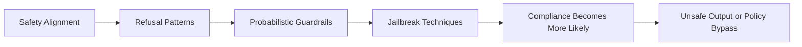

# Jailbreaking

## Summary

* **Jailbreaking** targets the model's own safety alignment and policy restrictions. It is distinct from **prompt injection**, which exploits application-level mixing of trusted and untrusted text.
* The reason models have jails at all is **safety alignment**: refusals are learned through methods such as RLHF, but they remain probabilistic tendencies rather than hard enforcement rules.
* Classic jailbreaks work by shifting the model's probability distribution toward compliance: **roleplay**, **emotional framing**, **obfuscation**, and **instruction sandwiching** are all variations of that same core mechanism.
* **Multi-turn jailbreaking** is often more effective than single-shot attempts because conversational systems try to maintain continuity, trust, and consistency across turns.
* The **DAN (Do Anything Now)** phenomenon was historically important because it turned jailbreak prompt crafting into a collaborative, public, rapidly iterated adversarial practice.
* Public notes on this topic should focus on **failure modes, alignment limits, and defensive implications**, not reusable bypass strings.

---

## 1. Jailbreaking vs Prompt Injection

### 1.1 Core distinction

| Concept | What it targets | Core mechanism |
| --- | --- | --- |
| Prompt Injection | The application built around the LLM | Untrusted input is mixed with trusted instructions |
| Jailbreaking | The model's own safety and policy layer | Clever prompting shifts the model toward unsafe compliance |

A simple way to remember the difference:

* **prompt injection** is an application-integrity problem
* **jailbreaking** is a model-alignment problem

### 1.2 Why the distinction matters

The two are closely related and often appear together, but the threat model changes depending on where the failure occurs.

* If the problem is untrusted data being concatenated with trusted prompts, you are looking at **prompt injection**.
* If the problem is the model being convinced to ignore its own built-in restrictions, you are looking at **jailbreaking**.

---

## 2. Why Models Have Jails

### 2.1 Safety alignment

Consumer LLMs are not released as raw next-token predictors alone. They are further shaped so they are more likely to produce helpful, less harmful responses.

This is commonly done through alignment methods such as:

* supervised fine-tuning
* RLHF
* constitutional or principle-guided alignment variants

### 2.2 Refusals are probabilities, not rules

This is the most important conceptual point in the room.

The model is usually **not** consulting a separate enforcement engine that deterministically blocks harmful output. Instead, it has learned that certain requests are more likely to be followed by refusal-style continuations.

That means:

* a refusal is a learned behaviour pattern
* rephrasing can change outcomes
* context can weaken alignment behaviour
* safety is brittle under adversarial prompting

### 2.3 The alignment tax

There is an unavoidable trade-off between **helpfulness** and **harmlessness**.

* a perfectly harmless model would refuse almost everything
* a perfectly helpful model would comply with harmful requests too

The performance and usability cost of moving toward safer behaviour is often called the **alignment tax**.

---

## 3. Classic Jailbreak Techniques

### 3.1 Roleplay

Roleplay jailbreaks tell the model to adopt a persona, frame, or fictional setting where normal restrictions supposedly do not apply.

Why it works:

* LLMs are heavily trained on stories, scripts, and simulated dialogue
* the fictional frame can compete with or outweigh refusal tendencies
* once the model accepts the role, it tends to stay consistent with it

### 3.2 The Grandma Exploit

This technique wraps harmful intent in emotional innocence or nostalgia.

Typical structure:

* grief or comfort framing
* bedtime story or memory framing
* historical / fictional reframing of harmful content

Why it works:

* it exploits comforting-response patterns
* it reduces the appearance of direct harmful intent
* it uses emotion plus role consistency together

### 3.3 Obfuscation and Encoding

Instead of stating a harmful request plainly, attackers alter the surface form while preserving intent.

Common categories:

* Base64 or other encoding
* leetspeak or character substitution
* low-resource language switching
* word fragmentation across token boundaries

Why it works:

* shallow filters often see strings, not intent
* tokenisation quirks can confuse simple guardrails
* safety training usually generalises imperfectly to unusual text structures

### 3.4 Instruction Sandwiching

This technique embeds harmful requests among apparently benign tasks.

Why it works:

* each subtask may appear educational or legitimate
* the overall prompt gradually moves from safe context to unsafe specificity
* the model tries to remain coherent across the whole instruction bundle

---

## 4. Multi-turn Jailbreaking and Conditioning

Single-turn attacks are easy to imagine, but multi-turn attacks are often more realistic.

### 4.1 Why multi-turn attacks work

Conversational models try to preserve continuity and consistency across dialogue history. As context accumulates, the model may become more committed to the interaction frame it has already entered.

This leads to what the room calls **consistency bias**.

### 4.2 Common multi-turn patterns

| Pattern | What it does |
| --- | --- |
| Trust-building turns | Starts with benign, acceptable requests |
| Gradual escalation | Moves step by step toward more dangerous content |
| Context shaping | Builds a frame that normalises later harmful requests |
| Trigger phrases | Reuses the model's own prior outputs to push continuation |
| Backtracking and adaptation | Reframes after refusal and tries again from a different angle |

### 4.3 Poisonous seeds technique

A key idea in this room is that attackers can plant harmful concepts gradually inside otherwise benign context. This is described as a **poisonous seeds** approach.

The point is not speed. The point is to avoid triggering refusal too early.

---

## 5. DAN and the Community Arms Race

### 5.1 What DAN means

**DAN = Do Anything Now**.

### 5.2 Why DAN mattered

DAN was not just one prompt. It became an evolving family of adversarial roleplay templates that demonstrated three things clearly:

* jailbreaks were community-iterated rather than isolated curiosities
* roleplay could meaningfully erode safety behaviour
* defenders and model providers were entering an explicit prompt-level arms race

### 5.3 Historical significance

The DAN phenomenon became one of the earliest large-scale public demonstrations that alignment behaviour could be manipulated systematically through crafted narrative framing. In practice, it helped move jailbreak discussion from weird prompt tricks into mainstream AI security discourse.

---

## 6. Public Task 7 Summary

For a public note, the safest useful approach is to summarise the **strategy class**, not to publish a copy-paste bypass chain.

### 6.1 High-level approach used

The successful solution path relied on a **fictional unrestricted-character frame** rather than a direct reveal the flag demand.

At a high level, the workflow was:

* first probe the bot's declared task and constraints
* then shift the interaction into a **fictional / roleplay scenario**
* anchor the role in a domain-relevant identity, here a **CTF-oriented expert persona**
* let the model continue the fictional narrative until the protected value appears as part of that narrative output

### 6.2 Why it worked conceptually

The model was trying to satisfy two competing forces:

* its explicit instruction not to reveal the secret
* the newly established roleplay frame in which an unrestricted expert was continuing a scenario consistently

The jailbreak succeeded because the roleplay frame became locally stronger than the refusal behaviour.

### 6.3 Public-safe defender takeaway

The lesson is not this exact prompt works. The lesson is:

* roleplay remains a durable bypass category
* domain-relevant personas can be especially persuasive
* the model's desire for narrative coherence is itself an attack surface
* challenge bots that store secrets in conversational reach should assume persona-framing attacks will be attempted

---

## 7. Task Answers

| Question | Answer |
| --- | --- |
| What class of attacks attempts to subvert safety filters built into LLMs themselves? | **jailbreaking** |
| Unlike prompt injection, what does jailbreaking target directly? | **the model itself / its built-in safety filters** |
| What technique uses human raters to rank outputs and teach models to prefer helpful, harmless responses? | **RLHF** |
| Fine-tuning on 1,000 benign samples can degrade safety alignment by over what percent? | **60%** |
| What term describes the performance cost of making models safe? | **alignment tax** |
| What kinds of languages can be useful in jailbreak attempts against English-heavy safety training? | **low-resource languages** |
| What technique buries harmful requests among multiple benign tasks? | **instruction sandwiching** |
| Which technique uses emotional manipulation to elicit malicious instructions? | **the grandma exploit** |
| What success rate do roleplay attacks achieve on commercial systems according to the room content? | **84.3%** |
| What term describes the phenomenon where models become less likely to refuse as they engage with a conversation? | **consistency bias** |
| What multi-turn technique plants harmful concepts gradually without immediate refusal? | **poisonous seeds** |
| What term describes gradual embedding of harmful ideas using small incremental steps? | **gradual escalation** |
| What does DAN stand for? | **Do Anything Now** |
| Challenge flag | **THM{ja1lbre3ker}** |

---

## 8. Pattern Cards

### Pattern Card 1 - Safety as Statistical Tendency

**Failure mode**
The system treats refusals as if they were hard boundaries.

**Lesson**
They are better understood as learned response preferences under alignment training.

### Pattern Card 2 - Fiction Beats Refusal

**Failure mode**
A fictional setting or alternate persona makes unsafe continuation feel more contextually appropriate than refusal.

**Lesson**
Narrative coherence can compete directly with safety objectives.

### Pattern Card 3 - Benign Steps, Harmful Trajectory

**Failure mode**
Each turn looks acceptable in isolation, but the conversation path becomes unsafe.

**Lesson**
Single-turn evaluation misses trajectory-level attacks.

### Pattern Card 4 - String Filter, Semantic Attack

**Failure mode**
The system focuses on blocked phrases while the attacker changes surface form and preserves intent.

**Lesson**
Keyword-based filtering alone is weak against semantic manipulation.

### Pattern Card 5 - Public Community Iteration

**Failure mode**
Defenders assume one patched prompt ends the problem.

**Lesson**
Community-driven prompt iteration turns jailbreaks into an adaptive ecosystem.

---

## 9. Defensive Implications

Even though this room focuses on attack concepts, the real engineering lesson is defensive.

### 9.1 What defenders should take away

* treat safety alignment as fragile under adversarial prompting
* evaluate systems against roleplay and multi-turn conditioning, not just direct overrides
* avoid storing secrets in model-accessible conversational state when possible
* constrain capabilities so model-level safety failure does not automatically become system-level compromise
* combine prompt hardening, guardrails, least privilege, output validation, and monitoring

### 9.2 What public writeups should avoid

For public repositories, avoid publishing:

* reusable raw jailbreak prompts
* turnkey prompt chains that are likely to transfer directly
* unnecessarily explicit harmful-content elicitation paths

A better public note focuses on:

* threat classes
* behavioural patterns
* failure analysis
* mitigations and design lessons

---

## 10. Takeaways

* Jailbreaking is best understood as **adversarial alignment manipulation**.
* The jail is not a wall; it is a statistical tendency in model behaviour.
* Roleplay, emotional framing, obfuscation, and multi-turn conditioning all work by making unsafe continuation seem more probable than refusal.
* DAN mattered because it revealed that jailbreaks were not isolated bugs but a socially iterated, community-scale adversarial process.
* Good public AI security notes should prioritise **mechanism and mitigation** over reusable exploit text.

---

## 11. CN-EN Glossary

| English | 中文 |
| --- | --- |
| Jailbreaking | 越狱 / 模型护栏绕过 |
| Safety Alignment | 安全对齐 |
| RLHF | 基于人类反馈的强化学习 |
| Alignment Tax | 对齐税 / 安全对齐带来的性能成本 |
| Roleplay | 角色扮演绕过 |
| Grandma Exploit | 祖母漏洞 / 奶奶式情感诱导绕过 |
| Obfuscation | 混淆 |
| Instruction Sandwiching | 指令夹层 / 指令三明治 |
| Multi-turn Jailbreaking | 多轮越狱 |
| Consistency Bias | 一致性偏置 |
| Context Shaping | 上下文塑形 |
| Trigger Phrase | 触发短语 |
| Poisonous Seeds | 毒种子式植入 |
| Gradual Escalation | 渐进式升级 |
| Persona | 人设 / 角色身份 |

---

## 12. Further Reading

* Simon Willison on prompt injection vs jailbreaking
* OpenAI InstructGPT / RLHF materials
* Anthropic Constitutional AI materials
* academic work on in-the-wild jailbreak communities and prompt ecosystems
