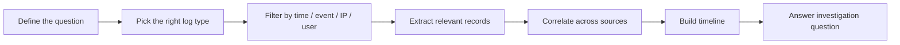
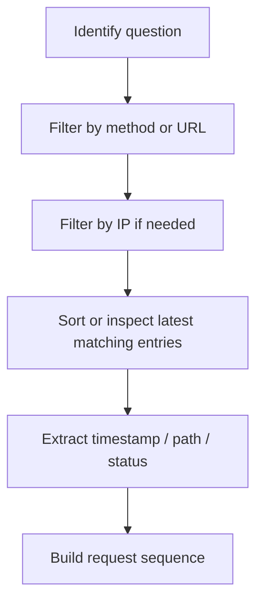

# Logs Fundamentals

## Summary

Logs are the primary trace source in most digital investigations. They record normal activity, errors, administrative actions, and malicious behavior. In practice, logs are useful for five core goals:

* security monitoring and anomaly detection
* incident investigation and root cause analysis
* troubleshooting system or application issues
* performance observation
* auditing and compliance

A useful mental model is simple: **logs are digital footprints**. They rarely tell the full story on their own, but when correlated across systems, they reconstruct attack paths, user actions, and system state changes.

---

## Why Logs Matter

In a physical investigation, responders look for footprints, forced entry, camera footage, and damaged objects. In a digital investigation, the equivalent evidence often lives in logs.

Typical value of logs:

* **What happened?**
* **When did it happen?**
* **Who or what triggered it?**
* **Which asset was involved?**
* **What happened next?**

This is why logging quality directly affects detection quality and forensic depth.

---

## Core Log Categories

Different logs answer different questions. Separating them by function reduces noise during investigation.

| Log type | Main purpose | Typical examples |
| --- | --- | --- |
| System Logs | OS and platform operations | startup, shutdown, drivers, hardware faults, service issues |
| Security Logs | Security-relevant activity | authentication, authorization, account changes, policy changes |
| Application Logs | App-specific behavior | user interactions, app errors, updates, internal actions |
| Audit Logs | Accountability and traceability | data access, admin changes, policy enforcement |
| Network Logs | Traffic visibility | inbound/outbound connections, firewall events, sessions |
| Access Logs | Access to resources | web access, database access, API requests |

### Quick Distinction

* **Network logs** answer: *what moved across the wire?*
* **Security logs** answer: *who authenticated, changed, failed, or escalated?*
* **Application logs** answer: *what did the app do internally?*
* **Access logs** answer: *who requested which resource, when, and how?*

---

## Log Analysis: Basic Workflow

Manual log analysis is still valuable, especially in labs, scoping, validation, or small investigations.



### Practical Investigation Logic

1. Start with a narrow question.
2. Choose the correct log source.
3. Filter aggressively.
4. Validate timestamps and identities.
5. Correlate with surrounding events.
6. Convert observations into a timeline.

### Common Pivots

* timestamp
* user account
* source IP
* hostname
* process name
* URL or path
* event ID
* HTTP method / status code

---

## Windows Event Logs

Windows stores many activities in structured event logs. For investigations, three channels matter first:

* **Application**
* **System**
* **Security**

The most important from a security perspective is usually **Security** because it records authentication and account-management activity.

### Event Viewer

Windows provides a built-in GUI tool for inspection: **Event Viewer**.

Typical workflow:

1. Open `Event Viewer`
2. Go to `Windows Logs`
3. Select `Security`, `System`, or `Application`
4. Use **Filter Current Log**
5. Filter by **Event ID**, time range, or keywords
6. Open specific events for details

### Important Fields in a Windows Event

* **Description** - detailed event text
* **Log Name** - which channel the event belongs to
* **Logged** - timestamp
* **Event ID** - numeric identifier for the activity type

### High-Value Event IDs

| Event ID | Meaning |
| --- | --- |
| 4624 | Successful logon |
| 4625 | Failed logon |
| 4634 | Successful logoff |
| 4720 | User account created |
| 4722 | User account enabled |
| 4724 | Password reset attempt |
| 4725 | User account disabled |
| 4726 | User account deleted |

### Investigation Example

If the question is *"Which account was created before the compromise?"*, filtering for **4720** is more efficient than scrolling through all security events.

If the question is *"Was the created account later enabled?"*, pivot next to **4722**.

If the question is *"Was its password reset?"*, pivot to **4724**.

### Investigation Pattern for Account Abuse

```text
4720  -> account created
4722  -> account enabled
4724  -> password reset attempted
4624  -> successful logon using that account
4634  -> logoff
```

This sequence is often more valuable than any single event in isolation.

---

## Windows Event Log Analysis Tips

### Useful Questions

* Which account was created last?
* Which parent account created it?
* When was the account enabled?
* Was the password reset afterward?
* Did the account log in successfully later?

### Practical Method

* Filter `Security` log by `4720`
* Identify the suspicious created account
* Open the event to inspect the **actor** who created it
* Filter `4722` for the same account
* Filter `4724` for password reset attempts
* Filter `4624` for successful use of the account

### Common Mistakes

* confusing the **target account** with the **actor account**
* ignoring time ordering
* using only one event instead of validating the chain
* forgetting that administrative bulk actions may be benign

---

## Web Server Access Logs

Web access logs record HTTP requests made to a web server. These logs are crucial for both troubleshooting and security investigation.

### Typical Fields in an Apache Access Log

| Field | Meaning |
| --- | --- |
| IP Address | client/source IP |
| Timestamp | time of request |
| HTTP Method | GET, POST, etc. |
| URL | requested path/resource |
| Status Code | server response status |
| User-Agent | browser / OS / client fingerprint |

### Example Interpretation

```text
CLIENT_IP - - [06/Jun/2024:13:58:44] "GET /products HTTP/1.1" 404 "-" "Mozilla/..."
```

This tells us:

* source IP: `CLIENT_IP`
* time: `06/Jun/2024:13:58:44`
* method: `GET`
* path: `/products`
* protocol: `HTTP/1.1`
* response: `404`
* client fingerprint: browser/user-agent string

### Why Access Logs Matter

They help answer questions like:

* which IP last requested `/contact`?
* when did a suspect IP make a POST request?
* which URL received the suspicious POST?
* did the activity resemble brute force, enumeration, or exploitation?

---

## Manual Web Log Analysis Commands

### `cat`

Show file contents.

```bash
cat access.log
```

Also useful for combining rotated logs:

```bash
cat access1.log access2.log > combined_access.log
```

### `grep`

Search for strings or patterns.

```bash
grep "CLIENT_IP" access.log
grep '"GET /contact' access.log
grep '"POST' access.log
```

### `less`

Browse large logs page by page.

```bash
less access.log
```

Inside `less`:

* `Space` -> next page
* `b` -> previous page
* `/pattern` -> search
* `n` -> next match
* `N` -> previous match

### Useful Combinations

```bash
grep '"GET /contact' access.log | tail
```

```bash
grep 'CLIENT_IP' access.log | grep '"POST'
```

```bash
grep 'CLIENT_IP' access.log | tail -n 20
```

These are often enough for lab-scale investigations.

---

## Web Access Log Investigation Pattern



### Example Questions

* What is the IP that made the last `GET /contact` request?
* When was the last `POST` by `CLIENT_IP`?
* Which URL received that final POST?

### Reasoning Pattern

1. Find matching lines.
2. Move to the latest occurrence.
3. Extract the relevant field.
4. Validate adjacent lines if the attack is multi-step.

---

## Status Codes: Fast Interpretation

| Status | Meaning | Investigation value |
| --- | --- | --- |
| 200 | OK | request succeeded |
| 301/302 | Redirect | may indicate login flow or URL rewrite |
| 403 | Forbidden | probing or blocked access |
| 404 | Not Found | enumeration, recon, broken links |
| 500 | Server Error | app bug, exploit side effect, backend issue |

A high volume of `404` across many paths may indicate content discovery or forced browsing.

---

## Investigation Heuristics

### In Windows Logs

Look for:

* account creation followed by enablement
* unexpected password reset activity
* successful logons after repeated failures
* admin action chains outside normal hours

### In Web Access Logs

Look for:

* unusual POST requests
* repeated requests from one IP to many paths
* admin or auth endpoints accessed repeatedly
* suspicious user-agents
* bursts of `404`, `403`, or `500`

### Cross-Source Correlation

A single log line is weak evidence. Correlation is stronger.

Examples:

* web access log shows POST to admin endpoint
* application log shows internal error afterward
* security log shows account created minutes later
* network log shows outbound session to a rare IP

That is how investigations become explanations, not guesses.

---

## Common Pitfalls

### 1. Reading Everything Instead of Filtering

Logs are large. Start with the question, not the file.

### 2. Ignoring Timestamps

If the time sequence is wrong, the story is wrong.

### 3. Confusing Cause and Effect

A `500` error may be caused by exploitation, misconfiguration, or routine breakage. Context decides.

### 4. Treating One Event as Proof

One event is a clue. Multiple corroborating records form evidence.

### 5. Ignoring Benign Admin Activity

Not every account creation or failed logon is malicious.

### 6. Forgetting Rotation and Fragmentation

The event you need may live in another log file or previous rotation.

---

## Minimal Analyst Playbook

### Windows Account Misuse

```text
Question:
Did an attacker create and use a rogue account?

Playbook:
1. Filter Event ID 4720
2. Identify created account name
3. Inspect who created it
4. Filter Event ID 4722 for enablement
5. Filter Event ID 4724 for reset activity
6. Filter Event ID 4624 for later successful logons
7. Build timeline
```

### Web Request Tracing

```text
Question:
Which client performed the suspicious action on the website?

Playbook:
1. Search by URL or method
2. Identify candidate IPs
3. Pivot on suspect IP
4. Find latest matching request
5. Extract time + path + status code
6. Review surrounding requests for sequence
```

---

## Quick Command Cookbook

```bash
# Show the whole log
cat access.log

# Merge rotated logs
cat access.log.1 access.log > merged.log

# Search by IP
grep "CLIENT_IP" access.log

# Search POST requests
grep '"POST' access.log

# Search a specific path
grep '/contact' access.log

# Browse large files
less access.log

# Search from inside less
/contact
n
N
```

---

## ASCII Cheatsheet

```text
INVESTIGATION TRIAD

Question  ->  Filter  ->  Correlate

If you skip Question:
  you drown in noise.
If you skip Filter:
  you waste time.
If you skip Correlate:
  you misread the event.
```

```text
WINDOWS ACCOUNT ABUSE

4720 -> 4722 -> 4724 -> 4624
create   enable  reset   use
```

```text
WEB LOG CORE FIELDS

IP | Time | Method | URL | Status | User-Agent
```

---

## Takeaways

* Logs are the main evidence layer in most digital investigations.
* Different log types answer different investigative questions.
* Windows Event Logs become far more usable once you pivot by **Event ID**.
* Web access logs are highly effective for reconstructing request sequences.
* Manual analysis with `cat`, `grep`, and `less` is basic but still operationally useful.
* The value of a log is rarely in one line; it is in **context, sequence, and correlation**.

---

## Further Reading

* Microsoft Event Viewer / Windows Logs documentation
* Apache HTTP Server logging documentation
* OWASP Logging Cheat Sheet

---

## CN-EN Glossary

* log - 日志
* trace - 痕迹 / 追踪线索
* event - 事件
* Event Viewer - 事件查看器
* Event ID - 事件标识符
* Security Log - 安全日志
* System Log - 系统日志
* Application Log - 应用日志
* Access Log - 访问日志
* authentication - 认证
* authorization - 授权
* correlation - 关联分析
* root cause analysis - 根因分析
* filtering - 过滤
* request - 请求
* status code - 状态码
* user-agent - 用户代理
* log rotation - 日志轮转
* timeline - 时间线
* indicator - 指标 / 迹象
