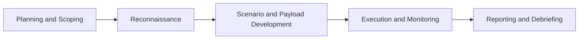

# Phishing Basics

## Summary

* Phishing is a social-engineering attack that targets people rather than software flaws.
* In pentesting, phishing is useful because it tests the human attack surface: trust, attention, routine behavior, and decision-making under pressure.
* The room covers five core dimensions: what phishing is, why it works psychologically, how campaigns are structured, common technical deception patterns, and how results should be reported.
* The most important professional constraint is that phishing in a pentest must remain authorized, bounded, measurable, reversible, and non-destructive.
* The end product is not the email itself. The end product is a decision-useful report.

```text
human trust -> lure -> interaction -> measurable behavior -> security recommendation
```

That is the real chain this room teaches.

## 1. Why Phishing Matters in Pentesting

When perimeter controls are mature, the easiest initial foothold is often not a CVE. It is a person.

A well-designed phishing exercise helps answer questions such as:

* Which user groups are most likely to interact with social-engineering content?
* Do users notice spoofing or typosquatting indicators?
* How often do they click links, open attachments, or attempt credential submission?
* Do they report suspicious messages quickly?
* Are technical controls reducing harm after user interaction?

This is why phishing is not just "sending a fake email." It is a controlled test of:

* awareness
* process
* technical controls
* escalation behavior
* reporting maturity

## 2. Core Definitions

## 2.1 Phishing

Phishing is a broad social-engineering attack in which a message impersonates a trusted source and attempts to induce a victim to:

* reveal sensitive information
* click a malicious link
* open an attachment
* execute a task
* install malware
* transfer money or data

The primary attack vector is usually trust manipulation, not software exploitation.

## 2.2 Smishing

Smishing is phishing delivered via SMS / text message.

## 2.3 Vishing

Vishing is phishing delivered via voice call.

## 2.4 Spear phishing

Spear phishing is a targeted phishing campaign tailored to a specific individual or small group.

## 2.5 Whaling

Whaling is spear phishing aimed at senior decision-makers, such as executives or finance leadership.

## 3. Taxonomy of Phishing

| Type | Scope | Targeting level | Typical objective |
| --- | --- | --- | --- |
| Phishing | Wide-net | Low | Scale, quick wins, generic credential theft |
| Spear phishing | Narrow | High | Initial access, tailored manipulation |
| Whaling | Executive-focused | Very high | Fraud, approvals, regulated data, override of controls |
| Smishing | Mobile/SMS | Medium to high | Link clicks, credential theft, MFA theft, call-backs |
| Vishing | Voice | Medium to high | Credential reset, MFA approval, policy override |

### First-principles distinction

```text
Phishing = broad deception
Spear phishing = tailored deception
Whaling = tailored deception against high-value decision-makers
```

## 4. Psychology of Phishing

Phishing works because it compresses human judgment.

Instead of asking the victim to perform careful analysis, it pushes them into:

* speed
* habit
* anxiety
* obedience
* curiosity
* social compliance

## 4.1 Social-engineering principles

### Scarcity

Scarcity creates the perception that something valuable is limited.

Common effect:

* loss aversion
* FOMO
* impulsive action

Typical language:

* limited seats
* last chance
* only a few left
* offer ends today

### Urgency

Urgency shortens the victim's decision window.

Common effect:

* reduced scrutiny
* compliance before verification

Typical language:

* act now
* within 24 hours
* immediate action required
* deadline passed

### Authority

Authority exploits role hierarchy and institutional legitimacy.

Common effect:

* fewer verification steps
* assumption of procedural correctness

Typical language:

* HR department
* IT administrator
* CFO request
* policy compliance required

### Fear

Fear frames inaction as dangerous.

Common effect:

* panic-driven interaction
* rapid "fix-the-problem" behavior

Typical language:

* suspicious login detected
* breach found
* legal issue
* account compromise

### Curiosity

Curiosity creates an information gap the victim wants to close.

Common effect:

* voluntary clicking
* lowered skepticism

Typical language:

* confidential
* leaked file
* roadmap preview
* internal discussion

### Trust

Trust leverages familiar brands, people, workflows, and communication style.

Common effect:

* routine acceptance
* reduced doubt

Typical signals:

* branded formatting
* familiar sender display name
* copied internal message tone
* common recurring process

## 4.2 Cognitive biases that help phishing succeed

### Overconfidence bias

"People like me do not fall for phishing."

This is especially dangerous in technical teams.

### Confirmation bias

Victims accept messages that match what they were already expecting.

Example:

* waiting for an invoice
* expecting a password reset
* expecting HR communication

### Authority bias

People are more likely to obey instructions when the sender appears senior or official.

## 5. Anatomy of a Phishing Campaign

The room frames phishing as a campaign lifecycle, not a single message.



## 5.1 Planning and scoping

This is where the engagement becomes lawful, safe, and measurable.

Key elements:

* define the mission in one sentence
* identify target groups in scope and out of scope
* define allowed techniques
* define measurable outcomes
* define timing and campaign waves
* document emergency contacts and kill switch
* record rules of engagement

### Good planning questions

* Are credential submissions being simulated or fully blocked?
* Are attachments allowed? If yes, are they harmless beacons only?
* Are executives, finance, HR, or IT included?
* Is the goal awareness measurement, control testing, or full initial-access simulation?

## 5.2 Reconnaissance

Recon should remain within OSINT and scope.

Typical public sources:

* company website
* LinkedIn
* press releases
* job posts
* public social media
* partner/vendor naming patterns

The objective is not mass collection. The objective is plausibility.

## 5.3 Scenario and payload development

This is where the pretext becomes operational.

Common safe training/pentest scenarios:

* IT policy update
* password expiration notice
* invoice reminder
* HR announcement
* MFA enrollment prompt
* service disruption notice

In an authorized simulation, payloads should be non-destructive.

Safe examples:

* tracking links
* branded landing pages for behavior measurement
* simulated login pages with fake accounts or synthetic collection logic
* benign document beacons

## 5.4 Execution and monitoring

Campaigns may be sent:

* in one wave
* in staggered waves
* by department
* by role tier

Real-time monitoring focuses on behavior signals, not harm.

Tracked events may include:

* email opens
* link clicks
* simulated credential submissions
* attachment opens
* user reports

## 5.5 Reporting and debriefing

This is where raw telemetry becomes security value.

A phishing test is incomplete without:

* trend interpretation
* benchmark positioning
* role-based analysis
* technical control recommendations
* awareness recommendations
* retest plan

## 6. Technical Deception Patterns

This room also introduces common technical patterns used in phishing. The useful way to study them is by defender recognition logic, not by offensive reproduction steps.

## 6.1 URL masking

A hyperlink's displayed text appears legitimate, but the actual destination differs.

**Defensive question**

Does the visible text match the real destination?

## 6.2 Homograph attacks

Characters from other alphabets or visually similar letters/numbers make a malicious domain look legitimate.

Example logic:

* `o` vs `0`
* Latin characters vs Cyrillic lookalikes

**Defensive question**

Does the domain visually resemble a trusted brand while not actually matching it?

## 6.3 Typosquatting

A domain relies on predictable typing mistakes.

Example logic:

* missing letter
* swapped letters
* extra hyphen
* alternate TLD

**Defensive question**

Is the sender or target domain "almost right" instead of exactly right?

## 6.4 Display-name spoofing

The display name looks trustworthy even when the real sender address is different.

**Defensive question**

Is the identity trusted because of the name only, while the real address is hidden or different?

## 6.5 Credential harvesting

A fake login page mimics the real application while routing submitted data elsewhere.

**Defensive question**

Is the brand/UI familiar, but the domain, certificate, flow, or redirection behavior abnormal?

## 6.6 Attachment-based lures

Documents prompt user interaction that leads to code execution, remote content retrieval, or telemetry callbacks.

**Defensive question**

Is the document asking for macro enablement, content enablement, or unusual trust actions?

## 7. Tooling Overview

This note intentionally stays at the capability level.

## 7.1 GoPhish

Use case:

* campaign management
* template handling
* target grouping
* scheduling
* tracking opens/clicks/submissions
* reporting dashboard

Operational value:

* structured phishing simulation platform
* easier measurement and repeatability

## 7.2 Evilginx / EvilNginx-style reverse-proxy phishing

Use case:

* advanced session/token interception concepts
* MFA-resistant phishing research in tightly controlled and authorized environments

Operational value:

* shows why session theft can bypass strong authentication if trust boundaries are wrong

## 7.3 SET (Social-Engineer Toolkit)

Use case:

* phishing workflow support
* social-engineering payload generation
* website attack vectors
* credential-harvester-style simulations

Operational value:

* flexible framework for lab demonstrations and controlled engagement scenarios

### Important ethical note

Tool availability does not equal permission to use it against real people or infrastructure.

## 8. Metrics That Matter

The room's strongest practical section is the reporting metrics table. That is where phishing turns into program improvement.

| Metric | What it measures | Example interpretation |
| --- | --- | --- |
| Open Rate | % who opened the email | Subject line and sender plausibility |
| Click Rate | % who clicked the link | Lure effectiveness and user caution |
| Credential Entry Rate | % who attempted submission | Severity of decision failure |
| Attachment Detonation Rate | % who opened/executed attachment | Document-handling risk |
| Reporting Rate (24h) | % who reported within 24h | Security culture and escalation maturity |

## 8.1 Benchmark-oriented interpretation

### Credential Entry Rate

* `< 2%` -> low risk
* `2-5%` -> moderate risk
* `> 5%` -> high risk

So a 6% credential entry rate should be treated as high risk.

### Attachment Detonation Rate

This measures the percentage of users who opened or executed the attachment.

### Click Rate around 10%

That generally suggests the need for focused security awareness training.

## 9. Reporting Logic: From Metrics to Recommendations

A phishing report should not stop at "X percent clicked."

It should answer:

* what happened
* why it likely happened
* who was most exposed
* which controls failed or were absent
* what should change next

### Example mapping

| Observation | Likely weakness | Recommendation |
| --- | --- | --- |
| High open rate | sender/subject plausibility too strong | awareness refresh focused on message validation |
| High click rate | link inspection behavior weak | focused security awareness training |
| High credential entry | phishing-site recognition weak; MFA absent or insufficient | phishing-site identification training and phishing-resistant MFA |
| High attachment detonation | document safety handling weak | educate on attachment handling; sandbox detonation strategy |
| Low reporting rate | security culture or reporting process weak | reporting-awareness campaign and simpler reporting workflow |

## 10. Pentest-Safe Boundaries

This is the most important professional section.

A phishing engagement should be:

* authorized
* written down
* scoped
* reversible
* non-destructive
* monitored in real time

## 10.1 What should stay out of scope in most training-style phishing work

* live malware deployment
* uncontrolled credential capture
* uncontrolled MFA bypass attempts
* persistence installation
* data exfiltration from real users
* uncontrolled forwarding outside the agreed target set

## 10.2 Preferred safety controls

* fake or synthetic credentials only
* redirect after simulated submission
* kill switch ready
* real-time pause criteria
* emergency contact path
* out-of-scope leakage handling
* anonymized reporting

## 11. Pattern Cards

## Pattern 1 - Pressure Before Verification

**Signal**

Message pushes speed before review.

**Examples**

* urgency
* fear
* scarcity

**Risk**

Victim acts before validating sender, domain, or request.

## Pattern 2 - Trust Borrowing

**Signal**

Message copies brand, department, or leader identity.

**Examples**

* HR update
* IT policy change
* executive instruction

**Risk**

Victim substitutes familiarity for verification.

## Pattern 3 - Plausibility via OSINT

**Signal**

Message references real company events, roles, or workflows.

**Examples**

* recent policy announcement
* recent hiring campaign
* real department naming

**Risk**

Victim accepts the lure as routine business activity.

## Pattern 4 - Metrics Without Recommendations

**Signal**

Report contains only percentages.

**Risk**

Client learns nothing operationally useful.

**Fix**

Tie each metric to a control or training recommendation.

## 12. Practical Study Takeaways From the Room

The supplied material strongly suggests four durable lessons:

1. Phishing is not mainly a mail problem. It is a trust-and-decision problem.
2. A believable campaign depends more on recon and narrative fit than flashy payloads.
3. Campaign success must be measured in behavior, not just delivery.
4. The value of the exercise is the debrief, not the click itself.

## 13. Quick Answer Bank

| Prompt | Correct concept |
| --- | --- |
| Primary channel in smishing | SMS / text messaging |
| CEO targeted individually | Whaling |
| iPhone offer expires in 24h | Urgency |
| Executive uses role pressure | Authority |
| Exclusive unknown product access | Curiosity |
| Breach / credentials exposed message | Fear |
| 6% credential entry rate | High risk |
| Attachment execution/open metric | Attachment Detonation Rate |
| 10% click rate recommendation | Focused security awareness training |

## 14. Blue-Team and Programmatic Defenses

The room mentions several controls worth grouping properly.

## 14.1 Messaging/authentication controls

* SPF
* DKIM
* DMARC

These help reduce sender impersonation and spoofing success.

## 14.2 Identity controls

* phishing-resistant MFA
* strong login anomaly detection
* risky-sign-in monitoring
* session protections

## 14.3 User-process controls

* security awareness refreshers
* role-targeted training
* fast reporting workflows
* safe attachment handling practices

## 14.4 Reporting/program controls

* anonymous aggregate reporting
* department trend tracking
* follow-up retests
* benchmark comparison over time

## 15. Reusable Phishing Assessment Template

```markdown
## Campaign Summary
- Objective:
- Scope:
- Dates:
- User groups targeted:
- Techniques allowed:
- Safety controls:

## Scenario
- Pretext:
- Sender theme:
- Delivery channel:
- Landing/attachment behavior:

## Metrics
- Open rate:
- Click rate:
- Credential entry rate:
- Attachment detonation rate:
- Reporting rate (24h):

## Analysis
- Strongest social-engineering principle used:
- Most affected group:
- Detection/reporting observations:
- Technical control observations:

## Recommendations
- Awareness:
- Identity/security controls:
- Email controls:
- Reporting workflow:
- Retest timeline:
```

## 16. CN-EN Glossary

* Phishing -- 网络钓鱼
* Spear phishing -- 鱼叉式钓鱼 / 定向钓鱼
* Whaling -- 高管定向钓鱼
* Smishing -- 短信钓鱼
* Vishing -- 语音钓鱼
* Pretext -- 预设话术 / 借口场景
* Credential harvesting -- 凭据收集 / 账号口令钓取
* Typosquatting -- 域名拼写抢注 / 错拼域名仿冒
* URL masking -- 链接伪装
* Display-name spoofing -- 显示名伪装
* Open rate -- 打开率
* Click rate -- 点击率
* Credential entry rate -- 凭据输入率
* Attachment detonation rate -- 附件触发 / 执行率
* Reporting rate -- 上报率
* Kill switch -- 紧急停止机制
* Rules of engagement -- 交战规则 / 授权边界
* OSINT -- 开源情报
* Social engineering -- 社会工程学

## 17. Final Takeaway

The cleanest way to remember this room is:

```text
Phishing success is rarely about technical sophistication first.
It is about believable context, psychological pressure, measurable behavior, and disciplined reporting.
```

That is why phishing belongs in pentesting, awareness, and blue-team maturity work at the same time.
