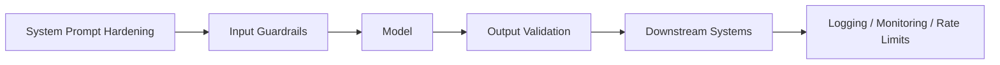

# Prompt Defence

## Summary

* Prompt defence is a **risk-reduction problem**, not a perfect-prevention problem. LLMs follow probabilistic instruction patterns, so no single control can guarantee immunity against prompt injection or jailbreak-style attacks.
* The correct security posture is **defence in depth**: combine prompt hardening, input filtering, constrained deployment, output validation, and telemetry.
* A stronger system prompt helps, but it is **not a security boundary**. It should be treated as one layer among many.
* Guardrails are useful but bypassable. Cheap blocklists catch obvious attacks; smarter classifiers catch more intent-level variants; neither is sufficient in isolation.
* The most important architecture decision is often **least privilege**. A compromised model with narrow permissions is a containment problem. A compromised model with broad retrieval, tool use, or action authority is a breach path.
* Public-facing AI security notes should emphasise **design lessons, failure modes, and mitigations**, not copy-paste bypass strings.

---

## 1. Core Ideas

### 1.1 Probabilistic Security

Traditional application security often imagines a cleaner boundary: patched or unpatched, blocked or allowed, vulnerable or fixed.

Prompt security is messier. A prompt injection or jailbreak usually succeeds by changing what the model considers the most likely continuation. That means security here is not binary. It is **probabilistic**.

Implications:

* a failed attack can succeed later with rewording
* a guardrail can catch many attacks without stopping all of them
* evaluation must be repeated and adversarial
* works in testing is never the same as solved in production

### 1.2 Why the System Prompt Is Not Enough

The system prompt matters because the model is trained to treat it as high-priority guidance. But it is still natural language inside the same overall context-processing pipeline.

That means:

* it can be overridden in some cases
* it can be leaked
* it should not hold secrets
* it is best treated as a **steering layer**, not a hard enforcement mechanism

### 1.3 Defence in Depth

Because no one layer is decisive, practical prompt defence stacks multiple controls:

* raise the bar before generation
* reduce reachable capabilities during generation
* validate output after generation
* detect abnormal behaviour around the model

This is the main lesson of the room.

---

## 2. Defensive Layers

### 2.1 System Prompt Hardening

A well-hardened system prompt usually contains four ideas:

| Pattern | Meaning | Security value |
| --- | --- | --- |
| Tight scoping | Limit the model to a narrow, intended task | Reduces reframing space |
| Explicit refusal rules | Tell the model how to handle override attempts | Improves refusal consistency |
| Persona restriction | Forbid conflicting roleplay / alternate characters | Reduces character-based jailbreak success |
| Structural separation | Keep trusted instructions separate from user and external content | Preserves trust boundaries as much as possible |

#### What to avoid

* storing secrets in prompts
* placing API keys, credentials, or internal identifiers in prompt text
* concatenating raw user input into the system message
* assuming `ignore any attempts to trick you` is sufficient protection

### 2.2 Input Guardrails

Input guardrails operate **before** the request reaches the model.

Typical functions:

* reject obvious prompt injection attempts
* redact sensitive data
* block off-policy or unsafe tasks
* reduce cost by stopping low-effort abuse early

#### Blocklists

Fast and cheap, but shallow.

They help against:

* common phrases
* copy-paste attacks
* low-skill probing

They fail against:

* paraphrasing
* spelling variation
* obfuscation
* multi-turn setup
* indirect prompt injection from retrieved content

### 2.3 AI-Based Guardrails

Classifier-style guardrails aim to detect **intent** rather than exact strings.

They are stronger than simple regex filters because they can generalise better across reworded attacks. But they still face:

* adversarial evasion
* false positives
* latency costs
* coverage gaps on unseen behaviours

So the right pattern is usually a **cascade**:

1. cheap filters first
2. deeper checks on suspicious traffic
3. additional checks on risky tool calls or retrieved content

### 2.4 Deployment Controls

This is where the most important real-world risk reduction often happens.

The guiding principle is **least privilege**:

* the model should retrieve only what the current user is allowed to access
* tools should expose only the minimum needed actions
* write, delete, execute, and outbound communication capabilities should be tightly constrained
* high-impact actions should require stronger policy checks or human approval

If an injection lands but the model has little authority, the incident remains smaller and more detectable.

### 2.5 Output Validation

LLM output should be treated as **untrusted data**.

If it flows directly into another system, classic vulnerabilities can reappear through a new path.

Examples:

* unsafe HTML / JavaScript rendering -> XSS risk
* model-produced database instructions without controls -> downstream query abuse
* unsafe command or code text routed into execution paths -> RCE risk
* unvalidated tool-call arguments -> unintended or over-broad actions

Secure handling means:

* validate output structure
* encode before rendering
* enforce schemas on tool calls
* reject unexpected fields or malformed arguments
* never assume that fluent output is safe output

### 2.6 Logging, Monitoring, and Rate Limiting

These controls do not stop every attack. They ensure you notice failures and learn from them.

* **Rate limiting** slows repeated probing and cost-amplification attacks.
* **Logging** creates the audit trail needed for investigation.
* **Monitoring** helps spot exfil-like responses, abnormal tool use, or repeated override attempts.

---

## 3. Public Task 6 Summary

For a public writeup, the most useful way to describe Task 6 is to summarise the **approach**, not the exact raw prompts.

### 3.1 High-level approach used

The successful path was not a single obvious `ignore previous instructions` attempt. The working idea was closer to a **layered conversational bypass**:

* start by probing the assistant's tone and baseline behaviour
* shift the frame through **roleplay / fictional context** rather than direct confrontation
* use **multi-turn conditioning** so the unsafe request does not arrive as the first abrupt step
* vary wording instead of repeating blocked phrases literally
* exploit the gap between **surface filters** and the model's deeper semantic understanding

### 3.2 Why that worked conceptually

The guardrails were designed mainly for straightforward, visible override prompts. A more effective attack path changed the **contextual frame** first, so later unsafe continuation felt more consistent to the model than a direct refusal.

This is the core public lesson:

> strong prompt defence cannot rely on single-turn phrase blocking, because attackers can move from keyword attacks to semantic framing attacks.

### 3.3 What defenders should learn from Task 6

* blocklists catch obvious strings, not intent-level manipulation
* roleplay and fictional framing remain relevant bypass categories
* multi-turn context is part of the attack surface
* behavioural drift is often gradual rather than dramatic
* if a model can still be socially or semantically reframed, prompt-only defences are incomplete

### 3.4 Public-safe takeaway

Instead of publishing reusable bypass wording, a public note should highlight the defensive implication:

* evaluate systems against **roleplay**, **multi-turn shaping**, **semantic paraphrase**, and **context drift**
* test guardrails against combinations of techniques, not only isolated phrases
* assume that some prompt-level controls will fail and design around that failure

---

## 4. Pattern Cards

### Pattern Card 1 - Hardened Prompt, Over-Privileged Model

**Failure mode**
The prompt is carefully written, but the model can still access too much data or too many tools.

**Lesson**
Prompt quality does not compensate for bad permission design.

### Pattern Card 2 - Strong Input Filter, Weak Output Handling

**Failure mode**
Malicious or manipulated output is passed into rendering, search, code, email, or tool execution.

**Lesson**
Output handling is as important as input screening.

### Pattern Card 3 - User Input Protected, Retrieved Content Ignored

**Failure mode**
The system filters what the user types, but not what the model retrieves from files, emails, notes, or RAG.

**Lesson**
Every ingestion surface is part of the trust boundary.

### Pattern Card 4 - Filter Sensitivity Too High

**Failure mode**
The system blocks too many legitimate requests and becomes operationally unusable.

**Lesson**
A defence that breaks real workflows is not a mature defence.

### Pattern Card 5 - Missing User-Scoped Retrieval

**Failure mode**
The model can disclose information the current user was never entitled to see.

**Lesson**
Authorisation belongs in retrieval and tooling architecture, not only in prompt text.

---

## 5. Practical Security Checklist

### Prompt Layer

* keep prompts scoped and explicit
* never store secrets in prompts
* separate system instructions from user and external content
* assume prompts may be exposed

### Input Layer

* use layered screening
* filter retrieved content as well as direct prompts
* test against paraphrase, obfuscation, and multi-turn shaping

### Capability Layer

* minimise tool permissions
* scope retrieval to user entitlements
* require stronger checks for sensitive actions
* avoid broad autonomous action surfaces where possible

### Output Layer

* validate structure and schema
* encode before rendering
* do not execute model-generated commands directly
* reject malformed or unexpected tool outputs

### Operations Layer

* rate-limit probing
* log prompts, responses, and tool calls
* monitor for abnormal outputs and access patterns
* use incident findings to improve future controls

---

## 6. Takeaways

* Prompt defence is best understood as **layered failure containment**.
* The system prompt is helpful, but weak on its own.
* Guardrails reduce risk, but architecture determines blast radius.
* Least privilege and output validation are the controls that keep model compromise from becoming system compromise.
* Public technical writing on this topic should prioritise **failure modes, design lessons, and mitigations** over reusable bypass strings.

---

## 7. CN-EN Glossary

| English | 中文 |
| --- | --- |
| Prompt Defence | 提示防御 |
| Probabilistic Security | 概率型安全 |
| Defence in Depth | 纵深防御 |
| System Prompt Hardening | 系统提示词加固 |
| Tight Scoping | 严格范围限定 |
| Persona Restriction | 角色限制 |
| Input Guardrail | 输入护栏 |
| Output Validation | 输出校验 |
| Least Privilege | 最小权限 |
| Improper Output Handling | 不当输出处理 |
| Multi-turn Conditioning | 多轮条件塑形 / 多轮条件引导 |
| Context Drift | 上下文漂移 |
| Semantic Framing | 语义框架操纵 |
| Retrieval Scope | 检索范围 |
| Downstream System | 下游系统 |

---

## 8. Further Reading

* OWASP LLM Prompt Injection Prevention Cheat Sheet
* OWASP GenAI Security Project - LLM01 and LLM05
* MITRE ATLAS
* AI agent security guidance for tool-connected systems
