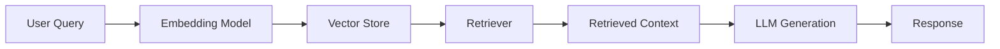
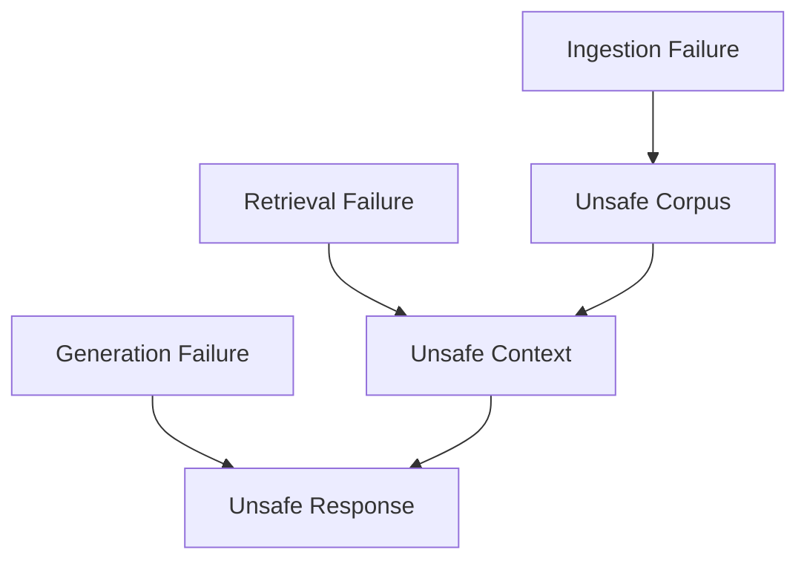
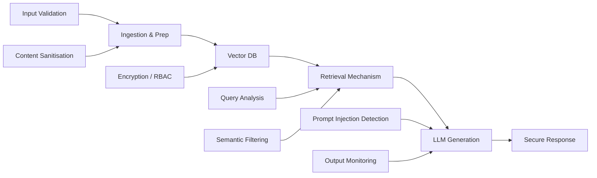

# RAG Security Fundamentals

## Summary

* Retrieval-Augmented Generation (RAG) changes the trust model of an AI system by allowing **external documents to shape model output at inference time**.
* A traditional LLM mostly relies on training-time knowledge. A RAG pipeline adds a new path: **query -> embedding -> vector search -> retrieved context -> generation**.
* This extra path improves freshness and relevance, but it also introduces **inference-time security risk**. Malicious, stale, or misleading content can influence answers without retraining the model.
* The highest-risk zones are **ingestion**, **retrieval**, and **context injection**. Those are the places where untrusted content crosses a trust boundary and becomes model-visible context.
* RAG failures are often silent. Outputs can remain fluent, structured, and convincing while still being wrong, unsafe, or attacker-influenced.
* Good RAG defence is not one filter. It is a **layered architecture** spanning ingestion controls, access control, retrieval constraints, prompt/context separation, output monitoring, and lifecycle governance.

---

## 1. What RAG Changes

### 1.1 Traditional LLM vs RAG

A normal LLM answer is mostly grounded in what the model learned during training.

A RAG system adds a retrieval stage:

* user query is embedded
* vector store finds semantically similar documents
* selected documents are injected into context
* the LLM answers using both the original query and the retrieved material

This means the model is no longer only answering from internal weights. It is now **reasoning over external, runtime-supplied context**.

### 1.2 Core consequence

The model does not independently verify:

* whether the retrieved content is true
* whether it is safe
* whether it is stale
* whether it contains hidden instructions
* whether it came from a trustworthy source

In practice, **placement in context** often acts like authority.

---

## 2. Core Components of a RAG System

| Component | What it does | Security relevance |
| --- | --- | --- |
| Embedding Model | Converts text into vectors | Hides surface wording and metadata inside numerical representation |
| Vector Store | Stores document embeddings | Becomes a high-value target for poisoned or stale documents |
| Retriever | Selects similar documents for a query | Controls what enters context and therefore what can influence output |
| LLM | Generates the final answer | Treats retrieved content as usable context, not as verified truth |

### 2.1 Key terminology

* **Embedding**: the numerical representation used to capture text meaning
* **Retriever**: the component that selects documents for the model
* **Vector store**: the store of document embeddings used for similarity search

---

## 3. RAG-Specific Attack Surface

RAG adds attack surfaces that do not exist, or do not matter as much, in a plain non-retrieval chatbot.

### 3.1 Document ingestion

If malicious, untrusted, or outdated content is admitted into the knowledge base, the system can later retrieve and amplify it.

Security problem:

* ingestion can silently convert untrusted content into available context
* weak approval workflows make poisoning easier
* internal sources are not automatically trustworthy

### 3.2 Embedding generation

Once text is embedded, some useful security context becomes harder to inspect manually.

What weakens here is not meaning, but **security-relevant metadata and interpretability**. Authorship, approval status, and intent are not naturally preserved in a way the model reasons over.

### 3.3 Similarity-based retrieval

RAG retrieval optimises for **semantic relevance**, not trust, correctness, freshness, or safety.

That means an attacker only needs content that *sounds relevant enough* to rank highly.

### 3.4 Context injection

Retrieved documents are inserted into the prompt or adjacent context before generation.

This is the most direct trust-boundary problem:

* the model cannot reliably distinguish instruction from data
* retrieved content can steer tone, framing, and conclusions
* malicious documents can behave like second-order prompts

---

## 4. Why Retrieval Is the Highest-Risk Component

Retrieval is the key choke point because it decides what becomes model-visible reality.

The LLM usually cannot see:

* where a document came from
* why it was retrieved
* whether it outranked other documents unfairly
* whether the content is approved or poisoned

Once the retriever passes it forward, the content is treated as usable background knowledge.

This is why retrieval should be treated as a **security boundary**, not merely a relevance feature.

---

## 5. Retrieval Abuse and Context Manipulation

### 5.1 Passive poisoning

Malicious content is inserted once and left in the knowledge base. The attacker waits for normal user queries to bring it back.

### 5.2 Active manipulation

Documents are deliberately engineered to rank highly for common or sensitive queries.

This is the more aggressive version of retrieval abuse:

* content is crafted for semantic match
* ranking becomes the attack path
* the attacker does not need to touch the live prompt directly

### 5.3 Context manipulation

Once retrieved, a document can:

* insert misinformation
* frame an answer misleadingly
* contain instruction-like text disguised as notes or documentation
* bias the model's interpretation of the query

The critical design weakness is that **retrieval selects by relevance, then generation treats that relevance as context authority**.

---

## 6. Failure Modes That Matter in Practice

### 6.1 Ingestion failure

The wrong content enters the corpus.

Typical causes:

* weak source validation
* missing approval workflows
* poor ownership tracking
* excessive trust in internal feeds or shared documents

### 6.2 Retrieval failure

The wrong content is selected.

Typical causes:

* semantic ranking without trust constraints
* missing freshness logic
* lack of access-aware filtering
* poisoned documents ranking too well

### 6.3 Generation failure

The model presents the wrong content as coherent truth.

Typical causes:

* stale documents treated as current
* prompt/context boundary collapse
* no downstream validation of model claims

---

## 7. Real-World-Framed Scenarios

### 7.1 Enterprise copilots and internal content

When email, documents, or collaboration content are available to a retrieval layer, hidden instructions or misleading guidance embedded in those sources can influence summarisation or downstream actions.

The key lesson is not external equals risky, internal equals safe. Internal content can also become an attack surface if retrieval treats it as trusted context without adequate controls.

### 7.2 Web-connected assistants and plugins

When an LLM retrieves live external content, the trust boundary expands to include third-party sites, APIs, and documents.

This creates classic indirect prompt injection conditions:

* retrieved content enters context
* the model interprets it as relevant input
* hidden instruction-like text can steer behaviour without changing the system prompt

### 7.3 Stale retrieval and governance failure

Not all RAG failures require attackers.

A pipeline can fail simply because:

* old content stays indexed
* update lifecycle is weak
* semantic ranking beats freshness
* the system presents archived information as if it were current

This is a governance failure, not just a model failure.

---

## 8. Defensive Architecture for RAG

### 8.1 Ingestion controls

Strong ingestion controls prevent weak data from entering the vector store in the first place.

Useful controls:

* source review
* ownership tracking
* approval workflows
* update history and versioning
* document lifecycle management
* sanitisation of instruction-like or hidden content

### 8.2 Vector store and access control

The vector layer should not be treated like a passive cache.

Useful controls:

* encryption at rest
* access control / RBAC
* namespace separation
* per-tenant or per-role retrieval boundaries
* metadata-aware filtering before ranking results are used

### 8.3 Retrieval-layer controls

This is where the biggest security payoff often happens.

Useful controls:

* query analysis
* trust-aware ranking or filtering
* freshness checks
* semantic filtering for instruction-like content
* retrieval caps and provenance display
* prompt injection detection on retrieved chunks, not only user input

### 8.4 Generation-layer controls

Generation should assume retrieved context may be imperfect.

Useful controls:

* clear separation between system instructions and retrieved data
* structured prompt templates
* response grounding requirements
* output validation and monitoring
* rate limiting and anomaly detection

---

## 9. Detection and Monitoring

RAG abuse is hard to detect because bad outputs are often still fluent and plausible.

### 9.1 Behavioural monitoring

The most useful detection layer is often **behavioural monitoring** over time.

Things to watch:

* unusual retrieval patterns
* repeated appearance of the same documents
* output tone drifting gradually
* growing dependence on narrow document clusters
* increased frequency of instruction-like retrieved chunks

### 9.2 Output drift

A key warning sign is **output drift**.

Output drift reflects a **slow change in system behaviour caused by gradual influence from malicious, misleading, or stale data**, rather than a sudden catastrophic failure.

That makes it easy to miss if teams only look for obvious breakage.

---

## 10. Public Task Answers

| Question | Answer |
| --- | --- |
| What numerical representation captures the meaning of text in RAG systems? | **embeddings / vectors** |
| Which component selects documents for the LLM? | **retriever** |
| Which RAG stage introduces the largest indirect attack surface? | **retrieval** |
| What is lost during embedding generation that affects security? | **authorship / approval context / source trust metadata in model-visible form** |
| What technique involves crafting malicious content so it ranks highly for sensitive queries? | **active manipulation** |
| What does retrieval select documents based on? | **semantic relevance / similarity** |
| In the web-connected assistant cases, governance gaps occurred in what part of the system? | **the retrieval pipeline** |
| What type of monitoring is useful for detecting RAG poisoning? | **behavioural monitoring** |
| What does output drift reflect instead of a sudden failure? | **gradual influence from malicious or misleading data over time** |

---

## 11. Pattern Cards

### Pattern Card 1 - Relevant but Untrusted

**Failure mode**
A document is semantically relevant but should not be trusted.

**Lesson**
Relevance is not the same as safety or authority.

### Pattern Card 2 - Internal Source, External Risk Profile

**Failure mode**
A document from inside the organization is treated as safe despite being attacker-editable or poorly governed.

**Lesson**
Internal origin does not remove trust-boundary risk.

### Pattern Card 3 - Retrieval as Hidden Prompt Builder

**Failure mode**
The retriever quietly decides which text gets inserted into generation context.

**Lesson**
Retrieval is part of prompt construction and must be secured accordingly.

### Pattern Card 4 - Silent Staleness

**Failure mode**
The model gives polished but outdated answers because old content remains retrievable.

**Lesson**
Freshness controls are a security and governance requirement, not only a quality feature.

### Pattern Card 5 - Poison Once, Influence Many Times

**Failure mode**
A poisoned document remains dormant until normal queries repeatedly surface it.

**Lesson**
Passive poisoning can scale without continuous attacker interaction.

---

## 12. Defensive Takeaways

* Treat retrieval as a **security boundary**.
* Treat vector stores as **security-relevant infrastructure**, not simple search accelerators.
* Separate **relevance** from **trust** in retrieval design.
* Validate and govern documents before they become retrievable context.
* Expect silent failures: fluent output is not proof of safe output.
* Use layered controls across ingestion, retrieval, generation, and monitoring.

---

## 13. CN-EN Glossary

| English | 中文 |
| --- | --- |
| Retrieval-Augmented Generation (RAG) | 检索增强生成 |
| Embedding | 嵌入向量 / 语义向量 |
| Vector Store | 向量存储 |
| Retriever | 检索器 |
| Context Injection | 上下文注入 |
| Inference-time Poisoning | 推理时投毒 |
| Retrieval Abuse | 检索滥用 |
| Passive Poisoning | 被动投毒 |
| Active Manipulation | 主动操纵 / 主动污染排序 |
| Semantic Relevance | 语义相关性 |
| Output Drift | 输出漂移 |
| Freshness Control | 新鲜度控制 |
| Document Lifecycle | 文档生命周期 |
| Behavioural Monitoring | 行为监控 |
| Trust Boundary | 信任边界 |

---

## 14. Further Reading

* OWASP GenAI Security Project
* NIST AI RMF and GenAI Profile
* Microsoft security guidance on prompt abuse and agent runtime risk
* OpenAI plugin safety notes and indirect prompt injection research
