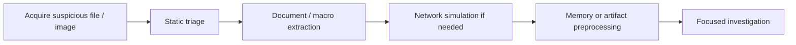

# REMnux: Getting Started

## Summary

REMnux is a purpose-built Linux environment for malware analysis, document analysis, network simulation, and memory investigation. Instead of manually assembling a lab from scratch, REMnux gives the analyst a curated toolbox in one place.

This note focuses on four beginner-useful ideas:

* what REMnux is and why it matters
* how to inspect suspicious Office documents with `oledump.py`
* how to simulate a fake network with `INetSim`
* how to preprocess memory evidence with `Volatility 3` and `strings`

This is not a full malware-analysis manual. It is a practical orientation note.

---

## Why REMnux Exists

Malware analysis has two constant constraints:

* **risk**: executing suspicious files can compromise the analyst environment
* **time**: incident work usually demands fast, defensible answers

REMnux helps by standardizing the analysis workspace.

### Operational Value

* reduces tool installation friction
* gives analysts a repeatable Linux-based analysis environment
* supports both static and controlled dynamic workflows
* is useful for triage, reverse-engineering support, and DFIR preprocessing

### Typical Problem REMnux Solves

```text
Without REMnux:
collect tools -> resolve dependencies -> build safe lab -> test tooling

With REMnux:
open VM -> use curated tools -> focus on evidence
```

---

## Core Tooling Themes in REMnux

Think of REMnux less as "one program" and more as a curated operating environment.

### Major Categories

| Category | Purpose | Example tools |
| --- | --- | --- |
| Static file analysis | inspect suspicious files without executing them | `oledump.py`, `strings`, `file`, `exiftool` |
| Network behavior analysis | simulate or observe communications | `INetSim`, `Wireshark`, `tcpdump` |
| Pattern-based detection | identify known malicious traits | `YARA` |
| Memory forensics | inspect RAM captures | `Volatility 3` |
| General malware triage | pivot across evidence quickly | shell tools, scripting, text processing |

---

## Mental Model: Static vs Controlled Dynamic Analysis

### Static Analysis

Study the file without running it.

Typical questions:

* Does it contain macros?
* Are there suspicious URLs, commands, strings, or file names?
* Is there evidence of downloader behavior?
* Does it reference LOLBins, PowerShell, WScript, or temp paths?

### Controlled Dynamic Analysis

Allow limited interaction in a lab to observe behavior.

Typical questions:

* What domains or IPs does the sample contact?
* Does it download a second stage?
* What protocol does it attempt to use?
* Does it expect internet services to exist?

### Evidence Preprocessing

This sits between raw evidence and real investigation.

Typical questions:

* Can I generate text outputs that are easier to search?
* Can I reduce repetitive manual tool execution?
* Can I hand structured outputs to another analyst faster?

---

## Workflow Map



---

## Part I - Suspicious Document Analysis with `oledump.py`

### What `oledump.py` Is For

`oledump.py` is commonly used to inspect OLE-based Microsoft document structures, especially when looking for embedded macros, streams, and suspicious VBA content.

#### Why It Matters

Malicious Office documents often do not look dangerous at the surface. The real logic may sit inside:

* VBA macro streams
* embedded objects
* compressed VBA content
* obfuscated command strings

### Basic Workflow with a Suspicious Office File

Suppose the file is:

```text
agenttesla.xlsm
```

#### Step 1: Enumerate streams

```bash
oledump.py agenttesla.xlsm
```

This gives a list of internal streams. What usually matters most at first:

* stream indexes
* whether a stream is marked with macro indicators like `M` or `m`
* VBA-related objects such as `ThisWorkbook`, `Sheet1`, or `vbaProject.bin`

#### What to look for

* macro-bearing stream
* suspicious stream size
* workbook-open style logic
* embedded VBA objects

### Stream Selection Logic

If a suspicious stream is identified, select it directly.

Example:

```bash
oledump.py agenttesla.xlsm -s 4
```

Here `-s` means **select** a stream.

At this stage, output may still be hex-heavy or compressed-looking. That is normal.

### VBA Decompression

The first real productivity jump usually comes from VBA decompression.

```bash
oledump.py agenttesla.xlsm -s 4 --vbadecompress
```

This makes macro content readable enough to inspect manually.

#### High-value indicators in decompressed VBA

Look for:

* `Workbook_Open()` or auto-execution logic
* `CreateObject("WScript.Shell")`
* obfuscated PowerShell
* string replacement logic used to hide commands
* `Invoke-WebRequest`
* remote URLs
* temp file creation and execution
* `Start-Process`

### What the AgentTesla Example Is Telling You

The sample from your material contains a clear structure:

1. document open triggers macro execution
2. VBA stores an obfuscated PowerShell command
3. script removes junk characters such as `*` and `^`
4. deobfuscated PowerShell downloads an `.exe`
5. downloaded file is saved to a temp location
6. file is executed

That is classic **staged downloader behavior**.

#### Analyst Interpretation

This document is not just "macro-enabled." It is acting as an initial delivery vehicle for a second-stage payload.

### Quick Macro Triage Checklist

```text
[ ] Is there auto-execution logic?
[ ] Is PowerShell invoked?
[ ] Is execution policy bypassed?
[ ] Is the window hidden?
[ ] Is a remote URL referenced?
[ ] Is a payload written to temp?
[ ] Is a new process started?
```

If you check most of these boxes, the document is already in high-suspicion territory.

### Obfuscation Pattern Recognition

The sample uses simple string obfuscation.

#### Common beginner patterns

* filler characters inserted and later removed
* split strings concatenated at runtime
* encoded PowerShell
* alternate casing
* environment variable abuse

#### Practical lesson

You do not always need full reverse engineering first. Sometimes a small deobfuscation step is enough to expose the attack chain.

---

## Part II - Fake Network Simulation with INetSim

### Why INetSim Matters

Many malware samples expect the internet to exist.

Without a simulated network, the analyst may see only half the behavior:

* no callback
* no second-stage download
* no fake service interaction
* incomplete behavior profile

INetSim solves this by simulating common internet services in a lab.

### Core Use Case

You want a sample to "believe" it is communicating with a real network, while you safely observe:

* what it tries to reach
* which protocol it uses
* what resource path it requests
* what file it tries to download

### Basic INetSim Setup Logic

#### 1. Identify REMnux IP

```bash
ifconfig
```

#### 2. Update configuration

```bash
sudo nano /etc/inetsim/inetsim.conf
```

Change:

```text
#dns_default_ip 0.0.0.0
```

to your REMnux VM IP and remove the comment marker.

#### 3. Confirm config

```bash
cat /etc/inetsim/inetsim.conf | grep dns_default_ip
```

#### 4. Start INetSim

```bash
sudo inetsim
```

You want to see:

```text
Simulation running
```

### What This Actually Does

INetSim makes your lab answer like a fake internet.

#### Example analyst perspective

```text
Sample requests: https://example-malware-c2/payload.exe
INetSim responds with a controlled fake service / fake file
Analyst observes requested URL, protocol, and timing
```

This is extremely useful for behavioral reconstruction.

### Practical Download Test

From another VM, such as an AttackBox, you can request a fake resource:

```bash
wget https://TARGET_IP/second_payload.zip --no-check-certificate
```

Or:

```bash
wget https://TARGET_IP/second_payload.ps1 --no-check-certificate
```

The point is not the downloaded content itself. The point is the **interaction pattern**.

#### What this simulates

* downloader malware
* second-stage retrieval
* script-fetch behavior
* simple beacon-to-download workflow

### Why the Report Output Matters

When INetSim stops, it writes connection reports.

Typical report path:

```bash
/var/log/inetsim/report/
```

#### Why this is valuable

The report gives you a small but useful behavior ledger:

* timestamp
* protocol
* method
* URL
* fake file served

That turns "the sample contacted the internet" into actual evidence.

### Analyst Questions for INetSim Logs

```text
What URL path was requested?
Was the request HTTP or HTTPS?
What file name was served?
Did the sample request multiple stages?
Did the same host request homepage-like probes before payloads?
```

---

## Part III - Memory Investigation Preprocessing

### Why Preprocessing Matters

Raw memory images are large and cognitively expensive.

If every analyst begins from raw RAM each time, effort is wasted.

Preprocessing creates searchable outputs that support:

* faster triage
* repeatable workflows
* easier keyword searches
* better handoff to teammates

### Volatility 3 in REMnux

Volatility 3 is the standard memory-forensics framework used to analyze artifacts from memory images.

In this note, the emphasis is not on deep interpretation of each plugin result. The emphasis is on **structured evidence extraction**.

### Example Memory Image Workflow

Target file:

```text
wcry.mem
```

Base pattern:

```bash
vol3 -f wcry.mem <plugin>
```

#### Useful starter plugins

| Plugin | Purpose |
| --- | --- |
| `windows.pstree.PsTree` | process hierarchy |
| `windows.pslist.PsList` | active process listing |
| `windows.cmdline.CmdLine` | process command lines |
| `windows.filescan.FileScan` | file object scanning |
| `windows.dlllist.DllList` | loaded modules / DLLs |
| `windows.psscan.PsScan` | scan for process objects |
| `windows.malfind.Malfind` | suspicious injected code regions |

### Why These Plugins Matter Together

One plugin rarely tells the full story.

#### Example correlation logic

* `PsList` tells you what is active
* `PsTree` tells you who launched whom
* `CmdLine` tells you how it was executed
* `DllList` helps explain dependencies or injected libraries
* `Malfind` highlights suspicious executable memory regions
* `FileScan` shows file-object traces even when the file is no longer easy to access on disk

This is evidence fusion, not one-command truth.

### Batch Preprocessing with a Loop

This is the most operationally useful part.

```bash
for plugin in windows.malfind.Malfind windows.psscan.PsScan windows.pstree.PsTree windows.pslist.PsList windows.cmdline.CmdLine windows.filescan.FileScan windows.dlllist.DllList; do vol3 -q -f wcry.mem $plugin > wcry.$plugin.txt; done
```

#### What this achieves

* runs multiple plugins consistently
* suppresses progress noise with `-q`
* saves each output into its own `.txt` file
* creates a reusable artifact set for later searching

#### Why this matters in practice

Instead of rerunning plugins again and again, you generate a working evidence pack once.

### Strings Preprocessing

Raw memory also contains useful printable strings.

#### ASCII strings

```bash
strings wcry.mem > wcry.strings.ascii.txt
```

#### Unicode little-endian strings

```bash
strings -e l wcry.mem > wcry.strings.unicode_little_endian.txt
```

#### Unicode big-endian strings

```bash
strings -e b wcry.mem > wcry.strings.unicode_big_endian.txt
```

### Why Three String Passes?

Because malware artifacts and Windows-related content may appear in different encodings.

#### You may recover

* URLs
* file paths
* mutex names
* command fragments
* ransom note text
* service names
* registry-like strings
* suspicious extensions

#### Practical note

ASCII-only extraction is often not enough for Windows-heavy artifacts.

### Evidence Preprocessing Philosophy

Preprocessing is not "busy work." It is defensive acceleration.

#### Goal

Transform this:

```text
one huge opaque memory image
```

into this:

```text
multiple searchable text outputs
```

That enables:

* grep-style investigation
* IOC pivoting
* timeline reconstruction support
* easier review by another analyst

### Suggested Directory Hygiene

Keep outputs organized.

#### Example layout

```text
case-remnux-lab/
├── samples/
│   └── agenttesla.xlsm
├── network/
│   ├── inetsim-report.txt
│   └── notes.md
├── memory/
│   ├── wcry.mem
│   ├── wcry.windows.pslist.PsList.txt
│   ├── wcry.windows.pstree.PsTree.txt
│   ├── wcry.windows.cmdline.CmdLine.txt
│   ├── wcry.windows.filescan.FileScan.txt
│   ├── wcry.windows.dlllist.DllList.txt
│   ├── wcry.windows.psscan.PsScan.txt
│   ├── wcry.windows.malfind.Malfind.txt
│   ├── wcry.strings.ascii.txt
│   ├── wcry.strings.unicode_little_endian.txt
│   └── wcry.strings.unicode_big_endian.txt
└── report-notes/
    └── triage-summary.md
```

---

## Common Analyst Mistakes

### 1. Treating REMnux as "safe enough" without isolation thinking

REMnux is safer than improvising on your daily machine, but analysis discipline still matters.

### 2. Running Suspicious Samples Too Early

Do static triage first. Running first and thinking later is amateur behavior.

### 3. Ignoring Simple Text Clues

A lot of beginner malware reveals enough through macros, strings, paths, and URLs.

### 4. Not Saving Outputs

If a tool result is useful, save it immediately. Terminal-only analysis is fragile.

### 5. Over-Reading One Plugin

Memory work is correlation-heavy. Single artifacts mislead easily.

---

## Fast Triage Checklist for REMnux Labs

```text
Document sample
[ ] Run file identification
[ ] Enumerate OLE/VBA streams
[ ] Decompress macros
[ ] Extract URLs / commands / filenames
[ ] Identify execution chain

Network simulation
[ ] Configure INetSim DNS default IP
[ ] Start simulation
[ ] Trigger controlled requests
[ ] Save connection report

Memory evidence
[ ] Identify target image and OS family
[ ] Run core Volatility plugins
[ ] Batch-save outputs
[ ] Extract strings in multiple encodings
[ ] Build searchable artifact set
```

---

## REMnux Use Cases by Task Type

| Task | Best-fit REMnux angle |
| --- | --- |
| suspicious Office document | `oledump.py`, string cleanup, macro review |
| downloader / staged malware | INetSim + network observation |
| suspected memory compromise | Volatility + strings preprocessing |
| IOC extraction | grep/search through saved outputs |
| analyst handoff | package text outputs and summary notes |

---

## First-Principles View

REMnux is valuable because malware analysis usually depends on four things:

```text
Environment + Tooling + Evidence Discipline + Interpretation
```

REMnux mainly solves the first two.

You still have to supply the last two.

---

## Key Takeaways

* REMnux is a Linux malware-analysis distribution designed to reduce setup friction and centralize common analysis tools.
* `oledump.py` is strong for inspecting malicious Office-style documents and uncovering macro-based execution chains.
* VBA decompression often turns an unreadable stream into a visible downloader workflow.
* INetSim helps simulate network services so a sample can reveal internet-dependent behavior safely in a lab.
* Volatility 3 plus batch output generation is a practical preprocessing workflow for memory evidence.
* `strings` extraction in ASCII and Unicode formats is a low-cost, high-yield preprocessing step.
* The real analyst skill is not "knowing one tool," but building a repeatable evidence workflow.

---

## Further Reading

* REMnux official docs
* Volatility 3 documentation
* INetSim documentation
* YARA rule-writing guides
* Didier Stevens Suite notes for `oledump.py`

---

## CN-EN Glossary

* malware analysis - 恶意软件分析
* static analysis - 静态分析
* dynamic analysis - 动态分析
* sandbox - 沙箱
* macro - 宏
* VBA - Visual Basic for Applications / VBA 宏脚本
* OLE - 对象链接与嵌入 / 复合文档结构
* stream - 数据流
* downloader - 下载器
* second stage / secondary payload - 第二阶段载荷
* obfuscation - 混淆
* deobfuscation - 去混淆
* fake network simulation - 虚假网络模拟
* memory image - 内存镜像
* preprocessing - 预处理
* artifact - 工件 / 证据产物
* IOC - 入侵指标
* reverse shell - 反弹 shell
* command line arguments - 命令行参数
* injected code - 注入代码
* loaded module / DLL - 已加载模块 / DLL
* evidence pack - 证据包
* triage - 初步研判 / 分诊
