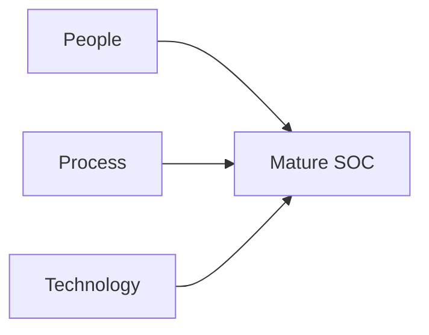
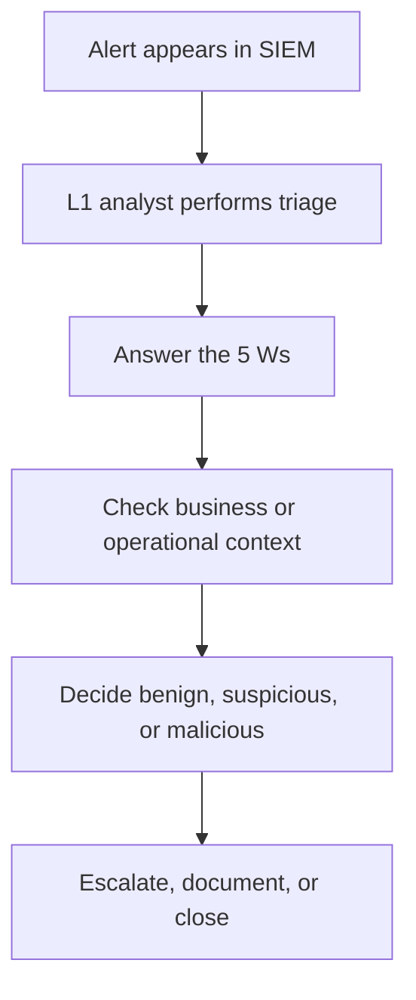

# SOC Fundamentals

## Summary

* A **SOC (Security Operations Center)** is a dedicated function or team responsible for continuously monitoring an organization's environment to **detect** and **respond** to security threats.
* The room is built around two foundational ideas:
  * a SOC exists to keep **detection and response** operational,
  * a mature SOC depends on the interaction of **People, Process, and Technology**.
* The room divides SOC capability into three practical layers:
  * **People**: analysts, engineers, managers
  * **Process**: triage, escalation, reporting, incident response
  * **Technology**: SIEM, EDR, firewall, and other security controls
* The most important beginner concept is that SOC work is not "watch dashboards all day." It is structured decision-making under uncertainty.
* The practical exercise simulates a **Level 1 analyst** reviewing a SIEM alert and answering the **5 Ws** to determine whether the activity is malicious or benign.
* This room is a strong baseline because it connects blue-team vocabulary to a concrete alert-handling workflow.

---

## 1. Context

This room is an introduction to the operational side of defensive security.

It is not focused on exploitation, malware reverse engineering, or advanced threat hunting. Its job is to explain:

* why organizations need a SOC,
* what the SOC is trying to achieve,
* who works there,
* what processes they follow,
* what technologies support them,
* how a Level 1 analyst thinks during early-stage alert review.

A good way to read this room is:

* **Task 2** explains the SOC mission.
* **Task 3** explains the people.
* **Task 4** explains the process.
* **Task 5** explains the technology.
* **Task 6** shows the workflow in action.

---

## 2. Purpose Of A SOC

The room states the central mission correctly:

```text
SOC exists to preserve detection and response capability.
```

That sounds abstract, but it has direct operational meaning.

### 2.1 Detection

The SOC is concerned with finding security-relevant conditions such as:

* vulnerabilities that materially affect organizational risk,
* unauthorized activity,
* policy violations,
* confirmed or suspected intrusions.

#### Important Nuance

Not every vulnerability belongs operationally to the SOC, but the SOC still cares because unresolved weakness affects overall security posture.

### 2.2 Response

Detection without response is mostly monitoring theater.

The SOC's response role includes:

* assisting incident response,
* escalating serious findings,
* minimizing impact,
* supporting root-cause analysis,
* helping guide containment.

This is why the room keeps detection and response together rather than treating them as separate worlds.

---

## 3. The Three Pillars: People, Process, Technology

This is the room's structural backbone.

### 3.1 People

People interpret noisy signals, decide what matters, escalate correctly, and respond intelligently.

Without people, security tooling becomes alert spam.

### 3.2 Process

Process ensures that alerts are handled consistently rather than emotionally or randomly.

Without process, even good analysts become inefficient.

### 3.3 Technology

Technology provides visibility, scale, and automation.

Without technology, manual defense does not scale.

#### Core Lesson



No single pillar is enough by itself.

---

## 4. People In A SOC

The room lays out a common tiered model. This is simplified, but useful for beginners.

### 4.1 SOC Analyst Level 1

Primary responsibility:

* first-line alert triage,
* basic analysis,
* reporting and escalation through the correct channel.

#### Why Level 1 Matters

Level 1 is the front gate of the SOC. If they fail badly, everything behind them gets distorted.

### 4.2 SOC Analyst Level 2

Primary responsibility:

* deeper investigation,
* cross-source correlation,
* more detailed event analysis.

#### Why Level 2 Matters

They convert suspicious signals into better-grounded conclusions.

### 4.3 SOC Analyst Level 3

Primary responsibility:

* advanced investigation,
* threat hunting,
* high-severity incident support,
* helping with containment, eradication, and recovery contexts.

### 4.4 Security Engineer

Primary responsibility:

* deploy and maintain security tooling,
* ensure SIEM, EDR, and related platforms operate correctly,
* support visibility and sensor quality.

### 4.5 Detection Engineer

Primary responsibility:

* write and tune detection rules,
* improve alert quality,
* convert threat ideas into machine-detectable logic.

### 4.6 SOC Manager

Primary responsibility:

* coordinate the team,
* maintain process discipline,
* report posture and status upward,
* align work with organizational priorities.

---

## 5. Process In A SOC

The room highlights three processes that matter early in a SOC career:

* alert triage,
* reporting,
* incident response and forensics support.

### 5.1 Alert Triage

Triage is the first serious analysis step after an alert appears.

Its purpose is to answer:

* how severe is this,
* how credible is this,
* what happened,
* what should happen next.

#### The 5 Ws Framework

The room uses the classic investigation frame:

* **What?** What happened?
* **When?** When did it happen?
* **Where?** On what system, path, host, or network location?
* **Who?** Which user, host, or actor is associated?
* **Why?** What explains the activity or motive or context?

This is beginner-friendly and genuinely useful.

### 5.2 Reporting

Once harmful activity is identified, the SOC should report it clearly.

A useful report should include:

* the 5 Ws,
* evidence, screenshots, or log references,
* severity or priority context,
* escalation path or next action.

### 5.3 Incident Response And Forensics

If the activity is serious enough, the issue stops being "just an alert" and becomes an incident.

At that point, response may involve:

* containment,
* eradication,
* recovery,
* forensic analysis,
* root-cause review.

---

## 6. Technology In A SOC

Technology is what gives the SOC its sensory system and much of its operating leverage.

The room highlights three common categories:

* SIEM
* EDR
* Firewall

### 6.1 SIEM

SIEM centralizes logs, correlates them, applies detection logic, and raises alerts.

#### What SIEM Is Best At

* collecting and normalizing data,
* correlation across sources,
* rule-based and analytics-driven detection,
* investigation through searchable event history.

#### Important Limitation

SIEM is primarily a **detection and visibility** platform. Response is often integrated indirectly, or performed through adjacent platforms and playbooks.

### 6.2 EDR

EDR provides deep endpoint visibility and response capabilities.

#### What EDR Is Best At

* endpoint telemetry,
* real-time and historical host activity,
* process, file, and user investigation,
* host-level response actions.

### 6.3 Firewall

A firewall monitors and filters network traffic entering and leaving a host or network boundary.

#### What Firewalls Are Best At

* traffic control,
* blocking unauthorized network communication,
* enforcing boundary policy,
* sometimes providing detection around suspicious traffic patterns.

---

## 7. Practical Investigation Model

The practical exercise is one of the strongest parts of the room because it compresses real SOC thinking into a manageable scenario.

### 7.1 Scenario Summary

You are acting as a **Level 1 SOC analyst**.

You receive an alert that indicates:

* **port scanning activity**
* originating from source IP **`CLIENT_IP`**

The room explicitly tells you that the vulnerability assessment team had already notified the SOC that they were running a port scan from that host.

That one sentence is the key to the whole exercise.

### 7.2 What The Exercise Is Really Testing

It is not testing whether you can identify a port scan.

It is testing whether you can:

* correlate the alert with preexisting operational context,
* answer the 5 Ws,
* decide whether the event is suspicious or expected.

That is real SOC work.

---

## 8. Lab Notes

From the screenshots and the room text, the alert under investigation is:

* **Port Scanning Activity Detected from IP: `CLIENT_IP`**

Visible details in the log table include:

* **Time**: June 12, 2024 17:24
* **Source IP**: `CLIENT_IP`
* **Destination IP**: `TARGET_IP`
* **Source Host Name**: approved vulnerability scanner
* **Destination Host Name**: `TARGET_HOST`
* Multiple destination ports being touched, for example `443`, `53`, `22`, and `21`

### 8.1 Reconstructed 5 Ws

#### What?

* A port scan was observed.

#### When?

* June 12, 2024 at 17:24.

#### Where?

* Source: `CLIENT_IP` / approved scanner host
* Destination: `TARGET_IP` / `TARGET_HOST`

#### Who?

* The vulnerability assessment team, using the approved scanning host `CLIENT_IP`.

#### Why?

* Authorized internal vulnerability assessment and security testing activity.

### 8.2 Proper Conclusion

Because the vulnerability assessment team had already notified the SOC, this should be treated as:

* **expected or benign operational activity**
* effectively a **false positive in the alerting sense**, or more precisely an alert that is operationally non-malicious because context explains it.

That is the real lesson.

### 8.3 Flag Observed In The Screenshot

The screenshot shows the flag:

```text
FLAG_REDACTED
```

---

## 9. Pattern Cards

### Pattern Card 1 - A SOC Is A Decision Center, Not Just A Monitoring Room

**Problem**
: people imagine a SOC as a wall of dashboards.

**Better view**
: it is an operational function for detection, triage, escalation, and response support.

**Reason**
: dashboards without decision-making are just screens.

### Pattern Card 2 - People Prevent Tool Noise From Becoming Operational Failure

**Problem**
: automation is assumed to replace analysts.

**Better view**
: analysts convert noisy detections into meaningful action.

**Reason**
: alerts without human judgment produce waste.

### Pattern Card 3 - The 5 Ws Are A Triage Scaffold

**Problem**
: new analysts read logs but do not structure their thinking.

**Better view**
: use What, When, Where, Who, and Why to shape first-pass analysis.

**Reason**
: structure reduces confusion and improves reporting.

### Pattern Card 4 - Context Decides Whether An Alert Is Dangerous

**Problem**
: every alert is treated as equally suspicious.

**Better view**
: known operational activity can explain a detection completely.

**Reason**
: security events are not automatically security incidents.

### Pattern Card 5 - Detection And Response Are Linked, Not Separate Silos

**Problem**
: learners treat "detect" and "respond" as different worlds.

**Better view**
: detection is only useful if it supports triage and response.

**Reason**
: the SOC exists to preserve both capabilities together.

---

## 10. Mini Workflow



That is the practical workflow the room is teaching.

---

## 11. Common Pitfalls

### 11.1 Treating Every Detection As An Incident

A detection can be valid without being malicious.

### 11.2 Ignoring Prior Operational Context

If the vulnerability team announced a scan, a port-scanning alert should be interpreted through that context.

### 11.3 Mixing Up Detection Tooling Roles

SIEM, EDR, and firewalls overlap, but they do not solve identical problems.

### 11.4 Skipping Structured Reporting

Good triage that is badly communicated still creates operational drag.

### 11.5 Underestimating Level 1 Analyst Importance

Bad first-pass triage creates downstream chaos for everyone else.

---

## 12. Takeaways

* SOC exists to continuously monitor, detect, and support response across the organization's environment.
* The three pillars of SOC are **People, Process, and Technology**.
* Level 1 analysts are the first responders in alert triage, while detection engineers build the logic that helps security tools fire correctly.
* SIEM provides visibility and detection, EDR provides endpoint-focused investigation and response, and firewalls enforce traffic control.
* The practical lab teaches the most important beginner lesson in blue-team work: **context decides meaning**.

---

## 13. CN-EN Glossary

* SOC - Security Operations Center, 安全运营中心
* Detection - 检测
* Response - 响应
* Alert Triage - 告警分诊 / 初筛
* Escalation - 升级上报
* Incident Response - 事件响应
* Forensics - 取证
* Level 1 Analyst - 一级 SOC 分析师
* Level 2 Analyst - 二级 SOC 分析师
* Level 3 Analyst - 三级 SOC 分析师
* Detection Engineer - 检测工程师
* Security Engineer - 安全工程师
* SIEM - 安全信息与事件管理
* EDR - 终端检测与响应
* Firewall - 防火墙
* Baseline - 基线
* False Positive - 误报
* True Positive - 真阳性 / 有效命中
* 5 Ws - What / When / Where / Who / Why 五问框架
* Port Scan - 端口扫描
* Vulnerability Assessment - 漏洞评估

---

## 14. References

* TryHackMe room content: *SOC Fundamentals*
* Microsoft documentation for security operations workflows, EDR capabilities, and Windows Firewall overview
* CISA incident response guidance and playbooks
