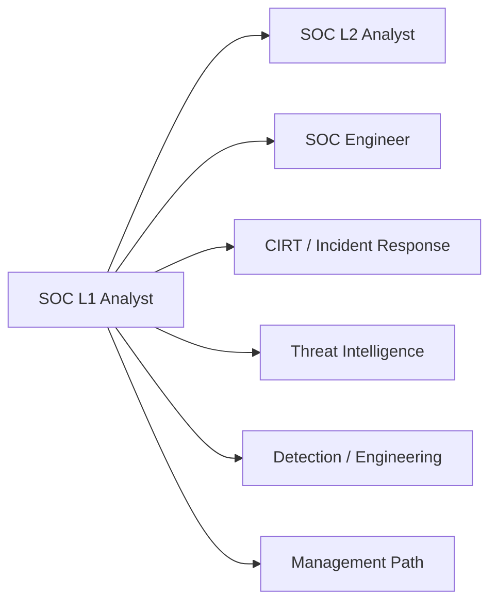

# SOC Role in Blue Team

## Summary

* This room explains **where SOC sits inside a company's wider security hierarchy**.
* The central distinction is between **executive security leadership**, **team-level management**, and **technical roles**.
* Blue Team is the defensive side of security. SOC is only one part of it, although it is often the first operational entry point for beginners.
* A SOC L1 analyst is the **first-line triage role**, not the final destination. The room frames SOC as a launchpad into L2, engineering, incident response, threat intel, forensics, AppSec, GRC, and management.
* The challenge section is really a role-mapping exercise: **choose the right team for the right problem**.

```text
Company leadership
    -> security leadership (CISO / CIO / CTO)
        -> security departments
            -> Blue Team / Red Team / GRC
                -> SOC / CIRT / specialized roles
```

---

## 1. Security Hierarchy: Where SOC Actually Lives

A useful beginner correction is this:

**SOC is not "the whole cyber security team."**
It is one operational unit inside a larger structure.

### High-level hierarchy

| Layer | Typical roles | Primary focus |
| --- | --- | --- |
| Executives | CEO, CFO, owner | business priorities, risk tolerance, budget |
| Security leadership | CISO, CIO, CTO | company-wide security program and direction |
| Team managers | SOC Manager, Red Team Lead, GRC lead | manage one security function |
| Technical staff | analysts, engineers, responders, pentesters | day-to-day security execution |

### Core point

Executives usually do **not** manage technical alerts or tools. They delegate security direction to leadership roles such as the **CISO**.

**Task answers**

* Senior role making key cyber security decisions: **CISO**
* Common name for roles like SOC analysts and engineers: **Blue Team**

---

## 2. Blue Team: Defensive Security in Practice

Blue Team is responsible for **defending**, **monitoring**, **investigating**, and **responding**.

This room divides Blue Team into three broad areas:

1. **SOC** - continuous monitoring and alert handling
2. **CIRT / CSIRT / CERT** - urgent response and deep incident handling
3. **Specialized defensive roles** - narrow, advanced, high-depth functions

### Mental model

```text
SOC   = first line of defense
CIRT  = cyber firefighters
Specialists = deep-focus support functions
```

**Task answers**

* Blue Team focuses on: **defensive** security
* Department handling active or urgent incidents: **CIRT / CSIRT / CERT**

---

## 3. SOC: First Line of Defense

SOC is presented here as the most common starting point for a beginner cyber career.

### Typical SOC structure

| Role | Main function |
| --- | --- |
| SOC L1 Analyst | triage alerts, validate suspicious activity, escalate when needed |
| SOC L2 Analyst | investigate more complex cases, perform deeper analysis |
| SOC Engineer | build, tune, and maintain tools like SIEM and EDR |
| SOC Manager | manage the team, process, reporting, and priorities |

### What SOC usually does

* monitors logs and alerts
* investigates suspicious behavior
* builds or improves detection rules
* coordinates with IT and other teams
* writes summary reports
* often operates 24/7

### Operational view

SOC is strong at **breadth**.
It sees many alerts, many hosts, many log sources, and many low-to-medium complexity incidents.
It is not always the final authority for major breaches.

---

## 4. CIRT / CSIRT / CERT: Cyber Firefighters

When a case becomes too severe, too complex, or too time-sensitive for ordinary SOC handling, escalation goes to incident response.

### Typical CIRT functions

| Function | Why it matters |
| --- | --- |
| handles critical incidents | ransomware, major compromise, cross-region breach |
| supports SOC | advanced investigation support |
| performs deep forensics | disk, memory, timeline, malware, root cause |
| recovers breached systems | containment, eradication, restoration |
| identifies hidden threats | persistence, lateral movement, stealth tooling |

### Important distinction

SOC is continuous operational defense.
CIRT is focused incident response under pressure.

That distinction matters for role selection during real incidents.

---

## 5. Specialized Defensive Roles

Large organizations often need specialists beyond ordinary SOC staffing.

### Examples from the room

| Role | Focus |
| --- | --- |
| Digital Forensics Analyst | disk/memory evidence, deep compromise reconstruction |
| Threat Intelligence Analyst / Threat Researcher | adversaries, TTPs, campaigns, reports |
| AppSec Engineer | secure software lifecycle and application risk |
| AI Researcher | AI threats, model abuse, defense methods |

### Broader support roles shown in the diagrams

| Role | Function |
| --- | --- |
| DevSecOps | security embedded into infrastructure and deployment pipelines |
| Penetration Tester | finds weaknesses before attackers do |
| GRC Auditor | policies, compliance, audit readiness |
| Threat Analyst | adversary behavior and intelligence interpretation |

### Key idea

Blue Team is not one job title. It is an ecosystem of defensive functions.

---

## 6. Internal SOC vs MSSP

A very practical part of this room is the comparison between **internal SOC** and **MSSP**.

### Definitions

* **Internal SOC**: a company's in-house security operations team
* **MSSP**: **Managed Security Services Provider**, an external company delivering SOC-like security services for many customers

### Comparison

| Topic | Internal SOC | MSSP |
| --- | --- | --- |
| Environment | one organization | many customers |
| Pace | often calmer, more contextual | often faster, queue-driven |
| Tooling | fewer tools, deeper familiarity | many tools, less consistency |
| Incident exposure | fewer major incidents | more frequent incident variety |
| Learning style | depth in one environment | breadth across many environments |

### Career reading

Internal SOC is better for:

* understanding one business deeply
* learning one stack thoroughly
* building internal relationships

MSSP is better for:

* fast exposure to many cases
* seeing diverse tools and attack patterns
* accelerating triage experience under pressure

**Task answer**

* Cyber security company providing SOC services: **MSSP**

---

## 7. Career Path: Why L1 Is a Good Starting Point

The room argues that L1 is valuable because it gives broad exposure.

That is correct.

A beginner usually lacks three things:

* production context
* alert judgment
* incident pattern recognition

SOC L1 gives all three, if the environment is healthy.

### Typical progression



### Natural next step

The most direct progression is:

**SOC L1 -> SOC L2 Analyst**

**Task answer**

* Role naturally continuing SOC L1 journey: **SOC L2 Analyst**

---

## 8. What Makes a Good SOC L1 Analyst

The diagram in the room gives four useful beginner principles:

### 8.1 Learn from every alert

Treat alerts as training data, not only as interruptions.

### 8.2 Think like an attacker

Before asking "how do I close this alert," ask:

* why would an attacker do this?
* what objective would this behavior support?
* what stage of the intrusion could this represent?

### 8.3 Verify everything

Do not trust labels blindly. Alerts are hypotheses, not truth.

### 8.4 Get involved in incidents

Real incidents compress learning. A difficult week in production can teach more than many isolated labs.

---

## 9. Final Challenge: Correct Role-to-Scenario Mapping

The challenge is a good test because it forces you to think structurally.

You are not choosing "who is smartest."
You are choosing **who is responsible by function**.

### Challenge mapping

| Scenario | Correct role | Why |
| --- | --- | --- |
| SIEM alert about FW-NY-01 firewall brute-force; who should triage it? | **SOC L1 Analyst** | triage is first-line SOC work |
| HR manager Anna launched phishing malware; who should make a deep analysis? | **SOC L2 Analyst** | deeper investigation belongs to advanced SOC analysis |
| Office in France was hit with ransomware; immediate response required | **CERT Lead** | urgent breach handling needs incident response leadership |
| Servers storing credit cards require PCI DSS audit | **GRC Auditor** | compliance and audit ownership belongs to GRC |
| Check the new version of tryhackme.thm for vulnerabilities | **Penetration Tester** | proactive security testing fits offensive assurance |
| SIEM is unavailable due to storage limit; who investigates? | **SOC Engineer** | tooling/platform issue, not analyst triage |
| FIN7 actively targets the company; who can analyze their tactics? | **Threat Researcher** | adversary-focused analysis belongs to threat intel/research |

### Why this matters

This is the difference between a mature and immature security organization.

An immature organization throws every problem at "the SOC."
A mature organization routes each problem to the correct function.

---

## 10. Pattern Cards

### Pattern Card - SOC L1

**Core job:** validate and triage alerts
**Strength:** speed, coverage, first response
**Escalates when:** complexity, uncertainty, or severity rises

### Pattern Card - SOC L2

**Core job:** deeper investigation
**Strength:** context, correlation, advanced analysis
**Escalates when:** incident becomes organization-level or requires IR authority

### Pattern Card - SOC Engineer

**Core job:** maintain and improve security tooling
**Strength:** SIEM, EDR, parsers, rules, pipelines, platform health
**Called when:** monitoring infrastructure breaks or needs tuning

### Pattern Card - CIRT / CERT

**Core job:** contain and manage serious incidents
**Strength:** crisis handling, forensics, restoration, cross-team coordination
**Called when:** breach is active, urgent, or high-impact

### Pattern Card - GRC

**Core job:** governance, policy, audit, compliance
**Strength:** regulatory alignment and assurance
**Called when:** PCI DSS, ISO, audit, control mapping, policy review

### Pattern Card - Threat Research / Threat Intel

**Core job:** analyze adversaries and campaigns
**Strength:** TTP mapping, actor tracking, strategic context
**Called when:** you need to understand "who targets us and how"

---

## 11. Practical Interview-Level Distinctions

These are the distinctions beginners often blur.

### SOC vs CIRT

* SOC monitors and triages continuously
* CIRT handles serious incident response and deep containment

### L1 vs L2

* L1 validates and routes
* L2 investigates and correlates more deeply

### SOC Engineer vs Analyst

* analyst investigates detections
* engineer builds and maintains the detection platform

### Threat Intel vs Pentest

* threat intel studies attackers and campaigns
* pentest proactively tests your systems for weaknesses

### GRC vs Technical Security

* GRC asks whether controls meet policy and regulation
* technical roles ask whether systems are actually secure and monitored

---

## 12. CN-EN Glossary

* Blue Team - 蓝队
* Security Operations Center (SOC) - 安全运营中心
* SOC L1 Analyst - 一线 SOC 分析师
* SOC L2 Analyst - 二线 SOC 分析师
* SOC Engineer - SOC 工程师
* SOC Manager - SOC 经理
* CIRT / CSIRT / CERT - 事件响应团队 / 计算机安全事件响应团队
* Incident Response - 事件响应
* Threat Intelligence - 威胁情报
* Threat Researcher - 威胁研究员
* Digital Forensics - 数字取证
* Governance, Risk, and Compliance (GRC) - 治理、风险与合规
* GRC Auditor - 合规 / 审计人员
* Managed Security Services Provider (MSSP) - 托管安全服务提供商
* Detection Rule - 检测规则
* Triage - 分诊 / 初步研判
* Escalation - 升级处理
* Compliance - 合规
* PCI DSS - 支付卡行业数据安全标准

---

## 13. Takeaways

This room is simple, but it teaches one very important professional habit:

**security work is role-shaped.**

Not every security problem belongs to the same person.
A brute-force alert, a malware analysis case, a ransomware incident, a SIEM storage issue, and a PCI DSS audit are all "security," but they belong to different operational owners.

That is how real organizations scale.

For a beginner, the most useful conclusion is this:

**SOC L1 is broad enough to teach you the landscape, but specific enough to build real operational judgment.**

That makes it a strong first role.

---

## 14. Minimal Review Checklist

```text
[ ] I can explain where SOC sits in a company structure.
[ ] I can distinguish Blue Team, Red Team, and GRC.
[ ] I can explain the difference between SOC and CIRT.
[ ] I can distinguish L1, L2, engineer, and manager responsibilities.
[ ] I can explain the difference between internal SOC and MSSP.
[ ] I can map common incident scenarios to the correct role.
```

---

## 15. Suggested Next Note

A good follow-up note would cover:

* what SOC actually monitors
* core security telemetry types
* common SOC detections
* alert lifecycle from ingestion to escalation
* how identity, endpoints, email, and network visibility connect in Blue Team work
