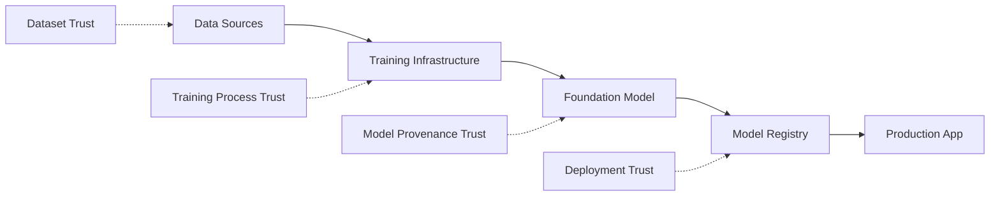
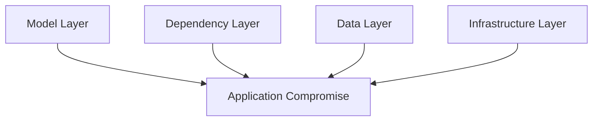
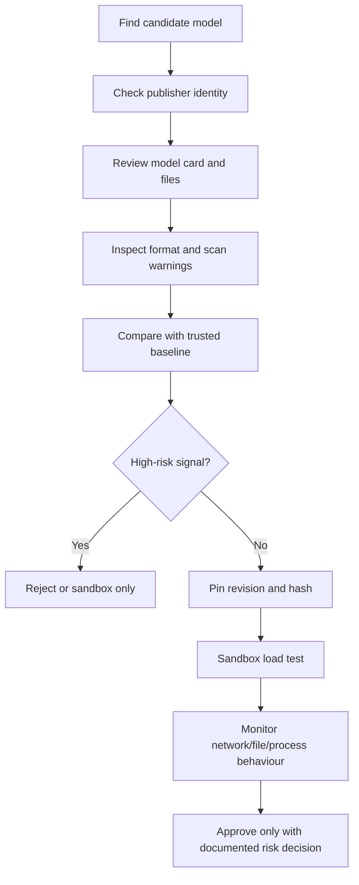

# Understanding AI Supply Chains

## Summary

* AI supply-chain security extends traditional software supply-chain security
  into **models, datasets, frameworks, dependencies, infrastructure, and hosted
  API providers**.
* The core idea is simple: your application inherits the risk of every upstream
  artefact it trusts. In AI, that includes not only code packages, but also
  **model weights, training data, fine-tuning adapters, model registries, and
  repository metadata**.
* AI supply-chain attacks work because they exploit trust. A model can look
  useful, documented, and professional while still executing code at load time
  or containing hidden behavioural backdoors.
* There are two main consumption paradigms: **downloaded model files** and
  **hosted API calls**. The first crosses your trust boundary as executable
  artefacts; the second hides the supply chain behind a provider endpoint.
* The four primary attack layers are **model**, **dependency**, **data**, and
  **infrastructure**. Each layer has different failure modes and requires
  different controls.
* Safe formats such as **SafeTensors** reduce serialization-level risk, but
  they do not eliminate architecture-level or weight-level attacks.
* A production model review should inspect **provenance, organization trust,
  download history, file formats, scanner findings, community signals,
  licensing, and reproducibility** before any deployment approval.



---

## 1. Core Security Interpretation

Traditional supply-chain security asks: **what third-party code did we
inherit?**

AI supply-chain security asks a wider question:

> What third-party knowledge, weights, data, formats, tools, infrastructure,
> and provider decisions did we inherit without independently verifying them?

That distinction matters because AI artefacts are not all human-readable source
code. A model may behave correctly on normal tests while still containing:

* malicious serialized code
* hidden trigger behaviour
* poisoned training influence
* unsafe dependencies
* compromised maintainer updates
* unreviewed adapters or quantized variants

The practical rule is blunt:

> Do not treat a model repository like a harmless download page. Treat it like
> an executable software dependency with extra hidden state.

---

## 2. Traditional vs AI Supply Chain

### 2.1 Traditional software supply chain

In ordinary software, the chain usually includes:

* application source code
* package dependencies
* transitive dependencies
* build infrastructure
* package registry
* deployment pipeline

A compromise upstream can affect every downstream consumer.

### 2.2 AI supply chain

AI adds components that do not fit cleanly into classic dependency thinking:

| Component | What it is | Why it matters |
| --- | --- | --- |
| Models | Pre-trained weights and architectures | May include malicious serialization, hidden backdoors, or unsafe transformations |
| Datasets | Training and evaluation data | Poisoned samples can influence downstream behaviour without breaking normal accuracy |
| Frameworks | PyTorch, TensorFlow, scikit-learn, Transformers, etc. | Framework bugs or unsafe loading behaviours can become execution paths |
| Dependencies | NumPy, tokenizers, Pillow, filelock, etc. | Transitive dependencies expand the attack surface silently |

### 2.3 Room answer: four components alphabetically

```text
Datasets, Dependencies, Frameworks, Models
```

---

## 3. Why AI Supply Chains Are Unusually Risky

### 3.1 Model files can behave like code

The room's strongest warning is about serialized model files.

Pickle-based formats can contain serialized Python objects. When deserialized
unsafely, those objects can execute code at load time. This is why loading an
untrusted model can be equivalent to running untrusted code.

The important distinction:

* a `.safetensors` file is designed to store tensor data without executable
  pickle logic
* `.pkl`, `.pt`, and some `.bin` workflows can involve pickle-based loading
  risk
* `.gguf` is not a pickle format, but can still carry model-behaviour risk at
  the weights level

### 3.2 Transfer learning propagates trust

Modern AI teams rarely train everything from scratch. They usually download a
base model and fine-tune it.

This creates inherited risk:

* a compromised foundation model can affect every fine-tuned descendant
* fine-tuning does not reliably remove pre-training backdoors
* LoRA or adapter files become additional supply-chain artefacts
* a clean base model plus a malicious adapter is still compromised

### 3.3 Supply-chain attacks scale efficiently

A supply-chain attacker does not need to compromise every victim directly. They
compromise one trusted upstream artefact and wait for downstream users to
install, load, fine-tune, or deploy it.

That is why dependency confusion, malicious model uploads, compromised build
pipelines, and leaked maintainer tokens are so dangerous.

---

## 4. Two Ways to Consume AI

### 4.1 Paradigm 1: Downloaded model files

In the download paradigm, the model artefact crosses your trust boundary and
runs inside your infrastructure.

Common formats:

| Format | Typical use | Main security note |
| --- | --- | --- |
| `.pkl` | Python pickle object serialization | High deserialization risk when untrusted |
| `.pt` / `.pth` | PyTorch checkpoint-style workflows | Often pickle-related; treat as potentially executable |
| `.bin` | Common model weight naming in older workflows | May involve unsafe loading depending on framework and content |
| `.safetensors` | Safer tensor-only storage | Reduces serialization-level code execution risk |
| `.h5` | Keras / HDF5 model workflows | Not pickle, but can carry architecture/layer-level risk |
| `.gguf` | Local LLM format for llama.cpp-style runtimes | Dominant for many local LLMs; not pickle, but weights/backdoor risk remains |

Room answer:

```text
GGUF
```

### 4.2 Paradigm 2: Hosted API calls

In the API paradigm, you do not download model files. You send a prompt and
receive a response.

This avoids local pickle execution risk, but it introduces a different trust
problem:

* provider controls the model weights
* provider controls training and fine-tuning choices
* provider may update models behind stable endpoint names
* provider infrastructure becomes part of your dependency chain
* your application may depend on hidden prompt templates, routing, or safety
  layers

The API model does not remove the supply chain. It makes it less visible.

---

## 5. The Four Attack Layers



### 5.1 Model layer

This layer covers model files, weights, architectures, and adapters.

Model-layer attacks include:

* malicious pickle payloads
* unsafe deserialization
* architecture-level malicious logic
* hidden trigger behaviour in weights
* malicious LoRA or adapter files

Room answer:

```text
Pickle-based attacks occur at the model layer.
```

### 5.2 Three model attack levels

| Level | Meaning | Example risk | SafeTensors effect |
| --- | --- | --- | --- |
| Serialization-level | Code embedded in file serialization logic | Arbitrary code execution when loading | Reduced / eliminated for pickle-style payloads |
| Architecture-level | Malicious logic embedded in model structure or layers | Hidden behaviour during inference | Not fully solved by SafeTensors |
| Weights-level | Learned parameters altered to trigger bad behaviour | Backdoor on specific input pattern | Not solved by SafeTensors |

Room answer:

```text
SafeTensors eliminates serialization-level attacks, not all model-layer attacks.
```

### 5.3 Dependency layer

This layer includes ML frameworks and supporting packages.

Attack patterns:

* dependency confusion
* typosquatting
* malicious package updates
* compromised maintainer accounts
* unsafe transitive dependencies

Security lesson:

> You are responsible for what `pip` installs indirectly, not only what you
> typed directly.

### 5.4 Data layer

This layer includes training datasets, fine-tuning datasets, evaluation sets,
and benchmark data.

Data-layer attacks include:

* poisoning a small percentage of samples
* inserting trigger examples
* manipulating labels
* polluting public benchmark data
* providing stale or biased data disguised as high-quality data

Room answer:

```text
Replacing 0.1% of a public training dataset with crafted backdoor samples represents the data layer.
```

### 5.5 Infrastructure layer

This layer includes model hubs, package registries, CI/CD systems, maintainer
accounts, access tokens, and build pipelines.

Attack patterns:

* stolen repository credentials
* malicious releases from trusted accounts
* compromised GitHub Actions workflows
* leaked Hugging Face tokens
* registry account takeover

Security lesson:

> Infrastructure compromise beats content trust because malicious artefacts can
> be published from identities users already believe.

---

## 6. Real-World Incident Patterns

### 6.1 PyTorch dependency confusion

The PyTorch-nightly incident showed that an ML dependency chain can be
compromised through package-index resolution and dependency confusion. The key
lesson is that ML framework installation commands may trust multiple registries
and pull packages the developer did not explicitly list.

Pattern:

```text
Trusted framework install -> unexpected transitive package -> malicious execution / credential exposure risk
```

### 6.2 Hugging Face malicious model uploads

Researchers have found malicious AI/ML model artefacts on Hugging Face that
looked functional while also containing code-execution behaviour. This
demonstrates why "the model works" is not a sufficient safety check.

Pattern:

```text
Professional model page -> plausible functionality -> unsafe model file -> execution at load time
```

### 6.3 Hugging Face token exposure

Exposed model-hub tokens can turn a repository ecosystem into an
infrastructure-layer attack path. If write-capable tokens leak, attackers may
modify trusted artefacts or publish malicious updates under legitimate
identities.

Pattern:

```text
Leaked token -> trusted account access -> poisoned repository update
```

### 6.4 Ultralytics build compromise

The Ultralytics incident demonstrates the build-pipeline variant of
supply-chain compromise. A trusted Python package was affected through the
release workflow, meaning users could install a legitimate-looking package
version that contained attacker-injected code.

Pattern:

```text
CI/CD compromise -> poisoned package release -> downstream execution during install or import
```

---

## 7. Practical Model Repository Review

The room's practical task asks whether a sentiment model should be approved for
production. The answer is clear:

```text
Do not approve this model for production.
```

### 7.1 Evidence from the suspicious model

| Signal | Observation | Security meaning |
| --- | --- | --- |
| Organization | `trustworthy-ai-models`, not verified | Provenance is weak |
| Downloads | `127` last month | Low adoption; weak community validation |
| Created | Jan 28, 2025 | New account / short track record |
| File format | `pytorch_model.bin`, Pickle warning | Unsafe loading risk |
| Security scan | Dangerous import + `__reduce__` / subprocess behaviour | Direct arbitrary-code-execution risk |
| Community | Discussions unavailable in exercise | No usable external review signal |

### 7.2 Room practical answers

```text
Unverified organisation: trustworthy-ai-models
Downloads last month: 127
Verified model weight format: SafeTensors
```

### 7.3 Why the model should be rejected

The model fails on several independent controls:

* unverified organisation
* low download count
* recent / weak provenance
* pickle-based model file
* explicit security scan findings
* dangerous import behaviour
* code execution via `__reduce__`

This is not a "needs more review" model. It is a **production rejection**.

---

## 8. Key Operations and Commands

These commands are public-safe review patterns for local model hygiene. They do
not prove a model is safe, but they help collect signals before any loading
step.

### 8.1 Check repository metadata manually

Before downloading:

* verify organization identity
* inspect creation date and download count
* read model card limitations
* check file list and formats
* review security scan tab
* inspect community discussions
* compare against a known-good baseline model

### 8.2 Prefer non-executing metadata inspection

```bash
# Never load an untrusted model just to see what it is.
# Start with file listing and metadata only.
ls -lh
file pytorch_model.bin
sha256sum pytorch_model.bin
```

### 8.3 Record dependency state

```bash
python -m pip freeze > requirements.lock.txt
python -m pip list --format=json > pip-inventory.json
```

Why this matters:

* it captures what is actually installed
* it exposes transitive dependency drift
* it helps post-incident reconstruction

### 8.4 Prefer safer model formats when possible

```text
Prefer SafeTensors over pickle-backed model files when compatible.
```

Do not overstate this control. SafeTensors reduces serialization-level risk,
but it does not validate training data, model behaviour, provenance, or hidden
weights-level backdoors.

### 8.5 Production gating checklist

```text
[ ] Is the publisher verified or otherwise strongly attributable?
[ ] Is the model widely used or independently reviewed?
[ ] Is the file format non-pickle where possible?
[ ] Are security scans clean?
[ ] Are model card details complete?
[ ] Are training data and limitations documented?
[ ] Is there a license suitable for your use case?
[ ] Are hashes / commit revisions pinned?
[ ] Is loading done in a sandbox first?
[ ] Is network egress blocked during first-run testing?
[ ] Are runtime behaviours logged?
```

---

## 9. Reusable Review Workflow



---

## 10. Stable Public Answers

| Question | Answer |
| --- | --- |
| In the SolarWinds attack, where was malicious code injected? | **the build process** |
| `filelock` pulled by pip while installing `torch` is what type of dependency? | **transitive dependency** |
| Four AI supply-chain components, alphabetically | **Datasets, Dependencies, Frameworks, Models** |
| What do model files contain that can run code when loaded? | **serialized objects / pickle serialization** |
| Dominant format for local LLMs such as LLaMA, Mistral, and Qwen | **GGUF** |
| At which layer do pickle-based attacks occur? | **model layer** |
| Which model attack level is eliminated by SafeTensors? | **serialization-level** |
| 0.1% poisoned public training data represents which layer? | **data layer** |
| Unverified organisation in the practical | **trustworthy-ai-models** |
| Downloads last month | **127** |
| Verified model weight format | **SafeTensors** |
| Production recommendation | **Reject / do not deploy** |

---

## 11. Pattern Cards

### Pattern Card 1 - Working Model, Malicious Loader

**Failure mode**
The model performs its advertised task correctly, so the team assumes it is
safe.

**Lesson**
Functional correctness does not imply supply-chain integrity.

### Pattern Card 2 - Safe Format, Unsafe Behaviour

**Failure mode**
The team assumes SafeTensors means the whole model is safe.

**Lesson**
SafeTensors reduces serialization-level code execution risk, but not
architecture-level or weights-level risk.

### Pattern Card 3 - Trusted API, Hidden Pipeline

**Failure mode**
The team assumes API usage removes supply-chain risk.

**Lesson**
API providers hide model weights from you, but you still depend on their
training, hosting, versioning, and security controls.

### Pattern Card 4 - Transitive Dependency Blindness

**Failure mode**
Security review covers only direct dependencies.

**Lesson**
Attackers often enter through the packages you did not explicitly name.

### Pattern Card 5 - New Publisher, Professional Page

**Failure mode**
A polished model card creates false confidence.

**Lesson**
Trust should be based on provenance, verification, scan results, and
reproducibility, not page aesthetics.

---

## 12. Defensive Takeaways

* Treat model files as executable artefacts unless proven otherwise.
* Prefer safer serialization formats, but do not confuse file-format safety
  with model safety.
* Pin exact revisions and hashes for models, datasets, and dependencies.
* Review transitive dependencies, not just direct requirements.
* Sandbox first-run model loading with restricted network egress.
* Maintain an AI asset inventory covering models, datasets, adapters, prompts,
  and providers.
* Include hosted API providers in supply-chain risk management.
* Record model approval decisions like software dependency approvals.

---

## 13. Practical Takeaways

* The fastest rejection signals in the practical are: **unverified
  organization, pickle format, low downloads, and explicit scanner findings**.
* The clean baseline model demonstrates what "normal trust signals" look like:
  established publisher, SafeTensors, high adoption, and cleaner metadata.
* A security scan warning on a model repository should block production
  adoption until proven benign under controlled review.
* In AI supply chains, the decisive question is not "does it work?" It is "what
  did we just trust?"

---

## 14. CN-EN Glossary

| English | 中文 |
| --- | --- |
| AI Supply Chain | AI 供应链 |
| Software Supply Chain | 软件供应链 |
| Foundation Model | 基础模型 |
| Transfer Learning | 迁移学习 |
| Fine-tuning | 微调 |
| LoRA Adapter | LoRA 适配器 |
| Model Registry | 模型注册表 / 模型仓库 |
| Model Provenance | 模型来源与溯源 |
| Transitive Dependency | 传递依赖 |
| Dependency Confusion | 依赖混淆 |
| Typosquatting | 拼写仿冒 |
| Pickle Serialization | Pickle 序列化 |
| Deserialization | 反序列化 |
| SafeTensors | 安全张量格式 |
| GGUF | 本地大模型常用权重格式 |
| Data Poisoning | 数据投毒 |
| Infrastructure Compromise | 基础设施层妥协 |
| Build Pipeline | 构建流水线 |
| Token Exposure | 令牌泄露 |
| Model Card | 模型说明卡 |

---

## 15. Further Reading

* OWASP Top 10 for LLM Applications - Supply Chain Vulnerabilities
* MITRE ATLAS - ML Supply Chain Compromise
* Hugging Face Hub security documentation on pickle scanning
* PyTorch security guidance for untrusted models
* SafeTensors documentation
* PyPI analysis of the Ultralytics supply-chain attack
* PyTorch advisory on the torchtriton dependency confusion incident
