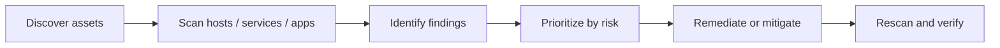
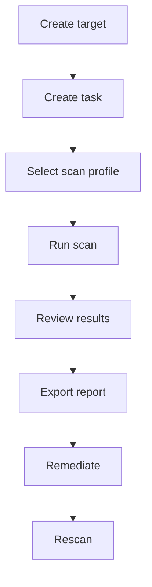

# Vulnerability Scanner Overview

## Summary

A vulnerability scanner is an automated security tool that inspects hosts, services, applications, and sometimes credentials-based system state to identify known weaknesses. In operational terms, it helps answer three questions:

* **What is exposed?**
* **What is weak or misconfigured?**
* **What should be fixed first?**

This note covers:

* what vulnerabilities are
* how vulnerability scanning works
* major scan categories
* common tools
* CVE and CVSS basics
* OpenVAS workflow and result interpretation
* practical limitations and analyst heuristics

---

## What Is a Vulnerability?

A vulnerability is a weakness in software, hardware, configuration, or system design that could be exploited to compromise confidentiality, integrity, or availability.

A useful first-principles view:

```text
Asset + Weakness + Reachability + Exploitability = Security Risk
```

Not every vulnerability is equally dangerous. A weak setting on an internal test server is different from default credentials on an internet-facing management service.

### Patching

The process of fixing vulnerabilities is commonly called **patching**. In practice, remediation may also include:

* configuration hardening
* disabling vulnerable services
* network segmentation
* credential rotation
* compensating controls

So "patching" is the narrow case; "remediation" is the broader security case.

---

## Why Vulnerability Scanning Matters

Organizations run vulnerability scans because manual inspection does not scale.

### Core Reasons

* discover weaknesses before attackers do
* support patching and remediation programs
* validate baseline hardening
* meet compliance requirements
* prioritize limited security resources

### Typical Lifecycle



Scanning without remediation is inventory. Scanning with prioritization and verification becomes vulnerability management.

---

## Vulnerability Scanning Categories

### 1. Authenticated vs Unauthenticated

#### Authenticated scans

Authenticated scans use valid credentials for the target host or service.

They usually provide deeper visibility into:

* installed software
* local configuration
* missing patches
* weak permissions
* unsafe services and local posture

#### Unauthenticated scans

Unauthenticated scans do not log in. They inspect the target from the outside.

They are useful for identifying:

* exposed services
* remote weaknesses
* internet-facing misconfigurations
* default credentials detectable over the network

#### Authenticated vs Unauthenticated Comparison

| Type | Strength | Limitation | Typical use |
| --- | --- | --- | --- |
| Authenticated | deeper host visibility | requires access and setup | internal assessment, server baseline review |
| Unauthenticated | realistic attacker view from outside | shallower coverage | external attack surface review |

### 2. Internal vs External

#### Internal scans

Performed from inside the network. These simulate or support the scenario where an attacker already has a foothold or where internal misconfiguration matters.

#### External scans

Performed from outside the network. These focus on what is reachable and exploitable from the public side.

#### Internal vs External Comparison

| Type | Question answered |
| --- | --- |
| Internal | What can be abused from inside the environment? |
| External | What can be abused from the internet or outside perimeter? |

#### Rule of Thumb

A mature program usually needs **both**:

* external unauthenticated scans for exposed perimeter risk
* internal authenticated scans for real remediation depth

---

## What a Scanner Actually Does

A scanner does not "magically know" everything. It uses several technical methods such as:

* service discovery and banner detection
* version matching against known vulnerability data
* configuration checks
* authenticated package / patch inspection
* credential tests in some plugins
* web application probing
* protocol-specific checks

This means scanner output is always a mixture of:

* true findings
* probable findings
* informational findings
* false positives
* blind spots

That is why validation matters.

---

## Common Vulnerability Scanners

### Nessus

Well-known commercial vulnerability scanner from Tenable. Widely used in enterprise environments and strong in plugin coverage, reporting, and operational maturity.

### Qualys

Cloud-based vulnerability management platform with strong asset visibility, scanning, and compliance integration.

### Nexpose / InsightVM

Rapid7's vulnerability management line, focused on risk-aware prioritization and asset-centric workflows.

### OpenVAS / Greenbone

Open-source vulnerability assessment ecosystem associated with Greenbone. Useful for labs, learning, and smaller environments, and still conceptually representative of how enterprise scanners work.

---

## Choosing a Scanner

Do not choose a scanner only by brand name. Choose by operating model.

### Questions to Ask

* How large is the asset inventory?
* Do you need authenticated scanning at scale?
* Do you need cloud-native coverage?
* How important are remediation workflows and ticketing integration?
* Is this for learning, SMB use, or enterprise vulnerability management?
* Can the team maintain scan credentials safely?

### Simple Decision Model

```text
Need deep enterprise VM + compliance + workflows?
    -> commercial platform likely justified
Need open-source lab / learning / smaller footprint?
    -> OpenVAS / Greenbone is reasonable
```

---

## CVE and CVSS

These two are related but not interchangeable.

### CVE

**CVE** stands for **Common Vulnerabilities and Exposures**.

A CVE ID is a unique identifier for a publicly disclosed vulnerability.

Format example:

```text
CVE-2024-12345
```

Breakdown:

* `CVE` = identifier prefix
* `2024` = year
* `12345` = assigned numeric ID

CVE answers:

* **Which vulnerability are we talking about?**

It does **not** answer:

* how severe it is in your environment
* whether it is exploitable right now
* whether you should patch it first

### CVSS

**CVSS** stands for **Common Vulnerability Scoring System**.

CVSS is a scoring framework used to express vulnerability severity.

It answers:

* **How severe is this vulnerability in general terms?**

#### Common Severity Ranges

| Score | Severity |
| --- | --- |
| 0.0-3.9 | Low |
| 4.0-6.9 | Medium |
| 7.0-8.9 | High |
| 9.0-10.0 | Critical |

#### Important Limitation

CVSS is not business priority by itself.

A Medium vulnerability on a domain controller or payment system may matter more operationally than a High finding on an isolated lab host.

So actual prioritization should consider:

* asset value
* exposure
* exploit availability
* existing controls
* compensating controls
* business criticality

---

## Interpreting a Vulnerability Finding

A scanner result usually includes fields like:

* title
* severity / CVSS
* affected port or service
* summary
* evidence / detection result
* impact
* solution / workaround
* detection method or plugin ID

### Example: Default Credentials Finding

A default-credential finding on a management interface means more than "bad password hygiene." It typically means:

* the service is reachable
* the service accepted vendor or default credentials
* an attacker may gain administrative access remotely

That shifts the risk from abstract misconfiguration to near-direct compromise.

### Read the Finding in Layers

```text
Title        -> what kind of problem is it?
Evidence     -> what exactly did the scanner observe?
Impact       -> what could an attacker do?
Solution     -> what should be changed?
Method       -> how reliable was detection?
```

### Analyst Note

A finding that says "It was possible to login using the following credentials" is much stronger evidence than a finding that only says "Version appears vulnerable."

---

## OpenVAS / Greenbone Workflow Overview

For study purposes, OpenVAS is useful because it exposes the structure of vulnerability management clearly.

### High-Level Workflow

1. deploy the scanner
2. access the web UI
3. create a target
4. create a task / scan job
5. choose scan profile
6. run the scan
7. review findings
8. export report
9. remediate and rescan

### Conceptual Objects

| Object | Meaning |
| --- | --- |
| Target | the host or IP range being scanned |
| Task | the scan job definition |
| Scan config | the intensity / profile of the scan |
| Report | the generated output after execution |
| Result | an individual finding inside a report |

### Minimal Workflow Diagram



---

## Reading OpenVAS Results Correctly

OpenVAS results are often presented by severity and service.

### What to Look at First

* **Severity**: High / Medium / Low / Log / False Positive candidate
* **Service / Port**: which exposed component is affected?
* **Summary**: short human-readable explanation
* **Detection evidence**: what was actually confirmed?
* **Impact**: attacker consequence
* **Solution**: patch / config / workaround

### Triage Logic

Start with questions in this order:

1. Is the finding externally reachable?
2. Is the evidence direct or inferred?
3. Does it expose authentication or remote execution risk?
4. Is there a valid patch or only a workaround?
5. Is the service business-critical?

### Example Triage Buckets

| Bucket | Typical meaning |
| --- | --- |
| Critical / High + direct auth or RCE evidence | patch or contain immediately |
| High + inferred version match only | validate quickly |
| Medium + internal-only | prioritize by asset criticality |
| Low / informational | track, not panic |

---

## What Scanner Reports Often Miss

A scanner is strong at breadth, weaker at deep business context.

### Common Limitations

* false positives
* false negatives
* version detection ambiguity
* custom application logic flaws not covered well
* chained attack paths
* actual exploitability under local controls
* whether the weak service is truly reachable from attacker-relevant paths

### Practical Implication

Vulnerability scanners are excellent at **finding candidate weaknesses**, but not perfect at proving business exploitability.

That is where validation, threat modeling, and sometimes manual testing enter.

---

## Vulnerability Management vs Vulnerability Scanning

These are not the same thing.

### Scanning

A technical action that discovers possible weaknesses.

### Management

A program that includes:

* asset inventory
* scan scheduling
* validation
* prioritization
* remediation
* exception handling
* retesting
* reporting to stakeholders

### If You Only Scan

You get a backlog.

### If You Manage

You reduce risk.

---

## Common False-Positive Situations

Be skeptical, not cynical.

### Typical Cases

* banner says vulnerable version, but vendor backported patch
* service exposed internally only, not reachable from actual threat path
* weak ciphers reported on a disabled or unused interface
* default credential check partially matched but failed in real validation
* package inventory outdated because credentialed scan was incomplete

### Validation Checklist

```text
1. Confirm target / service / port
2. Confirm reachability
3. Confirm actual version or auth result
4. Confirm business relevance
5. Confirm remediation path
```

---

## Practical Prioritization Framework

A simple field-ready model:

```text
Priority = Severity x Exposure x Asset Criticality x Evidence Strength
```

### Example

* Default credentials on internet-facing admin service
  * Severity: high
  * Exposure: external
  * Asset criticality: high
  * Evidence strength: direct login success
  * Priority: immediate
* Medium package issue on isolated internal test VM
  * Severity: medium
  * Exposure: low
  * Asset criticality: low
  * Evidence strength: version-based
  * Priority: lower

This is how mature teams stop treating scanner severity as the only truth.

---

## Reporting Guidance

A useful vulnerability report should answer:

* what is affected?
* what was observed?
* what is the likely impact?
* how confident is the detection?
* what should be fixed?
* how should the fix be verified?

### Good Remediation Language

Prefer:

* "Rotate the affected credentials and disable vendor-default accounts."
* "Restrict management service exposure to trusted administrative networks."
* "Apply the vendor patch and validate version after deployment."

Avoid vague language like:

* "Harden the server."
* "Improve security settings."

---

## OpenVAS Lab Notes

If you are using OpenVAS in a lab or student setup, remember:

* scan results depend heavily on feed freshness
* authenticated scans require stable credentials and permissions
* scan duration can vary a lot
* deeper scan profiles increase coverage but also noise and runtime
* one host is enough to learn the workflow, but not enough to learn prioritization at scale

---

## Analyst Heuristics

### When a Finding Matters More Than Its Score

* internet-facing admin panel
* default credentials
* exposed database or management service
* credential reuse or weak auth findings
* remote code execution on business-critical service

### When a Finding Needs Validation Before Panic

* generic version string match
* informational SSL/TLS issues on non-critical service
* medium findings on dead or isolated assets
* detections with weak evidence language like "appears" or "may" only

---

## Mini Playbook: Scan Review

```text
Question:
What should be fixed first after the scanner report arrives?

Playbook:
1. Group by asset criticality
2. Separate external from internal exposure
3. Pull out findings with direct evidence
4. Validate likely false positives
5. Identify quick wins (default creds, exposed admin, missing patch)
6. Create remediation owners and deadlines
7. Rescan to verify closure
```

---

## ASCII Cheat Sheet

```text
SCANNER OUTPUT IS NOT THE FINISH LINE

Discover -> Validate -> Prioritize -> Remediate -> Verify
```

```text
CVE = identity
CVSS = severity
Risk = CVSS + context
Priority = risk + business reality
```

```text
BEST PRACTICE PAIRING

External unauthenticated  -> attacker-view exposure
Internal authenticated    -> real remediation depth
```

---

## Key Takeaways

* Vulnerability scanning is the automated discovery of known weaknesses.
* Authenticated scans provide deeper host visibility; unauthenticated scans provide attacker-view exposure.
* Internal and external scans answer different threat questions.
* CVE identifies the vulnerability; CVSS estimates severity.
* Scanner results are valuable, but must be validated and prioritized in context.
* OpenVAS is a useful open-source platform for learning the full workflow of target -> task -> result -> report.
* Vulnerability management is broader than scanning; remediation and verification are the actual goal.

---

## Further Reading

* CVE Program overview
* CVSS specification and calculators
* Greenbone / OpenVAS official documentation
* CISA Known Exploited Vulnerabilities catalog

---

## CN-EN Glossary

* vulnerability - 漏洞
* patching - 打补丁 / 修补
* remediation - 修复 / 缓解
* vulnerability scan - 漏洞扫描
* authenticated scan - 认证扫描
* unauthenticated scan - 未认证扫描
* internal scan - 内部扫描
* external scan - 外部扫描
* exposure - 暴露面
* threat surface / attack surface - 威胁面 / 攻击面
* default credentials - 默认凭证
* finding - 发现项
* evidence - 证据
* workaround - 变通措施
* false positive - 误报
* false negative - 漏报
* prioritization - 优先级排序
* validation - 验证
* asset criticality - 资产关键性
* CVE - 通用漏洞披露编号
* CVSS - 通用漏洞评分系统
* OpenVAS - 开源漏洞评估系统
* feed - 漏洞检测规则 / 更新源
