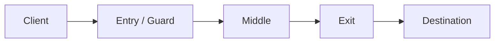

---

platform: tryhackme
name: TOR, Proxychains & Tor Browser
category: anonymity-networking
difficulty: beginner
tags: [tor, proxychains, socks5, opsec, dns-leak, threat-modeling]
status: completed
date: 2026-01-08
sanitized: true
---

# TryHackMe — TOR, Proxychains & Tor Browser (Sanitized Write-up)

## 1. Executive Summary

This room introduces three related tools for network-level privacy in **authorized** contexts:

* **Tor**: an anonymity network that routes traffic through multiple relays to reduce linkability between you and a destination.
* **proxychains**: a user-space shim that forces TCP-based applications to use a proxy (commonly Tor’s local SOCKS5 listener).
* **Tor Browser**: a hardened Firefox bundle with Tor built-in for safer browsing with reduced fingerprinting.

Main security lesson: anonymity is a **system property**. Misconfiguration (especially DNS handling) and poor OPSEC can collapse the intended privacy guarantees.

## 2. Scope / Rules of Engagement

* This write-up is for **legal training platforms** and **authorized testing** only.
* No target identifiers are included. Use placeholders such as `TARGET_IP` and `example.com`.
* Content is intentionally “report-like”: focuses on threat model, configuration intent, and failure modes, not on weaponizable steps.

## 3. Threat Model and High-level Architecture

### 3.1 What Tor provides (and what it does not)

Tor is a low-latency anonymity network. It typically builds a circuit of 3 relays:

* **Entry (Guard)**: can observe your real IP, but not the final destination content.
* **Middle**: forwards encrypted traffic without knowing endpoints.
* **Exit**: connects to the destination; can observe plaintext **if** end-to-end encryption (e.g., HTTPS) is absent.



Tor helps against:

* Local observers (ISP, campus network, public Wi-Fi) correlating your IP to visited sites.
* Simple IP-based blocks (in authorized scenarios).

Tor does **not** solve:

* Browser fingerprinting or account identity (logins, cookies).
* Endpoint compromise (malware on your machine).
* Application-layer identifiers (headers, telemetry) that uniquely tag you.

### 3.2 Operational framing (security work)

Use Tor as a **network separation layer** (separating “testing” IP-space from “personal” IP-space), not as a blanket “invisibility cloak”. Anonymity fails fastest when you mix personas.

## 4. Components and Config Intent

### 4.1 Tor daemon (local SOCKS proxy)

Common default: Tor exposes a local SOCKS5 listener on `127.0.0.1:9050`.

Intent:

* Applications that support SOCKS5 can route traffic through Tor directly.
* Applications that do not can be forced via wrappers (e.g., `proxychains`, `torsocks`).

### 4.2 proxychains (forcing TCP apps through a proxy)

`proxychains` intercepts TCP `connect()` calls (often via `LD_PRELOAD`) and routes them through proxies defined in its config.

```mermaid
flowchart LR
  A[App: curl / firefox / nmap -sT] --> P[proxychains]
  P --> S[SOCKS5 127.0.0.1:9050 (Tor)]
  S --> I[Internet]
```

Key limitation:

* Works for **TCP connect-based** traffic.
* Does **not** transparently proxy raw-socket behavior (e.g., ICMP ping, many UDP tools, SYN scans).

### 4.3 Tor Browser (privacy-by-default browsing)

Tor Browser is a Tor-enabled Firefox with hardened defaults:

* Traffic routed over Tor automatically.
* Fingerprinting resistance (aims for uniformity across users).
* Security level slider (e.g., “Safer”) reduces attack surface by disabling/limiting risky features.

## 5. Findings (Misconfigurations → Impact → Controls)

### Finding A — DNS leak risk when proxying

* **Category**: Information leakage / misconfiguration
* **Risk**: If DNS queries are resolved by the system resolver (ISP/campus DNS) while web traffic goes through Tor, an observer can infer visited domains despite Tor routing.
* **Root cause**: Proxying only the application’s TCP traffic while leaving DNS resolution outside the proxy path.
* **Remediation**:

  * Ensure proxy-aware DNS handling (e.g., proxychains’ `proxy_dns` option when appropriate).
  * Prefer end-to-end encrypted DNS within the same privacy boundary (context-dependent).
* **Detection ideas**:

  * Validate with DNS leak checks using a *separate* testing identity.
  * Compare observed resolver IPs against local ISP/campus resolvers; look for correlation.

### Finding B — Exit node visibility without end-to-end encryption

* **Category**: Confidentiality risk (network path)
* **Risk**: Exit relays can see plaintext content if the destination uses HTTP or weak transport security.
* **Root cause**: Tor provides anonymity of routing; it does not replace TLS.
* **Remediation**:

  * Use HTTPS by default; enforce HSTS where possible.
  * Avoid sending sensitive data over non-TLS destinations.
* **Detection ideas**:

  * Browser warnings for insecure HTTP.
  * Network capture locally to confirm plaintext is not leaving your host (still not a complete guarantee, but useful).

### Finding C — Persona mixing (OPSEC failure)

* **Category**: Operational security / identity correlation
* **Risk**: Logging into personal accounts (email, social media, banking) over the same Tor context used for testing destroys separation; correlation becomes trivial.
* **Root cause**: Reuse of browser profile/cookies/circuits across different identities.
* **Remediation**:

  * Separate profiles/VMs for “personal” vs “testing”.
  * Reset Tor Browser identity and avoid persistent sessions for testing.
* **Detection ideas**:

  * Audit browser storage (cookies, localStorage).
  * Keep a strict checklist: “no personal accounts in testing context”.

## 6. Practical Workflow (Sanitized)

### 6.1 Typical setup logic

* Start Tor daemon (to provide local SOCKS5).
* Configure proxychains to use Tor’s SOCKS5 listener.
* Use proxychains for **TCP-based** tools when you need routing through Tor.
* Use Tor Browser for web workflows where you want hardened defaults and consistent fingerprinting posture.

### 6.2 What “success” looks like (observable signals)

* Applications routed through Tor should show a **non-local** egress IP (Tor exit).
* DNS lookups should not hit your local ISP/campus resolver when you intend proxy-routed DNS.

(Validation sites can be used, but keep this as a *check*, not a ritual: the real risk is your config drift + OPSEC drift.)

## 7. Pitfalls and Failure Modes

* Tor not running → proxychains timeouts.
* Wrong proxychains config → traffic goes out directly (false sense of privacy).
* Using non-TCP scan types through proxychains → results misleading or simply fail.
* Over-trusting Tor → ignoring endpoint compromise and identity correlation.

## 8. Takeaways

* Treat Tor as a **routing anonymity layer**, not a total privacy solution.
* The biggest real-world failure is not “Tor is broken”, it is **your boundary definition**:

  * DNS path
  * browser identity
  * account logins
  * reusing sessions across contexts
* For security work, the mature mindset is: **threat model first**, tooling second.

## 9. Further Reading (non-exhaustive)

```text
Tor Project — Documentation / FAQ
Tor Browser — Security Slider and fingerprinting defenses
proxychains — configuration patterns (dynamic vs strict chaining, DNS behavior)
```

## 10. EN–ZH Glossary

| Term                   | 中文        | Note                                                  |
| ---------------------- | --------- | ----------------------------------------------------- |
| Tor (The Onion Router) | 洋葱路由      | Low-latency anonymity network                         |
| circuit                | 电路/链路     | Path through multiple relays                          |
| relay / node           | 中继节点      | Tor hop in the circuit                                |
| entry/guard            | 入口/守门节点   | First hop, sees your IP                               |
| exit node              | 出口节点      | Last hop, sees destination traffic (if not encrypted) |
| SOCKS5                 | SOCKS5 代理 | Common proxy protocol used locally by Tor             |
| proxychains            | 代理链工具     | Forces TCP apps through proxies                       |
| DNS leak               | DNS 泄露    | DNS queries reveal domains even if HTTP is proxied    |
| OPSEC                  | 行动安全      | Practices to prevent correlation/deanonymization      |
